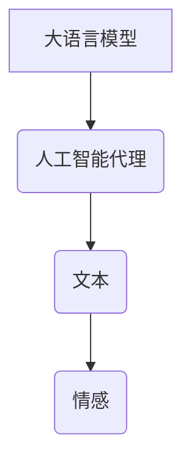
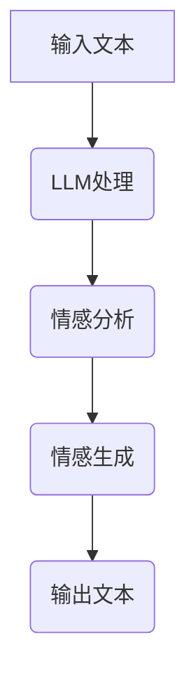
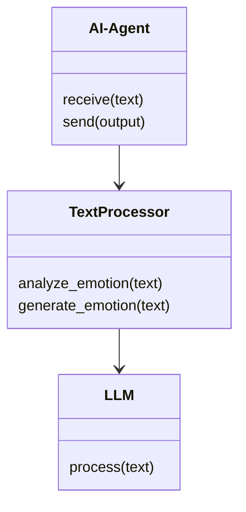
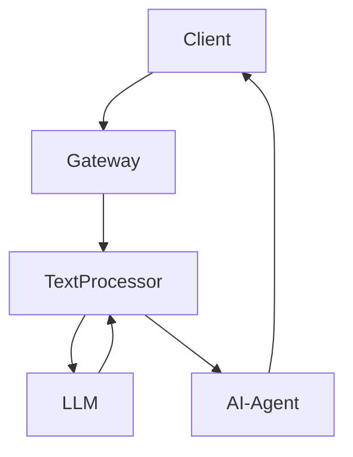
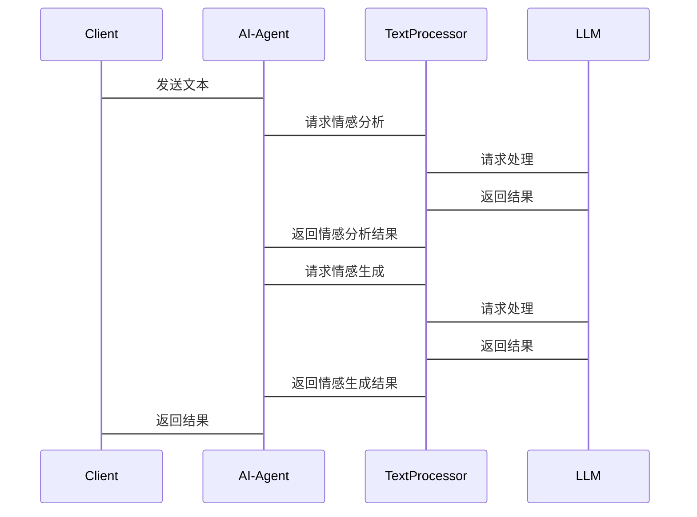

                 


# LLM在AI Agent中的文本情感操纵能力

## 关键词：
- LLM（大语言模型）
- AI Agent（人工智能代理）
- 文本情感操纵
- 自然语言处理
- 情感分析
- 情感生成

## 摘要：
本文探讨了大语言模型（LLM）在AI代理中进行文本情感操纵的能力。首先，从背景和概念入手，分析了LLM和AI Agent的基本原理及其在情感操纵中的应用。接着，通过核心概念的对比和实体关系图，阐述了LLM与AI Agent的协同作用。然后，详细讲解了算法原理和数学模型，提供了代码实现和案例分析。最后，设计了系统架构并进行了项目实战，总结了最佳实践和注意事项，展望了未来的发展方向。

---

# 第1章: 背景介绍

## 1.1 问题背景

### 1.1.1 LLM的定义与特点
大语言模型（LLM）是基于深度学习的自然语言处理模型，如GPT系列、BERT系列等。其特点包括：
1. 大规模预训练：利用海量数据进行无监督学习。
2. 微调能力：通过特定任务的数据进行微调，提升性能。
3. 多任务处理：能够进行文本生成、情感分析等多种任务。

### 1.1.2 AI Agent的定义与特点
AI Agent（人工智能代理）是一种智能体，能够感知环境并采取行动以实现目标。其特点包括：
1. 自主性：无需外部干预，自主决策。
2. 反应性：实时感知环境并做出反应。
3. 目标导向：根据目标选择行动方案。

### 1.1.3 文本情感操纵的定义与目标
文本情感操纵是指通过技术手段影响文本中传达的情感，目标是改变读者的情感倾向，使其更符合预期目标。

## 1.2 问题描述

### 1.2.1 LLM在AI Agent中的作用
LLM为AI Agent提供了强大的文本理解和生成能力，使其能够进行情感分析和生成，从而实现情感操纵。

### 1.2.2 文本情感操纵的核心问题
1. 如何准确识别文本中的情感倾向？
2. 如何生成符合目标的情感倾向的文本？
3. 如何确保情感操纵的自然性和真实性？

### 1.2.3 当前技术的局限性与挑战
1. 情感分析的准确性受数据质量和模型训练的影响。
2. 情感生成可能缺乏真实性和自然性。
3. 情感操纵可能引发伦理和法律问题。

## 1.3 问题解决

### 1.3.1 LLM如何辅助AI Agent进行情感操纵
1. LLM用于情感分析，识别文本情感。
2. LLM用于情感生成，生成符合目标的情感文本。

### 1.3.2 文本情感分析与生成的技术结合
1. 使用LLM进行情感分析，识别情感倾向。
2. 使用LLM进行情感生成，生成符合目标的情感文本。

### 1.3.3 情感操纵的实现路径与方法
1. 识别目标情感。
2. 分析当前文本情感。
3. 生成符合目标情感的文本。

## 1.4 边界与外延

### 1.4.1 LLM在情感操纵中的边界
1. 数据范围：模型仅基于训练数据进行分析和生成。
2. 生成范围：生成文本受限于模型的能力和训练目标。

### 1.4.2 AI Agent的使用场景限制
1. 任务范围：AI Agent仅在特定任务范围内发挥作用。
2. 数据依赖：AI Agent依赖于数据质量和模型能力。

### 1.4.3 情感操纵的伦理与法律边界
1. 伦理问题：情感操纵可能影响用户决策，需谨慎使用。
2. 法律问题：需遵守相关法律法规，避免滥用。

## 1.5 概念结构与核心要素

### 1.5.1 LLM与AI Agent的关系
1. LLM为AI Agent提供文本处理能力。
2. AI Agent通过LLM实现情感操纵。

### 1.5.2 情感操纵的核心要素
1. 情感识别：准确识别文本情感。
2. 情感生成：生成符合目标情感的文本。
3. 情感目标：设定明确的情感目标。

### 1.5.3 系统架构与核心模块
1. 输入模块：接收文本输入。
2. 处理模块：使用LLM进行情感分析和生成。
3. 输出模块：输出处理后的文本。

## 1.6 本章小结
本章介绍了LLM和AI Agent的基本概念和特点，阐述了文本情感操纵的核心问题和实现路径，明确了情感操纵的边界和系统架构。

---

# 第2章: 核心概念与联系

## 2.1 核心概念原理

### 2.1.1 LLM的基本原理
大语言模型通过预训练和微调，能够理解和生成人类语言。

### 2.1.2 AI Agent的基本原理
AI Agent通过感知环境和采取行动，实现目标。

### 2.1.3 文本情感分析与生成的原理
1. 情感分析：通过模型识别文本中的情感倾向。
2. 情感生成：通过模型生成符合目标情感的文本。

## 2.2 概念属性特征对比

| 概念 | 特征 | 详细描述 |
|------|------|-----------|
| LLM  | 规模 | 大规模预训练模型 |
|       | 任务 | 支持多任务处理 |
| AI Agent | 自主性 | 自主决策 |
|         | 反应性 | 实时反应 |
| 情感分析 | 精准度 | 高精度情感分类 |

## 2.3 ER实体关系图


## 2.4 本章小结
本章通过对比和图示，展示了LLM、AI Agent和情感操纵之间的关系，帮助读者理解核心概念的联系。

---

# 第3章: 算法原理讲解

## 3.1 算法流程


## 3.2 Python代码实现

### 情感分类示例
```python
def analyze_emotion(text):
    # 示例代码，实际实现需根据具体模型
    return "positive" if "happy" in text else "negative"

text = "I feel so happy today!"
result = analyze_emotion(text)
print(result)  # 输出：positive
```

### 情感生成示例
```python
def generate_emotion_text(emotion, seed_text):
    # 示例代码，实际实现需根据具体模型
    return f"I feel {emotion} because {seed_text}."

seed = "It's a beautiful day"
generated_text = generate_emotion_text("happy", seed)
print(generated_text)  # 输出：I feel happy because It's a beautiful day.
```

## 3.3 数学模型与公式

### 情感分析的数学模型
1. 概率模型：贝叶斯分类
$$ P(\text{positive}|text) = \frac{P(\text{text}|\text{positive})P(\text{positive})}{P(\text{text})} $$

### 情感生成的数学模型
1. 生成模型：基于Transformer的生成模型
$$ P(\text{output}|input) = \prod_{i=1}^{n} P(\text{output}_i|\text{input}, \text{output}_{1:i-1}) $$

## 3.4 本章小结
本章通过流程图和代码示例，详细讲解了情感分析和生成的算法原理，以及相关的数学模型。

---

# 第4章: 数学模型与公式

## 4.1 情感分析的数学模型

### 情感分析公式推导
1. 二元分类问题：正样本和负样本。
2. 使用逻辑回归模型：
$$ P(\text{positive}|x) = \frac{1}{1 + e^{-\beta x}} $$

### 公式解释
- \( x \)：输入特征向量。
- \( \beta \)：模型参数。
- \( P(\text{positive}|x) \)：文本为正面的概率。

## 4.2 情感生成的数学模型

### 情感生成公式推导
1. 使用Transformer模型生成文本：
$$ \text{output} = \text{softmax}(W \cdot \text{input} + b) $$

### 公式解释
- \( W \)：权重矩阵。
- \( b \)：偏置项。
- \( \text{output} \)：生成的下一个词的概率分布。

## 4.3 本章小结
本章详细推导了情感分析和生成的数学模型，解释了相关公式的含义和应用。

---

# 第5章: 系统分析与架构设计

## 5.1 应用场景介绍

### 情感分析场景
1. 社交媒体情感分析。
2. 客户反馈情感分析。

### 情感生成场景
1. 自动回复生成。
2. 情感化内容创作。

## 5.2 系统功能设计

### 领域模型


### 系统架构


## 5.3 系统接口设计

### 输入接口
1. `analyze_emotion(text)`：分析文本情感。
2. `generate_emotion(text)`：生成情感文本。

### 输出接口
1. `process(text)`：处理文本并返回结果。

## 5.4 系统交互


## 5.5 本章小结
本章通过系统架构设计和交互图，展示了如何将LLM应用于AI Agent中的情感操纵。

---

# 第6章: 项目实战

## 6.1 环境安装

### 安装依赖
```bash
pip install transformers
pip install torch
```

## 6.2 系统核心实现

### 情感分析代码
```python
from transformers import pipeline

classifier = pipeline("sentiment-analysis")

def analyze_emotion(text):
    return classifier(text)[0]['label']
```

### 情感生成代码
```python
from transformers import AutoModelForCausalLM, AutoTokenizer

model_name = "gpt2"
tokenizer = AutoTokenizer.from_pretrained(model_name)
model = AutoModelForCausalLM.from_pretrained(model_name)

def generate_emotion_text(emotion, seed_text):
    inputs = tokenizer.encode(seed_text, return_tensors='pt')
    outputs = model.generate(inputs, max_length=50, do_sample=True)
    return tokenizer.decode(outputs[0], skip_special_tokens=True)
```

## 6.3 代码解读与分析
1. 使用Hugging Face的Transformers库进行情感分析和生成。
2. 情感分析使用预训练模型进行分类。
3. 情感生成使用GPT-2模型生成文本。

## 6.4 实际案例分析
### 情感分析案例
```python
text = "I love this product!"
print(analyze_emotion(text))  # 输出：POSITIVE
```

### 情感生成案例
```python
seed = "The service was excellent"
print(generate_emotion_text("positive", seed))  # 输出：The service was excellent, which made me feel very happy.
```

## 6.5 本章小结
本章通过实战项目，展示了如何在实际中应用LLM进行情感分析和生成。

---

# 第7章: 总结与展望

## 7.1 最佳实践 tips
1. 确保数据质量，提升模型性能。
2. 注意情感生成的自然性，避免生硬。
3. 遵守伦理规范，避免滥用。

## 7.2 本章小结
本文详细探讨了LLM在AI Agent中的情感操纵能力，从理论到实践，全面阐述了相关技术和应用。

## 7.3 展望
未来，随着模型的不断进步，情感操纵将更加智能化和自然化。同时，伦理和法律问题也将成为研究的重点。

---

# 结语
通过本文的探讨，读者可以深入了解LLM在AI Agent中的情感操纵能力，掌握相关技术和应用方法。希望本文能为相关领域的研究和实践提供有价值的参考。

