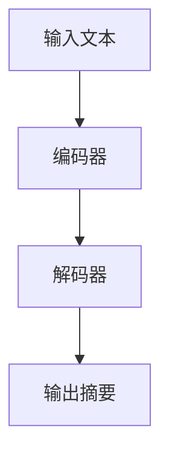
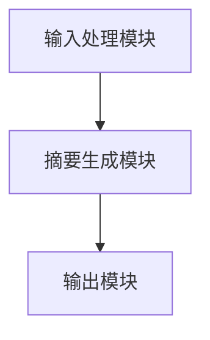

                 

# LLM在AI Agent中的文本摘要生成应用

## 关键词：LLM, AI Agent, 文本摘要, 自然语言处理, 人工智能, 深度学习

## 摘要：  
本文深入探讨了大语言模型（LLM）在AI代理中的文本摘要生成应用，分析了其核心原理、算法实现、系统架构设计及实际应用场景。通过详细的技术背景介绍、算法流程图、系统架构图、项目实战代码示例等，全面解析了LLM在文本摘要生成中的优势与挑战，为AI代理的开发者和研究人员提供了实践指导和理论支持。

---

# 第一部分: LLM与AI Agent基础

## 第1章: LLM与AI Agent概述

### 1.1 LLM的定义与特点  
大语言模型（LLM, Large Language Model）是指基于深度学习技术训练的大型神经网络模型，具有以下特点：  
- **大规模数据训练**：使用海量文本数据进行训练，能够理解复杂的语言模式。  
- **上下文理解**：通过注意力机制（Attention Mechanism）捕捉文本中的上下文信息。  
- **生成能力**：能够生成连贯且符合语境的文本内容，支持多种任务，如翻译、问答、摘要等。  

### 1.2 AI Agent的基本概念  
AI Agent（人工智能代理）是一种智能系统，能够感知环境、理解用户需求并执行任务。其核心功能包括：  
- **感知**：通过传感器或API获取外部信息。  
- **决策**：基于感知信息做出判断。  
- **执行**：通过执行器完成具体任务。  

### 1.3 LLM在AI Agent中的作用  
LLM作为AI Agent的核心模块，主要应用于以下场景：  
- **自然语言理解**：通过LLM理解用户的输入文本。  
- **文本生成**：利用LLM生成自然语言输出。  
- **任务执行**：结合LLM的生成能力，完成复杂任务的执行。  

---

# 第二部分: 文本摘要生成原理

## 第2章: 文本摘要生成的基本概念

### 2.1 文本摘要的定义与分类  
文本摘要是指从较长文本中提取关键信息，生成简短且保留原意的文本片段。根据生成方式的不同，文本摘要可以分为：  
- **提取式摘要**：从原文中直接选取重要句子或词语。  
- **生成式摘要**：通过模型生成新的文本片段，可能与原文内容有所偏差。  

### 2.2 LLM在文本摘要中的应用  
LLM通过其强大的语言生成能力，能够实现高质量的文本摘要。以下是其主要应用方式：  
- **基于LLM的生成式摘要**：利用LLM的解码器生成连贯的摘要文本。  
- **结合上下文的摘要**：通过LLM的上下文理解能力，生成更具语境的摘要。  

### 2.3 文本摘要生成的流程  
文本摘要生成的典型流程包括以下步骤：  
1. **输入文本预处理**：对输入文本进行分词、去除停用词等处理。  
2. **模型编码**：将预处理后的文本输入编码器，生成编码表示。  
3. **解码与输出**：通过解码器将编码表示生成最终的摘要文本。  

---

# 第三部分: LLM文本摘要生成的算法原理

## 第3章: LLM文本摘要生成的算法流程

### 3.1 基于LLM的文本摘要算法概述  
基于LLM的文本摘要算法通常采用编码器-解码器结构，结合注意力机制实现文本生成。以下是其核心流程：  
1. **编码器阶段**：将输入文本编码为固定长度的向量表示。  
2. **解码器阶段**：根据编码向量生成目标摘要文本。  
3. **注意力机制**：通过注意力机制捕捉输入文本的关键信息，提高生成摘要的质量。  

### 3.2 文本摘要生成的数学模型  
以下是基于Transformer的文本摘要生成模型的数学表达式：  

**编码器部分**：  
$$  
\text{Encoder}(x) = \text{MultiHeadAttention}(x)  
$$  

**解码器部分**：  
$$  
\text{Decoder}(y, \text{Encoder}(x)) = \text{MultiHeadAttention}(y, \text{Encoder}(x)) + \text{PositionalEncoding}(y)  
$$  

**生成输出**：  
$$  
\text{Output} = \text{Softmax}(W_{\text{out}} \cdot \text{Decoder}(y, \text{Encoder}(x)))  
$$  

### 3.3 算法流程图  

---

# 第四部分: LLM在AI Agent中的应用

## 第4章: LLM在AI Agent中的文本摘要应用

### 4.1 LLM在对话系统中的应用  
在对话系统中，LLM可以通过文本摘要生成技术，帮助AI Agent更好地理解用户意图并生成连贯的回复。  

### 4.2 LLM在信息检索中的应用  
通过文本摘要，AI Agent可以快速提取关键信息，提升信息检索的效率和准确性。  

### 4.3 LLM在任务执行中的应用  
LLM可以通过生成式摘要，帮助AI Agent更好地理解任务需求，优化任务执行流程。  

---

# 第五部分: 系统架构与项目实战

## 第5章: 系统架构设计

### 5.1 系统功能设计  
以下是AI Agent的系统功能模块划分：  
- **输入处理模块**：接收用户输入并进行预处理。  
- **摘要生成模块**：基于LLM生成文本摘要。  
- **输出模块**：将生成的摘要返回给用户或执行下一步任务。  

### 5.2 系统架构图  

---

# 第六部分: 最佳实践与未来展望

## 第6章: 最佳实践与未来展望

### 6.1 最佳实践  
- **数据优化**：确保训练数据的多样性和质量，提升模型的生成能力。  
- **模型调优**：通过超参数调优和模型剪枝等技术，优化模型性能。  

### 6.2 未来展望  
未来，随着LLM技术的不断发展，文本摘要生成在AI Agent中的应用将更加广泛和智能化，可能出现以下趋势：  
- **多模态摘要**：结合图像、音频等多种模态信息，生成更全面的摘要。  
- **实时生成**：实现低延迟的实时摘要生成，提升用户体验。  

---

通过以上章节的内容，我们详细探讨了LLM在AI Agent中的文本摘要生成应用，从理论到实践，为读者提供了全面的技术指导和实践参考。

