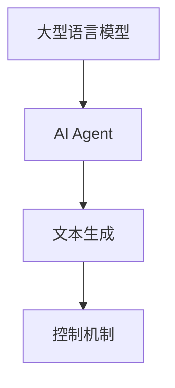
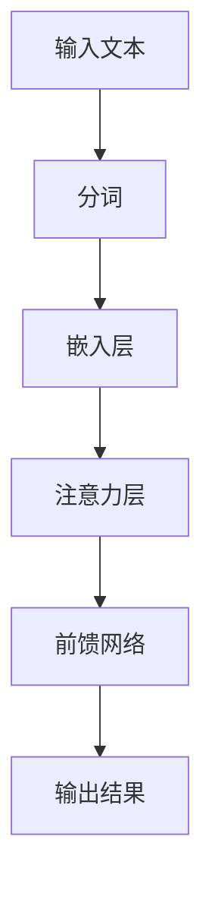
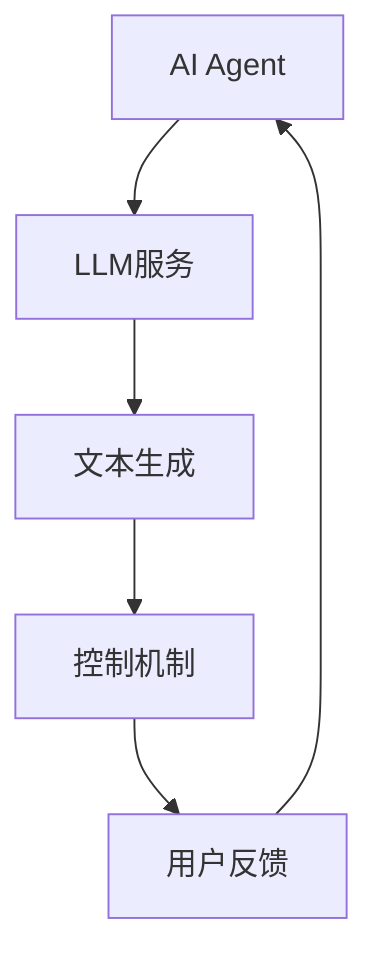
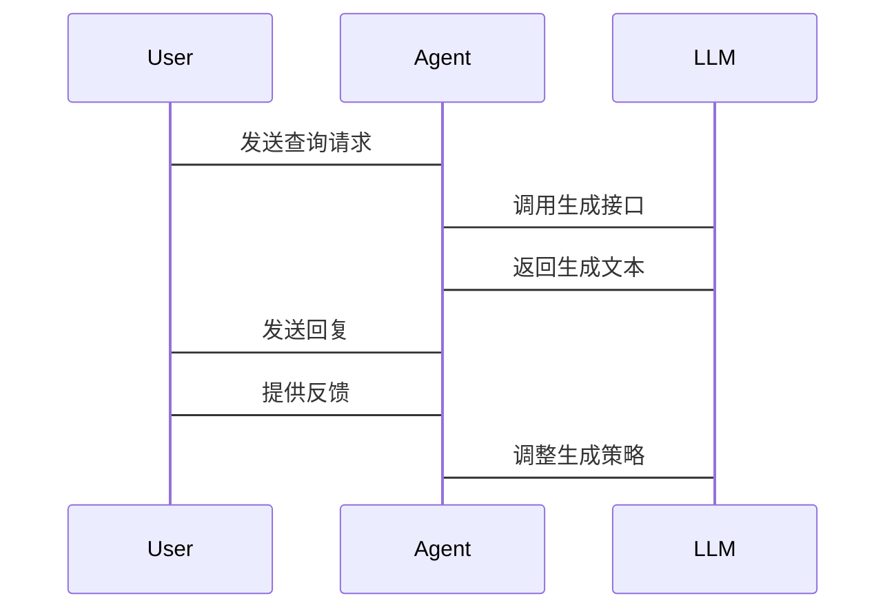

                 


# LLM在AI Agent中的文本生成控制：精确度与创造性平衡

## 关键词：LLM, AI Agent, 文本生成控制, 精确度, 创造性, Transformer, AI系统架构

## 摘要：
本文探讨了在AI Agent中使用大型语言模型（LLM）进行文本生成控制的问题，重点分析如何在精确度和创造性之间取得平衡。通过详细阐述LLM的算法原理、系统架构设计、实际项目实现以及最佳实践，本文旨在为AI Agent的开发提供理论支持和实践指导，帮助读者理解如何优化文本生成过程，以满足不同应用场景的需求。

---

# 第一部分: 背景介绍

## 第1章: LLM在AI Agent中的文本生成控制概述

### 1.1 问题背景
#### 1.1.1 LLM的定义与特点
大型语言模型（LLM）是指经过大量数据训练的深度学习模型，能够理解和生成自然语言文本。其特点包括：
- **大规模训练数据**：通常使用万亿级别的参数量，能够捕捉复杂的语言模式。
- **上下文理解能力**：通过自注意力机制，能够处理长上下文窗口，理解文本中的语义关系。
- **多任务能力**：LLM可以用于多种任务，如文本生成、机器翻译、问答系统等。

#### 1.1.2 AI Agent的基本概念
AI Agent是一种智能体，能够在环境中感知、推理、决策并执行任务。AI Agent的关键特性包括：
- **自主性**：能够独立执行任务，无需外部干预。
- **反应性**：能够实时感知环境变化并做出反应。
- **学习能力**：通过与环境的交互，不断优化自身的行为策略。

#### 1.1.3 文本生成控制的必要性
在AI Agent中，文本生成控制是实现人机交互的关键环节。通过精确控制生成文本的内容和风格，AI Agent可以更好地理解用户需求，提供更准确和个性化的服务。

### 1.2 问题描述
#### 1.2.1 LLM在AI Agent中的作用
LLM作为AI Agent的核心组件，负责生成自然语言文本，实现与用户的交互。例如，在智能客服系统中，LLM可以根据用户的问题生成回复，帮助解决问题。

#### 1.2.2 精确度与创造性的平衡问题
在实际应用中，AI Agent的文本生成需要在精确度和创造性之间取得平衡。精确度是指生成文本的准确性，创造性是指生成文本的新颖性和独特性。然而，过于强调精确度可能导致生成内容缺乏新意，而过于强调创造性可能导致内容偏离用户需求。

#### 1.2.3 当前存在的主要挑战
- **模型偏差**：LLM可能因为训练数据中的偏差，生成不符合预期的文本。
- **计算资源限制**：复杂的生成控制方法需要大量的计算资源。
- **用户需求多样性**：不同用户可能有不同的需求，如何实现个性化的生成控制是一个挑战。

### 1.3 问题解决
#### 1.3.1 LLM在文本生成中的应用
LLM在文本生成中的应用包括：
- **对话生成**：生成自然的对话回复。
- **内容创作**：生成文章、故事等创意文本。
- **自动摘要**：从长文本中提取关键信息。

#### 1.3.2 AI Agent的文本生成控制方法
为了实现精确度与创造性的平衡，可以采用以下方法：
- **基于规则的控制**：通过预定义的规则，限制生成文本的范围。
- **基于反馈的控制**：根据用户反馈调整生成策略。
- **多模型集成**：结合多个模型的优势，实现更灵活的控制。

#### 1.3.3 精确度与创造性平衡的实现路径
- **动态调整生成策略**：根据上下文和用户需求，动态调整生成参数。
- **多模态输入**：结合图像、语音等多模态信息，提高生成文本的准确性。
- **领域定制化**：针对特定领域优化模型，提高生成文本的相关性。

### 1.4 边界与外延
#### 1.4.1 LLM文本生成的边界条件
- **输入限制**：生成文本的长度和内容受输入限制。
- **模型能力限制**：生成文本的质量受模型参数和训练数据的影响。
- **计算能力限制**：生成过程需要大量的计算资源。

#### 1.4.2 AI Agent的文本生成控制范围
- **实时生成**：生成文本需要在用户交互过程中实时完成。
- **上下文依赖性**：生成文本需要依赖于当前的上下文信息。
- **用户反馈依赖性**：生成策略需要根据用户反馈进行调整。

#### 1.4.3 相关领域的影响与扩展
- **人机交互**：文本生成控制是人机交互的重要环节。
- **自然语言处理**：文本生成控制是自然语言处理的核心任务之一。
- **智能系统设计**：文本生成控制是智能系统设计中的关键问题。

### 1.5 核心概念
#### 1.5.1 LLM与AI Agent的关系
LLM作为AI Agent的核心组件，负责生成自然语言文本，实现与用户的交互。AI Agent通过调用LLM的生成接口，实现文本生成控制。

#### 1.5.2 文本生成控制的核心要素
- **生成策略**：生成文本的规则和方法。
- **控制参数**：生成过程中的超参数，如温度、重复惩罚等。
- **反馈机制**：根据用户反馈调整生成策略。

#### 1.5.3 精确度与创造性的概念结构
- **精确度**：生成文本的准确性和相关性。
- **创造性**：生成文本的新颖性和独特性。
- **平衡点**：根据不同场景的需求，动态调整精确度和创造性的权重。

---

# 第二部分: 核心概念与联系

## 第2章: LLM与AI Agent的核心概念

### 2.1 核心概念原理
#### 2.1.1 LLM的原理简述
LLM基于Transformer架构，通过自注意力机制和前馈网络，能够生成与输入上下文相关的文本。其核心思想是利用自注意力机制捕捉文本中的语义关系，然后通过前馈网络生成下一步的字符或词。

#### 2.1.2 AI Agent的工作原理
AI Agent通过感知环境、推理当前状态、制定计划并执行动作来实现目标。在文本生成控制中，AI Agent需要根据用户输入和上下文，调用LLM生成合适的回复。

#### 2.1.3 文本生成控制的机制
文本生成控制的机制包括：
- **输入处理**：对输入文本进行预处理，提取关键信息。
- **生成策略选择**：根据上下文和用户需求，选择合适的生成策略。
- **输出优化**：对生成的文本进行优化，确保其准确性和流畅性。

### 2.2 概念属性特征对比
| 概念 | 属性 | 特征 |
|------|------|------|
| LLM  | 模型复杂度 | 高度复杂，参数量大 |
| AI Agent | 自主性 | 高度自主，能够独立决策 |
| 文本生成控制 | 精确度 | 高精确度，生成文本准确 |
| 文本生成控制 | 创造性 | 高创造性，生成文本新颖 |

### 2.3 ER实体关系图


---

# 第三部分: 算法原理讲解

## 第3章: LLM的算法原理

### 3.1 算法概述
#### 3.1.1 Transformer架构
Transformer是一种基于自注意力机制的神经网络架构，由编码器和解码器组成。编码器负责将输入文本转换为固定长度的向量，解码器负责根据编码器输出生成目标文本。

#### 3.1.2 注意力机制
注意力机制是一种用于捕捉文本中不同位置之间关系的机制。通过计算输入文本中每个词与其他词的相关性，注意力机制能够聚焦于重要的信息，提高生成文本的质量。

#### 3.1.3 梯度下降优化
梯度下降是一种优化算法，用于最小化损失函数。在LLM的训练过程中，通过计算梯度并更新参数，逐步优化模型的生成能力。

### 3.2 算法流程图


### 3.3 代码实现
#### 3.3.1 Python代码实现
```python
import torch

class LLMModel(torch.nn.Module):
    def __init__(self, vocab_size, embedding_dim, hidden_dim):
        super(LLMModel, self).__init__()
        self.embedding = torch.nn.Embedding(vocab_size, embedding_dim)
        self.attention = torch.nn.MultiheadAttention(embed_dim=embedding_dim, num_heads=8)
        self.ffn = torch.nn.Sequential(
            torch.nn.Linear(embedding_dim, hidden_dim),
            torch.nn.ReLU(),
            torch.nn.Linear(hidden_dim, embedding_dim)
        )
    
    def forward(self, input_ids):
        embed = self.embedding(input_ids)
        attn_output, _ = self.attention(embed, embed, embed)
        ffn_output = self.ffn(attn_output)
        return ffn_output
```

#### 3.3.2 数学模型和公式
- **嵌入层**：将输入的字符转换为向量表示。
  $$ \text{embed}(x) = E[x] $$
- **注意力机制**：计算输入文本中每个词与其他词的相关性。
  $$ \alpha_{ij} = \text{softmax}\left(\frac{Q_i K_j}{\sqrt{d_k}}\right) $$
- **前馈网络**：对注意力输出进行非线性变换。
  $$ y = \text{FFN}(x) $$

---

## 第4章: 系统分析与架构设计

### 4.1 系统架构设计


### 4.2 功能设计
- **输入处理**：对输入文本进行预处理，提取关键信息。
- **生成策略选择**：根据上下文和用户需求，选择合适的生成策略。
- **输出优化**：对生成的文本进行优化，确保其准确性和流畅性。

### 4.3 接口设计
- **输入接口**：接收用户的输入文本和上下文信息。
- **输出接口**：输出生成的文本和相关反馈信息。

### 4.4 交互流程


---

## 第5章: 项目实战

### 5.1 环境安装
- **Python 3.8以上**
- **PyTorch 1.9以上**
- **Transformers库**

### 5.2 核心代码实现
```python
from transformers import AutoTokenizer, AutoModelForCausalLM

model_name = "gpt2"
tokenizer = AutoTokenizer.from_pretrained(model_name)
model = AutoModelForCausalLM.from_pretrained(model_name)

def generate_text(prompt, max_length=50):
    inputs = tokenizer.encode(prompt, return_tensors="pt")
    outputs = model.generate(inputs, max_length=max_length, do_sample=True)
    return tokenizer.decode(outputs[0], skip_special_tokens=True)
```

### 5.3 案例分析
- **案例1**：智能客服系统
  - 用户输入：我的订单在哪里？
  - 系统回复：您的订单可以在我的订单页面查看，您可以点击右上角的“我的订单”按钮进行查询。

- **案例2**：创意写作工具
  - 用户输入：写一篇关于未来科技的文章。
  - 系统生成：未来科技的发展将彻底改变我们的生活方式，人工智能、量子计算等技术将推动社会的进步。

---

## 第6章: 最佳实践与小结

### 6.1 最佳实践
- **模型选择**：根据具体任务选择合适的模型，如GPT-2、GPT-3等。
- **参数调整**：通过调整温度、重复惩罚等参数，优化生成文本的质量。
- **反馈机制**：根据用户反馈不断优化生成策略，提高用户体验。

### 6.2 小结
本文详细探讨了LLM在AI Agent中的文本生成控制问题，分析了精确度与创造性平衡的实现路径。通过实际案例和代码实现，展示了如何在不同场景下优化生成过程，提高生成文本的质量。

### 6.3 注意事项
- **模型性能**：确保模型在生成过程中保持高效和稳定。
- **数据隐私**：注意保护用户数据，避免数据泄露。
- **用户体验**：优化生成文本的可读性和流畅性，提高用户体验。

### 6.4 拓展阅读
- **相关论文**：阅读关于LLM和AI Agent的最新研究论文，了解前沿技术。
- **技术博客**：查阅技术博客，学习他人在文本生成控制中的实践经验。

---

通过本文的详细分析和实际案例，读者可以深入了解LLM在AI Agent中的文本生成控制问题，并在实际项目中应用这些方法，优化生成过程，提高系统性能。

