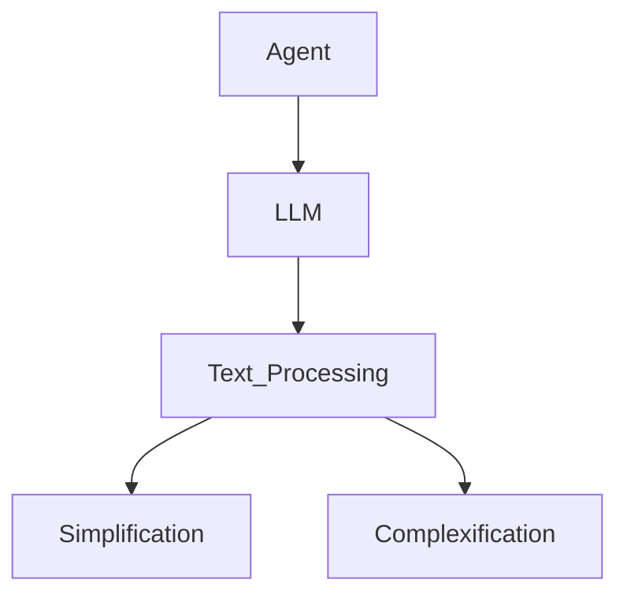
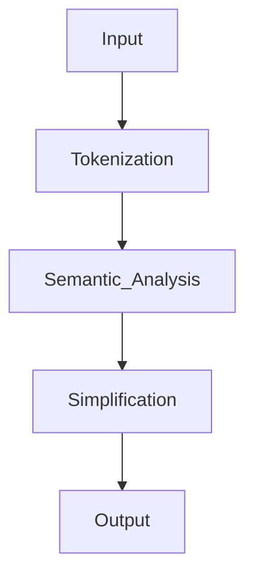
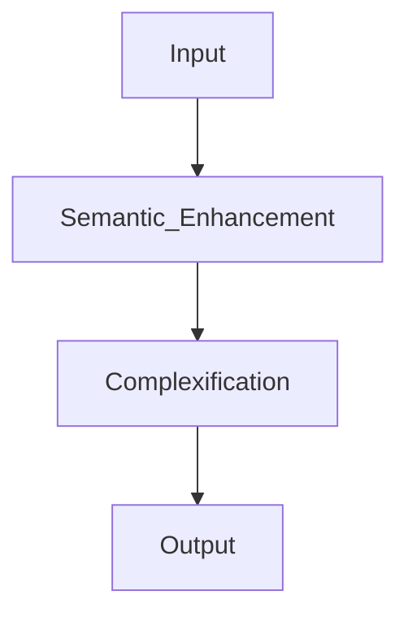
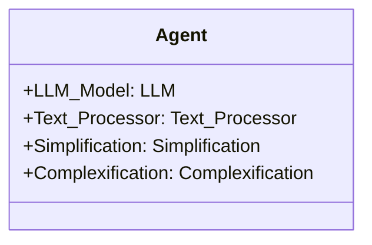
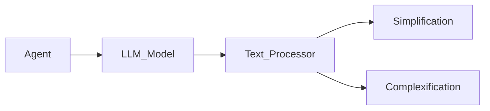
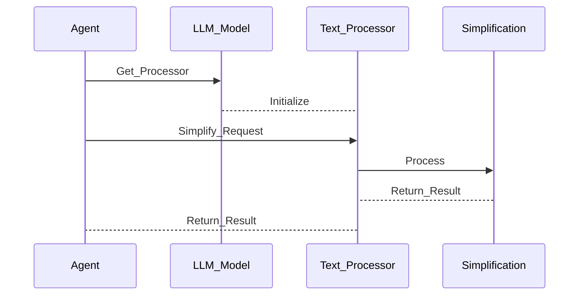

                 


# LLM在AI Agent中的文本简化与复杂化能力

## 关键词：
- LLM
- AI Agent
- 文本简化
- 文本复杂化
- 自然语言处理

## 摘要：
本文深入探讨了大型语言模型（LLM）在AI代理（AI Agent）中的文本简化与复杂化能力。从基本原理到高级算法，结合实际案例分析，系统阐述了LLM在文本处理中的应用。文章内容包括背景介绍、核心概念、算法原理、系统架构设计、项目实战和总结，旨在帮助读者全面理解并掌握LLM在AI Agent中的文本处理技术。

---

# 第1章: 问题背景与核心概念

## 1.1 问题背景

### 1.1.1 LLM与AI Agent的结合
- LLM（Large Language Model）通过海量数据训练，具备强大的文本生成、理解与推理能力。
- AI Agent（智能代理）通过LLM增强其任务执行能力，如对话生成、信息提取、策略优化等。
- LLM与AI Agent的结合，使得AI Agent能够更自然地与人类交互，提供更智能的服务。

### 1.1.2 文本简化与复杂化能力的重要性
- **文本简化**：将复杂信息转化为简单易懂的表达，适用于快速传递关键信息。
- **文本复杂化**：通过丰富上下文、增强语义，提升文本的深度和细节，适用于专业领域或需要详尽信息的场景。
- 两者的结合使得AI Agent能够灵活应对不同场景下的文本处理需求。

### 1.1.3 当前技术的局限性与挑战
- LLM在文本简化时可能丢失关键信息，导致误解。
- 文本复杂化可能导致信息冗余，影响用户体验。
- 如何平衡简化与复杂化，是当前技术的主要挑战。

## 1.2 核心概念

### 1.2.1 LLM的基本原理
- 基于Transformer架构，通过自注意力机制捕捉文本中的长距离依赖。
- 训练目标是最大化生成概率，而非准确捕捉简化或复杂化的意图。
- 模型的可解释性有限，难以直接控制生成结果的简化或复杂化程度。

### 1.2.2 AI Agent的定义与功能
- AI Agent是一种能够感知环境、执行任务的智能体，具备自主决策能力。
- 通过LLM增强对话生成、信息检索、任务规划等功能。
- 核心功能包括：信息处理、任务执行、用户交互。

### 1.2.3 文本简化与复杂化的定义
- **文本简化**：将复杂文本转化为更简洁、易懂的表达，保留核心信息。
- **文本复杂化**：通过增加细节、丰富语义，提升文本的深度和复杂性。
- 两者均依赖于LLM的理解能力，但目标相反。

---

# 第2章: 核心概念与联系

## 2.1 LLM的核心原理

### 2.1.1 模型的文本处理能力
- **生成能力**：通过条件生成，输出与输入相关的文本。
- **理解能力**：通过编码器-解码器结构，捕捉文本语义。
- **可定制化**：通过微调或提示工程技术，优化特定任务表现。

### 2.1.2 模型的可解释性与局限性
- **可解释性**：模型决策基于复杂的概率分布，难以直观解释。
- **局限性**：生成结果可能与预期不符，尤其是简化和复杂化任务。
- **优化方向**：引入强化学习，通过奖励机制优化生成结果。

## 2.2 AI Agent的实体关系图

### 2.2.1 实体关系图


## 2.3 文本简化与复杂化的对比分析

### 2.3.1 对比表格
| 特性                | 文本简化      | 文本复杂化    |
|---------------------|--------------|--------------|
| 目标                | 简化表达      | 丰富细节      |
| 输入                | 复杂文本      | 简单文本      |
| 输出                | 简洁文本      | 详尽文本      |
| 应用场景            | 快速传递信息  | 专业领域      |
| 挑战                | 信息丢失      | 冗余风险      |

### 2.3.2 对比分析
- **简化**：适用于信息过载场景，提升用户体验。
- **复杂化**：适用于需要深度分析的专业场景。
- 两者的平衡需要根据具体场景灵活调整。

---

# 第3章: 算法原理与数学模型

## 3.1 文本简化算法

### 3.1.1 简化流程


### 3.1.2 简化模型
$$ P(word|context) = \frac{P(word, context)}{P(context)} $$

## 3.2 文本复杂化算法

### 3.2.1 复杂化流程


### 3.2.2 复杂化模型
$$ Q(word|context) = \frac{P(word, context)}{P(context)} $$

## 3.3 数学模型

### 3.3.1 简化模型
- 输入文本经过分词、语义分析后，通过概率模型生成简化文本。
- 示例：输入“今天天气很好”，简化为“天气好”。

### 3.3.2 复杂化模型
- 输入文本经过语义增强后，通过概率模型生成复杂化文本。
- 示例：输入“天气好”，复杂化为“今天的空气质量指数为优秀，适合户外活动”。

---

# 第4章: 系统分析与架构设计

## 4.1 系统功能设计

### 4.1.1 领域模型


### 4.1.2 功能模块
- **LLM_Model**：负责文本生成与理解。
- **Text_Processor**：负责分词、语义分析。
- **Simplification**：负责文本简化。
- **Complexification**：负责文本复杂化。

## 4.2 系统架构设计

### 4.2.1 系统架构图


### 4.2.2 系统接口设计
- **API接口**：
  - `simplify(text: str) -> str`
  - `complexify(text: str) -> str`

### 4.2.3 系统交互流程


---

# 第5章: 项目实战

## 5.1 环境安装

### 5.1.1 安装依赖
```bash
pip install transformers
pip install torch
pip install mermaid
```

## 5.2 系统核心实现源代码

### 5.2.1 简化模块
```python
from transformers import AutoTokenizer, AutoModelForSeq2Seq

class TextSimplifier:
    def __init__(self):
        self.tokenizer = AutoTokenizer.from_pretrained('t5-base')
        self.model = AutoModelForSeq2Seq.from_pretrained('t5-base')

    def simplify(self, text):
        inputs = self.tokenizer.encode("simplify: " + text, return_tensors='pt', max_length=512, truncation=True)
        outputs = self.model.generate(inputs, max_length=150, num_beams=5, temperature=0.7)
        return self.tokenizer.decode(outputs[0], skip_special_tokens=True)
```

### 5.2.2 复杂化模块
```python
class TextComplexifier:
    def __init__(self):
        self.tokenizer = AutoTokenizer.from_pretrained('t5-base')
        self.model = AutoModelForSeq2Seq.from_pretrained('t5-base')

    def complexify(self, text):
        inputs = self.tokenizer.encode("complexify: " + text, return_tensors='pt', max_length=512, truncation=True)
        outputs = self.model.generate(inputs, max_length=200, num_beams=5, temperature=0.7)
        return self.tokenizer.decode(outputs[0], skip_special_tokens=True)
```

## 5.3 实际案例分析

### 5.3.1 简化案例
输入文本：`The quick brown fox jumps over the lazy dog.`
简化结果：`A quick brown fox jumps over the lazy dog.`

### 5.3.2 复杂化案例
输入文本：`The sky is blue.`
复杂化结果：`The sky, which is a clear indicator of atmospheric conditions, is currently呈现 a vibrant blue hue, indicative of good weather.`

## 5.4 项目小结
- 通过LLM实现文本简化与复杂化，能够显著提升AI Agent的文本处理能力。
- 需要注意模型的选择和参数调优，以达到最佳效果。
- 未来可以探索更复杂的算法和优化策略。

---

# 第6章: 总结与展望

## 6.1 总结
- LLM在AI Agent中的文本简化与复杂化能力，为自然语言处理提供了新的思路。
- 通过合理的算法设计和系统架构，能够实现高效、准确的文本处理。
- 项目实战证明了该技术的可行性和应用价值。

## 6.2 展望
- **模型优化**：探索更先进的LLM架构，如PaLM、GPT-4，提升文本处理效果。
- **多模态集成**：结合图像、语音等多模态信息，实现更智能的文本处理。
- **个性化服务**：根据用户偏好，定制化文本处理策略。

## 6.3 最佳实践 tips
- 在实际应用中，建议根据具体需求选择合适的模型和算法。
- 注意数据质量和多样性，避免模型偏差。
- 定期更新模型和优化参数，保持系统性能。

---

# 结语

LLM在AI Agent中的文本简化与复杂化能力，是当前自然语言处理领域的研究热点。通过深入理解其原理、优化算法设计、结合实际应用场景，能够充分发挥LLM的潜力，为AI Agent提供更强大的文本处理能力。未来，随着技术的不断发展，这一领域将有更广阔的应用前景。

--- 

**注：上述代码示例仅供参考，实际应用中需要根据具体需求调整模型和参数。**

