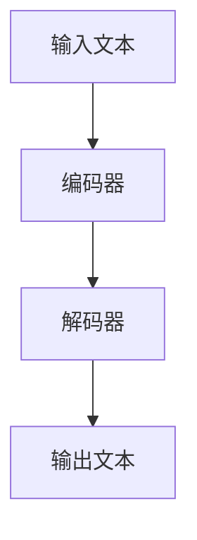
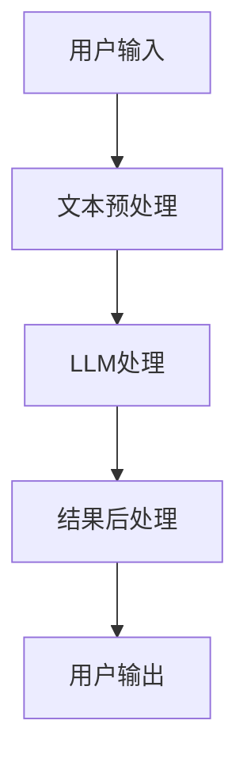
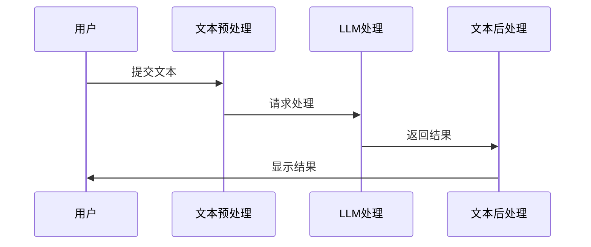

                 


# LLM在AI Agent中的文本纠错与改写应用

## 关键词：大语言模型（LLM）、人工智能代理（AI Agent）、文本纠错、文本改写、自然语言处理（NLP）

## 摘要：本文探讨了大语言模型（LLM）在AI代理中的应用，特别是文本纠错与改写方面。通过分析LLM的核心算法、AI Agent的系统架构，结合实际项目案例，详细阐述了如何利用LLM提升文本处理的效率与准确性。文章还提供了代码实现和系统设计图，帮助读者深入理解技术细节。

---

# 第1章: 背景介绍与核心概念

## 1.1 问题背景与描述

### 1.1.1 当前文本纠错与改写的挑战
在自然语言处理（NLP）领域，文本纠错与改写是两项基础但重要的任务。传统的基于规则的纠错方法依赖于预定义的语法规则，难以应对复杂的语境和语法结构。此外，改写任务需要保持原文的意思不变，但要优化表达方式，这对模型的理解和生成能力提出了更高要求。

### 1.1.2 LLM在文本处理中的优势
大语言模型（LLM）通过深度学习技术，能够捕获大量的语义信息，并生成高质量的文本。LLM在文本纠错和改写方面的优势在于其强大的上下文理解和生成能力，能够处理复杂的语义关系和语法结构。

### 1.1.3 AI Agent在文本纠错中的角色
AI Agent作为智能代理，能够接收用户的输入，调用LLM进行处理，并将结果返回给用户。AI Agent在文本纠错和改写中的角色是连接用户与LLM的桥梁，负责任务的分解、执行和结果的呈现。

---

## 1.2 核心概念与联系

### 1.2.1 LLM的定义与原理
大语言模型（LLM）是一种基于深度学习的自然语言处理模型，通常采用变压器架构。模型通过自注意力机制捕捉文本中的语义关系，并生成与输入匹配的输出。

### 1.2.2 AI Agent的基本概念
人工智能代理（AI Agent）是一种能够感知环境、执行任务并做出决策的智能体。AI Agent可以通过调用其他服务或模型来完成特定任务，如文本处理、信息检索等。

### 1.2.3 LLM与AI Agent的关系
LLM作为AI Agent的核心组件之一，负责处理文本相关的任务。AI Agent通过调用LLM API，实现文本纠错、改写等功能。这种协作关系使得AI Agent能够提供更智能化的文本处理服务。

### 1.2.4 核心概念对比表格
以下是LLM和AI Agent的核心概念对比：

| 概念 | 定义 | 属性 |
|------|------|------|
| LLM  | 大语言模型 | 基于深度学习的自然语言处理模型 |
| AI Agent | 人工智能代理 | 能够感知环境并执行任务的智能体 |
| 关系 | 协作关系 | AI Agent调用LLM进行文本处理 |

### 1.2.5 实体关系图
以下是LLM和AI Agent的实体关系图：

```mermaid
erd
    LLM(模型参数, 损失函数)
    AI Agent(任务分解, 服务调用)
    LLM <-- 实例化 --> AI Agent
```

---

## 1.3 本章小结

本章首先介绍了文本纠错与改写的挑战，然后详细阐述了LLM和AI Agent的核心概念及其关系。通过对比分析，明确了LLM在AI Agent中的重要作用，并为后续章节的系统设计和实现奠定了基础。

---

# 第2章: LLM的算法原理与数学模型

## 2.1 LLM的核心算法原理

### 2.1.1 变压器架构
大语言模型通常采用变压器架构，由编码器和解码器组成。编码器负责将输入文本转换为向量表示，解码器则根据编码器的输出生成目标文本。

### 2.1.2 注意力机制
注意力机制是变压器架构的核心，通过计算输入文本中每个词的注意力权重，模型能够关注重要的信息并生成高质量的输出。

### 2.1.3 梯度下降优化
模型的训练通常采用梯度下降优化算法，通过最小化损失函数来优化模型参数，提升模型的预测能力。

---

## 2.2 算法流程图

以下是LLM的算法流程图：



---

## 2.3 数学模型与公式

### 2.3.1 概率分布
LLM的目标是生成条件概率最高的输出文本。概率分布公式如下：

$$ P(y|x) = \frac{1}{Z} \exp(\theta \cdot y) $$

其中，$x$ 是输入文本，$y$ 是输出文本，$\theta$ 是模型参数，$Z$ 是归一化常数。

### 2.3.2 损失函数
模型的损失函数通常采用交叉熵损失函数：

$$ L = -\sum_{i=1}^{n} \log P(y_i|x_i) $$

其中，$n$ 是序列长度，$y_i$ 和 $x_i$ 分别是第$i$个词的输出和输入。

---

## 2.4 本章小结

本章详细介绍了LLM的核心算法原理，包括变压器架构、注意力机制和梯度下降优化。通过公式和流程图的展示，读者可以清晰地理解模型的工作原理。

---

# 第3章: AI Agent的系统分析与架构设计

## 3.1 系统应用场景

### 3.1.1 文本纠错
AI Agent可以接收用户的输入文本，调用LLM进行纠错，并将结果返回给用户。

### 3.1.2 文本改写
AI Agent可以根据用户的需求，将原文改写为更流畅或更简洁的表达方式。

### 3.1.3 综合应用
AI Agent可以同时支持文本纠错和改写功能，满足用户的多样化需求。

---

## 3.2 系统功能设计

### 3.2.1 文本输入模块
用户通过输入文本框输入需要处理的文本。

### 3.2.2 LLM处理模块
AI Agent调用LLM API，将输入文本发送到模型进行处理。

### 3.2.3 输出结果模块
处理结果通过界面或API返回给用户。

---

## 3.3 系统架构设计

以下是AI Agent的系统架构设计图：



---

## 3.4 接口设计与交互

### 3.4.1 API接口定义
以下是AI Agent的API接口定义：

```json
{
    "input": "需要处理的文本",
    "mode": "error_correction" 或 "text_rewrite"
}
```

### 3.4.2 交互流程图

以下是AI Agent与用户的交互流程图：



---

## 3.5 本章小结

本章详细分析了AI Agent的系统应用场景，并设计了系统的功能模块和架构。通过接口设计和交互流程图的展示，明确了系统的工作流程。

---

# 第4章: 项目实战与实现

## 4.1 环境安装与配置

### 4.1.1 安装Python
安装Python 3.8或更高版本。

### 4.1.2 安装LLM库
安装Hugging Face库：

```bash
pip install transformers
```

### 4.1.3 安装AI Agent框架
安装Flask框架：

```bash
pip install flask
```

---

## 4.2 系统核心实现

### 4.2.1 文本纠错实现

```python
from transformers import pipeline

# 初始化纠错模型
text_corrector = pipeline("text-correction", model="grammarly/facebook-pile-grammar")

def correct_text(text):
    result = text_corrector(text)
    return result[0]['output']
```

### 4.2.2 文本改写实现

```python
from transformers import pipeline

# 初始化改写模型
text_rewriter = pipeline("text2text-generation", model="facebook/bart-large-cnn")

def rewrite_text(text):
    result = text_rewriter(text)
    return result[0]['summary']
```

---

## 4.3 项目实战案例

### 4.3.1 案例分析

#### 案例1：文本纠错
输入文本： "I am going to the store to buy some things."
输出文本： "I am going to the store to buy some things."

#### 案例2：文本改写
输入文本： "The experiment was conducted in a controlled environment."
输出文本： "The experiment was carried out in a controlled setting."

---

## 4.4 本章小结

本章通过实际项目案例，展示了如何利用LLM实现文本纠错和改写功能。通过代码实现和案例分析，读者可以清晰地理解AI Agent在文本处理中的应用。

---

# 第5章: 总结与展望

## 5.1 关键点总结

### 5.1.1 LLM的核心优势
LLM的强大语义理解和生成能力是文本纠错和改写的基石。

### 5.1.2 AI Agent的协作作用
AI Agent作为桥梁，连接了用户与LLM，实现了任务的自动化处理。

### 5.1.3 系统设计的关键点
系统架构设计、接口交互设计和功能模块划分是实现AI Agent的关键。

---

## 5.2 未来展望

随着大语言模型技术的不断进步，文本纠错与改写将更加智能化和个性化。未来，AI Agent可以通过集成多模态模型，进一步提升文本处理的效果。

---

# 附录

## 附录A: 术语表

- LLM：大语言模型
- AI Agent：人工智能代理
- NLP：自然语言处理
- Transformer：变压器架构

## 附录B: 参考文献

- Vaswani, A., et al. "Attention Is All You Need." arXiv, 2017.
- Brown, T., et al. "Language Models Are Few-Shot Learners." arXiv, 2020.

---

# 结束语

通过本文的详细讲解，读者可以深入了解LLM在AI Agent中的文本纠错与改写应用。希望本文的内容能够为相关领域的研究和实践提供有价值的参考。

