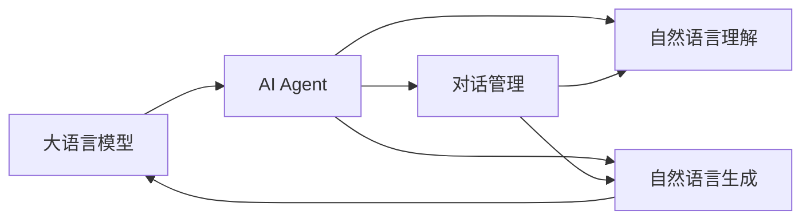
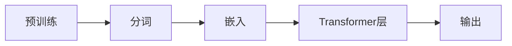
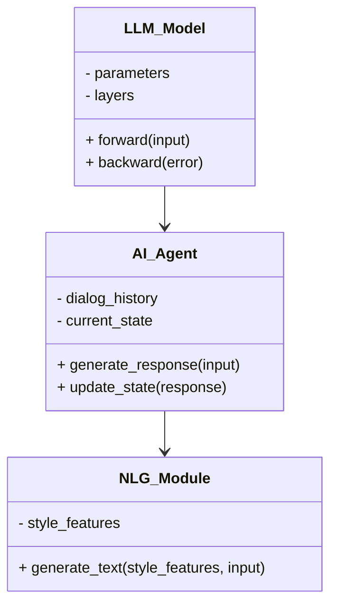
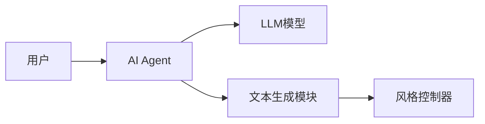
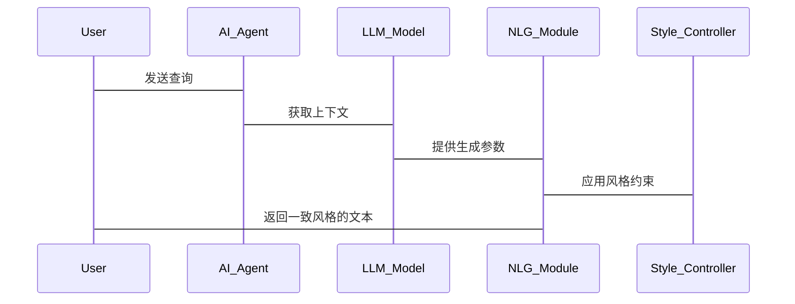

                 


# 《LLM在AI Agent中的文本风格一致性保持》

> **关键词**：大语言模型（LLM）、AI Agent、文本风格一致性、自然语言处理（NLP）、深度学习、文本生成、智能系统设计

> **摘要**：  
> 本文深入探讨了在AI Agent中利用大语言模型（LLM）保持文本风格一致性的关键问题。首先，从问题背景、核心概念到解决方案，系统地分析了LLM在AI Agent中的应用挑战。接着，通过详细阐述LLM的训练原理、算法实现以及系统架构，提出了保持文本风格一致性的具体方法。最后，结合实际案例，展示了如何在项目中实现这一目标，并总结了最佳实践和未来发展方向。文章内容详实，逻辑清晰，旨在为技术从业者提供有价值的参考。

---

# 1. 背景介绍

## 1.1 问题背景

### 1.1.1 大语言模型（LLM）的崛起
- 大语言模型（如GPT-3、PaLM）的出现，为自然语言处理（NLP）领域带来了革命性的变化。
- LLM能够生成高质量的文本，但在实际应用中，尤其是AI Agent场景中，生成的文本可能缺乏一致性，导致用户体验下降。

### 1.1.2 AI Agent的基本概念与应用场景
- AI Agent是一种智能系统，能够通过自然语言理解（NLU）和生成与用户交互。
- 应用场景包括智能客服、智能助手、内容生成等。

### 1.1.3 文本风格一致性的重要性
- 文本风格一致性是指生成的文本在语气、用词、句式等方面保持一致。
- 在AI Agent中，一致性是提升用户体验的关键，否则会导致对话混乱或用户信任度下降。

## 1.2 问题描述

### 1.2.1 LLM在AI Agent中的文本生成挑战
- LLM的通用性使其难以适应特定场景的需求。
- 不同对话轮次生成的文本风格可能不一致，影响用户体验。

### 1.2.2 文本风格不一致的具体表现形式
- 语气突兀：例如，前一句友好，后一句生硬。
- 用词不统一：例如，前后使用不同的专业术语。
- 句式变化过大：例如，突然从长句变为短句。

### 1.2.3 问题带来的实际影响与潜在风险
- 影响用户体验，降低用户满意度。
- 影响品牌形象，可能导致用户信任度下降。
- 在特定行业（如医疗、金融）中，不一致的文本可能引发严重后果。

## 1.3 问题解决

### 1.3.1 LLM在AI Agent中的文本风格一致性保持的目标
- 生成与上下文一致的文本。
- 保持对话中的语气、用词和句式的一致性。

### 1.3.2 解决方案的基本思路
- 在LLM的训练过程中引入风格约束。
- 在生成文本时，结合对话历史进行风格一致性控制。

### 1.3.3 解决方案的实现路径
- 数据预处理：将风格一致性作为训练目标的一部分。
- 模型微调：在特定风格的数据上进行微调。
- 在线风格控制：通过对话历史约束生成文本的风格。

## 1.4 边界与外延

### 1.4.1 LLM在AI Agent中的应用边界
- 适用于需要自然语言交互的场景。
- 不适用于需要严格逻辑推理的任务。

### 1.4.2 文本风格一致性保持的适用范围
- 适用于需要保持对话一致性的场景。
- 不适用于需要完全自由文本生成的场景。

### 1.4.3 相关概念的对比与区分
- 对比：文本风格一致性与文本内容准确性。
- 区分：文本生成的通用性与特定场景的定制化。

## 1.5 核心要素组成

### 1.5.1 LLM的基本组成
- 编码器-解码器架构。
- 预训练与微调机制。

### 1.5.2 AI Agent的核心功能模块
- 自然语言理解（NLU）模块。
- 自然语言生成（NLG）模块。
- 对话管理模块。

### 1.5.3 文本风格一致性的关键要素
- 对话历史记录。
- 风格特征提取。
- 风格约束机制。

---

# 2. 核心概念与联系

## 2.1 核心概念原理

### 2.1.1 大语言模型（LLM）的基本原理
- LLM通过大规模数据预训练，学习语言的规律和上下文关系。
- 生成文本时，基于概率预测下一个词。

### 2.1.2 AI Agent的核心工作原理
- AI Agent通过NLU理解用户输入。
- 通过LLM生成符合需求的回复。
- 通过对话管理模块维护上下文。

### 2.1.3 文本风格一致性保持的原理
- 在训练阶段，引入风格特征作为监督信号。
- 在生成阶段，利用对话历史约束生成的风格。

## 2.2 概念属性特征对比表格

| 概念       | 属性               | 特征描述                              |
|------------|--------------------|---------------------------------------|
| LLM        | 模型结构           | 基于Transformer架构                   |
|            | 训练目标           | 预测下一个词的概率                   |
| AI Agent   | 核心功能           | 理解用户输入、生成回复、管理对话     |
|            | 交互方式           | 自然语言交互                         |

## 2.3 实体关系图架构（Mermaid）



---

# 3. 算法原理讲解

## 3.1 预训练过程



## 3.2 微调过程

### 3.2.1 微调目标
- 优化损失函数：$$ \mathcal{L} = -\sum_{i=1}^{n} \log p(y_i|x_i) $$
- 优化目标：$$ \arg\min \mathcal{L} $$

### 3.2.2 微调实现
```python
def compute_loss(model, inputs, labels):
    outputs = model.generate(inputs)
    loss = cross_entropy(outputs, labels)
    return loss

# 微调过程
for batch in dataset:
    inputs, labels = get_batch(batch)
    loss = compute_loss(model, inputs, labels)
    loss.backward()
    optimizer.step()
```

---

# 4. 系统分析与架构设计方案

## 4.1 问题场景介绍

## 4.2 系统功能设计

### 4.2.1 领域模型类图（Mermaid）



### 4.2.2 系统架构图（Mermaid）



### 4.2.3 系统接口设计
- 输入接口：对话历史、用户输入。
- 输出接口：生成文本、状态更新。

### 4.2.4 系统交互序列图（Mermaid）



---

# 5. 项目实战

## 5.1 环境安装

```bash
pip install transformers torch
```

## 5.2 系统核心实现源代码

### 5.2.1 LLM加载与微调

```python
from transformers import AutoTokenizer, AutoModelForCausalLM

tokenizer = AutoTokenizer.from_pretrained('gpt2')
model = AutoModelForCausalLM.from_pretrained('gpt2')

# 微调
optimizer = torch.optim.Adam(model.parameters(), lr=1e-5)
for epoch in epochs:
    for batch in train_loader:
        inputs, labels = get_batch(batch)
        outputs = model.generate(inputs)
        loss = compute_loss(outputs, labels)
        loss.backward()
        optimizer.step()
```

### 5.2.2 文本生成与风格控制

```python
def generate_text(model, tokenizer, style_features, max_length=50):
    inputs = tokenizer.encode(style_features, return_tensors='pt')
    outputs = model.generate(inputs, max_length=max_length)
    return tokenizer.decode(outputs[0], skip_special_tokens=True)
```

## 5.3 代码应用解读与分析
- 加载预训练模型并进行微调。
- 在生成文本时，结合风格特征进行控制。

## 5.4 实际案例分析与详细讲解剖析
- 以电商客服AI Agent为例，展示如何保持回复风格的一致性。

## 5.5 项目小结

---

# 6. 最佳实践、小结、注意事项、拓展阅读

## 6.1 最佳实践

### 6.1.1 数据准备
- 确保训练数据多样化且具有代表性。
- 对风格特征进行标注和分类。

### 6.1.2 模型选择
- 根据具体场景选择合适的LLM模型。
- 考虑计算资源和模型大小。

### 6.1.3 风格控制
- 在生成阶段，动态调整风格参数。
- 结合领域知识优化风格控制策略。

## 6.2 小结
- 保持文本风格一致性是提升AI Agent用户体验的关键。
- 通过预训练、微调和在线控制实现风格一致性。

## 6.3 注意事项
- 避免过度优化，影响生成内容的多样性。
- 定期更新模型和风格特征，适应变化的用户需求。

## 6.4 拓展阅读
- 阅读相关论文，如《Maintaining Consistency in Text Generation with LLMs》。
- 关注最新的LLM技术和AI Agent应用案例。

---

# 7. 总结

## 7.1 核心内容回顾
- LLM在AI Agent中的应用挑战。
- 文本风格一致性保持的方法与实现。
- 项目实战与最佳实践。

## 7.2 未来发展方向
- 更高效的风格控制方法。
- 结合多模态信息提升风格一致性。
- 更智能的风格自适应机制。

---

通过以上步骤，我们详细分析了LLM在AI Agent中的文本风格一致性保持问题，并从理论到实践进行了全面探讨。希望本文能够为相关领域的从业者提供有价值的参考和启示。

