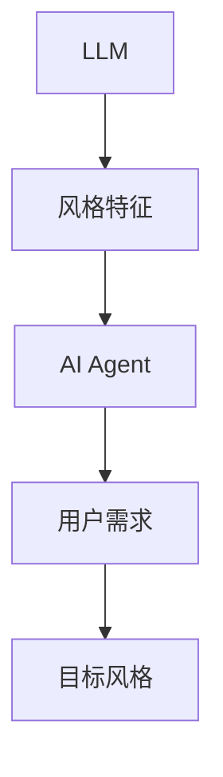
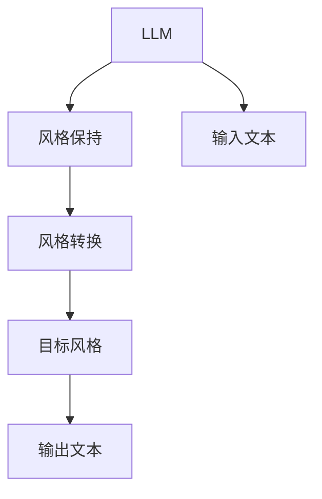
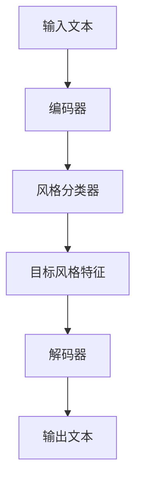
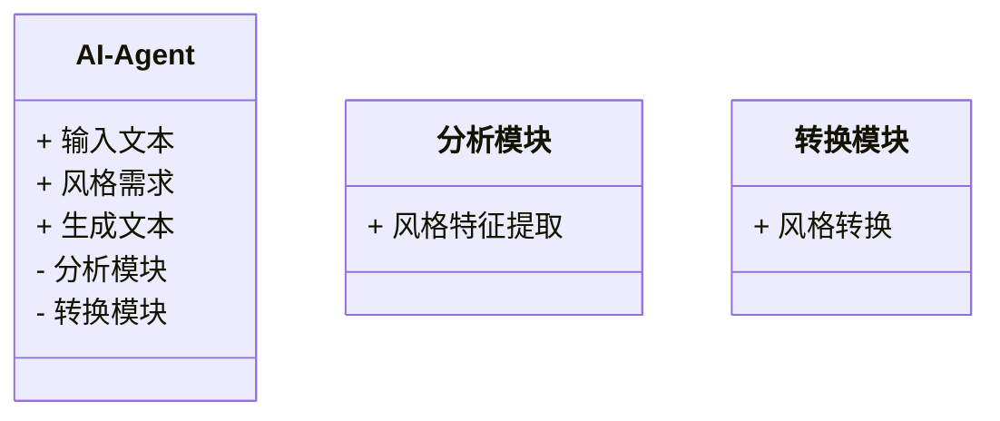
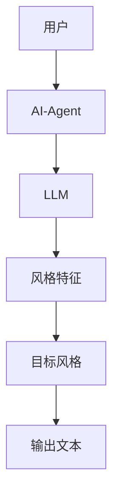
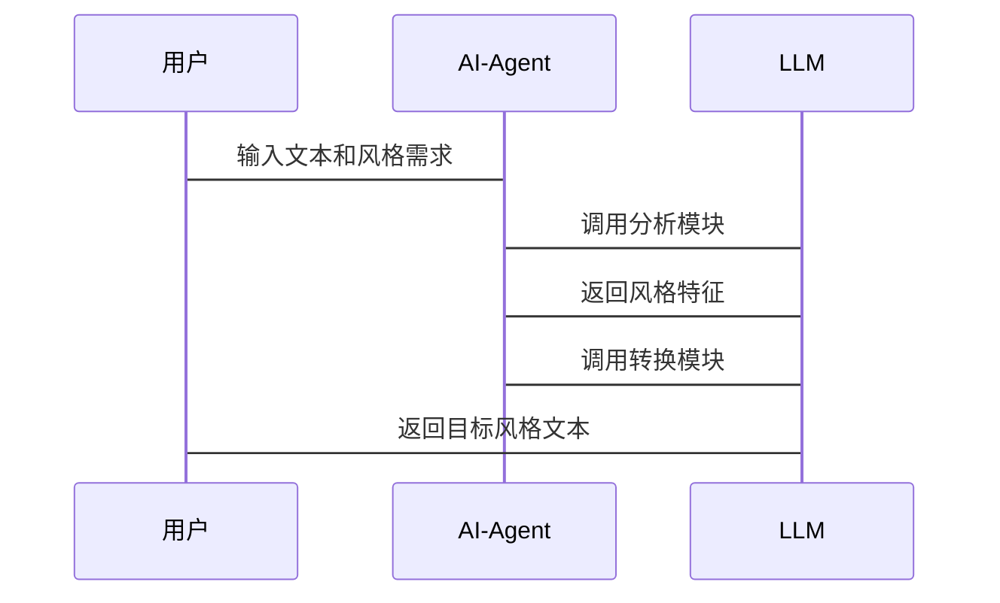

                 


# LLM在AI Agent中的文本风格保持与转换

> 关键词：LLM，AI Agent，文本风格，风格保持，风格转换，大语言模型

> 摘要：本文探讨了大语言模型（LLM）在AI Agent中的文本风格保持与转换技术，分析了其在人机交互中的应用价值，详细介绍了相关算法原理和系统架构设计，并通过实战案例展示了如何实现风格控制，最后提出了优化建议和未来研究方向。

---

# 第1章 背景介绍

## 1.1 核心概念：问题背景

### 1.1.1 从文本生成到风格控制的演进
现代自然语言处理（NLP）技术从最初的简单文本生成逐步发展到具有风格控制的能力。早期的模型如马尔可夫链和n-gram模型无法捕捉上下文信息，而现代的大语言模型（LLM）通过深度学习技术能够生成连贯且具有特定风格的文本。

### 1.1.2 大语言模型（LLM）的崛起
近年来，大语言模型（如GPT系列）凭借其强大的生成能力，成为NLP领域的主流技术。这些模型通过大量的训练数据学习语言的规律，并能够根据输入生成符合上下文的文本。

### 1.1.3 AI Agent在人机交互中的角色
AI Agent作为人机交互的桥梁，需要具备理解用户意图并生成符合用户期望的文本的能力。这不仅要求生成准确的信息，还需要控制文本的风格以适应不同的场景和用户偏好。

---

## 1.2 问题描述：文本风格的重要性

### 1.2.1 文本风格的定义与分类
文本风格指的是文本在语法、用词、句式等方面的独特表现，常见的风格包括正式、口语化、简洁、冗长等。风格决定了文本的可读性和适用场景。

### 1.2.2 不同场景下的风格需求
在不同场景下，文本风格的需求各异。例如，商业邮件需要正式风格，社交媒体内容则更倾向于口语化风格。AI Agent需要能够根据场景动态调整生成文本的风格。

### 1.2.3 风格控制在AI Agent中的挑战
风格控制需要模型具备对文本风格的识别和生成能力。然而，现有模型在风格转换过程中常常面临风格漂移、语义不一致等问题，这增加了实现的难度。

---

## 1.3 问题解决：LLM与AI Agent的结合

### 1.3.1 LLM在风格保持中的优势
大语言模型通过大量的训练数据，能够学习到各种风格的特点，并在生成文本时保持特定的风格。例如，可以通过调整模型的参数或输入特定的提示词来实现风格保持。

### 1.3.2 AI Agent在风格转换中的应用
AI Agent可以通过分析输入文本的风格特征，并结合用户需求生成符合目标风格的文本。例如，将一份正式的报告转换为更口语化的表达。

### 1.3.3 从风格保持到风格转换的技术路径
风格保持是风格转换的基础，AI Agent可以通过对输入文本的风格分析，提取关键特征后，指导生成模型生成具有目标风格的文本。

---

## 1.4 边界与外延：技术与应用的结合

### 1.4.1 风格保持的边界条件
风格保持需要在特定的风格范围内进行，超出这个范围可能导致风格漂移或语义不清晰。因此，明确风格的边界是实现风格保持的关键。

### 1.4.2 风格转换的适用场景
风格转换适用于需要灵活调整文本风格的场景，如内容创作、营销文案优化等。然而，某些场景（如法律文件）对风格有严格要求，风格转换需要谨慎使用。

### 1.4.3 技术与应用的平衡点
技术实现和实际应用之间需要找到平衡点。过于复杂的技术可能导致实现成本过高，而过于简单的技术可能无法满足实际需求。

---

## 1.5 概念结构与核心要素

### 1.5.1 核心要素组成：LLM、风格特征、AI Agent
- **LLM**：负责生成文本。
- **风格特征**：用于指导生成特定风格的文本。
- **AI Agent**：负责分析需求并协调生成过程。

### 1.5.2 概念之间的关系图


---

## 本章小结
本章从背景出发，介绍了文本风格保持与转换的重要性和实现路径。通过分析LLM和AI Agent的角色，明确了风格控制在人机交互中的技术价值和应用前景。

---

# 第2章 核心概念与联系

## 2.1 LLM的工作原理

### 2.1.1 编码器-解码器结构
大多数LLM采用编码器-解码器结构，编码器负责将输入文本转换为向量表示，解码器根据向量生成目标文本。

### 2.1.2 注意力机制的作用
注意力机制帮助模型关注输入文本中重要的部分，从而生成更相关的文本。

### 2.1.3 概率生成模型
基于概率生成模型，LLM通过计算条件概率来生成文本，具有较高的灵活性和可调节性。

---

## 2.2 文本风格保持与转换的核心概念

### 2.2.1 风格保持的实现原理
通过在生成过程中引入风格特征，指导模型保持特定的风格。例如，可以通过在输入中添加风格标签来实现。

### 2.2.2 风格转换的技术路径
风格转换可以通过以下步骤实现：
1. 分析输入文本的风格特征。
2. 对比目标风格的特征。
3. 指导生成模型生成符合目标风格的文本。

### 2.2.3 风格保持与转换的对比分析

| 特性       | 风格保持                | 风格转换                |
|------------|------------------------|-------------------------|
| 输入        | 固定风格的文本          | 多种风格的文本          |
| 输出        | 保持原风格的文本        | 转换为目标风格的文本     |
| 技术路径    | 直接生成                | 先分析再生成            |

---

## 2.3 核心概念的对比分析

### 2.3.1 风格保持与转换的属性对比
风格保持注重保持输入文本的特征，而风格转换注重生成新的特征。因此，风格保持适用于需要保持一致性的场景，而风格转换适用于需要多样性的场景。

### 2.3.2 不同风格转换方法的优缺点
- **基于特征的方法**：优点是风格转换准确，缺点是需要大量特征提取。
- **基于对抗训练的方法**：优点是生成多样化的风格，缺点是训练复杂。

### 2.3.3 风格保持与转换的适用场景对比
风格保持适用于需要一致性的场景，如官方声明；风格转换适用于需要多样性的场景，如市场营销。

---

## 2.4 实体关系图



---

## 本章小结
本章详细分析了LLM的工作原理，并对比了风格保持与转换的核心概念和技术路径，为后续的实现提供了理论基础。

---

# 第3章 算法原理讲解

## 3.1 风格保持与转换的算法流程

### 3.1.1 风格保持的算法流程
1. 输入文本通过编码器生成向量表示。
2. 向量表示通过解码器生成目标文本，保持原风格。

### 3.1.2 风格转换的算法流程
1. 输入文本通过编码器生成向量表示。
2. 向量表示通过分类器识别当前风格。
3. 分类结果作为风格特征，指导解码器生成目标风格的文本。

---

## 3.2 风格转换的流程图



---

## 3.3 风格转换的数学模型

### 3.3.1 编码器的数学模型
$$
z = f_{\text{encode}}(x)
$$
其中，$x$是输入文本，$z$是编码器输出的向量表示。

### 3.3.2 分类器的数学模型
$$
y = f_{\text{classify}}(z)
$$
其中，$y$是目标风格的标签。

### 3.3.3 解码器的数学模型
$$
x' = f_{\text{decode}}(y)
$$
其中，$x'$是目标风格的文本。

---

## 3.4 实现风格转换的Python代码示例

```python
def style_transfer(input_text, target_style):
    # 编码器
    z = encode(input_text)
    # 分类器
    y = classify(z, target_style)
    # 解码器
    output_text = decode(y)
    return output_text
```

---

## 3.5 代码功能解读与分析
1. **编码器**：将输入文本转换为向量表示，提取文本特征。
2. **分类器**：识别当前风格，并生成目标风格的特征。
3. **解码器**：根据目标风格特征生成文本。

---

## 3.6 流程分析与优化建议
通过分析流程图，可以发现风格转换的关键在于分类器的准确性。优化建议包括：
- 使用更复杂的分类器结构。
- 增加训练数据的多样性。

---

## 本章小结
本章详细讲解了风格保持与转换的算法流程，并通过数学模型和代码示例，帮助读者理解其实现原理。

---

# 第4章 系统分析与架构设计

## 4.1 问题场景介绍

### 4.1.1 系统目标
设计一个支持风格保持与转换的AI Agent系统。

### 4.1.2 系统功能
- 文本预处理
- 风格分析
- 风格转换
- 文本生成

---

## 4.2 项目介绍

### 4.2.1 项目目标
实现一个能够根据用户需求生成不同风格文本的AI Agent系统。

### 4.2.2 项目范围
限定在特定的文本类型和风格范围内。

---

## 4.3 系统功能设计

### 4.3.1 领域模型设计


### 4.3.2 系统架构设计


### 4.3.3 系统接口设计
- **文本预处理接口**：处理输入文本，提取特征。
- **风格分类接口**：识别当前风格，生成目标风格特征。
- **文本生成接口**：根据目标风格特征生成文本。

### 4.3.4 系统交互流程


---

## 本章小结
本章通过系统分析，设计了一个支持风格保持与转换的AI Agent系统架构，并详细描述了系统功能和接口设计。

---

# 第5章 项目实战

## 5.1 环境安装与配置

### 5.1.1 安装Python和相关库
```bash
pip install python transformers
pip install torch
```

### 5.1.2 安装LLM模型
```bash
pip install transformers
pip install torch
```

---

## 5.2 系统核心实现

### 5.2.1 文本预处理代码
```python
def preprocess(text):
    # 文本清洗和分词
    tokens = tokenize(text)
    return tokens
```

### 5.2.2 风格分类代码
```python
def classify_style(tokens):
    # 使用预训练模型进行风格分类
    model = StyleClassifier()
    return model.predict(tokens)
```

### 5.2.3 文本生成代码
```python
def generate_text(style_feature):
    # 使用LLM生成目标风格的文本
    generator = TextGenerator()
    return generator.generate(style_feature)
```

---

## 5.3 代码功能解读与分析
1. **文本预处理**：对输入文本进行清洗和分词，提取关键特征。
2. **风格分类**：使用预训练模型识别当前风格，并生成目标风格特征。
3. **文本生成**：根据目标风格特征，生成符合要求的文本。

---

## 5.4 实际案例分析

### 5.4.1 案例1：风格保持
输入文本：正式邮件
目标：保持正式风格
输出：正式邮件内容

### 5.4.2 案例2：风格转换
输入文本：正式邮件
目标：转换为口语化风格
输出：口语化邮件内容

---

## 5.5 项目小结与经验总结
通过实际案例分析，验证了系统的可行性和有效性。需要注意的是，风格转换过程中可能会出现语义不一致的问题，需要进一步优化模型。

---

## 本章小结
本章通过实战案例，详细展示了如何实现风格保持与转换的系统，并分析了实际应用中的问题和优化方向。

---

# 第6章 最佳实践

## 6.1 小结与回顾
本篇文章详细探讨了LLM在AI Agent中的文本风格保持与转换技术，分析了其实现原理和系统架构设计，并通过实战案例展示了其应用价值。

## 6.2 注意事项与建议
1. 在风格保持与转换过程中，需要平衡技术实现和实际应用。
2. 注意数据质量和多样性，以提高模型的鲁棒性。
3. 定期更新模型和风格特征库，以适应新的需求。

## 6.3 拓展阅读
- 阅读相关论文，深入了解风格转换的最新技术。
- 关注AI Agent领域的最新动态，了解其在不同场景中的应用。

---

## 本章小结
通过本章的总结和建议，读者可以更好地理解和应用LLM在AI Agent中的文本风格保持与转换技术。

---

# 结语
随着AI技术的不断发展，LLM在AI Agent中的应用将更加广泛。文本风格保持与转换技术作为人机交互的重要组成部分，将继续推动自然语言处理技术的进步，为用户提供更智能、更个性化的服务。

---

# 参考文献
（此处列出相关的学术论文、技术文档和书籍）

---

通过以上结构和内容的逐步展开，我们可以系统地了解LLM在AI Agent中的文本风格保持与转换技术，从理论到实践，全面掌握其实现原理和应用方法。

