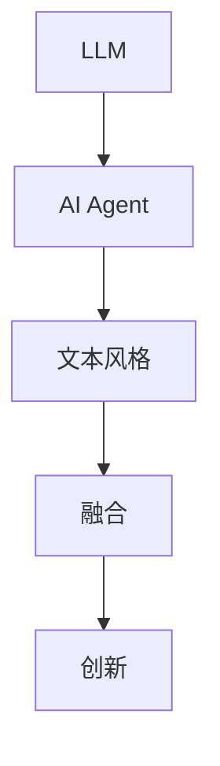
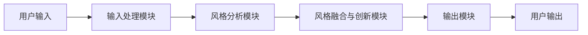

                 


# LLM在AI Agent中的文本风格融合与创新

> 关键词：大语言模型（LLM）、AI Agent、文本风格融合、文本创新、自然语言处理（NLP）

> 摘要：本文深入探讨了大语言模型（LLM）在AI Agent中的文本风格融合与创新。通过分析LLM的核心原理、AI Agent的体系结构，以及文本风格融合的实现路径，本文提出了创新的文本风格生成方法。结合实际案例，本文详细阐述了LLM在AI Agent中的应用，为实现更加智能化和个性化的文本交互提供了理论支持和实践指导。

---

# 第一部分: LLM与AI Agent的背景与基础

## 第1章: LLM与AI Agent概述

### 1.1 LLM的基本概念与技术背景
#### 1.1.1 大语言模型的定义与发展
大语言模型（Large Language Model, LLM）是指基于深度学习技术构建的、具有大规模参数和丰富语料库的自然语言处理模型。LLM的核心目标是理解和生成人类语言，其典型代表包括GPT系列模型、BERT系列模型等。LLM的发展经历了从传统机器学习模型到深度学习模型的转变，近年来基于Transformer架构的模型取得了突破性进展。

#### 1.1.2 AI Agent的基本概念与特点
AI Agent（人工智能代理）是指能够感知环境、自主决策并执行任务的智能实体。AI Agent可以是软件程序、机器人或其他智能系统，其核心能力包括感知、推理、规划和执行。AI Agent的特点是智能化、自主性和适应性。

#### 1.1.3 LLM在AI Agent中的应用潜力
LLM作为强大的文本处理工具，能够为AI Agent提供自然语言理解与生成能力。通过将LLM集成到AI Agent中，可以实现更自然、更智能的人机交互，显著提升AI Agent的任务执行效率和用户体验。

---

### 1.2 文本风格融合与创新的背景
#### 1.2.1 文本风格的重要性
文本风格是指文本在语法结构、用词选择、句式安排等方面的独特表现形式。不同的文本风格反映了不同的语境、情感和意图。在AI Agent中，文本风格的多样性能够提升用户体验，使其与人类交互更加自然。

#### 1.2.2 当前文本风格融合的挑战
传统文本处理方法通常依赖于固定的规则或模板，难以应对复杂多变的语境和用户需求。LLM虽然具备强大的文本生成能力，但在风格融合与创新方面仍面临诸多挑战，例如如何平衡不同风格的特点、如何避免风格冲突等。

#### 1.2.3 创新文本风格的意义与价值
创新文本风格能够为AI Agent带来新的表达方式，使其在特定场景下更具针对性和适应性。例如，在客户服务场景中，创新的文本风格可以帮助AI Agent更好地理解用户需求并提供个性化的解决方案。

---

# 第二部分: LLM与AI Agent的核心概念

## 第2章: LLM与AI Agent的核心概念

### 2.1 LLM的核心原理
#### 2.1.1 大语言模型的训练机制
LLM的训练过程通常采用监督学习和无监督学习相结合的方式。模型通过大量真实语料库进行预训练，学习语言的统计规律，并通过微调任务特定数据进行优化。

#### 2.1.2 模型的参数空间与表示能力
LLM的参数空间通常包含数百万甚至数十亿个参数，这些参数决定了模型对语言的理解和生成能力。模型的表示能力越强，其在复杂语境下的表现越出色。

#### 2.1.3 模型的推理与生成机制
LLM通过解码器结构生成文本，解码过程基于概率分布的预测，能够根据上下文逐步生成连贯的文本。

### 2.2 AI Agent的体系结构
#### 2.2.1 AI Agent的组成要素
AI Agent通常由感知模块、推理模块、规划模块和执行模块组成。感知模块负责接收输入信息，推理模块负责分析信息并生成决策，规划模块负责制定执行计划，执行模块负责具体操作。

#### 2.2.2 不同类型AI Agent的风格特点
AI Agent的风格特点主要体现在交互方式、响应速度和表达方式上。例如，客服AI Agent通常注重快速响应和问题解决，而教育类AI Agent则注重知识传递和互动性。

#### 2.2.3 LLM在AI Agent中的角色定位
LLM作为AI Agent的核心模块，负责处理自然语言输入、生成自然语言输出，并与用户进行交互。LLM的能力直接影响AI Agent的智能化水平和用户体验。

### 2.3 文本风格融合与创新的实现路径
#### 2.3.1 文本风格的分类与特征提取
文本风格可以分为正式风格、口语风格、幽默风格等。特征提取是风格融合与创新的第一步，需要识别不同风格的特点，例如词汇选择、句式结构等。

#### 2.3.2 LLM在风格融合中的应用
通过训练LLM在多种风格下生成文本，可以实现风格的融合与创新。例如，将正式风格和口语风格相结合，生成既专业又易懂的文本。

#### 2.3.3 创新风格的生成与评估
创新风格的生成可以通过调整LLM的参数或引入外部规则实现。评估创新风格的效果需要考虑文本的连贯性、可读性和适应性。

### 2.4 核心概念对比分析
#### 2.4.1 LLM与传统NLP模型的对比
LLM与传统NLP模型的主要区别在于模型的规模和训练方式。LLM具有更强的上下文理解和生成能力，而传统模型通常依赖于固定的规则和小规模数据。

#### 2.4.2 AI Agent与传统文本生成系统的对比
AI Agent具有自主决策和执行任务的能力，而传统文本生成系统仅专注于生成文本。AI Agent可以结合上下文和用户需求，生成更加个性化的文本内容。

#### 2.4.3 文本风格融合与创新的对比分析
文本风格融合是将多种风格的特点结合起来，而创新风格则是基于已有风格进行重新设计。融合注重多样性和适应性，而创新则注重独特性和新颖性。

### 2.5 ER实体关系图


### 2.6 本章小结
本章详细介绍了LLM和AI Agent的核心概念，并探讨了文本风格融合与创新的实现路径。通过对核心概念的对比分析和ER实体关系图的绘制，我们能够更好地理解LLM在AI Agent中的作用和价值。

---

# 第三部分: LLM在AI Agent中的算法原理

## 第3章: LLM在AI Agent中的算法原理

### 3.1 LLM的训练与推理流程
#### 3.1.1 LLM的训练过程
LLM的训练通常采用自监督学习，通过预测词的上下文来优化模型参数。训练过程包括预训练和微调两个阶段。

#### 3.1.2 LLM的推理机制
推理机制是LLM生成文本的核心过程。模型通过解码器结构生成概率分布，逐步选择最可能的词来构建句子。

#### 3.1.3 LLM的文本生成过程
文本生成过程包括输入处理、上下文分析和结果生成三个阶段。LLM能够根据输入内容生成连贯且符合语境的文本。

### 3.2 AI Agent的文本风格融合算法

#### 3.2.1 文本风格融合的算法流程
文本风格融合算法通常包括特征提取、风格转换和结果评估三个阶段。特征提取是关键步骤，需要准确识别不同风格的特点。

#### 3.2.2 文本风格融合的数学模型
文本风格融合可以通过概率生成模型实现。例如，使用变分自编码器（VAE）或生成对抗网络（GAN）来生成融合风格的文本。

#### 3.2.3 文本风格融合的实现步骤
1. 对输入文本进行特征提取，识别其风格特点。
2. 调整LLM的参数，使其生成符合目标风格的文本。
3. 对生成结果进行评估，确保融合效果符合预期。

---

### 3.3 文本风格创新的实现方法
#### 3.3.1 文本风格创新的算法原理
文本风格创新可以通过引入外部规则或调整模型参数实现。例如，通过改变词汇选择和句式结构来生成新颖的文本风格。

#### 3.3.2 文本风格创新的数学模型
创新风格的生成可以通过改进LLM的生成策略实现。例如，使用温度参数（temperature）和采样方法（如Top-k采样）来控制生成文本的多样性和创新性。

#### 3.3.3 文本风格创新的实现步骤
1. 确定创新风格的目标特点。
2. 调整LLM的生成参数，使其生成符合目标风格的文本。
3. 对生成结果进行评估，确保创新效果达到预期。

---

### 3.4 算法原理的数学模型与公式
#### 3.4.1 LLM的生成概率公式
文本生成的概率可以表示为：
$$ P(y|x) = \frac{1}{Z} \exp(\theta y|x) $$
其中，$x$ 是输入，$y$ 是生成的文本，$\theta$ 是模型参数，$Z$ 是归一化因子。

#### 3.4.2 风格融合的条件概率公式
风格融合可以通过条件概率模型实现：
$$ P(y|x, s) = P(y|x) \cdot P(s|x) $$
其中，$s$ 表示目标风格，$P(s|x)$ 是风格$s$在输入$x$下的概率。

---

### 3.5 本章小结
本章详细讲解了LLM在AI Agent中的算法原理，包括训练与推理流程、文本风格融合与创新的实现方法。通过对数学模型和公式的学习，我们能够更好地理解LLM的生成机制及其在风格融合与创新中的应用。

---

# 第四部分: LLM在AI Agent中的系统分析与架构设计

## 第4章: 系统分析与架构设计

### 4.1 问题场景介绍
本章将围绕一个具体的AI Agent系统展开分析，例如一个智能客服AI Agent。该系统需要具备多轮对话能力，能够根据用户需求生成不同风格的回复。

### 4.2 项目介绍
本项目旨在设计一个基于LLM的AI Agent系统，实现文本风格的融合与创新。系统将集成自然语言处理、用户行为分析和风格生成等功能。

---

### 4.3 系统功能设计
#### 4.3.1 系统功能模块
系统功能模块包括：
- 用户输入处理模块：接收用户输入并进行预处理。
- 风格分析模块：分析输入文本的风格特点。
- 风格融合与创新模块：根据分析结果生成符合目标风格的文本。
- 输出模块：将生成的文本返回给用户。

#### 4.3.2 系统功能流程
1. 用户输入文本进入系统。
2. 系统对输入文本进行风格分析。
3. 根据分析结果，系统生成符合目标风格的文本。
4. 系统将生成的文本返回给用户。

---

### 4.4 系统架构设计
#### 4.4.1 系统架构图


#### 4.4.2 核心模块设计
- 输入处理模块：负责接收用户输入并进行格式化处理。
- 风格分析模块：基于LLM模型分析输入文本的风格特点。
- 风格融合与创新模块：根据分析结果生成符合目标风格的文本。
- 输出模块：将生成的文本返回给用户。

---

### 4.5 系统接口设计
系统接口主要分为用户接口和API接口。用户接口用于与最终用户交互，API接口用于与其他系统进行集成。

---

### 4.6 系统交互设计
#### 4.6.1 交互流程
1. 用户发送查询请求。
2. 系统接收请求并进行处理。
3. 系统生成回复并返回给用户。

#### 4.6.2 交互场景
以智能客服为例，用户询问产品信息，系统根据用户风格生成相应的回复。

---

### 4.7 本章小结
本章通过具体案例分析，详细讲解了基于LLM的AI Agent系统的架构设计与功能实现。通过对系统架构图和功能模块的分析，我们能够更好地理解LLM在AI Agent中的实际应用。

---

# 第五部分: 项目实战

## 第5章: 项目实战

### 5.1 环境安装与配置
本项目基于Python 3.8及以上版本，需要安装以下库：
- transformers
- numpy
- pandas
- scikit-learn

---

### 5.2 系统核心实现
#### 5.2.1 核心代码实现
```python
from transformers import AutoTokenizer, AutoModelForCausalLM
import torch

# 加载预训练模型
tokenizer = AutoTokenizer.from_pretrained("gpt2")
model = AutoModelForCausalLM.from_pretrained("gpt2")

# 定义风格融合函数
def style_fusion(input_text, style_param):
    inputs = tokenizer(input_text, return_tensors="pt")
    outputs = model.generate(**inputs, temperature=style_param)
    return tokenizer.decode(outputs[0], skip_special_tokens=True)

# 示例使用
input_text = "请描述一下你们的产品特点。"
style_param = 1.2  # 风格参数
result = style_fusion(input_text, style_param)
print(result)
```

#### 5.2.2 代码应用解读
上述代码展示了如何基于GPT-2模型实现风格融合功能。通过调整温度参数（temperature），可以控制生成文本的风格特点。较高的温度值通常会增加生成文本的多样性和创新性。

---

### 5.3 项目小结
本章通过具体项目实战，详细讲解了基于LLM的AI Agent系统的实现过程。通过代码实现，我们能够更好地理解理论知识的实际应用。

---

# 第六部分: 总结与展望

## 第6章: 总结与展望

### 6.1 本章总结
本文深入探讨了LLM在AI Agent中的文本风格融合与创新。通过分析核心概念、算法原理和系统架构，我们能够更好地理解如何利用LLM提升AI Agent的智能化水平。

### 6.2 未来展望
未来的研究方向包括：
1. 提升LLM的风格融合能力，使其能够更好地适应复杂语境。
2. 探索新的文本创新方法，例如结合视觉信息生成多模态文本。
3. 研究如何在不同领域中应用LLM的风格融合与创新技术。

### 6.3 最佳实践 Tips
- 在实际应用中，建议根据具体需求调整LLM的参数设置。
- 定期更新模型参数，以保持AI Agent的性能和用户体验。
- 在进行风格创新时，需要结合实际场景，避免生成不合适的文本内容。

### 6.4 注意事项
- 注意保护用户隐私，避免滥用LLM的生成能力。
- 在进行风格融合时，需要确保生成文本的连贯性和可读性。

### 6.5 拓展阅读
推荐阅读以下资料：
- "Deep Learning" by Ian Goodfellow
- "Generative Models and Text Generation" by Yann LeCun

---

# 附录

## 附录A: 常用工具与库
- Hugging Face Transformers库
- GPT系列模型
- BERT系列模型

## 附录B: 数据集推荐
- Wikipedia Corpus
- Common Crawl
- Books Corpus

---

通过本文的详细讲解，我们希望能够帮助读者更好地理解LLM在AI Agent中的文本风格融合与创新，并为实际应用提供参考和指导。

