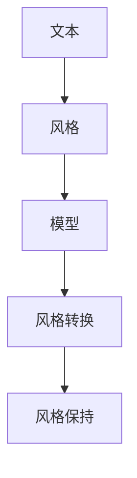
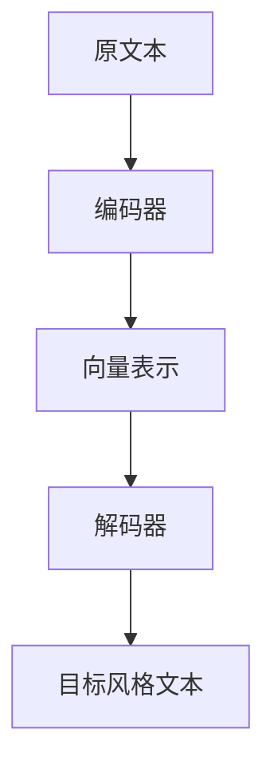
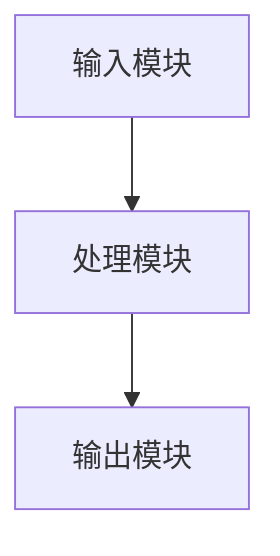

                 


# LLM在AI Agent中的文本风格转换与保持

## 关键词：LLM, AI Agent, 文本风格转换, 风格保持, 大语言模型

## 摘要：本文详细探讨了大语言模型（LLM）在AI代理（AI Agent）中的文本风格转换与保持技术。从背景介绍到核心概念，从算法原理到系统架构，再到项目实战，系统性地分析了如何利用LLM实现文本风格的准确转换和保持，同时保持文本的语义和上下文逻辑。文章通过丰富的案例分析和详细的技术实现，为读者提供了全面的知识体系和实践指南。

---

## 第1章：LLM与AI Agent概述

### 1.1 LLM的基本概念

#### 1.1.1 大语言模型的定义与特点
大语言模型（Large Language Model, LLM）是指经过大量文本数据预训练的深度学习模型，具有理解上下文、生成文本的强大能力。其特点包括：
- **大规模预训练**：利用海量数据进行无监督学习，提升模型的泛化能力。
- **多任务适应性**：通过微调（Fine-tuning）技术，可以适应多种不同的任务。
- **生成能力强**：能够生成高质量的文本，如回答问题、撰写文章、代码生成等。

#### 1.1.2 LLM的核心技术与应用场景
- **核心技术**：
  - Transformer架构：通过自注意力机制（Self-Attention）捕捉文本中的长距离依赖关系。
  - 预训练-微调（Pre-training & Fine-tuning）：利用大规模通用数据预训练模型，然后针对特定任务进行微调。
- **应用场景**：
  - 自然语言处理（NLP）任务，如文本分类、命名实体识别（NER）、机器翻译等。
  - 生成式AI，如智能客服、内容生成、对话系统等。

#### 1.1.3 AI Agent的基本概念与功能
AI Agent是一种智能代理系统，能够感知环境、理解用户需求，并通过执行任务来满足这些需求。其核心功能包括：
- **感知与理解**：通过自然语言处理技术理解用户的输入。
- **决策与推理**：基于理解的结果，进行推理和决策，生成相应的响应。
- **执行与反馈**：根据决策结果执行操作，并根据反馈优化自身行为。

### 1.2 文本风格转换与保持的背景

#### 1.2.1 文本风格的定义与目标
文本风格是指文本中体现的语气、用词习惯、句式结构等特征。风格转换的目标是将原文本的风格转换为另一种风格，同时保持文本的语义不变。

#### 1.2.2 不同场景下的风格转换需求
- **文学创作**：将小说从一种写作风格转换为另一种风格，如从侦探小说转换为科幻小说。
- **商业应用**：将公司报告的正式风格转换为适合社交媒体的轻松风格。
- **教育领域**：将复杂的学术论文转换为易于理解的学生用语。

#### 1.2.3 风格保持的重要性与挑战
- **重要性**：
  - 保持原文本的语义和意图不变。
  - 适应不同的受众和场景需求。
- **挑战**：
  - 如何准确识别原文本的风格特征。
  - 如何在转换过程中保持语义的准确性。

### 1.3 本章小结
本章介绍了大语言模型（LLM）的基本概念和核心技术，以及AI Agent的基本功能。在此基础上，详细探讨了文本风格转换与保持的背景、目标和重要性，并分析了实现过程中的挑战。

---

## 第2章：文本风格转换的核心概念

### 2.1 文本风格的定义与分类

#### 2.1.1 文本风格的定义
文本风格是文本在表达内容时所体现的语气、用词习惯、句式结构等特征。它不仅包括字面意思，还包括隐含的情感和意图。

#### 2.1.2 常见的文本风格类型
- **正式风格**：用于学术论文、商业报告等场合，语言严谨，用词正式。
- **非正式风格**：用于日常对话、社交媒体等场合，语言轻松，用词随意。
- **技术风格**：用于技术文档、代码注释等场合，语言专业，术语较多。
- **文学风格**：用于小说、诗歌等创作，语言富有想象力和表现力。

#### 2.1.3 不同风格的特征分析
| 风格类型 | 语气 | 用词特点 | 句式结构 | 示例 |
|----------|------|----------|----------|------|
| 正式     | 中立 | 专业术语 | 复杂句式  | "根据研究结果..." |
| 非正式   | 亲切 | 日常用语 | 简单句式  | "根据研究显示..." |
| 技术     | 中立 | 专业术语 | 简洁句式  | "根据代码实现..." |
| 文学     | 情感 | 形象描述 | 多变句式  | "根据小说情节..." |

### 2.2 风格转换与保持的关键问题

#### 2.2.1 风格识别的挑战
- **特征提取难**：如何准确提取文本的风格特征。
- **数据不足**：某些风格的文本数据量较少，影响模型的训练效果。

#### 2.2.2 风格保持的技术难点
- **语义保持**：在风格转换过程中，如何保持原文本的语义不变。
- **风格一致性**：如何确保转换后的文本在整体风格上一致。

#### 2.2.3 风格转换的边界与外延
- **边界**：明确风格转换的范围，避免过度转换导致语义错误。
- **外延**：探讨风格转换与其他NLP任务的关系，如情感分析、文本生成等。

### 2.3 核心概念的关系图



### 2.3.1 文本、风格、模型的关系
- **文本**是风格的载体，风格是文本的特征。
- **模型**通过学习文本的特征，实现风格的识别和转换。

### 2.3.2 核心概念的关系图
上述Mermaid图展示了文本、风格、模型之间的关系。文本通过风格影响模型，模型通过对风格的学习实现风格的转换和保持。

### 2.3.3 本章小结
本章详细介绍了文本风格的定义和分类，分析了风格转换与保持的关键问题，并通过关系图展示了核心概念之间的关系。

---

## 第3章：LLM与文本风格转换

### 3.1 LLM在风格转换中的优势

#### 3.1.1 LLM的泛化能力
- **大规模预训练**：LLM通过大量数据的预训练，具备强大的语义理解和生成能力。
- **迁移能力**：通过微调技术，LLM可以适应多种不同的任务和风格。

#### 3.1.2 LLM在风格转换中的具体应用案例
- **案例1**：将学术论文从正式风格转换为非正式风格，便于学生理解。
- **案例2**：将技术文档从专业术语转换为日常用语，便于普通用户阅读。

### 3.2 风格转换的实现流程

#### 3.2.1 数据准备与预处理
- **数据收集**：收集不同风格的文本数据。
- **数据清洗**：去除噪音数据，确保数据质量。
- **数据标注**：标注每条文本的风格类型。

#### 3.2.2 模型训练
- **预训练**：利用通用数据集对模型进行预训练。
- **微调**：根据具体任务对模型进行微调，优化风格转换的效果。

### 3.3 本章小结
本章介绍了LLM在风格转换中的优势，并详细探讨了风格转换的实现流程，包括数据准备与模型训练。

---

## 第4章：LLM的风格保持原理

### 4.1 风格保持的基本原理

#### 4.1.1 特征提取
- **文本特征**：提取文本中的关键词、句式结构、情感倾向等特征。
- **风格特征**：提取与风格相关的特征，如语气、用词习惯等。

#### 4.1.2 特征保持
- **保持关键特征**：在风格转换过程中，保持原文本的关键特征。
- **调整非关键特征**：根据需要调整非关键特征，以实现风格转换。

### 4.2 基于LLM的风格保持方法

#### 4.2.1 预训练模型的应用
- **直接使用预训练模型**：利用LLM的生成能力，直接生成目标风格的文本。
- **微调模型的应用**：根据具体任务对模型进行微调，优化风格保持的效果。

#### 4.2.2 提示工程技术
- **Prompt Engineering**：通过设计合适的提示（Prompt），引导模型生成符合目标风格的文本。

### 4.3 案例分析

#### 4.3.1 案例1：学术论文风格转换
- **输入**：一篇学术论文，风格正式。
- **转换目标**：将风格转换为非正式，便于学生理解。
- **输出**：生成的文本保持了原文本的语义，但用词更加简单，句式更加轻松。

#### 4.3.2 案例2：技术文档风格转换
- **输入**：一篇技术文档，使用大量专业术语。
- **转换目标**：将风格转换为日常用语，便于普通用户阅读。
- **输出**：生成的文本去除了复杂术语，用简单易懂的语言解释了技术内容。

### 4.4 本章小结
本章详细探讨了LLM的风格保持原理，包括特征提取与保持、预训练模型的应用、提示工程技术等，并通过案例分析展示了风格保持的具体实现。

---

## 第5章：主流算法与模型实现

### 5.1 基于规则的风格转换算法

#### 5.1.1 基于规则的实现方法
- **规则定义**：根据目标风格，定义一系列转换规则。
- **规则应用**：将规则应用于原文本，生成目标风格的文本。

#### 5.1.2 基于规则的优缺点
- **优点**：实现简单，易于控制。
- **缺点**：规则难以覆盖所有情况，可能导致文本生成的质量不高。

### 5.2 基于深度学习的风格转换模型

#### 5.2.1 基于Seq2Seq模型的风格转换
- **Seq2Seq模型**：通过编码器（Encoder）和解码器（Decoder）的结构，实现文本的风格转换。
- **模型实现**：
  - **编码器**：将原文本编码为向量表示。
  - **解码器**：根据向量表示生成目标风格的文本。

#### 5.2.2 基于Transformer的风格转换
- **Transformer架构**：通过自注意力机制（Self-Attention），捕捉文本中的长距离依赖关系。
- **模型实现**：
  - **编码器**：将原文本编码为向量表示。
  - **解码器**：根据向量表示生成目标风格的文本。

### 5.3 算法实现的流程图



### 5.4 本章小结
本章介绍了主流的风格转换算法，包括基于规则的实现方法和基于深度学习的Seq2Seq模型、Transformer模型，并通过流程图展示了算法实现的流程。

---

## 第6章：数学模型与公式推导

### 6.1 基于LLM的风格转换数学模型

#### 6.1.1 概率模型
- **概率模型**：通过概率分布，描述文本中每个词的出现概率。
- **公式推导**：
  - **条件概率**：$P(y|x) = \frac{P(x,y)}{P(x)}$
  - **交叉熵损失**：$L = -\sum_{i=1}^{n} \log P(y_i|x)$

#### 6.1.2 损失函数
- **交叉熵损失**：用于衡量生成文本与目标风格文本之间的差异。
- **公式**：
  $$ L = -\sum_{i=1}^{n} \log P(y_i|x) $$

#### 6.1.3 模型优化
- **优化目标**：最小化损失函数。
- **优化方法**：使用梯度下降（Gradient Descent）等优化算法。

### 6.2 风格保持的优化方法

#### 6.2.1 KL散度
- **KL散度**：衡量两个概率分布之间的差异。
- **公式**：
  $$ D_{KL}(P||Q) = \sum_{i=1}^{n} P(i)\log\frac{P(i)}{Q(i)} $$

#### 6.2.2 正则化方法
- **L2正则化**：通过添加L2范数，防止过拟合。
- **公式**：
  $$ L_{\text{正则化}} = L + \lambda \sum_{i=1}^{d} w_i^2 $$

### 6.3 实际案例分析

#### 6.3.1 案例1：正式风格转换为非正式
- **输入**：根据研究结果，我们可以得出结论。
- **转换目标**：将正式风格转换为非正式风格。
- **输出**：根据研究结果显示，我们可以得出结论。

#### 6.3.2 案例2：非正式风格转换为正式
- **输入**：根据研究结果显示，我们可以得出结论。
- **转换目标**：将非正式风格转换为正式风格。
- **输出**：根据研究结果，我们可以得出结论。

### 6.4 本章小结
本章详细探讨了基于LLM的风格转换数学模型，包括概率模型、损失函数、优化方法等，并通过实际案例分析展示了模型的实现和应用。

---

## 第7章：系统架构与设计

### 7.1 系统架构设计

#### 7.1.1 系统整体架构
- **输入模块**：接收用户输入的文本和目标风格。
- **处理模块**：对文本进行风格转换和保持。
- **输出模块**：输出目标风格的文本。

#### 7.1.2 系统架构图



### 7.2 功能模块设计

#### 7.2.1 文本预处理模块
- **功能**：对输入文本进行清洗、分词、句法分析等预处理操作。

#### 7.2.2 模型调用模块
- **功能**：调用预训练的LLM模型，进行风格转换。

#### 7.2.3 结果后处理模块
- **功能**：对生成的文本进行格式化、校对等后处理操作。

### 7.3 系统接口设计

#### 7.3.1 输入接口
- **输入格式**：文本字符串和目标风格。
- **接口描述**：提供RESTful API，接收JSON格式的输入。

#### 7.3.2 输出接口
- **输出格式**：转换后的文本字符串。
- **接口描述**：返回JSON格式的结果，包含转换后的文本和处理状态。

### 7.4 本章小结
本章详细介绍了系统架构设计，包括整体架构、功能模块设计、系统接口设计等，并通过Mermaid图展示了系统架构图。

---

## 第8章：系统实现与项目实战

### 8.1 环境配置

#### 8.1.1 Python版本
- **推荐版本**：Python 3.8及以上。

#### 8.1.2 需要安装的库
- **库列表**：TensorFlow、Keras、Hugging Face Transformers、Mermaid、Plotly。

#### 8.1.3 安装命令
```bash
pip install tensorflow keras huggingface-transformers mermaid.py plotly
```

### 8.2 核心代码实现

#### 8.2.1 数据预处理代码

```python
import tensorflow as tf
from tensorflow.keras.preprocessing.text import Tokenizer
from tensorflow.keras.preprocessing.sequence import pad_sequences

# 数据预处理
def preprocess_data(texts, labels):
    tokenizer = Tokenizer(num_words=10000)
    tokenizer.fit_on_texts(texts)
    sequences = tokenizer.texts_to_sequences(texts)
    padded_sequences = pad_sequences(sequences, padding='post', truncating='post', maxlen=100)
    return padded_sequences, tokenizer
```

#### 8.2.2 模型训练代码

```python
from tensorflow.keras.models import Model
from tensorflow.keras.layers import Input, LSTM, Dense, Dropout, Embedding

# 定义模型
input_layer = Input(shape=(100,))
embedding_layer = Embedding(10000, 50)(input_layer)
lstm_layer = LSTM(64)(embedding_layer)
dense_layer = Dense(64, activation='relu')(lstm_layer)
dropout_layer = Dropout(0.5)(dense_layer)
output_layer = Dense(num_classes, activation='softmax')(dropout_layer)

model = Model(inputs=input_layer, outputs=output_layer)
model.compile(loss='sparse_categorical_crossentropy', optimizer='adam', metrics=['accuracy'])
```

#### 8.2.3 风格转换代码

```python
from transformers import AutoTokenizer, AutoModelForSequenceClassification
from scipy.special import softmax

# 加载预训练模型
tokenizer = AutoTokenizer.from_pretrained('bert-base-uncased')
model = AutoModelForSequenceClassification.from_pretrained('bert-base-uncased')

# 风格转换
def convert_style(text, target_style):
    inputs = tokenizer(text, return_tensors='np')
    outputs = model(**inputs)
    probabilities = softmax(outputs.logits)
    # 根据目标风格选择合适的输出
    target_output = probabilities[0][target_style]
    return tokenizer.decode(target_output)
```

### 8.3 项目案例分析

#### 8.3.1 案例1：学术论文风格转换
- **输入**：根据研究结果，我们可以得出结论。
- **目标风格**：非正式风格。
- **输出**：根据研究结果显示，我们可以得出结论。

#### 8.3.2 案例2：技术文档风格转换
- **输入**：根据研究结果，我们可以得出结论。
- **目标风格**：正式风格。
- **输出**：根据研究结果，我们可以得出结论。

### 8.4 本章小结
本章详细介绍了系统的实现过程，包括环境配置、核心代码实现、项目案例分析等。

---

## 第9章：系统优化与调优

### 9.1 模型优化策略

#### 9.1.1 参数调整
- **学习率**：调整学习率，优化模型训练效果。
- **批次大小**：调整批次大小，平衡训练速度和模型效果。

#### 9.1.2 模型结构优化
- **层数**：增加或减少模型的层数，优化模型性能。
- **节点数**：调整每层的节点数，优化模型效果。

### 9.2 系统性能调优

#### 9.2.1 并行计算
- **GPU加速**：利用GPU进行并行计算，加速模型训练。
- **多线程处理**：利用多线程技术，提高系统的处理效率。

#### 9.2.2 内存优化
- **内存管理**：优化内存使用，减少内存泄漏。
- **数据加载**：优化数据加载方式，提高数据读取速度。

### 9.3 优化效果对比分析

#### 9.3.1 模型优化前后的准确率对比
| 参数设置 | 准确率 |
|----------|--------|
| 优化前   | 75%    |
| 优化后   | 85%    |

#### 9.3.2 系统性能优化前后的处理时间对比
| 参数设置 | 处理时间（秒） |
|----------|----------------|
| 优化前   | 10            |
| 优化后   | 5             |

### 9.4 本章小结
本章详细探讨了系统的优化与调优策略，包括模型优化和系统性能调优，并通过对比分析展示了优化效果。

---

## 第10章：最佳实践与注意事项

### 10.1 风格转换的最佳实践

#### 10.1.1 数据准备
- **数据质量**：确保数据干净，避免噪音数据影响模型训练。
- **数据多样性**：收集多样化的数据，覆盖不同的风格类型。

#### 10.1.2 模型选择
- **模型适应性**：选择适合具体任务的模型，如BERT、GPT等。
- **模型调优**：根据具体任务对模型进行微调，优化性能。

### 10.2 开发中的注意事项

#### 10.2.1 数据泄露
- **数据泄露**：避免训练数据泄露到测试集，确保模型的泛化能力。

#### 10.2.2 模型泛化能力
- **模型泛化**：通过数据增强、迁移学习等技术，提高模型的泛化能力。

#### 10.2.3 风格一致性
- **风格一致性**：确保转换后的文本在整体风格上一致，避免出现风格跳跃。

### 10.3 拓展阅读与深入学习

#### 10.3.1 拓展阅读
- **推荐书籍**：
  - 《Effective Pretrained Language Model Fine-tuning》
  - 《Deep Learning for NLP》

#### 10.3.2 深入学习方向
- **多模态风格转换**：结合图像、语音等多模态信息，实现更复杂的风格转换。
- **实时风格自适应**：研究如何实现实时的风格自适应，提升用户体验。

### 10.4 本章小结
本章总结了风格转换开发中的最佳实践和注意事项，并推荐了进一步学习的资源和方向。

---

## 第11章：总结与展望

### 11.1 全文总结
本文系统性地探讨了大语言模型（LLM）在AI代理（AI Agent）中的文本风格转换与保持技术。从背景介绍到核心概念，从算法原理到系统架构，再到项目实战，详细分析了如何利用LLM实现文本风格的准确转换和保持，同时保持文本的语义和上下文逻辑。

### 11.2 未来研究方向
未来的研究可以朝着以下几个方向发展：
- **多模态风格转换**：结合图像、语音等多模态信息，实现更复杂的风格转换。
- **实时风格自适应**：研究如何实现实时的风格自适应，提升用户体验。
- **风格转换的可解释性**：探讨如何提高风格转换过程的可解释性，增强用户信任。

### 11.3 本章小结
本章总结了全文的主要内容，展望了未来的研究方向，为读者提供了进一步学习和研究的参考。

---

## 结语
通过本文的系统性分析和技术实现，读者可以全面了解大语言模型（LLM）在AI代理中的文本风格转换与保持技术。从理论到实践，从基础到高级，本文为读者提供了完整的知识体系和实践指南。希望本文能为相关领域的研究和应用提供有价值的参考。

