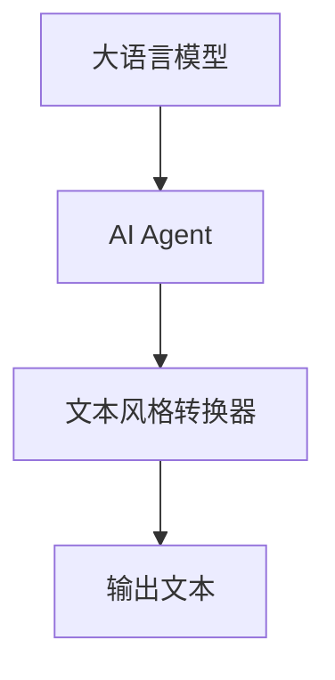
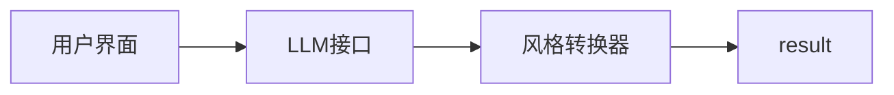
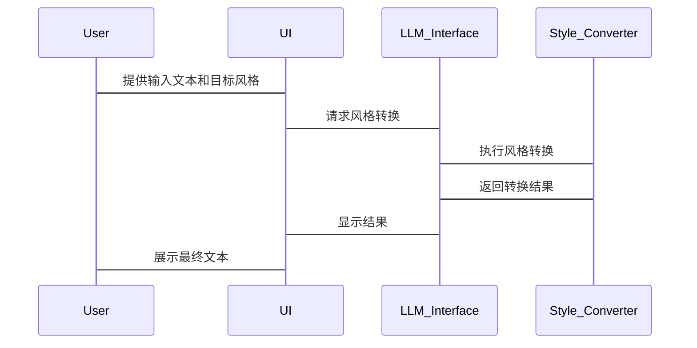

                 


---

# LLM在AI Agent中的文本风格转换应用

## 关键词：
LLM, AI Agent, 文本风格转换, 大语言模型, 智能代理, 文本生成

## 摘要：
本文深入探讨了大语言模型（LLM）在AI Agent中的文本风格转换应用。通过分析LLM与AI Agent的核心概念、算法原理、系统架构，结合实际项目案例，详细阐述了文本风格转换的技术实现与应用。文章结构清晰，内容丰富，旨在为技术人员和研究人员提供有价值的参考。

---

## 第一部分：背景介绍

### 第1章：LLM与AI Agent概述

#### 1.1 LLM的基本概念
- **1.1.1 大语言模型的定义与特点**
  大语言模型（LLM）是一种基于深度学习的自然语言处理模型，具有大规模参数和强大的语言理解与生成能力。LLM的特点包括通用性、可扩展性和上下文理解能力。

- **1.1.2 LLM的核心技术与发展趋势**
  LLM的核心技术包括Transformer架构、预训练和微调。发展趋势主要集中在模型轻量化、多模态融合和高效推理方面。

- **1.1.3 LLM在AI Agent中的作用**
  LLM作为AI Agent的核心组件，负责处理自然语言输入、生成自然语言输出，并提供决策支持。

#### 1.2 AI Agent的基本概念
- **1.2.1 AI Agent的定义与分类**
  AI Agent是一种智能代理系统，能够感知环境、执行任务并做出决策。根据应用场景，AI Agent可以分为任务型、服务型和社交型。

- **1.2.2 AI Agent的核心功能与应用场景**
  核心功能包括感知、推理、决策和执行。应用场景涵盖客服、教育、医疗和金融等领域。

- **1.2.3 LLM与AI Agent的结合**
  LLM为AI Agent提供了强大的自然语言处理能力，使其能够更好地理解和生成人类语言，提升交互体验。

#### 1.3 文本风格转换的背景与意义
- **1.3.1 文本风格的定义与目标**
  文本风格转换是指将一种风格的文本转换为另一种风格，目标是使生成文本更符合特定场景或用户需求。

- **1.3.2 文本风格转换的应用场景**
  包括内容创作、客户服务、教育和个性化推荐等领域。

- **1.3.3 LLM在文本风格转换中的优势**
  LLM具有强大的语言模型，能够处理复杂语义，生成高质量文本，是实现文本风格转换的理想工具。

---

## 第二部分：核心概念与联系

### 第2章：LLM与AI Agent的关系

#### 2.1 LLM与AI Agent的核心概念对比
- **2.1.1 LLM的输入输出机制**
  LLM通过输入文本生成输出文本，具备上下文理解和生成能力。

- **2.1.2 AI Agent的决策与执行过程**
  AI Agent根据输入信息做出决策，并通过执行模块完成任务。

- **2.1.3 两者的联系与区别**
  LLM作为AI Agent的核心组件，为AI Agent提供语言理解和生成能力，而AI Agent则为LLM提供应用场景和决策框架。

#### 2.2 文本风格转换的核心原理
- **2.2.1 文本风格的特征分析**
  文本风格特征包括词汇选择、句式结构和语气情感等因素。

- **2.2.2 LLM在风格转换中的角色**
  LLM通过预训练和微调掌握不同风格的文本特征，生成符合目标风格的文本。

- **2.2.3 AI Agent在风格转换中的目标**
  AI Agent通过文本风格转换优化输出结果，提升用户体验。

#### 2.3 实体关系图与流程图



---

## 第三部分：算法原理讲解

### 第3章：LLM的算法原理

#### 3.1 大语言模型的结构与训练
- **3.1.1 模型结构概述**
  基于Transformer架构，包括编码器和解码器，通过自注意力机制处理长文本。

- **3.1.2 基于Transformer的架构**
  Transformer由多头自注意力和前馈网络组成，能够捕捉文本中的长程依赖。

- **3.1.3 大规模预训练的数学模型**
  LLM通过大量数据预训练，学习语言的分布和语义表示。

#### 3.2 AI Agent的决策算法
- **3.2.1 基于LLM的决策过程**
  AI Agent通过LLM生成可能的决策选项，评估每个选项的可行性，选择最优解。

- **3.2.2 基于强化学习的优化**
  使用强化学习优化AI Agent的决策策略，提升决策的准确性和鲁棒性。

- **3.2.3 决策树与概率模型的结合**
  结合决策树和概率模型，AI Agent能够处理复杂场景下的多种可能性。

#### 3.3 文本风格转换的算法实现
- **3.3.1 风格转换的数学模型**
  使用预训练的LLM，通过微调或提示工程技术实现风格转换。

- **3.3.2 基于LLM的风格转换流程**
  输入原始文本，通过LLM生成目标风格的文本。

- **3.3.3 算法的优化与改进**
  引入领域知识或用户反馈，进一步优化风格转换的效果。

---

## 第四部分：系统分析与架构设计

### 第4章：AI Agent文本风格转换系统的架构

#### 4.1 系统功能设计
- **4.1.1 领域模型设计**
  定义系统的核心功能模块，包括文本输入、风格选择、转换处理和结果输出。

- **4.1.2 系统功能模块划分**
  模块包括用户界面、LLM接口、风格转换器和结果展示。

- **4.1.3 功能交互流程**
  用户输入文本，选择目标风格，系统调用LLM生成并输出结果。

#### 4.2 系统架构设计



#### 4.3 系统接口设计
- **4.3.1 接口定义**
  包括文本输入接口、风格选择接口和结果输出接口。

- **4.3.2 接口交互流程**
  用户通过UI输入文本，选择风格，系统调用接口完成转换并返回结果。

#### 4.4 系统交互流程图



---

## 第五部分：项目实战

### 第5章：项目实战与案例分析

#### 5.1 项目环境安装
- **5.1.1 安装Python和相关库**
  需要安装Python 3.8以上版本，以及llm、transformers和sentence-transformers库。

#### 5.2 系统核心实现源代码
```python
from transformers import pipeline

# 初始化LLM pipeline
llm_pipeline = pipeline('text-generation', model='gpt2')

def text_style_conversion(input_text, target_style):
    # 使用LLM生成风格转换后的文本
    converted_text = llm_pipeline(input_text, max_length=500, temperature=0.7)[0]['text']
    return converted_text

# 示例输入
input_text = "Hello, how are you?"
target_style = "casual"

# 转换结果
result = text_style_conversion(input_text, target_style)
print(result)
```

#### 5.3 代码应用解读与分析
- **5.3.1 代码功能分析**
  该代码使用GPT-2模型实现文本风格转换，通过调整温度参数控制生成文本的随机性。

- **5.3.2 代码优化建议**
  可以引入领域知识或使用更先进的LLM模型（如GPT-3）提升转换效果。

#### 5.4 实际案例分析
- **5.4.1 案例背景**
  某企业希望将技术文档转换为用户友好的教程。

- **5.4.2 转换过程**
  使用LLM将技术术语转化为通俗易懂的语言，生成适合用户的教程内容。

- **5.4.3 结果展示**
  转换后的教程内容清晰易懂，提升了用户体验。

#### 5.5 项目小结
- **5.5.1 项目总结**
  通过实际项目验证了LLM在文本风格转换中的有效性。

- **5.5.2 项目成果**
  成功实现了AI Agent驱动的文本风格转换系统，提升了内容的可读性和用户体验。

---

## 第六部分：总结与展望

### 第6章：总结与展望

#### 6.1 最佳实践 tips
- **6.1.1 选择合适的LLM模型**
  根据具体需求选择适合的LLM模型，如较小的模型适合资源受限场景。

- **6.1.2 合理调整参数**
  通过调整温度和拓扑参数优化生成效果。

- **6.1.3 结合领域知识**
  引入专业领域知识提升转换的准确性和相关性。

#### 6.2 小结
本文详细探讨了LLM在AI Agent中的文本风格转换应用，从理论到实践，全面分析了相关技术和实现方案。

#### 6.3 注意事项
- **模型选择**
  注意模型的大小和计算资源的匹配。
- **数据隐私**
  确保数据处理符合隐私保护要求。
- **性能优化**
  通过模型压缩和优化算法提升运行效率。

#### 6.4 拓展阅读
- 推荐阅读《Large Language Models in AI》和《Transformer-based Models for Text Generation》。

---

## 参考文献
- [1] Vaswani, A., et al. "Attention Is All You Need." arXiv preprint arXiv:1706.03798, 2017.
- [2] Radford, A., et al. "Language models are few-shot learners." arXiv preprint arXiv:1909.02795, 2019.
- [3] Brown, T., et al. "A generative semantic model for zero-shot task-specific language models." arXiv preprint arXiv:2005.14168, 2020.

---

通过以上内容，希望读者能够全面理解LLM在AI Agent中的文本风格转换应用，并在实际项目中灵活运用这些技术。

