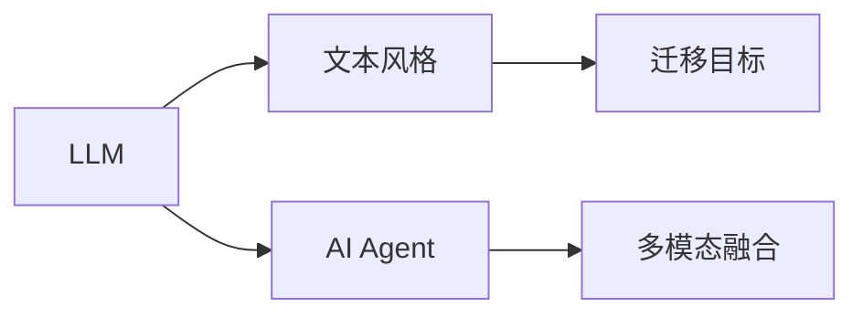

                 


```markdown
# LLM在AI Agent中的文本风格迁移与融合

> 关键词：大语言模型，AI Agent，文本风格迁移，多模态融合，自然语言处理，机器学习，文本生成

> 摘要：本文探讨了大语言模型（LLM）在AI Agent中的文本风格迁移与融合的技术细节。通过分析LLM的核心原理，结合文本风格迁移的实现机制，阐述了如何在AI Agent中实现多模态融合，以提升文本处理的准确性和灵活性。文章从背景介绍、核心概念、算法原理、系统架构、项目实战等多方面展开，结合实际案例和代码示例，为读者提供全面而深入的技术解析。

---

## 第一部分：背景介绍

### 第1章：问题背景与核心概念

#### 1.1 问题背景

- **1.1.1 AI Agent的发展现状**
  - AI Agent作为人工智能领域的核心应用，广泛应用于智能助手、自动化服务、智能客服等领域。
  - 随着深度学习技术的快速发展，AI Agent的功能逐渐从简单的信息查询扩展到复杂的多轮对话和任务执行。

- **1.1.2 大语言模型（LLM）的崛起**
  - LLM（Large Language Model）如GPT系列、BERT系列等，通过海量数据的训练，具备强大的自然语言理解和生成能力。
  - LLM的引入，使得AI Agent能够生成更自然、更贴近人类语言习惯的文本。

- **1.1.3 文本风格迁移与融合的必要性**
  - 在不同的场景下，AI Agent需要生成符合特定风格的文本，例如正式邮件、闲聊对话、技术文档等。
  - 为了满足多样化的用户需求，AI Agent需要具备文本风格迁移的能力，并能够将多种模态的信息进行融合，提升生成结果的质量。

#### 1.2 问题描述

- **1.2.1 文本风格迁移的核心问题**
  - 如何将源文本的风格迁移到目标文本，同时保持内容的一致性。
  - 如何处理风格迁移中的语义损失问题，确保生成文本的准确性。

- **1.2.2 多模态融合的挑战**
  - 多模态数据（如文本、图像、语音等）的融合需要考虑不同模态之间的关联性。
  - 如何在AI Agent中实现多模态数据的高效融合，提升生成结果的多样性。

- **1.2.3 AI Agent中的文本处理需求**
  - AI Agent需要处理多种语言、多种风格的文本。
  - 如何在复杂的场景下，快速响应用户的文本请求，并生成符合用户期望的结果。

#### 1.3 问题解决与边界

- **1.3.1 LLM在文本风格迁移中的应用**
  - 利用LLM的强大生成能力，实现文本风格的灵活切换。
  - 通过微调（Fine-tuning）技术，将模型适应特定的风格需求。

- **1.3.2 AI Agent中的多模态融合边界**
  - 确定哪些模态的数据需要融合，以及融合的顺序和方式。
  - 在AI Agent中，文本风格迁移与多模态融合的边界需要清晰定义，以避免功能冲突。

- **1.3.3 核心要素与概念结构**
  - 核心要素包括：源文本、目标风格、LLM模型、多模态数据、生成结果。
  - 概念结构通过表格和Mermaid图进行展示。

---

### 第2章：核心概念与联系

#### 2.1 LLM与文本风格迁移的原理

- **2.1.1 大语言模型的基本原理**
  - LLM通过预训练（Pre-training）技术，学习大规模的文本数据，掌握语言的结构和语义。
  - 基于Transformer架构，实现高效的序列建模和生成。

- **2.1.2 文本风格迁移的实现机制**
  - 通过风格编码（Style Encoding）技术，提取源文本的风格特征。
  - 利用LLM的生成能力，将源文本的内容迁移到目标风格。

- **2.1.3 LLM在AI Agent中的应用特点**
  - 实时性：AI Agent需要快速响应用户的请求。
  - 多样性：支持多种语言和风格的文本生成。
  - 可定制性：通过微调技术，适应特定场景的需求。

#### 2.2 核心概念对比

- **2.2.1 文本风格迁移的特征对比**
  | 特征维度 | 风格迁移前 | 风格迁移后 |
  |----------|------------|------------|
  | 语言风格 | 原始文本风格 | 目标文本风格 |
  | 内容保持 | 高 | 高 |
  | 生成效率 | 低 | 中 |

- **2.2.2 多模态融合的属性分析**
  - 融合方式：串行融合、并行融合。
  - 融合目标：提升生成结果的多样性和准确性。
  - 融合挑战：不同模态数据的异构性和一致性问题。

- **2.2.3 LLM与传统NLP模型的对比**
  - LLM：基于Transformer架构，具备强大的上下文理解能力。
  - 传统NLP模型：如SVM、CRF等，适用于特定任务。

#### 2.3 实体关系图



---

## 第三部分：算法原理与数学模型

### 第3章：算法原理与数学模型

#### 3.1 文本风格迁移算法

- **3.1.1 预处理阶段**
  - 文本清洗：去除噪声，保留有效信息。
  - 分词：将文本分割成词语或短语。

- **3.1.2 特征提取与转换**
  - 通过词向量（Word Embedding）提取文本的语义特征。
  - 使用风格向量（Style Vector）表示目标风格的特征。

- **3.1.3 模型训练与优化**
  - 利用LLM进行微调，训练风格迁移模型。
  - 通过交叉验证（Cross-validation）优化模型参数。

#### 3.2 多模态融合算法

- **3.2.1 多模态数据的预处理**
  - 文本数据：分词、去停用词。
  - 图像数据：提取特征向量。
  - 语音数据：提取音频特征。

- **3.2.2 融合策略的选择**
  - 基于内容的融合：根据文本内容选择相关的多模态数据。
  - 基于风格的融合：根据目标风格选择适合的多模态数据。

- **3.2.3 融合后的优化**
  - 使用注意力机制（Attention Mechanism）进行多模态数据的加权融合。
  - 通过后处理（Post-processing）优化生成结果的质量。

#### 3.3 数学模型与公式

- **3.3.1 文本风格迁移的数学模型**
  $$P(y|x) = \text{exp}(f(x) \cdot g(y))$$

- **3.3.2 多模态融合的数学公式**
  $$y = \sum_{i=1}^{n} w_i x_i$$

---

### 第4章：系统分析与架构设计

#### 4.1 问题场景介绍

- **4.1.1 AI Agent的功能需求**
  - 多轮对话：支持连续的交互，保持对话的连贯性。
  - 任务执行：根据用户的指令完成特定任务。
  - 文本生成：生成符合用户需求的文本。

- **4.1.2 文本风格迁移的应用场景**
  - 个性化服务：根据用户的偏好生成特定风格的文本。
  - 跨场景应用：在不同场景下切换文本风格，提升用户体验。

#### 4.2 项目介绍

- **4.2.1 项目目标**
  - 实现AI Agent中文本风格的灵活迁移。
  - 提供多模态数据的融合功能，提升生成结果的质量。

- **4.2.2 系统功能设计**
  ```mermaid
  classDiagram
      class LLM {
          generate(text: String) -> String
          style_transfer(source: String, target_style: String) -> String
      }
      class MultiModalFuser {
          fuse(text: String, image: String, voice: String) -> String
      }
      class AIAssistant {
          process_request(request: String) -> String
      }
      LLM --> MultiModalFuser
      MultiModalFuser --> AIAssistant
  ```

- **4.2.3 系统架构设计**
  ```mermaid
  ```

