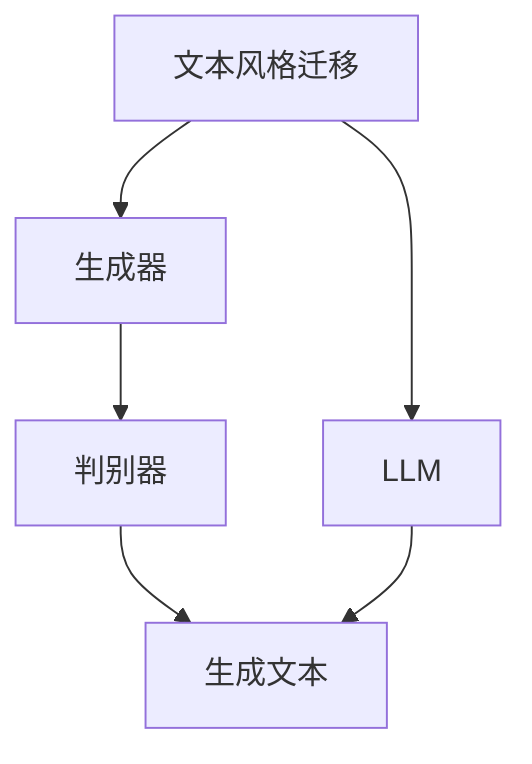
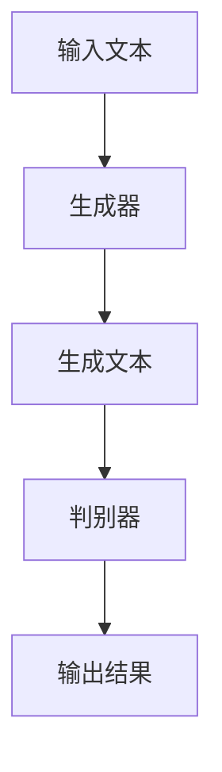

                 


# LLM在AI Agent中的文本风格迁移应用

> 关键词：LLM, AI Agent, 文本风格迁移, 生成对抗网络, 自然语言处理, 文本生成, 文本迁移

> 摘要：本文探讨了大语言模型（LLM）在AI Agent中的文本风格迁移应用，详细分析了文本风格迁移的核心概念、算法原理、系统架构以及实际应用案例。通过生成对抗网络和大语言模型的结合，展示了如何实现高效的文本风格转换，并应用于智能代理系统中，提升用户体验和系统性能。

---

## 第一部分：背景介绍

### 第1章：问题背景与核心概念

#### 1.1 问题背景

随着自然语言处理技术的快速发展，文本风格迁移在AI Agent中的应用变得越来越重要。AI Agent需要能够理解并适应不同用户的语言风格，从而提供更个性化的服务。然而，如何实现高效的文本风格迁移，同时保持文本的语义和流畅性，是一个具有挑战性的任务。

文本风格迁移的定义是指将一段文本从一种风格转换到另一种风格，同时保持其原始内容不变。例如，将正式的商务信函转换成更口语化的表达，或者将复杂的学术语言简化成通俗易懂的解释。这种技术在AI Agent中具有广泛的应用场景，如智能客服、个性化推荐和多语言翻译等。

#### 1.2 核心概念

文本风格迁移涉及多个核心概念，包括生成对抗网络（GAN）、大语言模型（LLM）、文本生成和迁移学习等。生成对抗网络是一种深度学习模型，由生成器和判别器组成，用于生成逼真的数据。大语言模型则是一种基于Transformer架构的模型，能够处理大量的文本数据，生成高质量的文本内容。

通过结合生成对抗网络和大语言模型，可以在AI Agent中实现高效的文本风格迁移。生成器负责生成目标风格的文本，判别器用于区分生成文本和真实文本，从而不断优化生成器的性能。大语言模型则提供了强大的文本生成能力，确保生成的文本在语义上与原始文本一致。

---

## 第二部分：核心概念与联系

### 第2章：核心概念与联系

#### 2.1 文本风格迁移的定义与分类

文本风格迁移可以分为两类：基于规则的方法和基于模型的方法。基于规则的方法通过替换关键词或调整句式来实现风格转换，但这种方法通常缺乏灵活性，难以处理复杂的文本结构。基于模型的方法则利用深度学习模型，如生成对抗网络和大语言模型，实现更复杂的风格转换。

#### 2.2 LLM与生成对抗网络的结合

生成对抗网络（GAN）由生成器和判别器组成。生成器负责生成目标风格的文本，判别器则区分生成文本和真实文本。通过不断优化生成器和判别器的参数，可以实现高效的文本生成。大语言模型则提供了强大的文本生成能力，能够生成高质量的文本内容，并通过迁移学习适应不同的风格。

#### 2.3 核心要素对比

| 核心要素 | 文本风格迁移 | LLM |
|----------|--------------|-----|
| 输入 | 原始文本 | 文本内容和风格 |
| 输出 | 目标风格文本 | 生成的文本 |
| 方法 | 基于规则或模型 | 基于深度学习模型 |
| 应用 | 个性化推荐、翻译 | 文本生成、问答系统 |

#### 2.4 概念结构与Mermaid图



---

## 第三部分：算法原理

### 第3章：算法原理

#### 3.1 生成对抗网络的工作原理

生成对抗网络由生成器和判别器组成，通过对抗训练优化生成器的性能。生成器的目标是生成与真实文本难以区分的文本，而判别器的目标是区分生成文本和真实文本。通过不断交替优化生成器和判别器的参数，可以实现高效的文本生成。

生成器的损失函数可以表示为：

$$ L_{\text{gen}} = -\log(1 - D(G(x))) $$

判别器的损失函数可以表示为：

$$ L_{\text{dis}} = -\log(D(x)) - \log(1 - D(G(x))) $$

其中，$x$ 是原始文本，$G(x)$ 是生成器生成的文本，$D(x)$ 是判别器对输入文本的判断结果。

#### 3.2 LLM在文本生成中的应用

大语言模型通过Transformer架构处理文本数据，生成高质量的文本内容。LLM的生成过程包括编码、解码和生成三个步骤。编码阶段将输入文本转换为向量表示，解码阶段通过自注意力机制生成文本的上下文表示，生成阶段通过解码器生成目标风格的文本。

生成过程可以表示为：

$$ P(y|x) = \text{argmax}(P(y|x, \theta)) $$

其中，$y$ 是生成的文本，$x$ 是输入文本，$\theta$ 是模型参数。

#### 3.3 算法流程与Mermaid图



---

## 第四部分：系统分析与架构设计

### 第4章：系统分析与架构设计

#### 4.1 问题场景介绍

AI Agent需要通过文本风格迁移技术，将输入文本转换为目标风格的文本。例如，将正式的商务信函转换成口语化的表达，以适应不同的用户需求。

#### 4.2 系统功能设计

系统功能包括文本输入、风格选择、文本生成和结果输出。用户输入原始文本后，选择目标风格，系统生成目标风格的文本并输出结果。

#### 4.3 系统架构设计

系统架构包括前端界面、后端服务和模型服务。前端界面负责接收用户输入和展示结果，后端服务处理用户请求并调用模型服务，模型服务负责生成目标风格的文本。

#### 4.4 系统接口设计

系统接口包括文本输入接口、风格选择接口、生成结果接口和错误处理接口。文本输入接口接收原始文本，风格选择接口接收目标风格，生成结果接口返回生成的文本，错误处理接口处理生成过程中出现的错误。

#### 4.5 系统交互流程

系统交互流程如下：

1. 用户输入原始文本。
2. 用户选择目标风格。
3. 系统调用生成器生成目标风格的文本。
4. 系统调用判别器验证生成文本。
5. 系统返回生成的文本。

---

## 第五部分：项目实战

### 第5章：项目实战

#### 5.1 环境安装

需要安装Python 3.8及以上版本，以及必要的库，如TensorFlow、Keras和Transformers。

```bash
pip install tensorflow keras transformers
```

#### 5.2 核心代码实现

以下是生成器和判别器的代码实现示例：

```python
import tensorflow as tf
from tensorflow.keras import layers

def build_generator(vocab_size, embedding_dim, hidden_dim):
    model = tf.keras.Sequential()
    model.add(layers.Embedding(vocab_size, embedding_dim))
    model.add(layers.LSTM(hidden_dim, return_sequences=True))
    model.add(layers.Dense(vocab_size, activation='softmax'))
    return model

def build_discriminator(vocab_size, embedding_dim, hidden_dim):
    model = tf.keras.Sequential()
    model.add(layers.Embedding(vocab_size, embedding_dim))
    model.add(layers.LSTM(hidden_dim, return_sequences=True))
    model.add(layers.Dense(1, activation='sigmoid'))
    return model
```

#### 5.3 代码解读

生成器使用嵌入层和LSTM层生成目标风格的文本，判别器使用嵌入层和LSTM层判断生成文本的真实性。生成器和判别器通过交替训练优化性能。

#### 5.4 实际案例分析

通过实际案例分析，展示如何利用生成器和判别器实现文本风格迁移，并通过LLM生成高质量的文本内容。

#### 5.5 项目小结

项目实战部分通过具体的代码实现和案例分析，展示了如何利用生成对抗网络和大语言模型实现文本风格迁移。

---

## 第六部分：优化与扩展

### 第6章：优化与扩展

#### 6.1 算法优化

通过调整生成器和判别器的参数，优化生成文本的质量和效率。例如，增加生成器的层数，提高判别器的判断能力。

#### 6.2 模型可解释性

通过可视化技术，展示生成器和判别器的内部结构，增强模型的可解释性。

#### 6.3 多模态扩展

将文本风格迁移扩展到多模态领域，如图像和音频，实现更广泛的风格迁移应用。

#### 6.4 最佳实践

在实际应用中，建议选择合适的模型架构，优化算法参数，并通过大量的数据训练，提高生成文本的质量和效率。

---

## 第七部分：总结与展望

### 第7章：总结与展望

#### 7.1 总结

本文详细探讨了大语言模型在AI Agent中的文本风格迁移应用，分析了生成对抗网络和大语言模型的核心原理，设计了系统的架构，并通过项目实战展示了如何实现文本风格迁移。

#### 7.2 展望

未来，随着技术的不断发展，文本风格迁移将更加智能化和个性化。通过结合多模态技术，可以实现更复杂的风格迁移应用，进一步提升AI Agent的性能和用户体验。

---

通过以上内容，我们可以看到，文本风格迁移在AI Agent中的应用具有广阔的发展前景。未来的研究可以进一步探索生成对抗网络与大语言模型的结合，优化算法性能，提升生成文本的质量和效率，为AI Agent的发展提供更多可能性。

