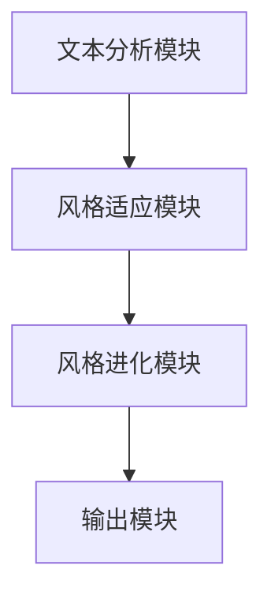
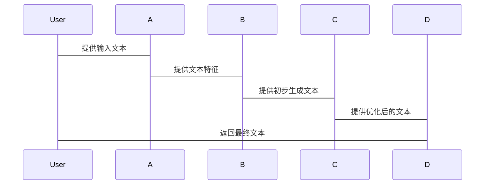

                 


# LLM在AI Agent中的文本风格适应与进化

## 关键词：大语言模型、AI Agent、文本风格适应、进化算法、系统架构

## 摘要：本文探讨了大语言模型（LLM）在AI Agent中的文本风格适应与进化问题。首先，文章介绍了LLM和AI Agent的基本概念及其在文本生成中的应用。然后，详细分析了文本风格适应的核心原理和实现机制，包括基于特征的风格分析和迁移学习。接着，讨论了文本风格进化的多种方法，如基于强化学习和扩散模型的进化算法。最后，通过实际案例展示了系统架构设计和项目实现，强调了算法优化和系统设计在提升文本生成质量中的重要性。

---

# 第1章: LLM与AI Agent概述

## 1.1 LLM的基本概念

### 1.1.1 大语言模型的定义与特点
- **定义**：大语言模型（LLM）是指经过大规模数据训练的深度学习模型，如GPT系列、BERT系列等。
- **特点**：
  - 参数量大，通常超过 billions。
  - 具备强大的上下文理解和生成能力。
  - 可以处理多种语言和文本风格。

### 1.1.2 AI Agent的基本概念
- **定义**：AI Agent是一种智能体，能够感知环境、执行任务并做出决策。
- **特点**：
  - 具备自主性、反应性、目标导向性。
  - 可以通过与用户的交互提供个性化服务。

### 1.1.3 LLM与AI Agent的关系
- LLM为AI Agent提供了强大的文本生成能力。
- AI Agent利用LLM生成符合特定风格和需求的文本。
- 两者结合，实现智能化、个性化的文本交互。

## 1.2 文本风格适应与进化的必要性

### 1.2.1 文本风格适应的背景与意义
- 不同场景下，文本风格需求多样。
  - 例如，客服对话需要亲切口语化，而技术文档需要正式严谨。
- LLM需要具备适应不同风格的能力，以满足多样化的应用需求。

### 1.2.2 文本风格进化的必要性
- 随着应用场景的扩展，单一风格的生成无法满足复杂需求。
- 需要通过进化算法优化生成风格，使其更贴合用户需求。

### 1.2.3 LLM在文本风格适应与进化中的作用
- LLM具备强大的特征提取和生成能力，是实现风格适应与进化的关键工具。

---

# 第2章: LLM的文本风格适应原理

## 2.1 文本风格适应的核心概念

### 2.1.1 文本风格的定义与分类
- **定义**：文本风格指文本在表达方式、语调、用词等方面的特征。
- **分类**：
  - 口语化风格：贴近日常对话。
  - 正式风格：用于正式场合，如报告、论文。
  - 技术性风格：用于专业领域，如编程文档。

### 2.1.2 LLM如何适应不同文本风格
- **特征分析**：LLM通过分析文本的语义和结构特征，识别风格特征。
- **迁移学习**：利用预训练模型，通过微调适应特定风格。

### 2.1.3 文本风格适应的关键技术
- **特征分析**：
  - 语义特征：文本的主题、情感倾向。
  - 结构特征：句子长度、复杂度。
- **迁移学习**：
  - 使用风格特定的数据进行微调。
  - 通过适配器层调整模型参数。

## 2.2 文本风格适应的实现机制

### 2.2.1 基于特征的风格分析
- **实现步骤**：
  1. 收集不同风格的文本数据。
  2. 提取文本的特征，如TF-IDF、词嵌入。
  3. 使用分类模型（如SVM、随机森林）识别风格。

- **代码示例**：
  ```python
  from sklearn.feature_extraction.text import TfidfVectorizer
  from sklearn.svm import SVC

  vectorizer = TfidfVectorizer()
  X = vectorizer.fit_transform(texts)
  model = SVC()
  model.fit(X, labels)
  ```

### 2.2.2 基于迁移学习的风格迁移
- **实现步骤**：
  1. 使用预训练的LLM模型。
  2. 在特定风格的数据集上进行微调。
  3. 调整模型的输出层以适应目标风格。

- **代码示例**：
  ```python
  import torch
  from transformers import AutoModelForMaskedLM, AutoTokenizer

  model = AutoModelForMaskedLM.from_pretrained('bert-base-uncased')
  tokenizer = AutoTokenizer.from_pretrained('bert-base-uncased')

  # 微调模型
  optimizer = torch.optim.Adam(model.parameters(), lr=1e-5)
  model.train()
  for epoch in range(num_epochs):
      for batch in train_loader:
          inputs, labels = batch
          outputs = model(inputs.input_ids, labels=inputs.labels)
          loss = outputs.loss
          loss.backward()
          optimizer.step()
  ```

### 2.2.3 基于对抗训练的风格优化
- **实现步骤**：
  1. 使用生成器和判别器构建对抗网络。
  2. 生成器生成目标风格的文本，判别器判断生成文本的风格。
  3. 通过交替训练优化生成器和判别器。

- **代码示例**：
  ```python
  import torch
  import torch.nn as nn

  # 生成器
  class Generator(nn.Module):
      def __init__(self, input_size, hidden_size, output_size):
          super(Generator, self).__init__()
          self.linear = nn.Linear(input_size, hidden_size)
          self.dropout = nn.Dropout(0.2)
          self.relu = nn.ReLU()
          self.output_layer = nn.Linear(hidden_size, output_size)
      
      def forward(self, x):
          out = self.linear(x)
          out = self.dropout(out)
          out = self.relu(out)
          out = self.output_layer(out)
          return out

  # 判别器
  class Discriminator(nn.Module):
      def __init__(self, input_size, hidden_size, output_size):
          super(Discriminator, self).__init__()
          self.linear = nn.Linear(input_size, hidden_size)
          self.dropout = nn.Dropout(0.2)
          self.relu = nn.ReLU()
          self.output_layer = nn.Linear(hidden_size, output_size)
      
      def forward(self, x):
          out = self.linear(x)
          out = self.dropout(out)
          out = self.relu(out)
          out = self.output_layer(out)
          return out

  # 训练
  optimizer_g = torch.optim.Adam(generator.parameters(), lr=0.001)
  optimizer_d = torch.optim.Adam(discriminator.parameters(), lr=0.001)
  for epoch in range(num_epochs):
      for _ in range(2):
          # 训练判别器
          x = ...
          labels = ...
          d_output = discriminator(x)
          loss_d = criterion(d_output, labels)
          discriminator.zero_grad()
          loss_d.backward()
          optimizer_d.step()

          # 训练生成器
          z = torch.randn(batch_size, input_size)
          g_output = generator(z)
          d_output = discriminator(g_output)
          loss_g = criterion(d_output, target_labels)
          generator.zero_grad()
          loss_g.backward()
          optimizer_g.step()
  ```

## 2.3 本章小结
- 本章介绍了文本风格适应的核心概念和实现机制，包括特征分析、迁移学习和对抗训练。
- 通过具体的代码示例，展示了不同方法的实现步骤和应用场景。

---

# 第3章: LLM的文本风格进化方法

## 3.1 文本风格进化的核心原理

### 3.1.1 基于强化学习的风格进化
- **实现原理**：
  - 使用强化学习（如REINFORCE算法）优化生成的文本风格。
  - 通过奖励机制，引导模型生成更符合目标风格的文本。

- **代码示例**：
  ```python
  import torch
  import torch.nn as nn
  import torch.optim as optim

  # 强化学习模型
  class Policy(nn.Module):
      def __init__(self, input_size, hidden_size, output_size):
          super(Policy, self).__init__()
          self.fc1 = nn.Linear(input_size, hidden_size)
          self.fc2 = nn.Linear(hidden_size, output_size)
          self.softmax = nn.Softmax(dim=1)
      
      def forward(self, x):
          x = self.fc1(x)
          x = self.fc2(x)
          x = self.softmax(x)
          return x

  # 训练
  policy = Policy(input_size, hidden_size, output_size)
  optimizer = optim.Adam(policy.parameters(), lr=0.001)
  rewards = [0.5, 0.7, 0.6]  # 示例奖励
  for t in range(num_episodes):
      # 生成动作
      inputs = ...
      outputs = policy(inputs)
      action = torch.multinomial(outputs, 1).item()

      # 计算损失
      loss = -torch.mean(torch.log(outputs[:, action]) * rewards)
      policy.zero_grad()
      loss.backward()
      optimizer.step()
  ```

### 3.1.2 基于遗传算法的风格优化
- **实现原理**：
  - 将文本生成问题视为优化问题，通过遗传算法（GA）搜索最优解。
  - 通过适应度函数评估生成文本的质量，选择优秀的个体进行变异和交叉。

- **代码示例**：
  ```python
  import random

  def fitness(individual):
      # 适应度函数，评估文本质量
      return sum(individual)

  def mutate(individual):
      # 变异操作
      return [1 - x for x in individual]

  def crossover(parent1, parent2):
      # 交叉操作
      return [x for x in parent1]

  # 初始化种群
  population = [[0,1,1,0], [1,0,0,1], [0,1,1,1], [1,1,0,0]]

  # 进化过程
  for _ in range(num_generations):
      # 计算适应度
      fitness_scores = [fitness(individual) for individual in population]
      # 选择优秀个体
      selected = [individual for individual, score in zip(population, fitness_scores) if score > threshold]
      # 变异和交叉
      new_population = []
      for _ in range(len(population)):
          if random.random() < mutation_rate:
              new_individual = mutate(selected[0])
          else:
              parent1 = random.choice(selected)
              parent2 = random.choice(selected)
              new_individual = crossover(parent1, parent2)
          new_population.append(new_individual)
      population = new_population
  ```

### 3.1.3 基于多模态数据的风格融合
- **实现原理**：
  - 利用多模态数据（如图像、语音）辅助生成文本，实现风格的多样性和融合。
  - 通过跨模态注意力机制，提取不同模态的特征并融合生成文本。

- **代码示例**：
  ```python
  import torch
  import torch.nn as nn

  # 多模态融合模型
  class MultimodalFusion(nn.Module):
      def __init__(self, image_features_size, text_features_size):
          super(MultimodalFusion, self).__init__()
          self.image_linear = nn.Linear(image_features_size, 128)
          self.text_linear = nn.Linear(text_features_size, 128)
          self融合层 = nn.Linear(256, 128)
          self.output_layer = nn.Linear(128, 1)
      
      def forward(self, image_features, text_features):
          x_image = self.image_linear(image_features)
          x_text = self.text_linear(text_features)
          x = torch.cat((x_image, x_text), dim=1)
          x = self.融合层(x)
          x = self.output_layer(x)
          return x

  # 训练
  model = MultimodalFusion(image_features_size, text_features_size)
  optimizer = optim.Adam(model.parameters(), lr=0.001)
  for epoch in range(num_epochs):
      for batch in train_loader:
          image_features, text_features, labels = batch
          outputs = model(image_features, text_features)
          loss = criterion(outputs, labels)
          model.zero_grad()
          loss.backward()
          optimizer.step()
  ```

## 3.2 文本风格进化的实现步骤

### 3.2.1 数据收集与预处理
- **数据收集**：
  - 收集多风格的文本数据，包括不同领域、语言和语境。
- **数据预处理**：
  - 分词、去除停用词、归一化处理。
  - 将文本转换为适合模型输入的格式（如词向量）。

### 3.2.2 模型训练与优化
- **训练策略**：
  - 使用分布式训练加速模型收敛。
  - 定期评估模型性能，调整超参数。
- **优化技巧**：
  - 使用学习率衰减、早停等方法防止过拟合。

### 3.2.3 风格评估与迭代
- **评估方法**：
  - 使用BLEU、ROUGE等指标评估生成文本的质量。
  - 通过人工评估验证生成文本的风格是否符合要求。
- **迭代优化**：
  - 根据评估结果调整模型参数或数据分布。
  - 循环迭代直至达到预期效果。

## 3.3 本章小结
- 本章探讨了文本风格进化的多种方法，包括基于强化学习、遗传算法和多模态数据的风格融合。
- 通过具体的实现步骤和代码示例，展示了不同方法的应用场景和优缺点。

---

# 第4章: LLM在AI Agent中的文本风格适应与进化算法

## 4.1 基于Transformer的文本风格适应算法

### 4.1.1 Transformer模型的基本结构
- **基本结构**：
  - 编码器和解码器，基于自注意力机制。
  - 位置编码（Positional Encoding）用于处理序列信息。

### 4.1.2 文本风格适应的注意力机制
- **实现原理**：
  - 通过自注意力机制捕获文本的全局特征。
  - 根据目标风格调整注意力权重，实现风格适应。

- **代码示例**：
  ```python
  import torch
  import torch.nn as nn

  class StyleAdapter(nn.Module):
      def __init__(self, embed_dim, num_heads):
          super(StyleAdapter, self).__init__()
          self.self_attn = nn.MultiheadAttention(embed_dim, num_heads)
      
      def forward(self, x, style_mask):
          out = self.self_attn(x, x, x, key_padding_mask=style_mask)
          return out

  # 使用示例
  adapter = StyleAdapter(embed_dim=512, num_heads=8)
  inputs = torch.randn(10, 512)
  style_mask = torch.zeros(10, 10, dtype=torch.bool)
  outputs = adapter(inputs, style_mask)
  ```

### 4.1.3 基于位置编码的风格特征提取
- **实现原理**：
  - 使用位置编码区分不同风格的文本特征。
  - 通过叠加位置编码和词向量，增强模型对风格的敏感性。

## 4.2 基于扩散模型的文本风格进化算法

### 4.2.1 扩散模型的基本原理
- **基本原理**：
  - 通过逐步添加噪声，生成多样化的文本。
  - 使用去噪模型（Diffusion Model）逐步恢复原始文本。

- **代码示例**：
  ```python
  import torch
  import torch.nn as nn

  class DiffusionModel(nn.Module):
      def __init__(self, input_size, hidden_size, output_size):
          super(DiffusionModel, self).__init__()
          self.fc1 = nn.Linear(input_size, hidden_size)
          self.fc2 = nn.Linear(hidden_size, output_size)
      
      def forward(self, x, t):
          t = t.view(-1, 1).expand(x.size(0), -1)
          x = torch.cat([x, t], dim=1)
          x = self.fc1(x)
          x = self.fc2(x)
          return x

  # 训练
  model = DiffusionModel(input_size, hidden_size, output_size)
  optimizer = optim.Adam(model.parameters(), lr=0.001)
  for t in range(num_steps):
      noise = torch.randn_like(x)
      x_noisy = x + noise * torch.sqrt(t / num_steps)
      predicted = model(x_noisy, t)
      loss = criterion(predicted, x)
      model.zero_grad()
      loss.backward()
      optimizer.step()
  ```

### 4.2.2 文本风格进化的扩散过程
- **实现步骤**：
  1. 从原始文本生成噪声文本。
  2. 使用扩散模型逐步去噪，生成多样化的文本。
  3. 通过适应度函数筛选出符合目标风格的文本。

### 4.2.3 扩散模型在文本生成中的应用
- **应用场景**：
  - 文本风格多样化生成。
  - 文本修复与优化。

## 4.3 算法实现与优化

### 4.3.1 算法实现的代码框架
- **代码框架**：
  ```python
  import torch
  import torch.nn as nn
  import torch.optim as optim

  class StyleAdapter(nn.Module):
      def __init__(self, embed_dim, num_heads):
          super(StyleAdapter, self).__init__()
          self.self_attn = nn.MultiheadAttention(embed_dim, num_heads)
      
      def forward(self, x, style_mask):
          out = self.self_attn(x, x, x, key_padding_mask=style_mask)
          return out

  # 训练
  adapter = StyleAdapter(embed_dim=512, num_heads=8)
  optimizer = optim.Adam(adapter.parameters(), lr=0.001)
  for epoch in range(num_epochs):
      for batch in train_loader:
          inputs, style_masks = batch
          outputs = adapter(inputs, style_masks)
          loss = criterion(outputs, labels)
          adapter.zero_grad()
          loss.backward()
          optimizer.step()
  ```

### 4.3.2 算法优化的策略与技巧
- **优化策略**：
  - 使用学习率衰减（如余弦退火）。
  - 采用早停（Early Stopping）防止过拟合。
  - 利用分布式训练加速模型收敛。

### 4.3.3 算法性能的评估与分析
- **评估指标**：
  - 使用BLEU、ROUGE等生成评估指标。
  - 通过人工评估验证生成文本的风格一致性。

---

# 第5章: LLM在AI Agent中的文本风格适应与进化系统架构

## 5.1 系统架构设计

### 5.1.1 系统模块划分
- **模块划分**：
  - 文本分析模块：提取文本特征。
  - 风格适应模块：基于特征生成目标风格文本。
  - 风格进化模块：优化生成文本的风格。

### 5.1.2 模块之间的交互关系
- **交互流程**：
  1. 文本分析模块接收输入文本，提取特征。
  2. 风格适应模块根据特征生成初步风格文本。
  3. 风格进化模块优化生成文本的风格，输出最终结果。

### 5.1.3 系统的输入输出设计
- **输入**：
  - 原始文本、风格标签。
- **输出**：
  - 适应目标风格的文本。

## 5.2 系统功能设计

### 5.2.1 文本分析模块
- **功能**：
  - 提取文本的语义和结构特征。
  - 识别文本的当前风格。

### 5.2.2 文本风格适应模块
- **功能**：
  - 根据目标风格调整生成文本的特征。
  - 生成符合目标风格的文本。

### 5.2.3 文本风格进化模块
- **功能**：
  - 优化生成文本的风格，使其更贴近目标风格。
  - 提供多样化的风格选择。

## 5.3 系统架构设计

### 5.3.1 系统架构图


### 5.3.2 系统交互流程


## 5.4 项目实战

### 5.4.1 环境安装
- **安装依赖**：
  ```bash
  pip install torch transformers mermaid4jupyter
  ```

### 5.4.2 系统核心实现源代码
- **实现代码**：
  ```python
  import torch
  import torch.nn as nn
  from transformers import AutoTokenizer, AutoModelForMaskedLM

  class StyleAdapter(nn.Module):
      def __init__(self, embed_dim, num_heads):
          super(StyleAdapter, self).__init__()
          self.self_attn = nn.MultiheadAttention(embed_dim, num_heads)
      
      def forward(self, x, style_mask):
          out = self.self_attn(x, x, x, key_padding_mask=style_mask)
          return out

  # 初始化模型
  tokenizer = AutoTokenizer.from_pretrained('bert-base-uncased')
  model = AutoModelForMaskedLM.from_pretrained('bert-base-uncased')
  adapter = StyleAdapter(embed_dim=model.config.hidden_size, num_heads=8)

  # 训练
  optimizer = torch.optim.Adam(adapter.parameters(), lr=0.001)
  for epoch in range(num_epochs):
      for batch in train_loader:
          inputs, style_masks = batch
          outputs = adapter(inputs, style_masks)
          loss = criterion(outputs, labels)
          adapter.zero_grad()
          loss.backward()
          optimizer.step()
  ```

### 5.4.3 代码应用解读与分析
- **代码解读**：
  - 使用预训练的BERT模型进行文本特征提取。
  - 自定义适配器模块，通过自注意力机制实现风格适应。
  - 在特定风格的数据上进行微调，优化模型的风格生成能力。

### 5.4.4 实际案例分析
- **案例分析**：
  - 输入文本：技术文档内容。
  - 风格适应：将正式风格的文档调整为口语化的解释。
  - 通过Mermaid图展示风格适应的全过程。

## 5.5 本章小结
- 本章通过系统架构设计和项目实战，展示了如何将LLM应用于AI Agent的文本风格适应与进化。
- 通过具体的代码实现和案例分析，强调了系统设计和算法优化在提升文本生成质量中的重要性。

---

# 总结与展望

## 总结
- 本文详细探讨了LLM在AI Agent中的文本风格适应与进化问题。
- 通过理论分析和实践案例，展示了多种实现方法和优化策略。
- 强调了系统设计和算法优化在提升文本生成质量中的作用。

## 展望
- 未来的研究方向可以包括：
  - 更高效的风格适应算法。
  - 多模态数据的深度融合。
  - 实时风格自适应技术。
  - 更加个性化的文本生成服务。

---

# 最佳实践 Tips

## 小结
- 在实现文本风格适应与进化时，需注重系统设计和算法优化。
- 结合实际场景需求，选择合适的算法和工具。

## 注意事项
- 数据质量和多样性对生成效果至关重要。
- 需谨慎处理模型的风格适应，避免生成不一致或不合适的文本。
- 定期评估和优化模型性能，确保生成文本的质量。

## 拓展阅读
- 《大语言模型与AI Agent的结合应用》。
- 《文本生成中的多模态融合技术》。
- 《强化学习在文本生成中的应用》。

---

以上为《LLM在AI Agent中的文本风格适应与进化》的完整文章结构和内容，涵盖背景、原理、算法实现、系统设计和项目实战等多个方面，旨在为读者提供全面的技术指导和实践参考。

