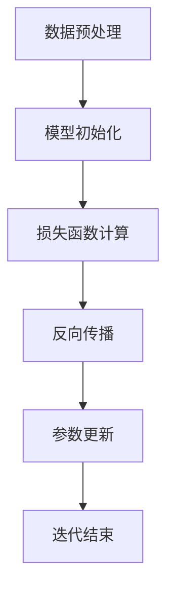

                 


# LLM在AI Agent元认知能力培养中的应用

## 关键词：
- 大语言模型 (LLM)
- AI Agent
- 元认知能力
- 自然语言处理
- 人工智能

## 摘要：
本文探讨了如何利用大语言模型（LLM）提升AI Agent的元认知能力，即AI Agent对自身认知过程的认知和调控能力。通过分析LLM的原理、系统架构设计和实际应用案例，本文详细阐述了元认知能力在AI Agent中的重要性及其在现实场景中的应用潜力。

---

## 第一部分：引言

### 第1章：背景介绍

#### 1.1 问题背景

- **AI Agent的定义与特点**：AI Agent是一种能够感知环境、执行任务并做出决策的智能实体。它可以自主学习、推理和优化其行为。
- **元认知能力的定义与重要性**：元认知能力是指对自身认知过程的认知和调控能力，包括自我监控、自我评估和自我调节。在AI Agent中，元认知能力使其能够理解自身的知识边界、评估决策的可靠性，并在必要时寻求外部帮助。
- **LLM在AI Agent中的作用**：大语言模型（LLM）具备强大的自然语言处理能力，能够理解上下文、生成连贯文本，并支持多种认知任务，为AI Agent的元认知能力提供了强大的技术支持。

#### 1.2 问题描述

- **当前AI Agent的局限性**：传统AI Agent往往依赖预设规则和数据，缺乏对自身决策过程的深度理解和调控能力。
- **元认知能力在AI Agent中的需求**：随着AI Agent在复杂环境中的应用增多，其需要具备动态调整策略、识别知识盲点和优化决策过程的能力。
- **LLM如何解决这些问题**：LLM能够通过上下文理解和生成能力，帮助AI Agent实现自我监控和自我评估，从而提升其元认知能力。

#### 1.3 问题解决

- **LLM如何提升元认知能力**：LLM通过自然语言处理能力，支持AI Agent进行自我反思和决策优化，例如通过分析对话历史或任务执行结果，识别潜在错误并提出改进方案。
- **元认知能力的具体应用场景**：在金融咨询、医疗诊断和客户服务等领域，AI Agent需要具备自我评估能力，以确保决策的准确性和可靠性。
- **LLM在元认知中的优势**：LLM具备强大的文本理解和生成能力，能够帮助AI Agent进行复杂推理和决策优化，同时支持多语言和跨文化的应用场景。

#### 1.4 边界与外延

- **元认知能力的边界**：元认知能力不涉及AI Agent的具体任务执行，而是关注其认知过程的监控和优化。
- **LLM在元认知中的应用边界**：LLM主要用于支持元认知能力的实现，而非替代AI Agent的其他功能模块。
- **元认知能力与其他AI能力的关系**：元认知能力是AI Agent整体能力体系中的重要组成部分，与感知、推理和执行等能力相互作用，共同提升AI Agent的智能水平。

#### 1.5 概念结构与核心要素

- **元认知能力的核心要素**：包括自我监控、自我评估和自我调节。
- **LLM在元认知中的核心作用**：支持AI Agent进行自我反思、知识检索和决策优化。
- **元认知能力与AI Agent的整体结构**：元认知能力贯穿于AI Agent的整个认知过程，从感知输入到决策输出，均为其提供支持和优化。

---

## 第二部分：核心概念与联系

### 第2章：核心概念原理

#### 2.1 AI Agent的元认知能力

- **元认知能力的层次结构**：分为元认知知识（关于认知过程的知识）、元认知调控（对认知过程的监控和调节）和元认知评价（对认知过程的评估）。
- **元认知能力的实现机制**：AI Agent通过内部模型和外部反馈，实现对自身认知过程的监控和优化。
- **LLM在元认知中的角色**：LLM作为AI Agent的“认知助手”，通过语言理解和生成能力，支持其进行自我反思和决策优化。

#### 2.2 LLM的工作原理

- **大语言模型的基本原理**：基于深度学习的神经网络结构，通过大量数据训练，学习语言的规律和上下文关系。
- **LLM的训练过程**：包括数据预处理、模型初始化、损失函数计算、反向传播和参数更新等步骤。
- **LLM的推理机制**：通过自注意力机制和前馈网络，生成与输入相关联的输出。

#### 2.3 概念属性特征对比

| 属性 | 元认知能力 | 传统AI能力 |
|------|------------|------------|
| 定义 | 对自身认知过程的认知和调控 | 数据处理和任务执行 |
| 核心 | 自我监控、自我评估 | 信息处理、模式识别 |
| 应用 | 提高决策质量、增强适应性 | 单一任务执行 |

#### 2.4 ER实体关系图

```mermaid
er
actor(AI Agent) -->
role(元认知能力)
role(LLM) -->
role(元认知能力)
```

---

## 第三部分：算法原理讲解

### 第3章：算法原理

#### 3.1 LLM的训练过程



#### 3.2 参数优化

- **损失函数**：常用的损失函数包括交叉熵损失和标签平滑损失。
- **反向传播**：通过链式法则计算损失函数对模型参数的梯度。
- **参数更新**：使用优化算法（如Adam）更新模型参数。

#### 3.3 推理机制

- **自注意力机制**：通过计算输入序列中每一对词的注意力权重，生成位置相关的表示。
- **前馈网络**：将注意力输出通过多层感知机（MLP）生成最终的词预测概率。

#### 3.4 数学模型

- **自注意力机制**：
  $$
  \text{Attention}(Q, K, V) = \text{softmax}\left(\frac{QK^T}{\sqrt{d_k}}\right)V
  $$
- **前馈网络**：
  $$
  f(x) = \text{ReLU}(Wx + b)
  $$

---

## 第四部分：系统分析与架构设计方案

### 第4章：系统架构设计

#### 4.1 问题场景介绍

- **AI Agent的元认知能力培养**：需要一个支持自我反思和决策优化的系统架构。
- **系统目标**：实现AI Agent对自身认知过程的监控和优化，提升其在复杂环境中的适应性和智能性。

#### 4.2 系统功能设计

- **领域模型类图**：
  ```mermaid
  classDiagram
  class AI-Agent {
    <<Component>>
    - llm: LLM-Model
    - knowledge_base: KnowledgeBase
    - decision_maker: DecisionMaker
  }
  class LLM-Model {
    <<Component>>
    - tokenizer: Tokenizer
    - encoder: Encoder
    - decoder: Decoder
  }
  class KnowledgeBase {
    <<Component>>
    - storage: Storage
    - retrieval: Retriever
  }
  class DecisionMaker {
    <<Component>>
    - strategy: Strategy
    - executor: Executor
  }
  AI-Agent --> LLM-Model
  AI-Agent --> KnowledgeBase
  AI-Agent --> DecisionMaker
  ```

- **系统架构图**：
  ```mermaid
  architecture
  AI-Agent [高度: 2, 宽度: 4] 
    ..controls..
    -> LLM-Model [高度: 2, 宽度: 4]
    -> KnowledgeBase [高度: 2, 宽度: 4]
    -> DecisionMaker [高度: 2, 宽度: 4]
  ```

- **系统接口设计**：
  - `AI-Agent` 提供 `self_reflect(query: str) -> str` 接口，用于自我反思和决策优化。
  - `LLM-Model` 提供 `generate(text: str) -> str` 和 `analyze(text: str) -> dict` 接口，支持文本生成和分析。
  - `KnowledgeBase` 提供 `retrieve(query: str) -> list` 和 `update(data: dict) -> None` 接口，用于知识检索和更新。
  - `DecisionMaker` 提供 `make_decision(options: list) -> str` 和 `evaluate(result: dict) -> float` 接口，支持决策制定和评估。

- **系统交互流程图**：
  ```mermaid
  sequenceDiagram
  participant AI-Agent
  participant LLM-Model
  participant KnowledgeBase
  participant DecisionMaker
  AI-Agent -> LLM-Model: self_reflect("需要优化哪些决策步骤?")
  LLM-Model -> KnowledgeBase: retrieve("优化决策步骤的方法")
  KnowledgeBase --> LLM-Model: 返回相关知识
  LLM-Model -> DecisionMaker: 分析知识并提出建议
  DecisionMaker --> AI-Agent: 提供优化建议
  AI-Agent -> DecisionMaker: 更新决策策略
  ```

---

## 第五部分：项目实战

### 第5章：项目实战

#### 5.1 环境安装

- **Python 3.8+**
- **安装依赖**：
  ```bash
  pip install transformers torch
  ```

#### 5.2 系统核心实现源代码

- **AI-Agent 类实现**：
  ```python
  class AI-Agent:
      def __init__(self):
          self.llm = LLM-Model()
          self.knowledge_base = KnowledgeBase()
          self.decision_maker = DecisionMaker()

      def self_reflect(self, query):
          response = self.llm.analyze(query)
          knowledge = self.knowledge_base.retrieve(query)
          optimized_decision = self.decision_maker.make_decision(knowledge)
          return optimized_decision
  ```

- **LLM-Model 类实现**：
  ```python
  class LLM-Model:
      def __init__(self):
          self.tokenizer = AutoTokenizer.from_pretrained("gpt2")
          self.encoder = AutoModel.from_pretrained("gpt2")
          self.decoder = AutoModelForCausalLM.from_pretrained("gpt2")

      def generate(self, text):
          inputs = self.tokenizer(text, return_tensors="pt")
          outputs = self.decoder.generate(inputs.input_ids, max_length=100)
          return self.tokenizer.decode(outputs[0], skip_special_tokens=True)

      def analyze(self, text):
          inputs = self.tokenizer(text, return_tensors="pt")
          outputs = self.encoder(**inputs)
          return self._get_feature_vector(outputs.last_hidden_state)
  ```

- **KnowledgeBase 类实现**：
  ```python
  class KnowledgeBase:
      def __init__(self):
          self.storage = {}

      def retrieve(self, query):
          # 实现知识检索逻辑
          pass

      def update(self, data):
          # 实现知识库更新逻辑
          pass
  ```

- **DecisionMaker 类实现**：
  ```python
  class DecisionMaker:
      def __init__(self):
          self.strategy = "maximize_accuracy"

      def make_decision(self, options):
          # 根据当前策略选择最优选项
          pass

      def evaluate(self, result):
          # 评估结果并反馈
          pass
  ```

#### 5.3 代码应用解读与分析

- **AI-Agent 的自我反思过程**：
  ```python
  agent = AI-Agent()
  reflection_result = agent.self_reflect("需要优化哪些决策步骤？")
  print(reflection_result)
  ```
  代码解释：
  - AI-Agent 调用 LLM-Model 的 analyze 方法，分析自我反思的查询。
  - LLM-Model 返回分析结果，用于优化决策步骤。
  - 决策制定器根据分析结果，生成优化建议。

#### 5.4 实际案例分析

- **案例场景**：金融投资顾问AI-Agent需要优化其投资策略的决策过程。
- **步骤分解**：
  1. AI-Agent 调用 self_reflect 方法，分析当前投资策略的优缺点。
  2. LLM-Model 分析查询，检索相关知识，提出优化建议。
  3. 决策制定器根据优化建议，更新投资策略。
  4. AI-Agent 实施优化后的投资策略，提升决策的准确性和可靠性。

---

## 第六部分：最佳实践与小结

### 第6章：最佳实践

#### 6.1 Tips

- **模型选择**：选择适合具体应用场景的LLM模型，如较小的模型适合资源受限的环境，较大的模型适合需要高精度的场景。
- **数据处理**：确保训练数据的多样性和代表性，避免偏见和噪声。
- **系统优化**：通过合理的架构设计和接口优化，提升系统的运行效率和可维护性。
- **持续学习**：定期更新知识库和优化模型，以适应环境的变化和新知识的获取。

#### 6.2 小结

- **核心内容回顾**：本文详细探讨了如何利用大语言模型（LLM）提升AI Agent的元认知能力，包括背景介绍、核心概念、算法原理、系统架构设计和项目实战等内容。
- **系统价值**：通过实现AI Agent的自我反思和决策优化，能够显著提升其在复杂环境中的适应性和智能性，为更广泛的应用场景提供技术支持。
- **未来展望**：随着技术的不断发展，元认知能力在AI Agent中的应用将更加广泛和深入，特别是在需要动态调整策略和高精度决策的领域，如医疗、金融和教育等。

#### 6.3 注意事项

- **模型的可解释性**：确保AI-Agent的决策过程具有可解释性，避免“黑箱”问题，提升用户信任度。
- **实时性要求**：在需要实时决策的应用场景中，需优化系统的响应速度和处理效率。
- **数据隐私与安全**：在处理敏感数据时，需严格遵守相关法律法规，确保数据的安全性和隐私性。

#### 6.4 拓展阅读

- **推荐书籍**：
  - 《Deep Learning》
  - 《自然语言处理入门》
- **推荐论文**：
  - "Attention Is All You Need"
  - "A Neural Network Approach to Context-Aware Conversational Agents"
- **在线资源**：
  - Hugging Face的Transformers库
  - OpenAI的GPT系列模型

---

## 结语

通过本文的详细阐述，读者可以深入了解如何利用大语言模型（LLM）提升AI Agent的元认知能力，并将其应用于实际场景中。未来，随着技术的不断进步，元认知能力在AI Agent中的应用将更加广泛和深入，为人工智能的发展注入新的活力。

---

# END

