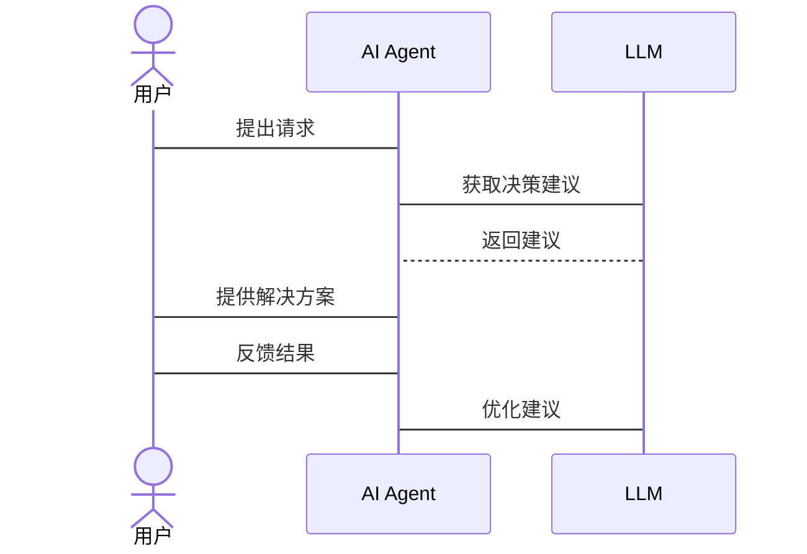

                 


# LLM在AI Agent决策过程中的角色：从建议到执行

## 关键词：大语言模型, AI Agent, 决策过程, 人机协作, 系统架构

## 摘要：  
随着人工智能技术的快速发展，大语言模型（LLM）在AI Agent中的应用日益广泛。本文将从LLM在AI Agent决策过程中的角色入手，详细探讨从建议到执行的全过程。通过对LLM的算法原理、系统架构、协作机制等多方面的分析，结合实际案例，揭示LLM在AI Agent中的核心作用，并展望未来的发展趋势。

---

# 第1章: 引言

## 1.1 AI Agent的基本概念  
AI Agent（人工智能代理）是指能够感知环境、自主决策并执行任务的智能体。它能够通过与环境交互来实现特定目标，具有主动性、反应性和社会性等特点。  

## 1.2 大语言模型的基本概念与技术特点  
大语言模型（LLM）是指基于深度学习构建的大型语言模型，如GPT系列、BERT系列等。它具有强大的语言理解和生成能力，能够处理复杂文本任务，如自然语言理解、文本生成、问答系统等。  

## 1.3 LLM与AI Agent的结合背景  
随着LLM技术的成熟，AI Agent的决策能力得到了显著提升。LLM能够为AI Agent提供高质量的决策建议，并在某些场景下直接执行任务，从而实现了从“建议者”到“执行者”的角色转变。  

---

# 第2章: LLM在AI Agent决策中的建议角色

## 2.1 LLM作为决策建议者的功能  
- **决策建议的生成**：LLM能够根据输入的上下文生成多种决策建议，并评估每种建议的可行性和潜在风险。  
- **语言理解与生成能力**：LLM通过自然语言处理技术，理解用户需求并生成符合目标的建议。  
- **动态适应性**：LLM能够根据环境变化实时调整建议内容，确保决策的灵活性和适应性。  

## 2.2 LLM与AI Agent的协作机制  
- **交互式对话**：LLM与AI Agent之间通过对话式交互，实时传递信息和建议。  
- **反馈优化**：AI Agent可以根据执行结果向LLM反馈，优化后续的建议生成过程。  

## 2.3 案例分析：LLM在客服AI Agent中的应用  
- **场景描述**：AI Agent通过LLM生成多种解决方案，帮助客户解决售后问题。  
- **协作流程**：  
  1. AI Agent接收客户需求。  
  2. LLM生成多个解决方案。  
  3. AI Agent选择最优方案并执行。  
  4. 反馈结果并优化建议生成过程。  

---

# 第3章: LLM在AI Agent决策中的执行角色

## 3.1 LLM作为决策执行者的功能  
- **指令生成**：LLM能够根据决策建议生成具体的执行指令。  
- **任务优化**：LLM通过分析任务目标，优化执行步骤和资源分配。  
- **结果评估**：LLM能够对执行结果进行评估，并提供改进建议。  

## 3.2 LLM在复杂决策中的应用  
- **多阶段决策**：LLM能够处理复杂场景下的多阶段决策任务。  
- **多目标优化**：LLM在决策过程中同时考虑多个目标，确保全局最优。  
- **动态环境适应**：LLM能够快速适应环境变化，实时调整执行策略。  

---

# 第4章: LLM与AI Agent的协作机制设计

## 4.1 对话式交互的设计  
- **上下文管理**：通过维护对话历史，确保LLM与AI Agent之间的信息连贯性。  
- **反馈机制**：AI Agent根据执行结果向LLM反馈，优化后续的协作过程。  

## 4.2 系统架构设计  
- **模块划分**：AI Agent系统包括感知层、决策层、执行层和反馈层。  
- **数据流设计**：  
  1. 感知层接收输入信号。  
  2. 决策层通过LLM生成决策建议。  
  3. 执行层根据建议生成执行指令。  
  4. 反馈层收集执行结果并优化系统。  

## 4.3 系统交互流程图  


---

# 第5章: 项目实战：基于LLM的AI Agent系统实现

## 5.1 环境配置  
- **工具安装**：安装Python、TensorFlow、Hugging Face库等。  
- **模型选择**：选择GPT-3作为LLM模型。  

## 5.2 核心代码实现  
```python
from transformers import GPT2LMHeadModel, GPT2Tokenizer

# 初始化模型和分词器
model = GPT2LMHeadModel.from_pretrained('gpt2')
tokenizer = GPT2Tokenizer.from_pretrained('gpt2')

# 定义决策建议生成函数
def generate_suggestions(input_text):
    inputs = tokenizer(input_text, return_tensors='np')
    outputs = model.generate(**inputs, max_length=50, num_return_sequences=3)
    suggestions = [tokenizer.decode(output, skip_special_tokens=True) for output in outputs]
    return suggestions

# 定义执行指令生成函数
def generate_instructions(suggestion):
    inputs = tokenizer(suggestion, return_tensors='np')
    outputs = model.generate(**inputs, max_length=30, num_return_sequences=1)
    instruction = tokenizer.decode(outputs[0], skip_special_tokens=True)
    return instruction
```

## 5.3 系统功能模块设计  
- **输入处理模块**：接收用户输入并解析需求。  
- **决策建议生成模块**：调用LLM生成多种决策建议。  
- **执行指令生成模块**：根据建议生成具体执行指令。  
- **反馈优化模块**：收集执行结果并优化后续决策过程。  

---

# 第6章: 未来发展趋势与总结

## 6.1 未来发展趋势  
- **更强大的LLM模型**：开发更高效、更智能的LLM模型，提升AI Agent的决策能力。  
- **多模态交互**：结合视觉、听觉等多种模态信息，提升AI Agent的综合决策能力。  
- **实时协作优化**：优化LLM与AI Agent之间的协作机制，实现更高效的实时优化。  

## 6.2 总结  
本文详细探讨了LLM在AI Agent决策过程中的角色，从建议到执行的全过程。通过理论分析和实际案例，揭示了LLM在AI Agent中的核心作用，并展望了未来的发展趋势。希望本文能够为相关领域的研究和实践提供有价值的参考。

---

# 参考文献  
（此处列出相关的学术论文、技术文档和技术博客等参考资料）

