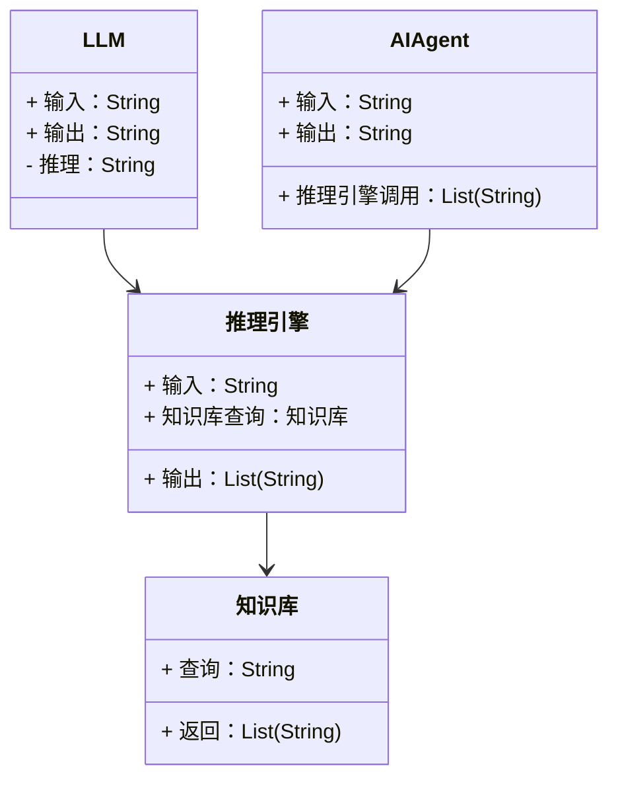
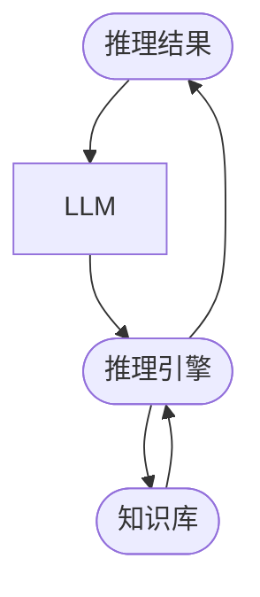
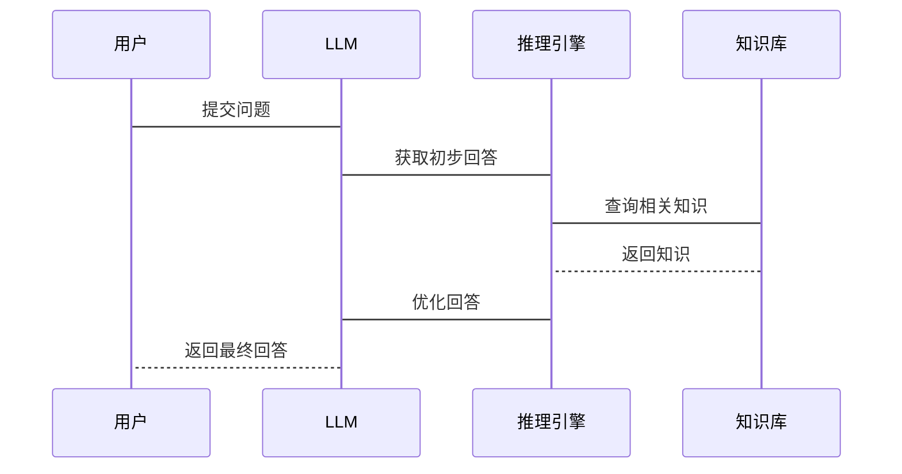

                 


# LLM在AI Agent常识推理中的应用

## 关键词：大语言模型，AI Agent，常识推理，人工智能，自然语言处理，智能系统

## 摘要：本文将探讨大语言模型（LLM）在AI Agent常识推理中的应用，分析其核心原理、算法设计、系统架构，并通过实际案例展示其在智能系统中的应用前景。

---

# 第一部分：LLM与AI Agent概述

## 第1章：LLM与AI Agent概述

### 1.1 LLM的基本概念与技术背景

#### 1.1.1 大语言模型（LLM）的定义
大语言模型（LLM）是指经过大量数据训练的深度学习模型，能够理解和生成人类语言。其核心技术包括变压器架构、注意力机制和梯度下降优化。

#### 1.1.2 LLM的核心技术特点
- **变压器架构**：采用编码器-解码器结构，处理长距离依赖关系。
- **注意力机制**：通过权重计算，关注输入中的重要部分。
- **多任务学习**：支持多种NLP任务，如文本生成、翻译和问答。

#### 1.1.3 LLM与传统NLP模型的区别
传统NLP模型通常针对特定任务训练，而LLM通过预训练可以处理多种任务，具有更强的通用性。

### 1.2 AI Agent的基本概念与功能

#### 1.2.1 AI Agent的定义
AI Agent是一种智能体，能够感知环境、执行任务并做出决策。它通常包括知识库、推理引擎和行为决策模块。

#### 1.2.2 AI Agent的核心功能
- **感知环境**：通过传感器或数据输入获取信息。
- **推理与决策**：基于知识和推理引擎做出决策。
- **执行任务**：通过行动或输出结果完成任务。

#### 1.2.3 AI Agent的应用场景
AI Agent广泛应用于智能助手、自动驾驶、机器人和推荐系统等领域。

### 1.3 LLM在AI Agent中的应用背景

#### 1.3.1 LLM与AI Agent的结合动机
LLM的强大语言处理能力使其成为AI Agent的理想选择，能够提升推理和生成能力。

#### 1.3.2 常识推理在AI Agent中的重要性
常识推理是AI Agent理解现实世界的关键，能够帮助其做出合理的决策。

#### 1.3.3 当前技术的局限性与挑战
- **数据稀疏性**：常识推理需要大量多样化的数据。
- **模型解释性**：复杂的模型往往缺乏可解释性。
- **实时性要求**：高实时性任务对计算能力提出更高要求。

## 第2章：LLM与AI Agent的核心概念

### 2.1 LLM的内部工作机制

#### 2.1.1 变压器架构的原理
变压器架构由编码器和解码器组成，编码器将输入转换为表示，解码器生成输出。

#### 2.1.2 注意力机制的作用
注意力机制通过计算输入中的每个词对当前词的重要性，帮助模型关注关键部分。

#### 2.1.3 梯度下降与训练方法
使用随机梯度下降优化模型参数，通过反向传播计算梯度并更新参数。

### 2.2 AI Agent的内部结构与功能模块

#### 2.2.1 知识库模块
知识库存储常识、领域知识和上下文信息，为推理提供支持。

#### 2.2.2 推理引擎模块
推理引擎基于逻辑推理和概率模型，生成合理的推理结果。

#### 2.2.3 行为决策模块
行为决策模块根据推理结果和环境反馈做出最终决策。

### 2.3 LLM与AI Agent的交互流程

#### 2.3.1 输入处理
AI Agent接收用户输入或环境数据，将其转化为模型可处理的形式。

#### 2.3.2 推理过程
LLM根据输入生成中间结果，推理引擎结合知识库进行推理。

#### 2.3.3 输出结果
AI Agent根据推理结果生成最终输出，反馈给用户或执行相应操作。

### 2.4 核心概念对比分析

#### 2.4.1 LLM与传统NLP模型的对比
LLM具有更强的通用性和迁移能力，而传统模型通常针对特定任务优化。

#### 2.4.2 AI Agent与传统AI系统对比
AI Agent具有更强的自主性和适应性，能够动态响应环境变化。

#### 2.4.3 LLM在AI Agent中的角色与作用
LLM作为AI Agent的语言处理核心，负责理解和生成文本，支持推理和决策。

## 2.5 本章小结

---

# 第二部分：常识推理的算法原理

## 第3章：常识推理的算法原理

### 3.1 基于LLM的常识推理方法

#### 3.1.1 基于概率的推理模型
概率模型通过计算事件发生的可能性，生成合理的推理结果。

#### 3.1.2 基于符号逻辑的推理模型
符号逻辑模型通过规则和逻辑推理，生成确定性的结论。

#### 3.1.3 混合模型的优势与挑战
混合模型结合概率和符号推理，提高了准确性和灵活性，但实现复杂。

### 3.2 常识推理的数学模型

#### 3.2.1 概率模型的数学表达
概率模型使用贝叶斯定理，计算条件概率。

$$P(A|B) = \frac{P(B|A)P(A)}{P(B)}$$

#### 3.2.2 符号逻辑模型的数学表达
符号逻辑模型通过命题逻辑或一阶逻辑表示知识和推理规则。

例如，命题逻辑中的蕴含关系：
$$A \rightarrow B$$

### 3.3 算法实现的详细步骤

#### 3.3.1 数据预处理
对输入数据进行清洗、分词和向量化处理，确保模型能够理解。

#### 3.3.2 模型训练
使用预处理的数据训练LLM，优化参数以提高推理准确性。

#### 3.3.3 推理过程
根据输入问题，调用LLM生成可能的解答，结合知识库进行验证和优化。

---

# 第三部分：系统分析与架构设计

## 第4章：系统分析与架构设计

### 4.1 问题场景介绍
AI Agent需要处理复杂任务，如问答系统、任务规划和对话生成。

### 4.2 项目介绍
构建一个基于LLM的AI Agent系统，实现常识推理和任务执行。

### 4.3 系统功能设计

#### 4.3.1 领域模型设计
使用Mermaid类图展示系统模块及其交互。



### 4.4 系统架构设计

#### 4.4.1 系统架构图
使用Mermaid绘制系统架构图，展示各模块的交互关系。



### 4.5 系统接口设计

#### 4.5.1 接口描述
- **LLM接口**：接收输入字符串，返回生成的输出。
- **知识库接口**：根据查询返回相关知识。
- **推理引擎接口**：接收输入和知识库查询结果，返回推理结果。

#### 4.5.2 接口交互流程
用户输入问题，LLM生成初步回答，推理引擎结合知识库进行验证和优化，最终输出结果。

### 4.6 系统交互流程图



---

# 第四部分：项目实战

## 第5章：项目实战

### 5.1 环境安装

#### 5.1.1 安装Python和相关库
安装Python 3.x，以及必要的库如TensorFlow、PyTorch和Hugging Face的Transformers库。

```bash
pip install python python-tensorflow transformers
```

### 5.2 系统核心实现

#### 5.2.1 核心代码实现
实现LLM与AI Agent的交互，使用预训练模型进行推理。

```python
from transformers import AutoModelForCausalLM, AutoTokenizer

model_name = "gpt2"
tokenizer = AutoTokenizer.from_pretrained(model_name)
model = AutoModelForCausalLM.from_pretrained(model_name)

def generate_response(prompt):
    inputs = tokenizer.encode(prompt, return_tensors="pt")
    outputs = model.generate(inputs, max_length=50, do_sample=True)
    response = tokenizer.decode(outputs[0], skip_special_tokens=True)
    return response

# 示例
prompt = "今天天气怎么样？"
print(generate_response(prompt))
```

### 5.3 实际案例分析

#### 5.3.1 案例分析
分析一个具体案例，如问答系统中的常识推理，展示系统的实现和效果。

#### 5.3.2 代码应用解读
解释代码实现的每个步骤，说明其在系统中的作用和意义。

### 5.4 项目小结

---

# 第五部分：总结与展望

## 第6章：总结与展望

### 6.1 本章小结
总结全文内容，强调LLM在AI Agent中的重要性及其在常识推理中的应用前景。

### 6.2 经验与最佳实践

#### 6.2.1 小结
总结项目实施过程中的经验和教训，提出改进建议。

#### 6.2.2 注意事项
提醒读者在实际应用中需要注意的问题，如数据质量、模型解释性等。

#### 6.2.3 未来发展方向
展望LLM与AI Agent技术的未来发展，探讨潜在的研究方向和应用领域。

### 6.3 拓展阅读
推荐相关领域的书籍和论文，帮助读者进一步深入学习。

---

# 第六部分：附录

## 附录A：术语表

- **LLM**：大语言模型
- **AI Agent**：人工智能代理
- **常识推理**：基于常识的推理过程
- **注意力机制**：模型关注输入部分的机制
- **变压器架构**：模型的编码器-解码器结构

## 附录B：工具与库

- **Python**：编程语言
- **TensorFlow**：深度学习框架
- **Transformers**：Hugging Face的模型库

## 附录C：扩展阅读

- [《深度学习》—— Ian Goodfellow](https://www.deeplearningbook.org/)
- [《自然语言处理入门》—— Nlp-cc](https://nlpcc.github.io/)

---

通过以上结构，文章详细介绍了LLM在AI Agent常识推理中的应用，从理论到实践，为读者提供全面的知识和指导。

