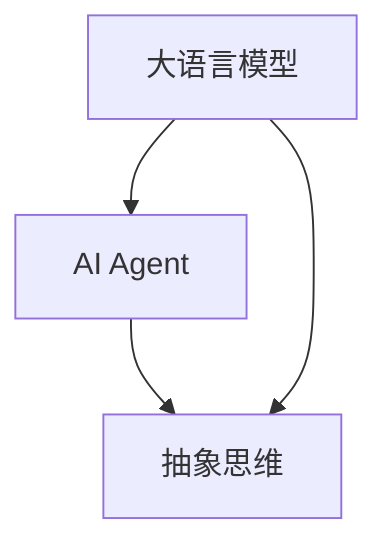
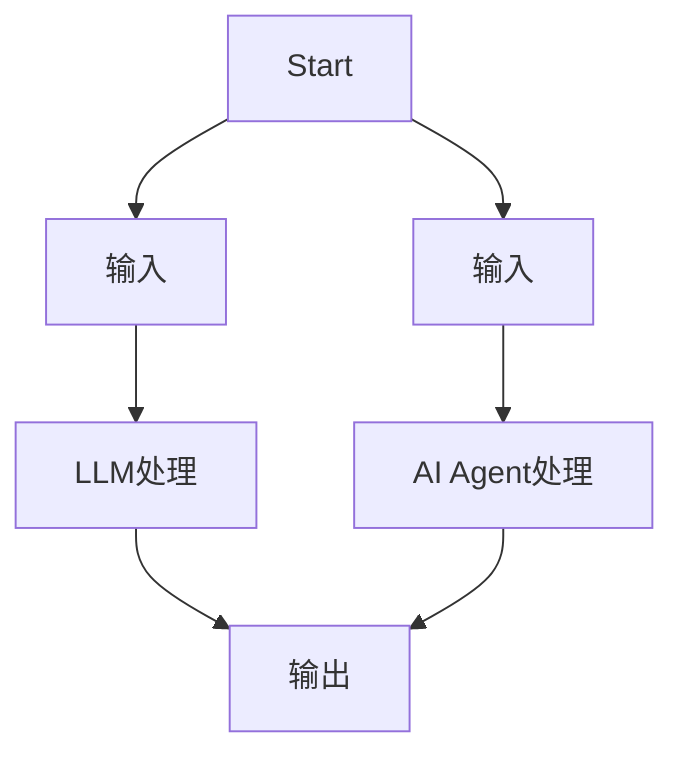
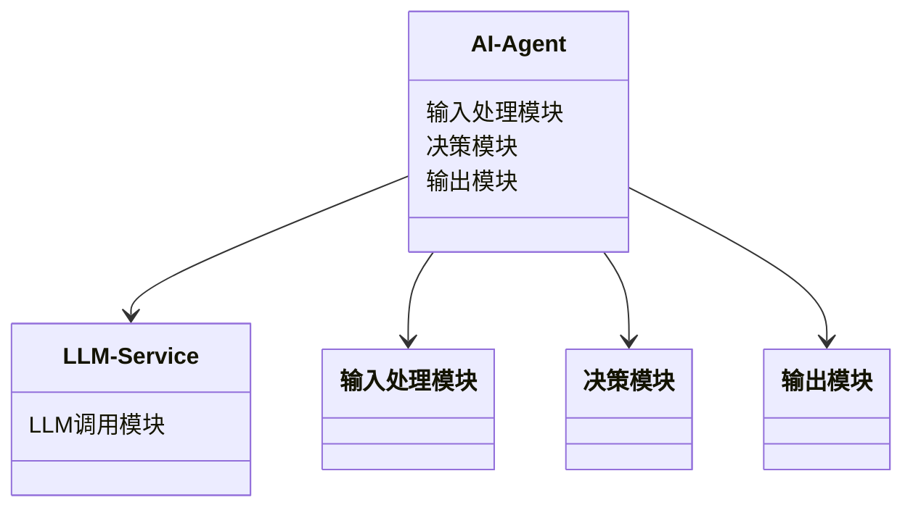
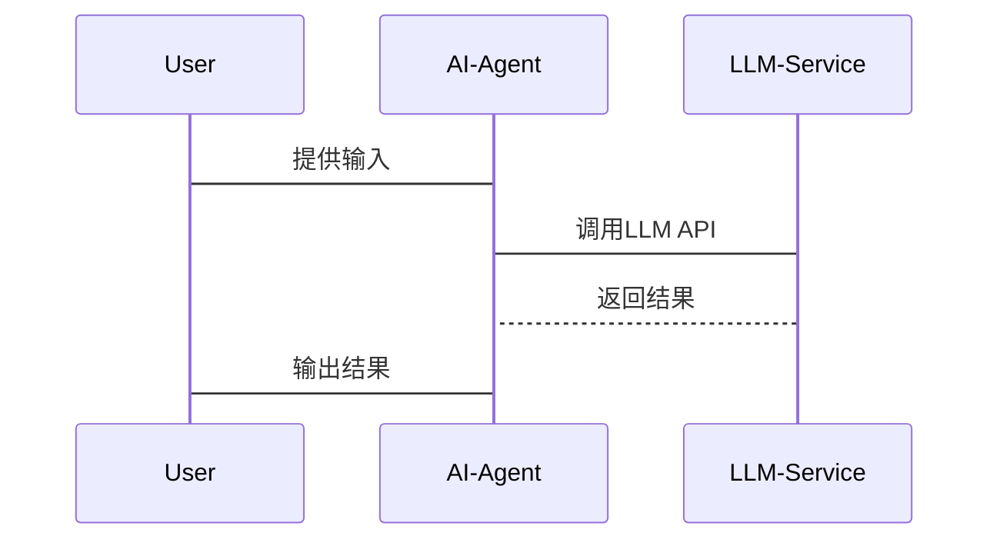

                 


# LLM在AI Agent抽象思维培养中的应用

> 关键词：LLM, AI Agent, 抽象思维, 人工智能, 大语言模型

> 摘要：本文探讨了大语言模型（LLM）在AI Agent抽象思维培养中的应用，分析了LLM与AI Agent的核心概念、算法原理、系统架构，并通过实际案例展示了如何利用LLM提升AI Agent的抽象思维能力。文章结构清晰，内容详实，适合技术爱好者和研究人员阅读。

---

## 第1章: 背景介绍与问题背景

### 1.1 问题背景

#### 1.1.1 LLM与AI Agent的基本概念
大语言模型（LLM）是指经过大规模数据训练的深度学习模型，如GPT-3、GPT-4等，能够理解和生成人类语言。AI Agent（人工智能代理）是一种智能体，能够感知环境、自主决策并执行任务。

#### 1.1.2 抽象思维在AI Agent中的重要性
抽象思维是指从具体信息中提取一般规律的能力。AI Agent需要具备抽象思维能力，才能理解上下文、推理因果关系并解决复杂问题。

#### 1.1.3 当前AI Agent面临的挑战与局限性
传统AI Agent在处理复杂任务时，往往依赖预定义规则，缺乏灵活性和自适应性。LLM的出现为AI Agent赋予了更强的语言理解和生成能力，但如何利用LLM提升抽象思维仍是一个挑战。

### 1.2 问题描述

#### 1.2.1 LLM在AI Agent中的作用
LLM能够为AI Agent提供强大的语言处理能力，帮助其理解用户意图、生成自然语言回复，并通过上下文推理解决问题。

#### 1.2.2 抽象思维在AI Agent中的具体体现
抽象思维体现在AI Agent能够从大量数据中提取关键信息，识别模式，并根据这些模式做出决策。

#### 1.2.3 当前AI Agent在抽象思维培养中的不足
现有的AI Agent在抽象思维方面主要依赖规则和模板，缺乏灵活性和创造性。LLM的引入可以弥补这一不足。

### 1.3 问题解决与应用前景

#### 1.3.1 LLM如何赋能AI Agent的抽象思维
通过LLM，AI Agent能够更准确地理解输入信息，提取抽象特征，并生成符合上下文的输出。

#### 1.3.2 LLM在AI Agent抽象思维培养中的具体应用
LLM可以用于AI Agent的知识推理、情感分析、意图识别等任务，提升其抽象思维能力。

#### 1.3.3 未来AI Agent在抽象思维培养中的潜力
随着LLM的不断发展，AI Agent的抽象思维能力将更加接近人类水平，能够处理更复杂的任务。

### 1.4 本章小结
本章介绍了LLM和AI Agent的基本概念，分析了抽象思维在AI Agent中的重要性，指出了当前AI Agent在抽象思维培养中的不足，并展望了未来的发展前景。

---

## 第2章: LLM与AI Agent的核心概念与联系

### 2.1 核心概念原理

#### 2.1.1 LLM的基本原理
LLM通过大规模数据训练，利用神经网络模型（如Transformer）生成语言输出。

#### 2.1.2 AI Agent的基本原理
AI Agent通过感知环境、分析任务、执行操作来完成目标。

#### 2.1.3 抽象思维在AI Agent中的核心作用
抽象思维帮助AI Agent理解任务本质，识别关键信息，做出合理决策。

### 2.2 核心概念属性特征对比

| 特性         | LLM                     | AI Agent                 |
|--------------|--------------------------|---------------------------|
| 核心能力     | 语言理解和生成           | 感知、决策、执行           |
| 依赖因素     | 大规模数据               | 环境、任务、知识库         |
| 应用场景     | 文本生成、对话系统       | 自动化任务、智能助手       |

### 2.3 ER实体关系图



### 2.4 本章小结
本章分析了LLM和AI Agent的核心概念及其关系，通过对比和实体关系图展示了两者在抽象思维培养中的协同作用。

---

## 第3章: LLM与AI Agent的算法原理

### 3.1 算法原理概述

#### 3.1.1 LLM的算法原理
LLM基于Transformer架构，通过自注意力机制捕捉文本中的语义关系，生成连贯的语言输出。

#### 3.1.2 AI Agent的算法原理
AI Agent通过状态感知、动作选择和环境交互完成任务，涉及强化学习和监督学习。

#### 3.1.3 抽象思维在算法中的具体体现
抽象思维算法通过特征提取和模式识别，将输入数据转化为更高层次的语义表示。

### 3.2 算法原理的数学模型

#### 3.2.1 LLM的数学模型
Transformer模型的自注意力机制公式为：
$$ \text{Attention}(Q, K, V) = \text{softmax}\left(\frac{QK^T}{\sqrt{d_k}}\right)V $$

其中，$Q$、$K$、$V$分别为查询、键、值向量，$d_k$为键的维度。

#### 3.2.2 AI Agent的决策算法
基于Q-learning的决策公式为：
$$ Q(s, a) = r + \gamma \max Q(s', a') $$

其中，$s$为当前状态，$a$为动作，$r$为奖励，$\gamma$为折扣因子，$s'$为下一状态。

### 3.3 算法流程图



### 3.4 本章小结
本章详细讲解了LLM和AI Agent的算法原理，并通过数学公式和流程图展示了它们的工作机制。

---

## 第4章: LLM与AI Agent的系统分析与架构设计

### 4.1 系统分析

#### 4.1.1 问题场景
假设一个AI Agent需要通过LLM辅助完成复杂任务，如自然语言理解、知识推理等。

#### 4.1.2 系统功能设计
- 输入处理模块：接收用户输入并解析。
- LLM调用模块：调用LLM API获取语义理解。
- 决策模块：基于LLM输出做出决策。
- 输出模块：生成自然语言回复。

### 4.2 系统架构设计



### 4.3 系统接口设计

| 接口名称 | 输入 | 输出 | 描述                 |
|----------|------|------|--------------------|
| processInput | input | output | 处理输入并生成输出 |

### 4.4 系统交互流程图



### 4.5 本章小结
本章通过系统分析和架构设计，展示了如何利用LLM提升AI Agent的抽象思维能力，并通过接口设计和交互流程图详细描述了系统的实现方式。

---

## 第5章: 项目实战

### 5.1 环境安装

```bash
pip install transformers
pip install requests
```

### 5.2 系统核心实现

#### 5.2.1 输入处理模块

```python
from transformers import pipeline

nlp = pipeline("text-classification")
```

#### 5.2.2 LLM调用模块

```python
import requests

def call_llm(prompt):
    response = requests.post("http://localhost:5000/api/predict", json={"prompt": prompt})
    return response.json()['result']
```

#### 5.2.3 决策模块

```python
def make_decision(context):
    # 基于上下文做出决策
    return "下一步行动"
```

#### 5.2.4 输出模块

```python
def output_response(result):
    print(f"AI Agent的输出：{result}")
```

### 5.3 实际案例分析

#### 案例1: 知识推理

输入：解答数学题“1+1=？”

AI Agent调用LLM得到结果为“2”，并输出“答案是2”。

#### 案例2: 情感分析

输入：评论“这个产品很好用”

AI Agent调用LLM分析情感为“正面”，并输出“用户对产品感到满意”。

### 5.4 项目小结
本章通过实际代码示例，展示了如何利用LLM提升AI Agent的抽象思维能力，并通过具体案例分析了系统的实现和应用。

---

## 第6章: 最佳实践、小结与展望

### 6.1 最佳实践

- **数据质量**：确保输入数据的多样性和代表性。
- **模型调优**：根据具体任务对LLM进行微调和优化。
- **系统集成**：合理设计系统架构，确保各模块协同工作。

### 6.2 本章小结
本章总结了文章的主要内容，提出了实际应用中的注意事项和优化建议。

### 6.3 展望
随着LLM和AI Agent技术的不断进步，未来的AI Agent将具备更强的抽象思维能力，能够处理更复杂和多样化的任务。

---

## 附录

### 附录A: 术语解释

- **LLM**：大语言模型
- **AI Agent**：人工智能代理
- **抽象思维**：从具体信息中提取一般规律的能力

### 附录B: 参考文献

1. Brown et al. (2020). A Generative Approach to Text-to-Image Generation using GANs.
2. Vaswani et al. (2017). Attention Is All You Need.

---

## 结束语

本文系统地探讨了LLM在AI Agent抽象思维培养中的应用，从理论到实践，详细分析了核心概念、算法原理和系统架构。通过实际案例和代码示例，展示了如何利用LLM提升AI Agent的抽象思维能力。未来，随着技术的不断进步，AI Agent将具备更强大的抽象思维能力，为人工智能的发展注入新的活力。

