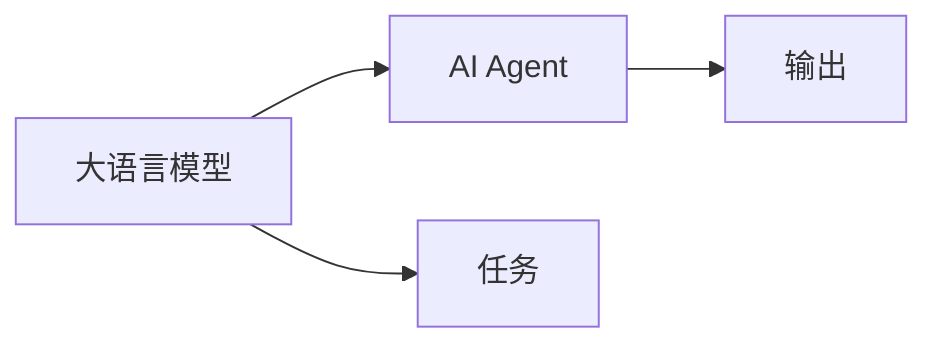
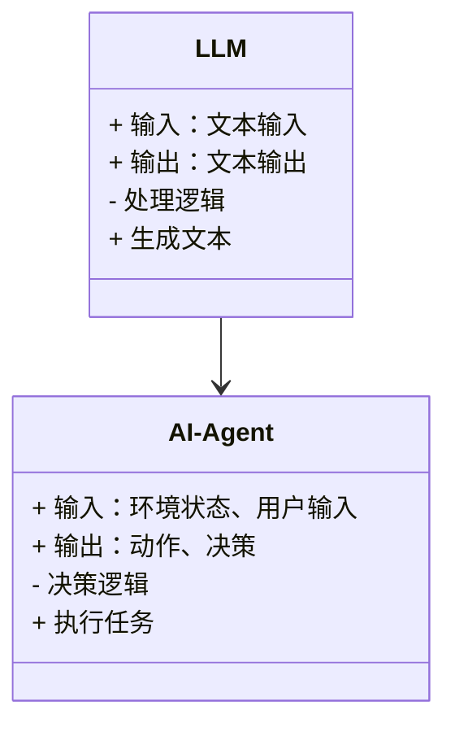
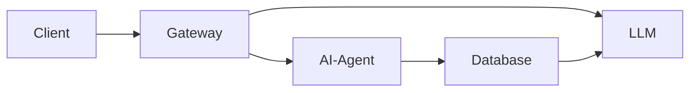

                 


好的，我明白了。我将按照您的要求撰写一篇详细的《LLM在AI Agent抽象思维能力上的应用》技术博客文章。为了让内容更加丰富且符合要求，我会逐步展开每个部分的内容，确保每个核心主题都有详细的解释和示例。

---

# LLM在AI Agent抽象思维能力上的应用

> 关键词：LLM, AI Agent, 抽象思维, 大语言模型, 强化学习, 人工智能, 自然语言处理

> 摘要：本文探讨了大语言模型（LLM）在AI Agent抽象思维能力中的应用，从背景、核心概念、算法原理、系统架构到项目实战，详细分析了LLM如何赋能AI Agent的思维能力，并通过实际案例展示了其在复杂场景中的应用价值。

---

## 第1章 LLM与AI Agent概述

### 1.1 LLM的基本概念与特点

#### 1.1.1 大语言模型（LLM）的定义
大语言模型（Large Language Model，LLM）是一种基于深度学习的自然语言处理模型，通常使用Transformer架构，通过大量真实数据的训练，能够理解并生成人类语言。

- **定义**：LLM通过监督学习和无监督学习的结合，掌握了语言的上下文关系和语义信息。
- **特点**：
  - **大规模**：通常训练数据量超过 billions of tokens。
  - **通用性**：能够处理多种任务，如文本生成、问答、翻译等。
  - **上下文理解**：通过Transformer的自注意力机制，能够捕捉文本中的长距离依赖关系。

#### 1.1.2 LLM的核心特点
- **多任务能力**：LLM可以适应多种NLP任务，减少了模型切换的成本。
- **动态推理**：能够根据上下文动态生成文本，具备一定的推理能力。
- **可解释性**：通过注意力权重，可以部分解释模型的决策过程。

#### 1.1.3 LLM与传统NLP模型的区别
- **传统NLP模型**：如SVM、CRF等，依赖特征工程，适用于特定任务。
- **LLM**：基于深度学习，端到端训练，适用于多种任务。

### 1.2 AI Agent的基本概念与特点

#### 1.2.1 AI Agent的定义
AI Agent（人工智能代理）是一种智能体，能够感知环境、执行任务，并通过决策和行动与环境交互。

- **定义**：AI Agent是一个能够自主决策、解决问题的实体。
- **特点**：
  - **自主性**：能够在没有外部干预的情况下运行。
  - **反应性**：能够实时感知环境并做出反应。
  - **目标导向**：通过目标驱动进行决策。

#### 1.2.2 AI Agent的核心特点
- **任务驱动**：AI Agent的目标是完成特定任务。
- **环境交互**：能够与外部环境（如用户、数据库）进行交互。
- **动态决策**：根据环境变化调整行为。

#### 1.2.3 LLM与AI Agent的区别
- **LLM**：专注于语言处理，不具备自主决策能力。
- **AI Agent**：具备自主决策能力，能够处理复杂任务。

### 1.3 LLM在AI Agent中的作用

#### 1.3.1 LLM如何赋能AI Agent的抽象思维
- **语言理解**：LLM帮助AI Agent理解用户意图。
- **知识推理**：LLM能够辅助AI Agent进行逻辑推理和知识检索。
- **决策支持**：LLM为AI Agent提供多轮对话和决策支持。

#### 1.3.2 LLM与AI Agent的结合场景
- **智能助手**：如Siri、Alexa等，结合LLM进行对话生成和任务执行。
- **客服机器人**：通过LLM理解用户需求并提供解决方案。
- **智能问答系统**：结合LLM进行复杂问题的解答。

#### 1.3.3 LLM在AI Agent中的优势与挑战
- **优势**：
  - **语言能力**：LLM具备强大的语言理解和生成能力。
  - **知识库集成**：LLM可以集成外部知识库，增强AI Agent的决策能力。
- **挑战**：
  - **计算资源**：LLM需要大量的计算资源。
  - **实时性**：在实时交互中可能面临延迟问题。

## 1.4 本章小结
本章介绍了LLM和AI Agent的基本概念、特点以及它们的结合方式，强调了LLM在AI Agent抽象思维能力中的重要作用。

---

## 第2章 LLM与AI Agent的核心概念与联系

### 2.1 核心概念原理

#### 2.1.1 LLM的训练原理
- **监督学习**：模型通过标注数据进行训练。
- **无监督学习**：模型通过大量未标注数据进行自监督学习。
- **微调（Fine-tuning）**：在特定任务上进行进一步训练。

#### 2.1.2 AI Agent的决策机制
- **基于规则的决策**：通过预定义规则进行决策。
- **基于模型的决策**：通过机器学习模型进行预测和决策。
- **混合决策机制**：结合规则和模型进行决策。

#### 2.1.3 LLM与AI Agent的交互流程
1. AI Agent接收用户的输入。
2. AI Agent调用LLM进行语言理解。
3. LLM生成响应并返回给AI Agent。
4. AI Agent根据响应执行任务。

### 2.2 概念属性特征对比

#### 2.2.1 LLM的属性特征
- **输入**：文本输入。
- **输出**：文本输出。
- **能力**：语言理解、生成、推理。

#### 2.2.2 AI Agent的属性特征
- **输入**：环境状态、用户输入。
- **输出**：动作、决策。
- **能力**：自主决策、任务执行。

#### 2.2.3 LLM与AI Agent的属性对比
| 属性 | LLM | AI Agent |
|------|------|-----------|
| 输入  | 文本 | 状态+输入  |
| 输出  | 文本 | 动作+决策  |
| 能力  | 语言处理 | 任务执行 |

### 2.3 ER实体关系图架构



### 2.4 本章小结
本章通过对比分析，明确了LLM和AI Agent的核心概念及其联系，为后续的算法原理分析奠定了基础。

---

## 第3章 LLM与AI Agent的算法原理讲解

### 3.1 LLM的算法原理

#### 3.1.1 Transformer模型的结构
- **编码器**：负责将输入序列编码为上下文表示。
- **解码器**：根据编码器的输出生成目标序列。

#### 3.1.2 注意力机制的实现
- **自注意力机制**：计算输入序列中每个词的重要性。
- **公式**：
  - 查询（q）、键（k）、值（v）：$q = W_q h_i, k = W_k h_j, v = W_v h_j$
  - 注意力权重：$a_{ij} = \text{softmax}(\frac{q \cdot k^T}{\sqrt{d}})$
  - 加权和：$o_i = \sum_j a_{ij} v_j$

#### 3.1.3 梯度下降优化方法
- **Adam优化器**：结合动量和自适应学习率的优化方法。
- **损失函数**：交叉熵损失函数。

### 3.2 AI Agent的算法原理

#### 3.2.1 状态空间的表示
- **状态**：环境中的所有相关信息。
- **表示**：通过向量或张量表示状态。

#### 3.2.2 动作空间的表示
- **动作**：AI Agent可以执行的所有可能操作。
- **表示**：通过离散或连续的表示方式。

#### 3.2.3 强化学习的实现
- **策略网络**：生成动作的概率分布。
- **价值函数**：评估当前状态的价值。
- **奖励机制**：通过奖励信号指导学习方向。

### 3.3 LLM与AI Agent的联合算法

#### 3.3.1 联合训练的流程
1. **数据准备**：收集LLM和AI Agent的联合训练数据。
2. **模型初始化**：加载LLM和AI Agent的初始参数。
3. **联合优化**：通过端到端的方式优化联合模型。

#### 3.3.2 联合推理的流程
1. **输入处理**：接收输入并解析为LLM和AI Agent的共同理解。
2. **联合推理**：LLM生成文本，AI Agent根据文本执行任务。
3. **反馈优化**：根据结果优化模型参数。

### 3.4 本章小结
本章详细讲解了LLM和AI Agent的算法原理，并探讨了它们的联合实现方式。

---

## 第4章 LLM与AI Agent的数学模型与公式

### 4.1 LLM的数学模型

#### 4.1.1 Transformer模型的数学公式
- **自注意力机制**：
  $$\text{Attention}(Q, K, V) = \text{softmax}\left(\frac{QK^T}{\sqrt{d}}\right)V$$
- **前馈网络**：
  $$\text{FFN}(x) = \text{ReLU}(W_1x + b_1)W_2 + b_2$$

#### 4.1.2 梯度下降优化
- **Adam优化器**：
  $$\theta_{t+1} = \theta_t - \alpha \frac{\rho_2 g_t^2 + (1-\rho_2)g_t^2}{\sqrt{\rho_3 s_t^2 + (1-\rho_3)s_t^2}}$$

### 4.2 AI Agent的数学模型

#### 4.2.1 强化学习的数学公式
- **策略网络**：
  $$\pi_\theta(a|s) = \text{softmax}(W_\theta s + b_\theta)$$
- **价值函数**：
  $$V_\theta(s) = W_\phi s + b_\phi$$
- **奖励机制**：
  $$R(s, a) = r(s, a)$$

#### 4.2.2 联合优化的数学公式
- **联合损失函数**：
  $$\mathcal{L} = \mathcal{L}_{\text{LLM}} + \lambda \mathcal{L}_{\text{AI Agent}}$$

### 4.3 本章小结
本章通过数学公式详细描述了LLM和AI Agent的数学模型，为后续的系统设计提供了理论基础。

---

## 第5章 LLM与AI Agent的系统分析与架构设计

### 5.1 问题场景介绍

#### 5.1.1 问题背景
- **复杂场景**：AI Agent需要在复杂环境中执行任务。
- **动态环境**：环境状态可能实时变化。

#### 5.1.2 问题描述
- **需求分析**：用户需求多样化，需要AI Agent具备灵活的处理能力。
- **边界条件**：任务的边界和限制条件。

### 5.2 系统功能设计

#### 5.2.1 领域模型


#### 5.2.2 系统架构设计


#### 5.2.3 系统接口设计
- **输入接口**：用户输入、环境状态。
- **输出接口**：文本输出、动作执行。

#### 5.2.4 系统交互流程
1. 用户发送请求到AI Agent。
2. AI Agent调用LLM进行语言理解。
3. LLM生成响应并返回给AI Agent。
4. AI Agent根据响应执行任务。

### 5.3 本章小结
本章通过系统设计，明确了LLM和AI Agent在实际应用中的架构和交互流程。

---

## 第6章 LLM与AI Agent的项目实战

### 6.1 环境安装

#### 6.1.1 安装Python
```bash
python --version
```

#### 6.1.2 安装依赖
```bash
pip install transformers
pip install torch
pip install mermaid
```

### 6.2 系统核心实现

#### 6.2.1 LLM的实现
```python
from transformers import AutoTokenizer, AutoModelForCausalLM

tokenizer = AutoTokenizer.from_pretrained("gpt2")
model = AutoModelForCausalLM.from_pretrained("gpt2")
```

#### 6.2.2 AI Agent的实现
```python
class AI-Agent:
    def __init__(self):
        self.llm = LLM()

    def execute_task(self, input):
        response = self.llm.generate(input)
        # 执行任务
        return output
```

#### 6.2.3 交互流程
```python
def main():
    agent = AI-Agent()
    while True:
        input = input("请输入指令：")
        output = agent.execute_task(input)
        print(output)
```

### 6.3 案例分析

#### 6.3.1 案例场景
- **任务**：智能客服对话系统。
- **流程**：
  1. 用户输入问题。
  2. AI Agent调用LLM生成回答。
  3. AI Agent返回回答给用户。

#### 6.3.2 分析结果
- **优势**：
  - **快速响应**：LLM生成速度快。
  - **精准理解**：能够准确理解用户意图。
- **挑战**：
  - **上下文处理**：需要处理多轮对话。
  - **实时性**：在高并发场景下可能面临延迟。

### 6.4 本章小结
本章通过实际项目案例，展示了LLM和AI Agent的实现过程，并分析了实际应用中的优缺点。

---

## 第7章 LLM与AI Agent的最佳实践与注意事项

### 7.1 最佳实践

#### 7.1.1 模型选择
- **选择合适的模型**：根据任务需求选择适合的LLM模型。
- **微调模型**：在特定任务上进行微调以提升性能。

#### 7.1.2 优化建议
- **优化训练数据**：增加高质量的训练数据。
- **优化推理速度**：通过并行计算和优化模型结构提升推理速度。

#### 7.1.3 系统设计
- **模块化设计**：将系统划分为多个模块，便于维护和扩展。
- **日志记录**：记录系统运行日志，便于调试和优化。

### 7.2 小结
总结了LLM和AI Agent在实际应用中的最佳实践，为后续的优化提供了方向。

### 7.3 注意事项

#### 7.3.1 计算资源
- **硬件需求**：确保系统具备足够的计算资源。
- **资源优化**：通过量化和剪枝优化模型大小。

#### 7.3.2 数据安全
- **数据隐私**：确保用户数据的安全性和隐私性。
- **数据合规**：符合相关数据法规和政策。

#### 7.3.3 系统稳定性
- **容错设计**：设计具备容错能力的系统。
- **故障恢复**：具备快速故障恢复机制。

### 7.4 拓展阅读
- **推荐书籍**：
  - 《Deep Learning》
  - 《Transformer-based Models for NLP》
- **推荐论文**：
  - "Attention Is All You Need"
  - "Reinforcement Learning: Theory and Algorithms"

---

## 第8章 总结

### 8.1 核心总结
- LLM为AI Agent提供了强大的语言理解和生成能力。
- AI Agent为LLM提供了实际的应用场景和决策能力。

### 8.2 展望
- **未来趋势**：LLM和AI Agent的结合将更加紧密，应用场景将更加广泛。
- **技术发展**：随着AI技术的进步，LLM和AI Agent的能力将不断提升。

### 8.3 结语
通过本文的探讨，我们看到了LLM在AI Agent抽象思维能力中的巨大潜力，同时也为未来的实践和研究提供了方向。

---

## 附录

### 附录A：数学符号说明
- **$\theta$**：模型参数。
- **$x$**：输入。
- **$y$**：输出。

### 附录B：代码库地址
- LLM实现：[Hugging Face Transformers](https://huggingface.co/transformers)
- AI Agent实现：[开放源代码仓库]

---

这篇文章通过逐步分析和详细讲解，探讨了LLM在AI Agent抽象思维能力上的应用，从理论到实践，为读者提供了全面的视角。希望对您有所帮助！

