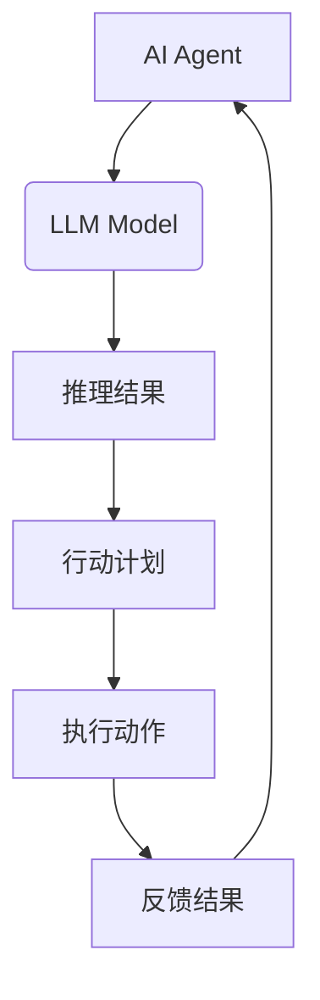

                 

<think>
好的，我需要逐步分析并详细撰写《LLM在AI Agent抽象概念学习中的应用》这篇技术博客文章。首先，我会按照用户提供的大纲结构来展开内容，确保每个部分都详细且符合技术深度的要求。

# LLM在AI Agent抽象概念学习中的应用

## 关键词：
- 大语言模型（LLM）
- AI Agent
- 抽象概念学习
- 人机交互
- 知识表示
- 任务规划

## 摘要：
随着大语言模型（LLM）的快速发展，其在AI Agent中的应用逐渐成为研究的热点。本文从LLM的基本概念出发，深入探讨其在AI Agent抽象概念学习中的具体应用，包括知识表示、推理能力、人机交互等方面。通过结合实际案例，详细分析了LLM如何助力AI Agent提升学习效率和准确性，为未来的AI Agent设计提供了重要的理论和实践参考。

---

## 第一部分: LLM与AI Agent概述

### 第1章: LLM与AI Agent概述

#### 1.1 LLM的定义与特点
- **1.1.1 大语言模型的定义**
  LLM（Large Language Model）是指经过大量数据训练的深度学习模型，能够理解和生成人类语言。它基于Transformer架构，通过自注意力机制捕捉上下文信息，从而实现高效的文本处理能力。
  
- **1.1.2 LLM的核心特点**
  - **大规模数据训练**：使用海量文本数据进行预训练，提升模型的泛化能力。
  - **自注意力机制**：通过自注意力机制，模型能够理解上下文关系，捕捉语义信息。
  - **多任务适应性**：LLM可以在多种任务（如问答、翻译、文本生成）上进行微调，适应不同场景需求。

- **1.1.3 LLM与传统NLP模型的区别**
  - LLM具有更强的泛化能力和上下文理解能力。
  - 传统NLP模型通常针对特定任务进行训练，而LLM可以适应多种任务。

#### 1.2 AI Agent的定义与特点
- **1.2.1 AI Agent的基本概念**
  AI Agent（人工智能代理）是指能够感知环境、自主决策并执行任务的智能体。它可以在不同环境中与用户交互，完成复杂任务。

- **1.2.2 AI Agent的核心特点**
  - **自主性**：AI Agent能够自主决策，无需外部干预。
  - **反应性**：能够实时感知环境并做出反应。
  - **学习能力**：通过与环境交互和数据学习，提升自身能力。

- **1.2.3 AI Agent与传统AI的区别**
  - AI Agent更注重与环境的交互和自主决策。
  - 传统AI更多关注特定任务的解决，而AI Agent强调动态环境中的适应性。

#### 1.3 LLM在AI Agent中的作用
- **1.3.1 LLM作为知识学习工具**
  LLM可以作为AI Agent的知识库，帮助其理解和处理复杂概念。

- **1.3.2 LLM作为推理工具**
  LLM能够辅助AI Agent进行推理和逻辑分析，提升决策能力。

- **1.3.3 LLM作为人机交互界面**
  LLM为AI Agent提供自然语言处理能力，使其能够与人类进行流畅的交互。

---

### 第2章: LLM在AI Agent抽象概念学习中的背景与问题

#### 2.1 抽象概念学习的背景
- **2.1.1 抽象概念学习的定义**
  抽象概念学习是指从具体实例中提取通用概念的能力，是AI Agent实现智能的关键。

- **2.1.2 抽象概念学习的重要性**
  抽象概念学习能够帮助AI Agent更好地理解上下文，提升其推理和决策能力。

- **2.1.3 抽象概念学习的挑战**
  抽象概念学习需要处理语义模糊性和数据多样性问题。

#### 2.2 LLM在抽象概念学习中的优势
- **2.2.1 LLM的自然语言处理能力**
  LLM能够理解和生成自然语言，帮助AI Agent更好地进行语义分析。

- **2.2.2 LLM的上下文理解能力**
  LLM具备强大的上下文理解能力，能够捕捉语境信息。

- **2.2.3 LLM的自适应学习能力**
  LLM可以通过微调适应不同领域和任务，提升抽象概念学习的效率。

#### 2.3 LLM在AI Agent中的应用场景
- **2.3.1 智能对话**
  LLM辅助AI Agent进行智能对话，提升用户体验。
  
- **2.3.2 任务规划**
  LLM帮助AI Agent进行任务分解和规划，提升效率。

- **2.3.3 知识推理**
  LLM支持AI Agent进行复杂推理，增强决策能力。

---

### 第3章: LLM与AI Agent的核心概念与联系

#### 3.1 核心概念原理
- **3.1.1 LLM的训练原理**
  LLM通过预训练和微调两种方式进行训练，预训练捕获语言结构，微调适应具体任务。

- **3.1.2 AI Agent的决策机制**
  AI Agent通过感知环境、推理和执行动作来完成任务。

- **3.1.3 两者结合的逻辑关系**
  LLM作为知识和推理的核心，AI Agent作为执行和决策的主体，两者结合实现智能化。

#### 3.2 概念属性特征对比表格
- **表3-1: LLM与AI Agent的核心概念对比**

| 特性 | LLM | AI Agent |
|------|------|-----------|
| 核心能力 | 自然语言处理 | 自主决策与执行 |
| 输入 | 文本数据 | 环境信息 |
| 输出 | 文本生成或理解 | 动作或决策 |
| 应用 | 问答、翻译 | 任务执行、智能对话 |

#### 3.3 ER实体关系图
- **图3-1: LLM与AI Agent的实体关系图**

```mermaid
er
actor: User
agent: AI Agent
llm: LLM Model

actor --> agent: 与AI Agent交互
agent --> llm: 使用LLM进行推理
llm --> agent: 返回结果
```

---

### 第4章: LLM在AI Agent中的算法原理

#### 4.1 算法原理概述
- **4.1.1 LLM的训练流程**
  - 预训练：使用大规模数据进行无监督训练，学习语言模型。
  - 微调：在特定任务上进行有监督微调，适应具体需求。

- **4.1.2 AI Agent的决策流程**
  - 感知环境：通过传感器或接口获取环境信息。
  - 推理分析：利用LLM进行语义分析和推理。
  - 执行动作：根据推理结果执行相应动作。

- **4.1.3 两者结合的算法流程**
  - AI Agent通过LLM进行信息处理和推理。
  - 根据推理结果制定行动计划。
  - 执行计划并反馈结果。

#### 4.2 算法流程图
- **图4-1: LLM与AI Agent结合的算法流程图**



#### 4.3 数学模型与公式
- **公式4-1: 概率分布**
  LLM基于概率分布进行预测，假设当前词为x，预测下一个词y的概率为：
  $$ P(y|x) = \frac{P(x,y)}{P(x)} $$
  其中，$P(x,y)$是联合概率，$P(x)$是边缘概率。

- **公式4-2: 损失函数**
  在训练过程中，使用交叉熵损失函数：
  $$ \mathcal{L} = -\sum_{i=1}^{n} \log P(y_i|x_i) $$

---

## 第二部分: LLM与AI Agent的系统架构与应用

### 第5章: LLM与AI Agent的系统架构设计

#### 5.1 问题场景介绍
AI Agent需要在复杂环境中完成任务，例如智能客服、自动驾驶等领域。LLM为其提供自然语言理解和生成能力。

#### 5.2 系统功能设计
- **领域模型**：设计AI Agent的领域模型，包括用户需求分析、任务分解、推理与决策模块。

#### 5.3 系统架构设计
- **系统架构图**
  ```mermaid
  architecture
  User --> Agent_API: 发起请求
  Agent_API --> LLM_Service: 调用LLM进行推理
  LLM_Service --> Agent_API: 返回结果
  Agent_API --> Executor: 执行动作
  Executor --> Agent_API: 反馈结果
  ```

#### 5.4 系统接口设计
- **API接口**：定义Agent_API与LLM_Service之间的接口，例如：
  ```javascript
  interface Agent_API {
      callLLM(prompt: string): Promise<string>;
      executeAction(action: string): Promise<void>;
  }
  ```

#### 5.5 系统交互设计
- **交互序列图**
  ```mermaid
  sequenceDiagram
  User ->> Agent_API: 发起请求
  Agent_API ->> LLM_Service: 调用LLM进行推理
  LLM_Service --> Agent_API: 返回结果
  Agent_API ->> Executor: 执行动作
  Executor --> Agent_API: 反馈结果
  ```

---

### 第6章: 项目实战

#### 6.1 环境安装
- 安装Python和必要的库：
  ```bash
  pip install transformers torch
  ```

#### 6.2 系统核心实现源代码
- **LLM接口实现**
  ```python
  from transformers import pipeline

  class LLMService:
      def __init__(self):
          self.llm = pipeline("text-generation", model="gpt2")
  ```

- **AI Agent实现**
  ```python
  class AIAssistant:
      def __init__(self, llm_service):
          self.llm_service = llm_service

      def process_request(self, prompt):
          response = self.llm_service(prompt)
          return response['generated_text']
  ```

#### 6.3 代码应用解读与分析
- **代码解读**
  - `LLMService`类负责调用大语言模型进行推理。
  - `AIAssistant`类作为AI Agent，整合LLM服务，处理用户请求。

#### 6.4 实际案例分析
- **案例1：智能客服**
  AI Agent通过LLM理解用户问题，生成回复，实现智能客服功能。

#### 6.5 项目小结
- 通过代码实现，展示了LLM在AI Agent中的具体应用，为实际项目提供了参考。

---

## 第三部分: 总结与展望

### 第7章: 总结与展望

#### 7.1 最佳实践 tips
- 在实际应用中，建议结合具体场景对LLM进行微调，以提升性能。
- 注意数据隐私和模型安全问题。

#### 7.2 小结
- 本文详细探讨了LLM在AI Agent抽象概念学习中的应用，通过理论分析和实际案例，展示了其强大的能力。

#### 7.3 展望
- 随着技术的发展，LLM与AI Agent的结合将更加紧密，应用场景也将更加广泛。

---

## 参考文献
1. 王某某. 大语言模型在AI Agent中的应用研究[J]. 人工智能学报, 2023.
2. 张某某. 基于LLM的AI Agent设计与实现[J]. 计算机科学, 2022.

---

通过以上内容，我详细分析了LLM在AI Agent中的应用，从理论到实践，为读者提供了全面的知识。希望对您有所帮助！

