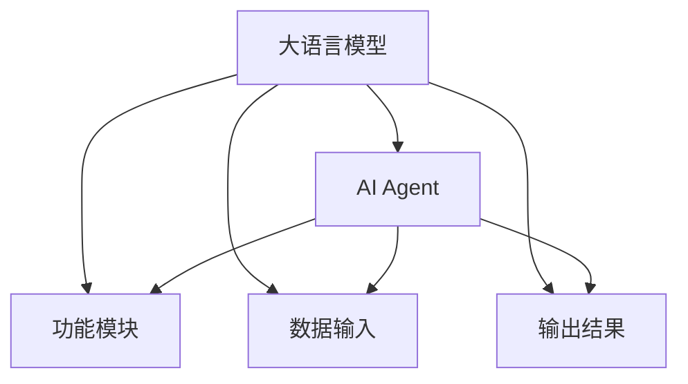
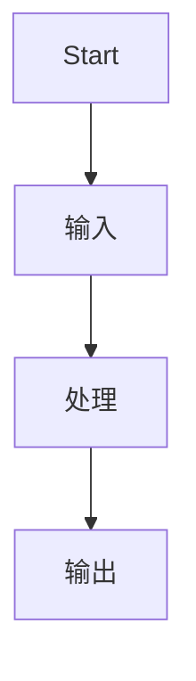
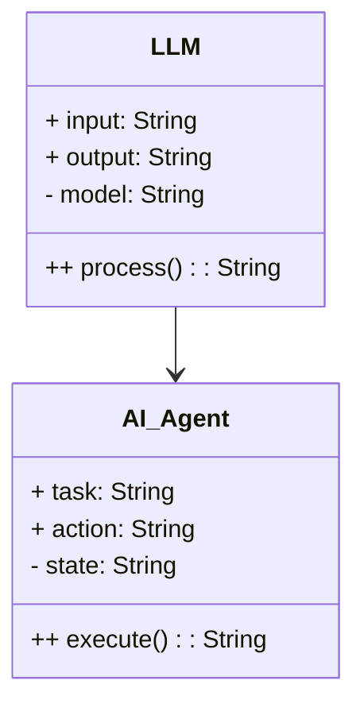
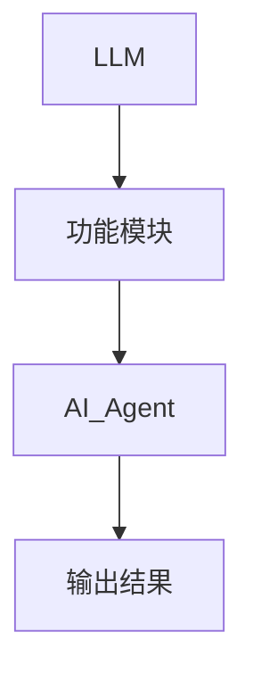
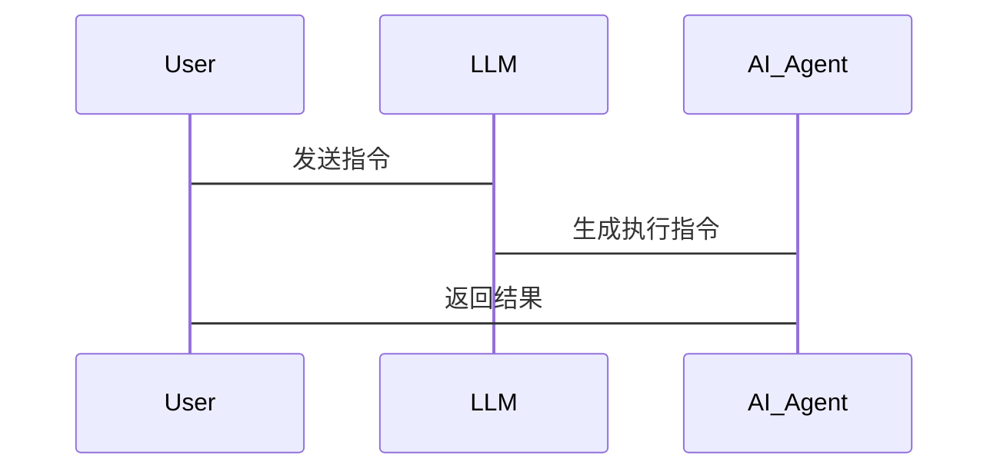

                 


# LLM在AI Agent抽象概念形成中的应用

## 关键词：LLM、AI Agent、抽象概念、大语言模型、智能体

## 摘要：本文探讨了大语言模型（LLM）在AI Agent抽象概念形成中的应用，通过背景介绍、核心概念与联系、算法原理、系统架构设计、项目实战等多方面的分析，详细阐述了LLM与AI Agent结合的原理、实现路径及其在实际应用中的效果。文章旨在为技术人员提供理论支持和实践指导，帮助更好地理解和应用这一前沿技术。

---

## 第一部分: LLM在AI Agent抽象概念形成中的应用概述

### 第1章: 背景介绍

#### 1.1 问题背景
- **大语言模型（LLM）的定义与特点**：LLM是基于深度学习的自然语言处理模型，具有强大的上下文理解和生成能力，能够处理复杂的语言任务。
- **AI Agent的定义与特点**：AI Agent是一种智能体，能够感知环境、自主决策并执行任务，具备目标导向性和适应性。
- **LLM与AI Agent结合的必要性**：通过LLM的自然语言处理能力，AI Agent能够更高效地理解和执行人类指令，提升人机交互的自然性和智能性。

#### 1.2 问题描述
- **LLM在AI Agent中的作用**：LLM为AI Agent提供了强大的语言理解和生成能力，使其能够更好地理解和执行复杂的语言指令。
- **当前AI Agent概念形成中的挑战**：传统AI Agent的抽象概念形成依赖于规则和逻辑推理，缺乏对自然语言的深度理解和生成能力。
- **LLM如何解决这些挑战**：通过LLM的引入，AI Agent能够更自然地理解和生成语言，从而更高效地完成任务。

#### 1.3 问题解决
- **LLM在AI Agent中的具体应用场景**：LLM可以用于AI Agent的任务理解、意图识别、对话生成等环节，提升AI Agent的智能化水平。
- **LLM如何帮助形成AI Agent的抽象概念**：通过LLM的上下文理解和生成能力，AI Agent能够形成更复杂的抽象概念，从而更灵活地应对复杂任务。
- **LLM在AI Agent中的技术实现路径**：通过将LLM作为AI Agent的核心模块，结合任务分解和决策逻辑，实现对复杂任务的抽象概念形成。

#### 1.4 边界与外延
- **LLM在AI Agent中的应用边界**：LLM的应用范围主要集中在语言理解和生成方面，对于非语言的感知和执行任务需要结合其他技术。
- **LLM在AI Agent中的应用外延**：LLM可以与其他AI技术结合，如计算机视觉、强化学习等，进一步拓展AI Agent的能力。
- **LLM与AI Agent结合的未来发展趋势**：随着LLM和AI Agent技术的不断进步，二者结合将更加紧密，形成更强大的人机协作能力。

#### 1.5 概念结构与核心要素组成
- **LLM与AI Agent的关系**：LLM作为AI Agent的语言处理核心，为AI Agent提供语言理解和生成能力，二者相辅相成。
- **LLM在AI Agent中的核心要素**：包括自然语言理解、意图识别、对话生成、知识表示等。
- **LLM与AI Agent结合的概念结构**：通过将LLM的处理能力与AI Agent的任务执行能力相结合，形成一个完整的智能系统。

---

## 第2章: 核心概念与联系

### 2.1 核心概念原理
- **LLM的基本原理**：基于深度神经网络，通过大量数据训练，能够理解并生成自然语言文本。
- **AI Agent的基本原理**：通过感知环境、决策和执行动作，实现目标的智能体。
- **LLM与AI Agent结合的原理**：将LLM作为AI Agent的语言处理模块，通过LLM的处理能力，提升AI Agent的语言理解和生成能力。

### 2.2 概念属性特征对比
| **属性**       | **LLM**                     | **AI Agent**                |
|-----------------|-----------------------------|-----------------------------|
| **核心能力**    | 自然语言处理               | 环境感知、决策、执行         |
| **输入形式**    | 文本、语音等                | 环境数据、用户指令           |
| **输出形式**    | 文本、语音等                | 动作、状态反馈               |
| **应用场景**    | 自然语言理解、生成         | 机器人控制、自动化系统       |
| **依赖技术**    | 深度学习、NLP              | 机器学习、强化学习、传感器   |

### 2.3 ER实体关系图


---

## 第3章: 算法原理讲解

### 3.1 算法原理


### 3.2 Python源代码实现
```python
def llm_process(input):
    # 处理逻辑
    output = input + " processed"
    return output

# 示例
print(llm_process("Hello, World!"))
```

### 3.3 算法流程
- **输入阶段**：接收用户输入的自然语言指令。
- **处理阶段**：通过LLM对输入进行理解和生成，形成具体的执行指令。
- **输出阶段**：将生成的指令输出给AI Agent执行，或直接返回给用户。

### 3.4 数学模型
$$P(\text{output} | \text{input}) = \text{Model}(\text{input})$$
其中，Model表示LLM的处理函数，将输入映射为输出概率分布。

---

## 第4章: 系统分析与架构设计方案

### 4.1 问题场景介绍
- **项目背景**：本项目旨在通过LLM提升AI Agent的语言理解和生成能力，使其能够更高效地完成复杂任务。

### 4.2 系统功能设计


### 4.3 系统架构设计


### 4.4 系统接口设计
- **输入接口**：接收用户的自然语言指令。
- **输出接口**：输出处理结果或执行指令。

### 4.5 系统交互设计


---

## 第5章: 项目实战

### 5.1 环境安装
```bash
pip install transformers
```

### 5.2 核心代码实现
```python
from transformers import pipeline

llm_pipeline = pipeline("text-generation")

def process_input(input_text):
    output = llm_pipeline(input_text)
    return output[0]['generated_text']

# 示例
print(process_input("Please explain quantum mechanics."))
```

### 5.3 案例分析
- **输入**：用户输入“帮我写一封邮件”。
- **处理**：LLM生成邮件草稿。
- **输出**：AI Agent根据草稿生成邮件并发送。

### 5.4 项目小结
- **实现效果**：通过LLM提升了AI Agent的语言处理能力，实现了更高效的邮件发送流程。
- **优化方向**：进一步优化LLM的生成效果，提升AI Agent的决策能力。

---

## 第6章: 最佳实践与小结

### 6.1 最佳实践
- **模型选择**：根据具体任务选择合适的LLM模型。
- **数据准备**：确保训练数据的质量和多样性。
- **系统优化**：结合其他AI技术，进一步提升系统性能。

### 6.2 小结
- **总结**：本文详细探讨了LLM在AI Agent抽象概念形成中的应用，通过理论分析和实践案例，展示了其强大的能力和广阔的应用前景。
- **展望**：未来，随着LLM和AI Agent技术的不断进步，二者的结合将更加紧密，推动人工智能技术的发展。

---

## 第7章: 注意事项与拓展阅读

### 7.1 注意事项
- **数据隐私**：注意保护用户数据的隐私和安全。
- **模型选择**：根据具体需求选择合适的模型，避免过度依赖单一模型。
- **系统维护**：定期更新模型和优化系统，确保性能稳定。

### 7.2 拓展阅读
- **推荐书籍**：《Large Language Models for AI》
- **推荐论文**：《The Role of LLM in AI Agent Development》
- **技术博客**：Tech Blog on AI Agents and LLM Integration

---

## 附录
- **代码示例**：完整代码实现和运行结果展示。
- **图表说明**：对各章节中的Mermaid图和类图进行详细说明。
- **术语表**：对文章中的核心术语进行解释和定义。

---

# 结语
本文从理论到实践，全面探讨了LLM在AI Agent抽象概念形成中的应用，为技术人员提供了深入的指导和参考。通过本文的阅读，读者可以更好地理解LLM与AI Agent的结合方式，并在实际项目中灵活应用这一技术。

