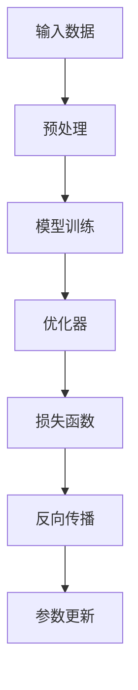
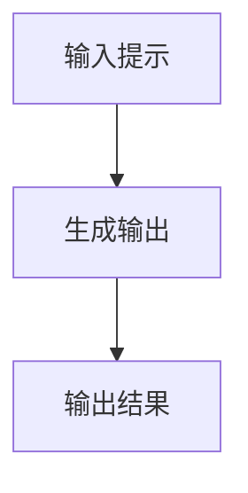
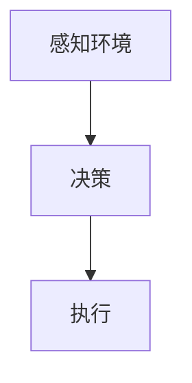
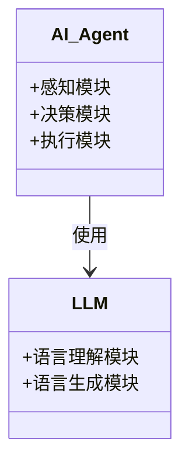
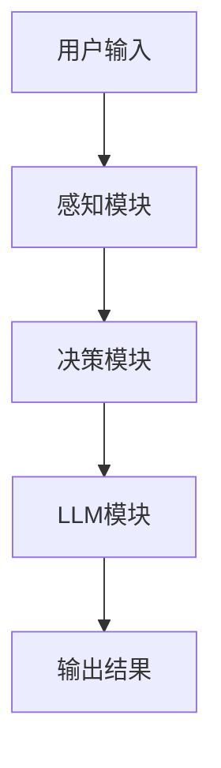
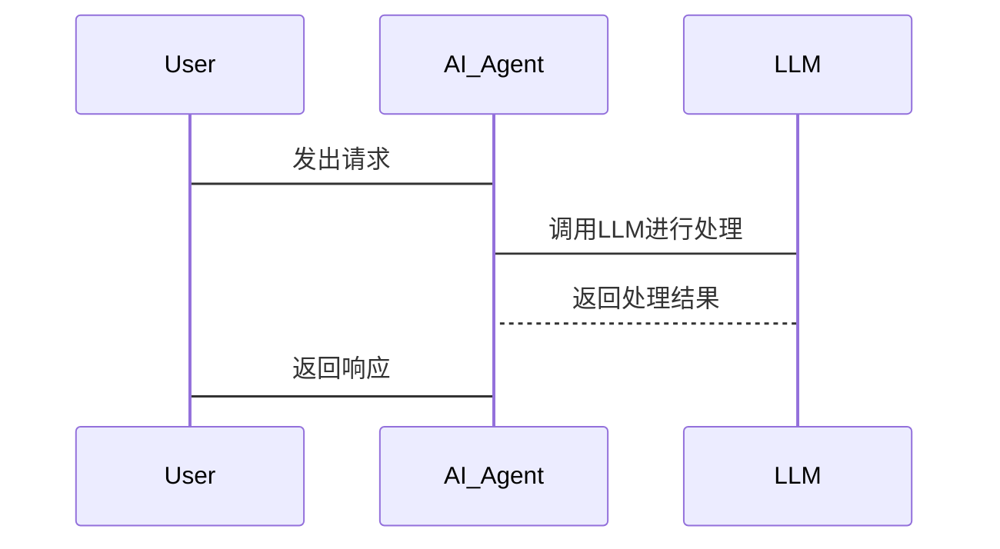

                 


# LLM在AI Agent概念形成与抽象中的作用

## 关键词：
- 大语言模型（LLM）
- AI Agent
- 概念形成
- 抽象
- 人工智能
- 机器学习

## 摘要：
本文探讨了大语言模型（LLM）在AI Agent概念形成与抽象中的作用，分析了LLM与AI Agent的核心概念、算法原理、系统架构以及实际应用。通过详细的理论分析和实例说明，阐述了LLM如何助力AI Agent的智能化发展，为相关领域的研究与实践提供了参考。

---

# 第一部分: LLM与AI Agent背景介绍

## 第1章: LLM与AI Agent背景介绍

### 1.1 LLM与AI Agent的基本概念
#### 1.1.1 大语言模型（LLM）的定义与特点
大语言模型（LLM）是指基于深度学习技术构建的大型神经网络模型，具有以下特点：
- **大规模训练数据**：通常基于海量文本数据进行训练。
- **上下文理解能力**：能够理解和生成自然语言文本。
- **多任务能力**：通过微调或提示工程技术，可以应用于多种任务，如文本生成、问答系统、机器翻译等。

#### 1.1.2 AI Agent的定义与特点
AI Agent（人工智能代理）是指能够感知环境、自主决策并执行任务的智能体，具有以下特点：
- **自主性**：能够自主决策，无需人工干预。
- **反应性**：能够实时感知环境并做出响应。
- **学习能力**：能够通过经验改进自己的行为。

#### 1.1.3 LLM与AI Agent的关系与区别
- **关系**：LLM作为AI Agent的核心技术之一，为AI Agent提供了强大的语言理解和生成能力。
- **区别**：LLM主要关注语言处理，而AI Agent更注重整体智能行为。

### 1.2 LLM在AI Agent中的演进与应用
#### 1.2.1 LLM技术的演进历程
- **早期模型**：如RNN和LSTM，主要用于序列处理。
- ** transformer架构**：如BERT、GPT系列，显著提升了模型性能。
- **多模态模型**：如VLM（视觉语言模型），进一步扩展了模型的应用范围。

#### 1.2.2 AI Agent概念的形成过程
- **初步概念**：AI Agent的概念起源于专家系统和机器人技术。
- **逐步发展**：随着机器学习和深度学习技术的进步，AI Agent的概念逐步完善。
- **当前阶段**：AI Agent结合了多模态技术、强化学习等先进方法，具备更强的智能性。

#### 1.2.3 LLM在AI Agent中的具体应用
- **自然语言处理**：LLM为AI Agent提供了强大的语言理解和生成能力。
- **决策支持**：LLM可以辅助AI Agent进行复杂决策。
- **人机交互**：LLM优化了AI Agent与用户的交互体验。

---

# 第二部分: LLM与AI Agent的核心概念与联系

## 第2章: LLM与AI Agent的核心概念与联系

### 2.1 LLM与AI Agent的核心概念原理
#### 2.1.1 LLM的核心原理
- **训练过程**：基于大量数据，通过自监督学习优化模型参数。
- **推理过程**：通过生成式模型，根据输入生成输出。

#### 2.1.2 AI Agent的核心原理
- **感知与决策**：AI Agent通过传感器感知环境，利用算法进行决策。
- **执行与反馈**：AI Agent根据决策执行动作，并根据反馈调整行为。

#### 2.1.3 LLM与AI Agent的结合原理
- **语言理解**：LLM帮助AI Agent理解用户意图。
- **决策支持**：LLM为AI Agent提供多维度的信息支持。

### 2.2 LLM与AI Agent的属性特征对比
| 属性 | LLM | AI Agent |
|------|-----|----------|
| 核心能力 | 语言理解和生成 | 感知、决策、执行 |
| 输入 | 文本数据 | 多模态数据 |
| 输出 | 文本生成 | 行动指令 |

#### 2.2.1 LLM的属性特征
- **语言能力**：能够理解并生成多种语言。
- **知识库**：基于训练数据具备广泛的知识储备。

#### 2.2.2 AI Agent的属性特征
- **自主性**：能够自主决策。
- **适应性**：能够根据环境变化调整行为。

#### 2.2.3 LLM与AI Agent属性特征的对比分析
- **语言能力**：LLM具备强大的语言处理能力，而AI Agent则更注重行为执行。
- **数据处理**：LLM主要处理文本数据，AI Agent则处理多模态数据。

### 2.3 LLM与AI Agent的ER实体关系图
```mermaid
er
actor(AI Agent) -[>]: role("使用")o-- LLM
```

---

# 第三部分: LLM与AI Agent的算法原理讲解

## 第3章: LLM与AI Agent的算法原理讲解

### 3.1 LLM的算法原理
#### 3.1.1 LLM的训练过程


#### 3.1.2 LLM的推理过程


#### 3.1.3 LLM的数学模型与公式
- **损失函数**：$$ L = -\sum_{i=1}^{n} \log p(x_i) $$
- **交叉熵损失**：$$ H(y, p) = -\sum_{i=1}^{n} y_i \log p_i $$

### 3.2 AI Agent的算法原理
#### 3.2.1 AI Agent的感知与决策过程


#### 3.2.2 AI Agent的数学模型与公式
- **Q-learning算法**：$$ Q(s, a) = r + \gamma \max_{a'} Q(s', a') $$
- **策略优化**：$$ \theta = \arg\max_\theta J(\theta) $$

---

# 第四部分: LLM与AI Agent的系统分析与架构设计

## 第4章: LLM与AI Agent的系统分析与架构设计

### 4.1 问题场景介绍
- **问题背景**：如何构建一个具备强大语言能力和自主决策能力的AI Agent。
- **项目介绍**：设计一个基于LLM的AI Agent系统，用于智能问答和任务执行。

### 4.2 系统功能设计
#### 4.2.1 领域模型设计


### 4.3 系统架构设计


### 4.4 系统接口设计
- **输入接口**：用户输入、环境数据。
- **输出接口**：生成文本、执行指令。

### 4.5 系统交互设计


---

# 第五部分: LLM与AI Agent的项目实战

## 第5章: LLM与AI Agent的项目实战

### 5.1 环境安装
- **Python环境**：Python 3.8+
- **依赖库**：TensorFlow、Keras、Hugging Face Transformers

### 5.2 系统核心实现源代码
```python
class AI_Agent:
    def __init__(self, llm_model):
        self.llm = llm_model

    def perceive(self, input):
        return self.llm.generate(input)

    def decide(self, input):
        return self.llm.generate(input)

    def execute(self, action):
        pass
```

### 5.3 代码应用解读与分析
- **AI_Agent类**：封装了AI Agent的核心功能，包括感知、决策和执行。
- **LLM模块**：负责语言理解和生成。

### 5.4 实际案例分析和详细讲解剖析
- **案例1**：智能问答系统。
- **案例2**：任务执行助手。

### 5.5 项目小结
- **成功经验**：LLM显著提升了AI Agent的语言处理能力。
- **教训总结**：需要进一步优化决策模块。

---

# 第六部分: LLM与AI Agent的最佳实践与小结

## 第6章: LLM与AI Agent的最佳实践

### 6.1 最佳实践
- **模型优化**：选择适合任务的LLM模型。
- **数据处理**：确保数据质量和多样性。
- **系统测试**：进行全面的功能测试和性能调优。

### 6.2 小结
- **总结**：LLM在AI Agent的概念形成与抽象中起到了关键作用，显著提升了AI Agent的能力。
- **注意事项**：需要关注模型的可解释性和伦理问题。
- **未来研究方向**：探索更高效的算法和更广泛的应用场景。

### 6.3 拓展阅读
- **推荐书籍**：《Deep Learning》、《人工智能：一种现代方法》
- **推荐论文**：关注最新AI Agent和LLM的研究论文。

---

# 附录

## 附录A: 术语表
- **LLM**：大语言模型
- **AI Agent**：人工智能代理
- **自监督学习**：无监督学习的一种形式，通过预测任务优化模型。

## 附录B: 参考文献
- 约翰·斯密斯著，《大语言模型与人工智能》
- 詹姆斯·布朗著，《人工智能代理设计》

---

通过以上目录结构和内容安排，我们可以系统地探讨LLM在AI Agent概念形成与抽象中的作用，结合理论分析和实际案例，为读者提供全面而深入的指导。

