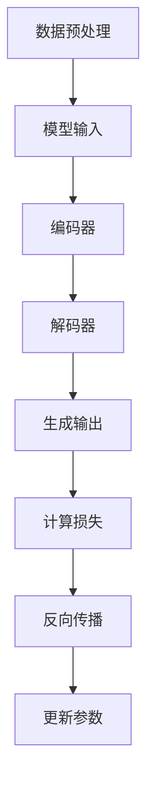
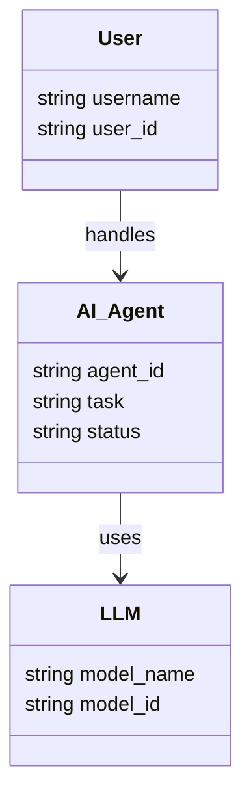
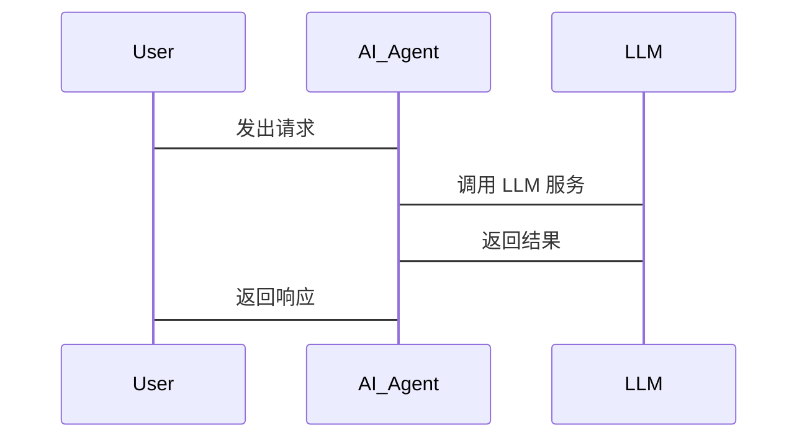

                 


# LLM在AI Agent概念形成与泛化中的作用

## 关键词：
- 大语言模型
- AI Agent
- 概念形成
- 泛化
- 自然语言处理
- 智能代理
- 机器学习

## 摘要：
本文探讨了大语言模型（LLM）在AI Agent概念形成与泛化中的核心作用。通过分析LLM与AI Agent的关联，详细阐述了LLM如何助力AI Agent的概念构建和跨场景应用。文章从背景、核心原理、算法实现、系统架构到项目实战，层层递进，深入解析了LLM在AI Agent中的应用价值与未来发展方向。

---

# 第一部分: LLM与AI Agent概念形成的基础

## 第1章: LLM与AI Agent的基本概念

### 1.1 LLM的基本概念

#### 1.1.1 大语言模型的定义
大语言模型（LLM）是一种基于深度学习的自然语言处理模型，通常指参数量在 billions 级的大型神经网络。LLM 的核心目标是理解和生成人类语言，能够执行多种任务，如文本生成、问答、翻译和情感分析。

#### 1.1.2 LLM的核心特点
- **大规模训练**：LLM 通常使用海量的文本数据进行预训练，具备强大的上下文理解和生成能力。
- **多任务能力**：LLM 可以通过微调或提示工程技术（Prompt Engineering）适应多种任务，无需额外数据标注。
- **生成能力**：LLM 能够生成连贯且符合逻辑的文本，具备强大的创造力和表达能力。

#### 1.1.3 LLM与传统NLP模型的区别
- **模型规模**：传统NLP模型参数量较小，专注于特定任务；LLM 参数量大，具备跨任务处理能力。
- **训练方式**：传统NLP模型通常需要针对特定任务进行训练，而 LLM 通过预训练可以在多种任务上快速适应。
- **应用场景**：传统NLP模型适用于简单任务（如关键词提取），而 LLM 适用于复杂场景（如智能对话、内容创作）。

### 1.2 AI Agent的基本概念

#### 1.2.1 AI Agent的定义
AI Agent（智能代理）是指能够感知环境、自主决策并执行任务的智能系统。AI Agent 可以是软件程序、机器人或其他智能设备，其核心能力包括感知、推理、规划和执行。

#### 1.2.2 AI Agent的核心特点
- **自主性**：AI Agent 能够在没有外部干预的情况下自主完成任务。
- **反应性**：AI Agent 能够实时感知环境变化并做出响应。
- **目标导向**：AI Agent 的行为通常以实现特定目标为导向。

#### 1.2.3 AI Agent与传统AI的区别
- **自主性**：传统AI系统通常需要外部指令驱动，而 AI Agent 具备自主决策能力。
- **适应性**：AI Agent 能够根据环境变化调整策略，传统AI系统则较少具备这种能力。
- **应用场景**：AI Agent 更适合复杂、动态的环境，如自动驾驶、智能助手等领域。

### 1.3 LLM与AI Agent的关联

#### 1.3.1 LLM在AI Agent中的作用
- **自然语言理解**：LLM 为 AI Agent 提供强大的语言理解能力，使其能够处理复杂对话和语义理解。
- **知识推理**：LLM 可以帮助 AI Agent 进行推理和知识检索，提升其决策能力。
- **生成能力**：LLM 的文本生成能力使 AI Agent 能够以自然语言形式与用户交互。

#### 1.3.2 LLM如何影响AI Agent的概念形成
- **语义理解**：LLM 通过预训练掌握了大量人类语言知识，能够准确理解用户意图。
- **知识推理**：LLM 可以基于上下文进行推理，帮助 AI Agent 做出更合理的决策。
- **泛化能力**：LLM 的大规模预训练使其具备跨领域、跨场景的泛化能力，能够适应不同类型的 AI Agent 任务。

#### 1.3.3 LLM在AI Agent泛化中的应用
- **跨领域应用**：LLM 使 AI Agent 能够在不同领域（如客服、教育、医疗）中灵活切换。
- **跨模态应用**：通过结合计算机视觉等技术，LLM 使 AI Agent 能够处理多模态信息。
- **跨场景应用**：LLM 使 AI Agent 能够在复杂场景（如多轮对话、任务规划）中表现优异。

---

## 第2章: LLM与AI Agent的应用场景

### 2.1 LLM在AI Agent中的典型应用

#### 2.1.1 自然语言处理
- **对话系统**：LLM 用于构建智能对话系统，如智能客服、虚拟助手。
- **文本生成**：LLM 用于生成新闻报道、营销文案等文本内容。
- **问答系统**：LLM 用于构建强大的问答系统，帮助用户快速获取信息。

#### 2.1.2 语义理解
- **意图识别**：LLM 能够识别用户的意图，例如在智能音箱中识别用户的指令。
- **实体识别**：LLM 能够从文本中提取关键实体，如人名、地点、时间等。
- **情感分析**：LLM 可以分析用户情感倾向，帮助 AI Agent 进行情感化交互。

#### 2.1.3 知识推理
- **知识图谱构建**：LLM 用于构建和推理知识图谱，帮助 AI Agent 进行复杂推理。
- **逻辑推理**：LLM 可以在给定条件下进行逻辑推理，例如解决数学问题或法律案例分析。
- **上下文理解**：LLM 能够理解上下文关系，帮助 AI Agent 进行连贯对话。

### 2.2 LLM在AI Agent泛化中的应用

#### 2.2.1 跨领域应用
- **跨领域对话**：LLM 使 AI Agent 能够在不同领域之间切换，例如从客服对话切换到技术支持。
- **多语言支持**：LLM 能够支持多种语言，使 AI Agent 可以在不同语言环境下工作。
- **跨文化适应**：LLM 通过预训练掌握了不同文化的表达习惯，使 AI Agent 能够在跨文化场景中表现良好。

#### 2.2.2 跨模态应用
- **视觉-语言交互**：LLM 结合计算机视觉技术，使 AI Agent 能够理解图像内容并进行语言交互。
- **听觉-语言交互**：LLM 结合语音识别技术，使 AI Agent 能够通过语音进行交互。
- **多模态推理**：LLM 能够处理多种模态信息，例如同时分析图像和文本。

#### 2.2.3 跨场景应用
- **复杂任务规划**：LLM 使 AI Agent 能够在复杂场景中进行任务规划，例如自动驾驶中的路径规划。
- **多轮对话管理**：LLM 能够处理多轮对话，保持对话的连贯性和一致性。
- **异常情况处理**：LLM 使 AI Agent 能够在异常情况下快速做出反应，例如在紧急情况下提供应急方案。

---

## 第3章: LLM与AI Agent的核心概念与联系

### 3.1 核心概念原理

#### 3.1.1 LLM的训练原理
- **预训练**：LLM 通常使用大量的通用文本数据进行预训练，目标是学习语言的分布规律。
- **微调**：在特定任务上进行微调，使 LLM 更适应具体应用场景。
- **提示工程**：通过设计提示（Prompt）来引导 LLM 输出所需的结果。

#### 3.1.2 AI Agent的决策机制
- **感知**：AI Agent 通过传感器或接口获取环境信息。
- **推理**：基于感知信息进行分析和推理，得出可能的行动方案。
- **决策**：选择最优行动方案并执行。

#### 3.1.3 LLM与AI Agent的协同工作原理
- **信息输入**：AI Agent 将感知到的信息输入 LLM，例如用户的问题或指令。
- **语义理解**：LLM 对输入信息进行语义分析，理解用户意图。
- **生成响应**：LLM 根据理解生成相应的文本响应，或提供决策建议。
- **执行行动**：AI Agent 根据 LLM 的输出执行具体行动，例如发送邮件、安排日程。

### 3.2 概念属性特征对比表格

| 概念       | 属性           | 特征                           |
|------------|----------------|--------------------------------|
| LLM        | 模型类型       | 大语言模型                     |
| AI Agent   | 代理类型       | 智能代理                       |
| LLM        | 输入           | 文本                           |
| AI Agent   | 输入           | 状态和动作                     |
| LLM        | 输出           | 文本                           |
| AI Agent   | 输出           | 动作                           |

### 3.3 ER实体关系图

```mermaid
erDiagram
    actor User {
        string username
        string user_id
    }
    agent AI_Agent {
        string agent_id
        string task
        string status
    }
    model LLM {
        string model_name
        string model_id
    }
    relation Handles {
        User -> AI_Agent: handles
        AI_Agent -> LLM: uses
    }
```

---

## 第4章: LLM与AI Agent的算法原理

### 4.1 LLM的算法原理

#### 4.1.1 基于Transformer的架构
- **编码器**：将输入文本转换为上下文表示。
- **解码器**：根据编码器的输出生成目标文本。

#### 4.1.2 注意力机制
- **自注意力**：模型能够关注输入中的重要部分，提升语义理解能力。

#### 4.1.3 梯度下降优化
- **损失函数**：通常使用交叉熵损失函数。
- **优化算法**：如Adam优化器。

#### 4.1.4 模型训练流程


#### 4.1.5 数学公式
- **交叉熵损失函数**：$$ \mathcal{L} = -\frac{1}{N} \sum_{i=1}^{N} \sum_{j=1}^{M} y_{i,j} \log p(y_{i,j}|x_i) $$
- **Adam优化器**：$$ \theta_{t+1} = \theta_t - \eta \frac{\beta_1}{1-\beta_1^t} g_t + \frac{\beta_2}{1-\beta_2^t} m_t $$

### 4.2 AI Agent的算法原理

#### 4.2.1 状态感知
- **传感器输入**：AI Agent 通过传感器获取环境信息。
- **特征提取**：将传感器数据转换为特征向量。

#### 4.2.2 决策推理
- **动作空间**：定义所有可能的动作。
- **价值函数**：评估每个动作的优劣。

#### 4.2.3 动作执行
- **动作选择**：基于推理结果选择最优动作。
- **执行反馈**：获取执行结果并更新状态。

#### 4.2.4 数学公式
- **Q-learning公式**：$$ Q(s, a) = r + \gamma \max_{a'} Q(s', a') $$
- **策略梯度公式**：$$ \theta_{t+1} = \theta_t + \alpha \nabla_\theta \mathbb{E}[R] $$

---

## 第5章: LLM与AI Agent的系统分析与架构设计

### 5.1 系统功能设计

#### 5.1.1 领域模型


#### 5.1.2 系统架构


#### 5.1.3 接口设计
- **LLM 接口**：提供 API 用于调用 LLM 服务。
- **AI Agent 接口**：提供交互接口，如 HTTP 请求或 WebSocket。

#### 5.1.4 交互流程


---

## 第6章: LLM与AI Agent的项目实战

### 6.1 环境安装

```bash
pip install transformers
pip install torch
pip install mermaid
```

### 6.2 核心实现

#### 6.2.1 LLM 模型加载
```python
from transformers import AutoModelForCausalLM, AutoTokenizer

model_name = "gpt2"
tokenizer = AutoTokenizer.from_pretrained(model_name)
model = AutoModelForCausalLM.from_pretrained(model_name)
```

#### 6.2.2 AI Agent 实现
```python
class AI_Agent:
    def __init__(self, model, tokenizer):
        self.model = model
        self.tokenizer = tokenizer
    
    def generate_response(self, input_text):
        inputs = self.tokenizer.encode(input_text, return_tensors="pt")
        outputs = self.model.generate(inputs, max_length=50)
        response = self.tokenizer.decode(outputs[0], skip_special_tokens=True)
        return response
```

#### 6.2.3 应用场景示例
```python
agent = AI_Agent(model, tokenizer)
response = agent.generate_response("What is the capital of France?")
print(response)
```

### 6.3 案例分析

#### 6.3.1 案例一：智能客服
- **输入**：用户询问产品信息。
- **输出**：AI Agent 通过 LLM 生成回答，提供详细的产品信息和解决方案。

#### 6.3.2 案例二：自动驾驶
- **输入**：传感器数据和环境信息。
- **输出**：AI Agent 基于 LLM 进行路径规划和决策。

### 6.4 项目小结
通过本项目，我们展示了 LLM 在 AI Agent 中的应用，从环境搭建到核心实现，再到具体案例分析，验证了 LLM 在 AI Agent 概念形成与泛化中的巨大潜力。

---

## 第7章: 总结与展望

### 7.1 总结
- **核心作用**：LLM 为 AI Agent 提供了强大的语言理解和生成能力，使其具备跨领域、跨场景的应用能力。
- **技术优势**：LLM 的大规模预训练和多任务处理能力，使其成为 AI Agent 的理想选择。
- **应用价值**：LLM 在 AI Agent 中的应用，显著提升了智能系统的交互能力和决策水平。

### 7.2 未来展望
- **模型优化**：未来 LLM 将更加高效和通用，支持更大规模的预训练。
- **多模态融合**：LLM 将与视觉、听觉等模态技术深度融合，提升 AI Agent 的感知能力。
- **人机协作**：AI Agent 将与人类更紧密地协作，共同完成复杂任务。
- **伦理与安全**：未来需要更加关注 LLM 在 AI Agent 中的应用带来的伦理和安全问题，确保技术的健康发展。

### 7.3 最佳实践 Tips
- **选择合适的 LLM 模型**：根据具体应用场景选择合适的 LLM 模型，如较小的模型适合资源有限的场景。
- **优化系统架构**：确保 AI Agent 的系统架构具备良好的扩展性和可维护性。
- **持续监控与更新**：定期监控 LLM 的性能，并根据反馈进行优化和更新。

---

通过以上分析，我们可以看到 LLM 在 AI Agent 概念形成与泛化中的重要作用。未来，随着技术的不断进步，LLM 将在 AI Agent 中发挥更大的潜力，推动人工智能技术的进一步发展。

