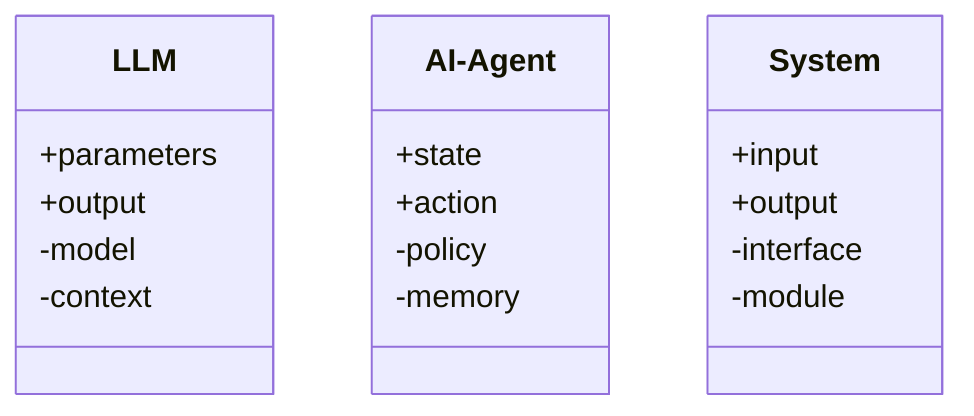
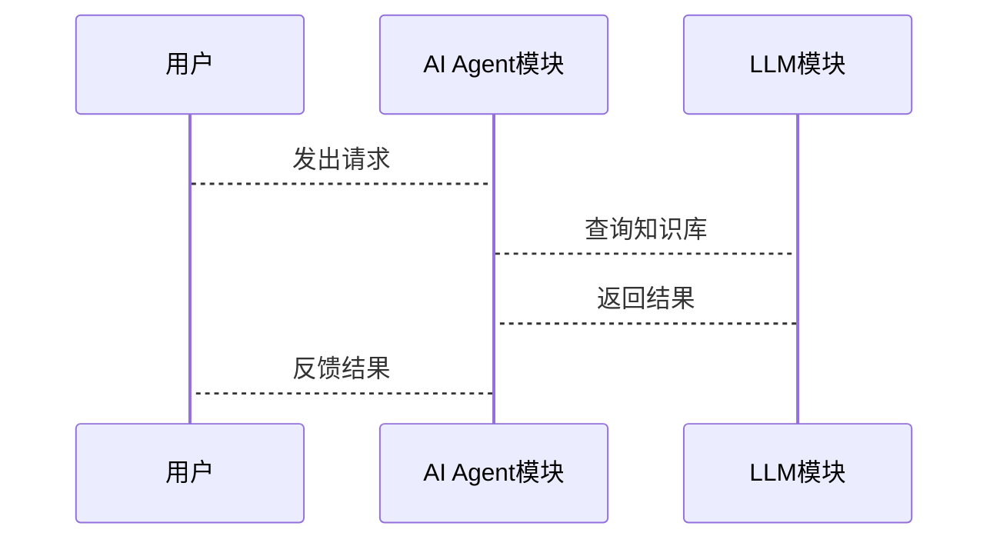

                 


# LLM在AI Agent自我意识模拟中的应用

## 关键词：
- 大语言模型（LLM）
- AI Agent
- 自我意识模拟
- 人工智能
- 机器学习
- 强化学习
- 系统架构

## 摘要：
本文探讨了大语言模型（LLM）在AI Agent自我意识模拟中的应用。通过分析LLM的核心原理、AI Agent的机制以及两者结合的优势，详细阐述了如何利用LLM提升AI Agent的自主决策能力。文章从基础概念到算法实现，再到系统设计，全面解析了LLM在AI Agent中的应用，并通过实际案例展示了其在不同场景中的潜力和效果。最后，文章总结了当前研究的成果，并展望了未来的发展方向。

---

# 第1章 LLM与AI Agent概述

## 1.1 问题背景
- 人工智能技术的快速发展
- AI Agent在实际场景中的需求
- LLM与AI Agent结合的必要性

## 1.2 问题描述
- AI Agent的核心任务与挑战
- LLM在自然语言处理中的优势
- 结合LLM与AI Agent的潜在价值

## 1.3 问题解决
- LLM作为AI Agent的核心模块
- AI Agent通过LLM实现自我意识模拟
- LLM与AI Agent协同工作的实现路径

## 1.4 边界与外延
- LLM与AI Agent结合的应用范围
- 与其他AI技术的对比
- 技术的局限性与未来改进方向

## 1.5 概念结构与核心要素
- LLM与AI Agent的关系图
- 核心要素对比表格
- 实体关系图（ER图）

---

# 第2章 LLM的核心原理

## 2.1 大语言模型（LLM）的定义
- 基于Transformer的模型结构
- 注意力机制的实现原理
- 梯度下降与优化算法

## 2.2 LLM的核心算法
- Transformer模型的数学公式
$$ \text{Attention}(Q,K,V) = \text{softmax}\left(\frac{QK^T}{\sqrt{d_k}}\right)V $$
- 编码器-解码器结构
- 模型的训练与推理过程

## 2.3 LLM的优势与局限
- 优势：强大的语言理解和生成能力
- 局限：对上下文的依赖性
- 解决方法：结合AI Agent的自主性

---

# 第3章 AI Agent的核心机制

## 3.1 AI Agent的基本概念
- 定义与分类
- 自主性与适应性
- 多任务处理能力

## 3.2 AI Agent的感知与决策
- 状态空间与动作空间
- 策略网络与价值函数网络
- 强化学习与模仿学习的结合

## 3.3 AI Agent的系统架构
- 分层架构设计
- 模块化设计
- 交互式设计

---

# 第4章 LLM与AI Agent的结合模型

## 4.1 LLM作为AI Agent的知识库
- 知识库的构建与查询
- 基于LLM的推理与决策
- 知识库的动态更新

## 4.2 AI Agent作为LLM的执行者
- LLM的决策转化为具体行动
- Agent的自主执行与反馈
- LLM与Agent的协同优化

## 4.3 结合模型的数学表示
- 联合概率模型
$$ P(x,y) = P(y|x)P(x) $$
- 协作机制的数学公式
$$ y = f(x) + g(x) $$

---

# 第5章 系统分析与架构设计

## 5.1 项目场景介绍
- 系统目标与范围
- 项目需求分析
- 核心功能模块

## 5.2 系统功能设计
- 领域模型（Mermaid类图）


## 5.3 系统架构设计
- 分层架构（Mermaid架构图）
```mermaid
archiitecture
    大语言模型模块 --> AI Agent模块
    AI Agent模块 --> 系统接口模块
    系统接口模块 --> 用户交互模块
```

## 5.4 系统接口设计
- 输入输出接口定义
- API设计与实现
- 接口交互流程

## 5.5 系统交互设计（Mermaid序列图）


---

# 第6章 项目实战

## 6.1 环境安装
- 开发工具与库的安装
- 代码环境配置

## 6.2 核心实现
- LLM与AI Agent的接口实现
- 系统功能模块开发
- 代码示例（Python）
```python
class LLM:
    def __init__(self, model):
        self.model = model

class AI-Agent:
    def __init__(self, llm):
        self.llm = llm
        self.state = None

    def decide(self, input):
        result = self.llm.model(input)
        return result
```

## 6.3 案例分析
- 典型案例的选择与分析
- 系统运行结果展示
- 优化与改进措施

## 6.4 项目小结
- 项目实现的关键点
- 成果总结
- 经验与教训

---

# 第7章 最佳实践与未来展望

## 7.1 最佳实践
- 系统设计中的注意事项
- 开发中的常见问题与解决方法
- 性能优化技巧

## 7.2 未来展望
- 技术的发展趋势
- 新的应用场景
- 挑战与机遇

---

# 第8章 总结

## 8.1 核心内容回顾
- LLM与AI Agent的结合
- 系统设计与实现
- 实际应用案例

## 8.2 小结
- 本文的主要贡献
- 对读者的启示
- 对未来研究的建议

---

# 参考文献
- 引用的相关论文、书籍和技术文档

---

# 附录
## 附录A: 算法的详细数学推导
## 附录B: 代码的详细解释
## 附录C: 系统架构的扩展说明

---

通过以上目录结构，文章将系统地阐述LLM在AI Agent自我意识模拟中的应用，从理论到实践，为读者提供全面而深入的技术指导。

