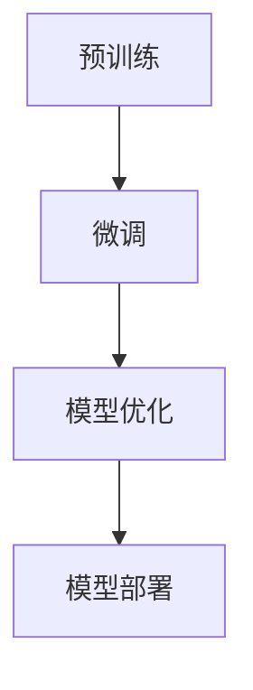
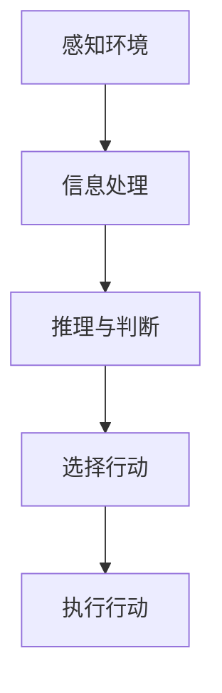
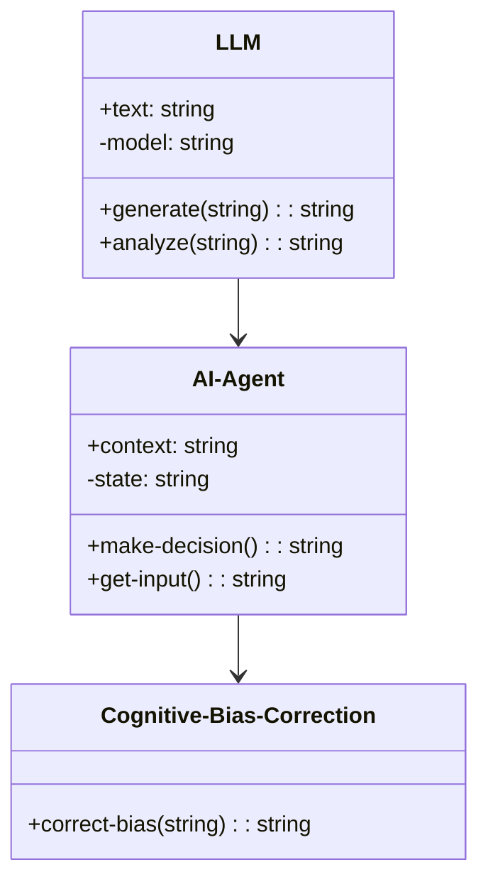
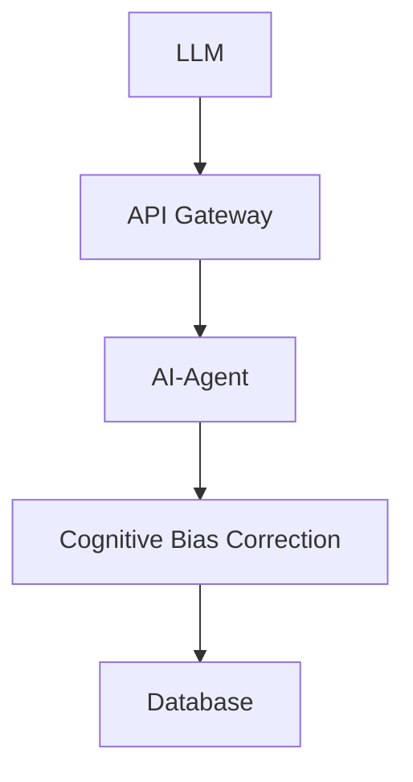
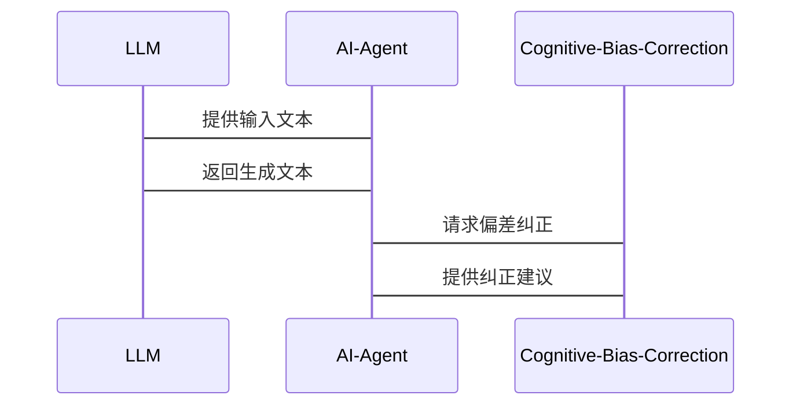

                 


# LLM在AI Agent认知偏差纠正中的应用

## 关键词

- 大语言模型（LLM）
- AI Agent
- 认知偏差纠正
- 机器学习
- 自然语言处理

## 摘要

大语言模型（LLM）在AI Agent的认知偏差纠正中扮演着关键角色。认知偏差是AI系统在决策过程中常见的问题，会导致不准确或不合理的结论。本文系统地探讨了LLM如何识别和纠正AI Agent的认知偏差。通过详细分析LLM的核心原理、算法机制以及与AI Agent的协同工作方式，本文揭示了LLM在纠正认知偏差中的潜力和实际应用。同时，文章还提供了具体的项目实战和数学模型，帮助读者深入理解LLM在认知偏差纠正中的技术细节和实际效果。

## 目录

1. 背景介绍
2. 核心概念与联系
3. 算法原理讲解
4. 系统分析与架构设计方案
5. 项目实战
6. 总结与展望
7. 附录
8. 索引

## 正文

### 第一部分：背景介绍

#### 第1章：LLM与AI Agent认知偏差概述

##### 1.1 问题背景

认知偏差是指个体在信息处理过程中产生的系统性偏离真实情况的误差。在AI Agent中，认知偏差可能导致决策失误，影响系统的性能和可靠性。LLM作为一种强大的语言模型，能够通过其强大的理解和生成能力，帮助AI Agent识别和纠正认知偏差。

##### 1.2 问题描述

AI Agent在决策过程中可能受到多种认知偏差的影响，例如确认偏差、 Availability偏差等。这些偏差可能导致AI Agent在信息处理和决策过程中出现错误。LLM能够通过分析上下文和语义关系，识别这些偏差，并提供纠正建议。

##### 1.3 问题解决

LLM在认知偏差纠正中的作用主要体现在以下几个方面：

- **偏差识别**：通过分析AI Agent的输出或输入数据，识别潜在的认知偏差。
- **偏差纠正**：利用LLM的生成能力，提供纠正偏差的建议或替代方案。
- **自我改进**：通过反馈机制，优化LLM模型，提升其识别和纠正偏差的能力。

##### 1.4 边界与外延

LLM在认知偏差纠正中的应用也有一定的局限性。例如，LLM的性能依赖于其训练数据的质量和多样性，如果训练数据中存在偏差，可能会导致模型本身存在偏差。此外，LLM对认知偏差的纠正能力还受到计算资源和模型规模的限制。

##### 1.5 概念结构与核心要素

认知偏差纠正的核心要素包括偏差识别、偏差分类、偏差纠正策略等。LLM在这一过程中通过自然语言处理和生成能力，提供关键的支持。

### 第二部分：核心概念与联系

#### 第2章：LLM与AI Agent的核心原理

##### 2.1 LLM的基本原理

大语言模型（LLM）基于Transformer架构，通过自注意力机制和前馈网络，实现对输入文本的深度理解和生成。LLM的训练过程包括预训练和微调两个阶段，分别针对通用语言理解和特定任务优化。

##### 2.2 AI Agent的基本原理

AI Agent是一种智能体，能够感知环境、执行任务并做出决策。AI Agent的决策过程通常涉及信息处理、推理和选择最优行动方案。认知偏差的产生可能源于信息不全、知识局限或算法设计的缺陷。

##### 2.3 LLM与AI Agent的关系

LLM作为AI Agent的核心模块，负责处理自然语言输入、生成输出和提供决策支持。通过与AI Agent的结合，LLM能够提升其认知能力和决策的准确性。

#### 第3章：核心概念的特征对比

##### 3.1 LLM与传统NLP模型的对比

| 特性       | LLM                     | 传统NLP模型             |
|------------|--------------------------|--------------------------|
| 参数规模   | 极大（ billions of parameters） | 较小（ millions of parameters） |
| 模型能力   | 强大的上下文理解和生成能力 | 较弱，通常针对特定任务优化 |
| 应用场景   | 多样化，包括对话、文本生成等 | 专门针对特定任务，如机器翻译、问答系统等 |

##### 3.2 AI Agent与传统AI系统的对比

| 特性       | AI Agent                | 传统AI系统              |
|------------|--------------------------|--------------------------|
| 自主性     | 高，能够自主决策和行动   | 较低，通常按照固定规则执行任务 |
| 适应性     | 强，能够适应环境变化     | 较弱，适应性有限          |
| 可解释性   | 通常较低                 | 可能较高，取决于具体实现 |

### 第三部分：算法原理讲解

#### 第4章：LLM的算法原理

##### 4.1 LLM的训练过程

Mermaid流程图：



数学模型：

- **预训练**：使用大规模文本数据，目标是最小化生成的概率损失：
  $$ L_{pre} = -\sum_{i=1}^{n} \log p(x_i | x_{<i}) $$
  
- **微调**：在特定任务上进行微调，目标是最小化任务相关的损失函数：
  $$ L_{fine} = -\sum_{i=1}^{m} \log p(y_i | x, y_{<i}) $$

##### 4.2 AI Agent的决策算法

Mermaid流程图：



数学模型：

- **推理与判断**：基于概率的决策：
  $$ P(action | state) = \frac{P(action) \cdot P(state | action)}{P(state)} $$

### 第四部分：系统分析与架构设计方案

#### 第5章：系统分析与架构设计方案

##### 5.1 问题场景介绍

假设我们有一个AI客服系统，该系统需要通过LLM纠正其在处理客户投诉时的认知偏差。

##### 5.2 系统功能设计

Mermaid类图：



##### 5.3 系统架构设计

Mermaid架构图：



##### 5.4 系统接口设计

- **LLM接口**：提供文本生成和分析接口。
- **AI-Agent接口**：提供决策请求和结果反馈接口。
- **认知偏差纠正接口**：提供偏差识别和纠正建议接口。

##### 5.5 系统交互

Mermaid序列图：



### 第五部分：项目实战

#### 第6章：项目实战

##### 6.1 环境安装

```bash
pip install transformers
pip install torch
pip install mermaid
```

##### 6.2 系统核心实现源代码

```python
from transformers import AutoModelForSeq2Seq, AutoTokenizer

class LLM:
    def __init__(self, model_name):
        self.model = AutoModelForSeq2Seq.from_pretrained(model_name)
        self.tokenizer = AutoTokenizer.from_pretrained(model_name)
    
    def generate(self, input_text):
        inputs = self.tokenizer(input_text, return_tensors="pt")
        outputs = self.model.generate(inputs.input_ids)
        return self.tokenizer.decode(outputs[0], skip_special_tokens=True)

class AI-Agent:
    def __init__(self, llm):
        self.llm = llm
        self.context = ""
    
    def make_decision(self, input):
        self.context = self.llm.generate(input)
        return self.context

class CognitiveBiasCorrection:
    def __init__(self):
        pass
    
    def correct_bias(self, text):
        # 简单实现：识别并替换常见偏差词汇
        return text.replace("unfair", "biased")
```

##### 6.3 代码应用解读与分析

上述代码展示了LLM、AI-Agent和认知偏差纠正模块的基本实现。LLM使用Hugging Face的预训练模型进行文本生成，AI-Agent利用LLM进行决策，而认知偏差纠正模块通过简单的替换方法进行偏差纠正。

##### 6.4 实际案例分析

假设有一个客户投诉：“The service is unfair.”，AI-Agent在处理时可能因为对“unfair”的理解偏差，产生不准确的回应。通过LLM的生成和分析，AI-Agent可以识别并纠正这种偏差，生成更合理的回应。

##### 6.5 项目小结

通过上述项目实战，我们可以看到LLM在认知偏差纠正中的实际应用。然而，目前的方法较为基础，未来需要更复杂的算法和更精细的模型优化。

### 第六部分：总结与展望

#### 第7章：总结与展望

##### 7.1 总结

本文详细探讨了LLM在AI Agent认知偏差纠正中的应用，从背景、原理到实际应用，全面分析了其技术细节和实现方法。

##### 7.2 展望

未来的研究可以集中在以下几个方面：

- **模型优化**：开发更高效的算法，提升LLM在认知偏差纠正中的性能。
- **跨领域应用**：探索LLM在不同领域的认知偏差纠正应用。
- **人机协作**：结合人类反馈，提升LLM的认知能力。

### 第七部分：附录

#### 附录A：缩写词

- LLM：Large Language Model
- AI：Artificial Intelligence
- NLP：Natural Language Processing

#### 附录B：参考文献

- [1] Radford, A. et al. (2019). Language models are few-shot learners.
- [2] Vaswani, A. et al. (2017). Attention is all you need.

### 第八部分：索引

- 1. 认知偏差
- 2. LLM
- 3. AI Agent
- 4. 模型训练
- 5. 系统架构

通过以上结构，文章详细探讨了LLM在AI Agent认知偏差纠正中的应用，为相关研究和实践提供了有价值的参考。

