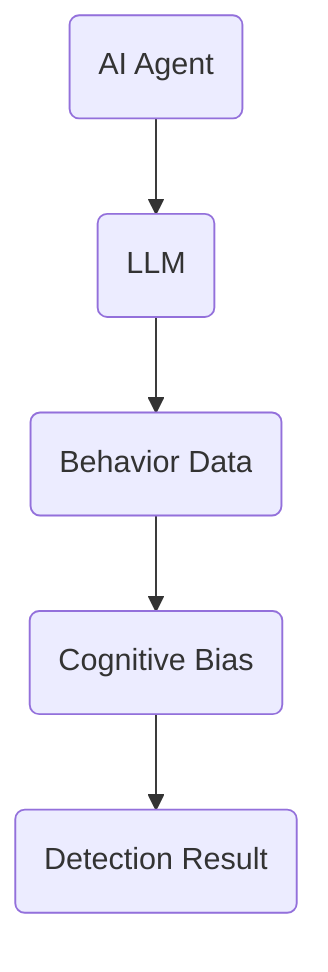
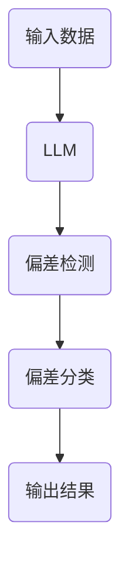
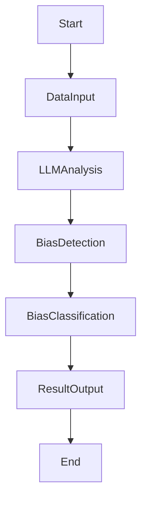
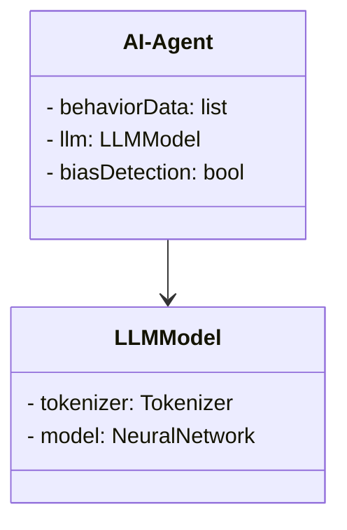

                 


# LLM在AI Agent认知偏差识别中的应用

> 关键词：LLM, AI Agent, 认知偏差, 机器学习, 自然语言处理

> 摘要：本文系统地探讨了大语言模型（LLM）在AI Agent认知偏差识别中的应用。首先，我们介绍了AI Agent和认知偏差的基本概念，分析了LLM在识别认知偏差中的作用。接着，我们详细讲解了基于LLM的认知偏差识别算法，包括其原理、流程和实现。最后，我们通过实际案例分析了LLM在AI Agent中的应用，并总结了相关经验和最佳实践。

---

## 第一部分: LLM在AI Agent认知偏差识别中的应用背景

### 第1章: 问题背景与核心概念

#### 1.1 问题背景

##### 1.1.1 AI Agent的定义与特点
AI Agent（人工智能代理）是指能够感知环境、自主决策并执行任务的智能实体。其特点包括：
- **自主性**：能够自主决策，无需外部干预。
- **反应性**：能够实时感知环境并做出反应。
- **目标导向**：基于目标驱动行为。
- **学习能力**：通过数据和经验优化自身行为。

##### 1.1.2 认知偏差的定义与分类
认知偏差是指个体在信息处理过程中产生的系统性偏离客观事实的思维方式。常见的认知偏差类型包括：
- **确认偏差**：倾向于寻找支持已有假设的信息。
- **忽略偏差**：忽略重要信息或低估其重要性。
- **代表性偏差**：根据事物的典型性来推断整体情况。

##### 1.1.3 LLM在AI Agent中的作用
LLM（大语言模型）通过自然语言处理技术，能够理解、生成和推理文本信息。在AI Agent中，LLM主要用于：
- 提供决策支持。
- 分析和识别认知偏差。
- 优化Agent的行为策略。

#### 1.2 问题描述

##### 1.2.1 AI Agent认知偏差的形成原因
AI Agent的认知偏差可能来源于：
- **数据偏差**：训练数据的不均衡或片面性。
- **算法偏差**：算法设计的局限性。
- **环境干扰**：外部环境的不确定性。

##### 1.2.2 认知偏差对AI Agent决策的影响
认知偏差会导致AI Agent做出错误的决策，例如：
- **误判风险**：低估或高估某项决策的风险。
- **决策失误**：基于偏差信息做出错误选择。
- **信任下降**：认知偏差会影响人类对AI Agent的信任。

##### 1.2.3 LLM在识别认知偏差中的潜力
LLM具备强大的语言理解和生成能力，能够帮助识别和纠正AI Agent的认知偏差。具体表现为：
- **实时分析**：快速分析Agent的行为数据。
- **偏差检测**：通过LLM的推理能力，识别潜在的认知偏差。
- **自我优化**：基于偏差分析结果，优化Agent的行为策略。

#### 1.3 问题解决与边界

##### 1.3.1 LLM在认知偏差识别中的解决方案
- **数据驱动方法**：利用大量数据训练LLM，使其能够识别偏差模式。
- **模型驱动方法**：通过构建偏差识别模型，实现自动化的偏差检测。
- **人机协作方法**：结合人类专家的判断，提高偏差识别的准确性。

##### 1.3.2 解决方案的边界与限制
- **数据依赖性**：LLM的性能依赖于训练数据的质量和多样性。
- **计算资源限制**：大规模LLM的运行需要高性能计算资源。
- **模型局限性**：当前LLM技术仍存在对某些特定场景的识别不足。

##### 1.3.3 解决方案的可行性分析
- **技术可行性**：LLM技术已较为成熟，具备实际应用的基础。
- **经济可行性**：随着云计算的发展，运行LLM的成本逐渐降低。
- **应用可行性**：在多个领域（如金融、医疗等）已展现出良好的应用前景。

#### 1.4 核心概念与联系

##### 1.4.1 LLM与AI Agent的关系
LLM作为AI Agent的核心组件，负责处理语言信息，支持Agent的决策和推理。

##### 1.4.2 认知偏差识别的原理与流程
认知偏差识别的基本流程包括：
1. 数据收集：获取AI Agent的行为数据。
2. 偏差检测：通过LLM分析数据，识别潜在偏差。
3. 偏差分类：将检测到的偏差进行分类。
4. 结果反馈：将识别结果反馈给AI Agent，优化其行为。

##### 1.4.3 问题场景的实体关系图



---

### 第2章: 核心概念与联系

#### 2.1 LLM与AI Agent的核心原理

##### 2.1.1 LLM的工作原理
LLM通过大量数据训练，利用神经网络结构生成语言文本。其核心原理包括：
- **编码器-解码器架构**：将输入文本编码为向量，再解码为输出文本。
- **注意力机制**：通过注意力机制捕捉文本中的长程依赖关系。

##### 2.1.2 AI Agent的认知模型
AI Agent的认知模型通常包括感知、推理和决策三个部分：
- **感知**：通过传感器获取环境信息。
- **推理**：基于感知信息进行逻辑推理。
- **决策**：根据推理结果做出决策。

##### 2.1.3 两者的结合与协同
LLM为AI Agent提供语言理解和生成能力，AI Agent为LLM提供决策和执行能力。两者协同工作，实现智能化的人机交互。

#### 2.2 认知偏差识别的原理与流程

##### 2.2.1 偏差识别的基本流程
1. 数据预处理：清洗和归一化数据。
2. 偏差检测：利用LLM分析数据，识别偏差。
3. 偏差分类：将偏差分为不同类别。
4. 结果评估：评估识别结果的准确性。

##### 2.2.2 LLM在偏差识别中的角色
- **数据分析**：通过LLM分析文本数据，识别偏差模式。
- **偏差分类**：利用LLM的分类能力，对偏差进行分类。
- **结果反馈**：将识别结果反馈给AI Agent，优化其行为。

##### 2.2.3 偏差识别的评估标准
- **准确率**：识别正确偏差的比例。
- **召回率**：识别出的偏差占总偏差的比例。
- **F1分数**：综合考虑准确率和召回率的指标。

#### 2.3 实体关系图

##### 2.3.1 ER实体关系图

```mermaid
erd
    A(AI Agent)
    B(Behavior Data)
    C(Cognitive Bias)
    D(Detection Result)
    A --> B
    B --> C
    C --> D
```

##### 2.3.2 LLM与AI Agent的交互关系


##### 2.3.3 偏差识别的系统架构



---

### 第3章: 算法原理与实现

#### 3.1 偏差识别的算法原理

##### 3.1.1 基于LLM的偏差检测方法
- **文本分析**：通过LLM分析文本数据，识别偏差。
- **模式匹配**：基于LLM的分类能力，匹配偏差模式。

##### 3.1.2 偏差分类的数学模型
- **逻辑回归**：用于分类问题。
- **支持向量机**：用于高维数据分类。
- **神经网络**：用于复杂的模式识别。

##### 3.1.3 算法的优缺点分析
- **优点**：高效、准确。
- **缺点**：需要大量数据支持，计算资源消耗大。

#### 3.2 算法实现的流程图

##### 3.2.1 算法流程图



##### 3.2.2 数据流分析
1. 数据输入：获取行为数据。
2. LLM分析：通过LLM处理数据，提取特征。
3. 偏差检测：检测数据中的偏差。
4. 偏差分类：对偏差进行分类。
5. 结果输出：输出偏差识别结果。

#### 3.3 代码实现与解读

##### 3.3.1 环境安装与配置
- **Python环境**：安装Python 3.8及以上版本。
- **依赖库安装**：安装`transformers`、`torch`等库。

##### 3.3.2 核心代码实现

```python
from transformers import AutoTokenizer, AutoModelForSequenceClassification
import torch

# 加载预训练模型
model_name = "bert-base-uncased"
tokenizer = AutoTokenizer.from_pretrained(model_name)
model = AutoModelForSequenceClassification.from_pretrained(model_name)

# 定义推理函数
def detect_bias(text):
    inputs = tokenizer.encode(text, return_tensors="pt")
    with torch.no_grad():
        outputs = model(inputs)
    logits = outputs.logits
    predicted_class = torch.argmax(logits, dim=1).item()
    return predicted_class

# 示例文本
text = "The evidence is conclusive, so we should take action."
print(detect_bias(text))
```

##### 3.3.3 代码解读与优化
- **模型加载**：加载预训练的BERT模型。
- **文本处理**：将输入文本编码为Tensor格式。
- **推理过程**：通过模型进行推理，得到 logits。
- **结果解析**：根据 logit 的最大值，确定偏差类别。

#### 3.4 数学模型与公式

##### 3.4.1 偏差识别的数学模型
$$ P(bias) = \frac{1}{1 + e^{-x}} $$

其中，$x$ 是模型的输出值。

##### 3.4.2 损失函数的优化过程
$$ L = -\frac{1}{n}\sum_{i=1}^{n} y_i \log(p_i) + (1 - y_i) \log(1 - p_i) $$

其中，$y_i$ 是真实标签，$p_i$ 是模型预测的概率。

##### 3.4.3 模型评估的数学指标
- **准确率**：$$ accuracy = \frac{\sum_{i=1}^{n} y_{pred}=y_{true}}{n} $$
- **召回率**：$$ recall = \frac{\sum_{i=1}^{n} y_{pred}=y_{true} \text{ 且 } y_{true}=1}{\sum_{i=1}^{n} y_{true}=1} $$
- **F1分数**：$$ F1 = 2 \frac{precision \cdot recall}{precision + recall} $$

---

### 第4章: 系统分析与架构设计

#### 4.1 问题场景介绍
本节将介绍一个实际的场景，例如在金融领域中，AI Agent可能因为认知偏差导致错误的投资决策。

#### 4.2 系统功能设计

##### 4.2.1 领域模型（Mermaid类图）



#### 4.3 系统架构设计

##### 4.3.1 系统架构图


##### 4.3.2 系统接口设计
- **输入接口**：接收行为数据。
- **输出接口**：输出偏差识别结果。
- **通信接口**：与外部系统进行数据交互。

#### 4.4 系统交互设计

##### 4.4.1 交互流程图


---

### 第5章: 项目实战

#### 5.1 环境安装与配置
- **安装Python**：确保安装了Python 3.8及以上版本。
- **安装依赖库**：安装`transformers`、`torch`等库。

#### 5.2 核心代码实现

##### 5.2.1 示例代码

```python
from transformers import AutoTokenizer, AutoModelForSequenceClassification
import torch

# 加载预训练模型
model_name = "bert-base-uncased"
tokenizer = AutoTokenizer.from_pretrained(model_name)
model = AutoModelForSequenceClassification.from_pretrained(model_name)

# 定义推理函数
def detect_bias(text):
    inputs = tokenizer.encode(text, return_tensors="pt")
    with torch.no_grad():
        outputs = model(inputs)
    logits = outputs.logits
    predicted_class = torch.argmax(logits, dim=1).item()
    return predicted_class

# 示例文本
text = "The evidence is conclusive, so we should take action."
print(detect_bias(text))
```

##### 5.2.2 代码解读
- **模型加载**：加载预训练的BERT模型。
- **文本处理**：将输入文本编码为Tensor格式。
- **推理过程**：通过模型进行推理，得到 logits。
- **结果解析**：根据 logit 的最大值，确定偏差类别。

#### 5.3 实际案例分析

##### 5.3.1 案例背景
在金融领域，AI Agent可能因为确认偏差导致过度投资某只股票。

##### 5.3.2 数据分析
通过LLM分析投资报告，识别确认偏差。

##### 5.3.3 偏差识别
通过模型识别出偏差，并优化投资策略。

---

### 第6章: 最佳实践与小结

#### 6.1 最佳实践 tips
- **数据质量**：确保训练数据的多样性和代表性。
- **模型选择**：根据具体场景选择合适的模型。
- **性能优化**：通过并行计算优化模型性能。

#### 6.2 小结
本文详细探讨了LLM在AI Agent认知偏差识别中的应用，从理论到实践，全面分析了其核心原理和实现方法。

#### 6.3 注意事项
- **数据隐私**：注意数据的隐私保护。
- **模型更新**：定期更新模型，保持其性能。
- **用户体验**：确保用户能够理解偏差识别的结果。

#### 6.4 拓展阅读
- **推荐书籍**：《Deep Learning》
- **推荐论文**：《Attention Is All You Need》

---

通过以上结构，我们可以系统地了解和掌握LLM在AI Agent认知偏差识别中的应用。希望本文能为相关领域的研究和实践提供有价值的参考。

