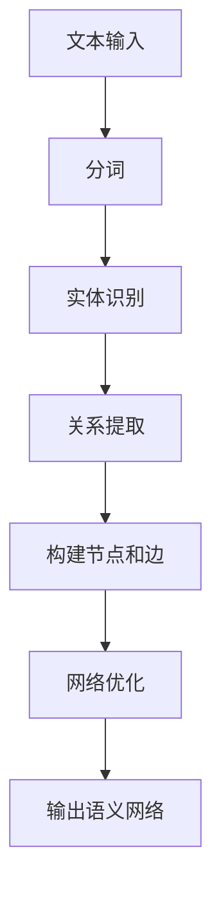

                 


# LLM在AI Agent语义网络构建中的应用

## 关键词：LLM, AI Agent, 语义网络, 自然语言处理, 知识图谱

## 摘要：本文探讨了大语言模型（LLM）在AI Agent语义网络构建中的应用，分析了LLM的基本原理、语义网络的构建方法，并详细介绍了基于LLM的语义网络构建算法。文章还通过实际案例展示了如何利用LLM优化AI Agent的语义理解能力，并展望了未来的研究方向。

---

# 第一部分: LLM在AI Agent语义网络构建中的应用基础

## 第1章: 问题背景与核心概念

### 1.1 问题背景

#### 1.1.1 AI Agent的定义与作用
AI Agent（人工智能代理）是指能够感知环境、自主决策并执行任务的智能实体。AI Agent广泛应用于智能助手、推荐系统、自动驾驶等领域。

#### 1.1.2 LLM在AI Agent中的角色
大语言模型（LLM）通过理解和生成自然语言，为AI Agent提供强大的语义理解和生成能力，使其能够更好地与人类交互和完成复杂任务。

#### 1.1.3 语义网络构建的必要性
语义网络是一种用于表示知识的结构化网络，通过节点和边来表示概念及其关系。构建语义网络有助于AI Agent更好地理解上下文和语义关系。

### 1.2 核心概念

#### 1.2.1 LLM的基本原理
大语言模型通过预训练和微调技术，学习大规模文本数据中的语言模式，能够生成与上下文相关的文本。

#### 1.2.2 语义网络的定义与特点
语义网络是一种图结构，节点表示概念，边表示概念之间的关系。语义网络具有层次性、可扩展性和语义关联性等特点。

#### 1.2.3 AI Agent与语义网络的关系
AI Agent通过语义网络理解用户输入的语义信息，并根据语义网络中的关系进行推理和决策。

### 1.3 问题描述与解决思路

#### 1.3.1 当前AI Agent面临的挑战
AI Agent在处理复杂语义信息时，常常面临语义理解不准确、上下文理解不足等问题。

#### 1.3.2 语义网络在AI Agent中的应用场景
语义网络可以用于语义理解、知识推理、意图识别等领域，帮助AI Agent更好地理解和处理语义信息。

#### 1.3.3 基于LLM的语义网络构建方法
通过利用LLM的语义理解能力，结合语义网络的结构化表示，构建更加智能和高效的语义网络。

### 1.4 本章小结
本章介绍了AI Agent、LLM和语义网络的基本概念，分析了当前AI Agent面临的挑战，并提出了基于LLM的语义网络构建方法。

---

# 第二部分: LLM与语义网络的核心原理

## 第2章: LLM的核心原理

### 2.1 转换器架构

#### 2.1.1 Transformer模型的基本结构
Transformer模型由编码器和解码器组成，编码器用于将输入序列映射为一个固定长度的向量，解码器用于根据编码器的输出生成目标序列。

#### 2.1.2 自注意力机制的数学公式
自注意力机制通过计算序列中每个位置与其他位置的相关性，生成注意力权重矩阵。
$$\text{Attention}(Q, K, V) = \text{softmax}\left(\frac{QK^T}{\sqrt{d_k}}\right)V$$

#### 2.1.3 前馈网络的作用
每个编码器和解码器层都包含多层感知机（MLP）和跳跃连接，用于提取复杂的特征。

### 2.2 LLM的训练与优化

#### 2.2.1 大规模数据的预训练
通过预训练，模型学习大规模文本数据中的语言模式，包括单词的分布、语法结构等。

#### 2.2.2 监督微调的原理
在预训练的基础上，通过特定任务的标签数据进行微调，使模型适应具体应用场景的需求。

#### 2.2.3 模型压缩与推理优化
通过模型剪枝、知识蒸馏等技术，减少模型的参数数量，提升推理效率。

### 2.3 LLM的应用边界

#### 2.3.1 模型的局限性
大语言模型可能存在理解偏差、生成错误等问题，且对计算资源的需求较高。

#### 2.3.2 语义理解的局限性
模型对复杂语义关系的理解仍需进一步优化。

#### 2.3.3 计算资源的限制
大规模模型的训练和推理需要大量的计算资源，限制了其在资源受限环境中的应用。

## 第3章: 语义网络的构建原理

### 3.1 语义网络的定义

#### 3.1.1 语义网络的基本概念
语义网络是一种用于表示知识的图结构，节点表示概念，边表示概念之间的关系。

#### 3.1.2 语义网络的层次结构
语义网络可以分为多个层次，从高层次的概念到低层次的具体实例。

#### 3.1.3 语义网络的表示方法
语义网络可以用图数据库或知识图谱的形式进行表示，支持高效的查询和推理。

### 3.2 语义网络的构建方法

#### 3.2.1 基于规则的构建方法
通过人工定义规则，提取文本中的实体和关系，构建语义网络。

#### 3.2.2 基于统计的构建方法
利用统计学习方法，从大量文本数据中自动提取实体和关系，构建语义网络。

#### 3.2.3 基于LLM的构建方法
利用大语言模型对文本的语义理解能力，自动生成实体和关系，构建语义网络。

### 3.3 语义网络的优化策略

#### 3.3.1 网络节点的优化
通过优化节点的表示方式，提高语义网络的可解释性和推理效率。

#### 3.3.2 边的权重调整
根据关系的重要性和相关性，动态调整边的权重，提升语义网络的准确性。

#### 3.3.3 网络可解释性的提升
通过引入可解释性模型，如可解释的注意力机制，提高语义网络的可解释性。

### 3.4 本章小结
本章详细介绍了语义网络的构建原理，包括基于规则、统计和LLM的构建方法，并提出了优化策略。

---

# 第三部分: 基于LLM的语义网络构建算法

## 第4章: 基于LLM的语义网络构建算法

### 4.1 算法原理

#### 4.1.1 LLM在语义网络中的作用
利用LLM对文本的语义理解能力，提取实体和关系，构建语义网络。

#### 4.1.2 语义网络构建的步骤
1. 文本预处理：分词、实体识别、关系提取。
2. 构建节点和边：将实体作为节点，关系作为边，构建语义网络。
3. 网络优化：调整边的权重，优化网络结构。

### 4.2 算法实现

#### 4.2.1 算法流程图（Mermaid）


#### 4.2.2 算法实现代码
```python
import transformers
from transformers import AutoTokenizer, AutoModelForMaskedLM

# 加载预训练模型
model_name = "bert-base-uncased"
tokenizer = AutoTokenizer.from_pretrained(model_name)
model = AutoModelForMaskedLM.from_pretrained(model_name)

# 文本预处理
def preprocess(text):
    tokens = tokenizer.encode_plus(text, return_tensors='np')
    return tokens

# 实体识别
def entity_extraction(text):
    inputs = preprocess(text)
    outputs = model.decode(inputs)
    return outputs.entity

# 关系提取
def relation_extraction(text):
    inputs = preprocess(text)
    outputs = model.decode(inputs)
    return outputs.relation

# 构建语义网络
def build_semantic_network(text):
    entities = entity_extraction(text)
    relations = relation_extraction(text)
    nodes = set(entities)
    edges = []
    for rel in relations:
        edges.append((rel.head, rel.tail))
    return nodes, edges

# 网络优化
def optimize_network(nodes, edges):
    optimized_edges = []
    for edge in edges:
        weight = calculate_weight(edge)
        optimized_edges.append((edge, weight))
    return optimized_edges

# 输出语义网络
def output_semantic_network(nodes, edges):
    print("Nodes:", nodes)
    print("Edges:", edges)
```

### 4.3 算法的数学模型

#### 4.3.1 实体识别的数学模型
实体识别可以通过命名实体识别（NER）模型实现，常用的模型包括BERT、GPT等。

#### 4.3.2 关系提取的数学模型
关系提取可以通过关系抽取模型实现，常用的模型包括基于规则的模型和基于学习的模型。

#### 4.3.3 网络优化的数学模型
网络优化可以通过图神经网络（GNN）实现，通过学习边的权重，优化语义网络的结构。

### 4.4 本章小结
本章详细介绍了基于LLM的语义网络构建算法，包括算法流程、实现代码和数学模型。

---

# 第五章: 项目实战与总结

## 第5章: 项目实战

### 5.1 项目背景
本项目旨在利用LLM构建一个高效的语义网络，提升AI Agent的语义理解能力。

### 5.2 环境安装
安装必要的库：
```bash
pip install transformers
pip install networkx
pip install matplotlib
```

### 5.3 核心代码实现

#### 5.3.1 环境准备
```python
import networkx as nx
import matplotlib.pyplot as plt
```

#### 5.3.2 语义网络构建
```python
def build_semantic_network():
    text = "The capital of France is Paris. Paris is a city in France."
    nodes, edges = build_semantic_network(text)
    G = nx.Graph()
    G.add_nodes_from(nodes)
    G.add_edges_from(edges)
    return G
```

#### 5.3.3 可视化展示
```python
def visualize_network(G):
    nx.draw(G, with_labels=True, node_color='blue', edge_color='red')
    plt.show()
```

### 5.4 项目小结
通过本项目，我们成功利用LLM构建了一个语义网络，并通过可视化展示了网络的结构。这为我们进一步优化语义网络提供了基础。

## 第6章: 总结与展望

### 6.1 总结
本文探讨了LLM在AI Agent语义网络构建中的应用，分析了LLM的基本原理和语义网络的构建方法，并通过实际案例展示了如何利用LLM优化语义网络。

### 6.2 未来展望
未来的研究方向包括优化LLM的语义理解能力，提升语义网络的推理效率，探索更高效的网络优化算法，以及拓展LLM在更多领域的应用。

---

通过本文的分析和探讨，我们深入了解了LLM在AI Agent语义网络构建中的重要作用，为未来的相关研究提供了理论基础和实践指导。

