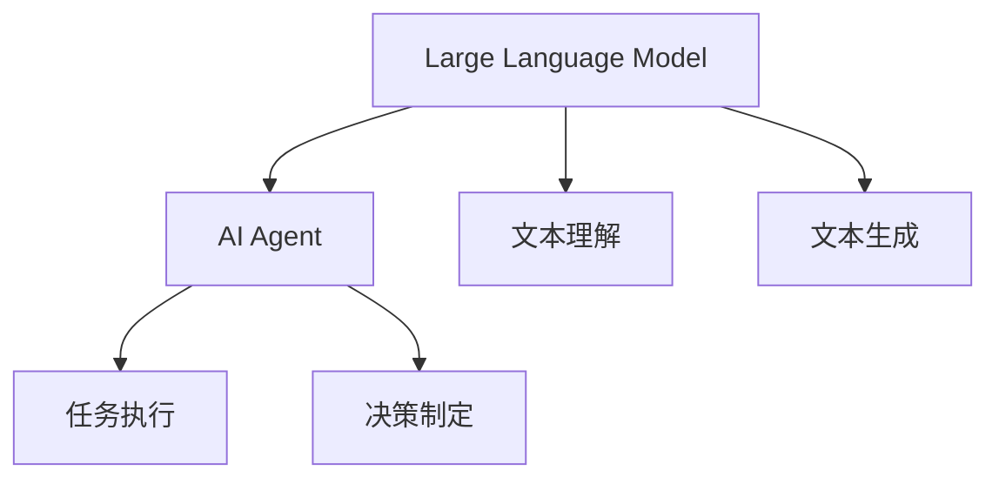
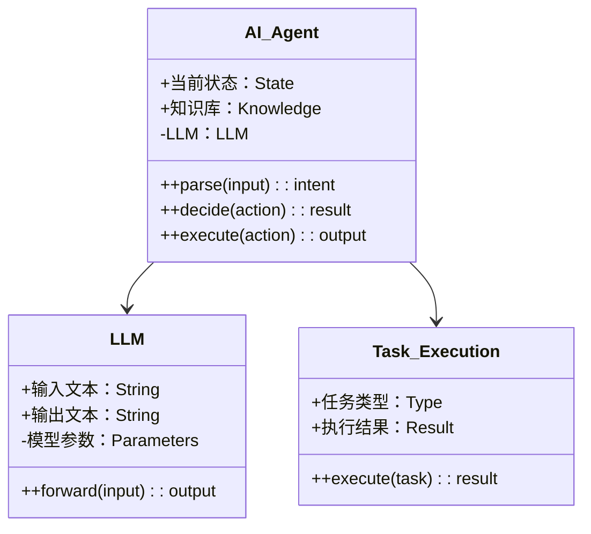
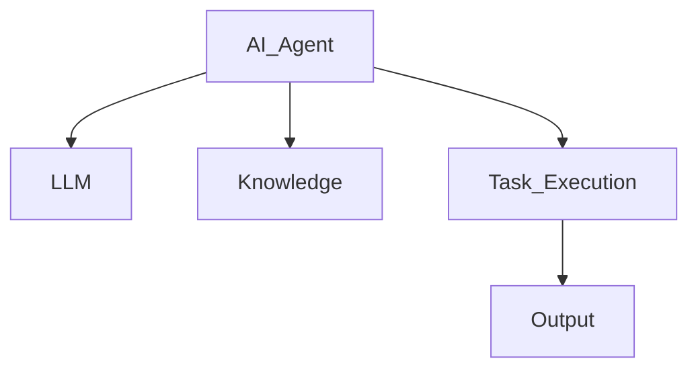

                 


# LLM在AI Agent语言理解深度上的提升

## 关键词：大语言模型，AI Agent，自然语言处理，智能体，深度学习，语言理解

## 摘要：  
随着大语言模型（LLM）的快速发展，AI Agent的语言理解能力得到了显著提升。本文将从背景与基础、核心概念与联系、算法原理、系统分析与架构设计、项目实战以及最佳实践等多个维度，详细探讨LLM在AI Agent语言理解中的应用与提升。通过分析LLM与AI Agent的关系，揭示其协同工作的机制，进而提出优化语言理解能力的具体方法和策略，为相关领域的研究和实践提供参考。

---

# 第一部分: LLM与AI Agent语言理解的背景与基础

# 第1章: LLM与AI Agent概述

## 1.1 大语言模型（LLM）的基本概念

### 1.1.1 什么是大语言模型  
大语言模型（Large Language Model, LLM）是指基于深度学习技术训练的大型神经网络模型，旨在理解和生成人类语言。LLM通过大量的文本数据进行训练，能够执行多种自然语言处理任务，如文本生成、问答、翻译等。

### 1.1.2 LLM的核心特点  
- **大规模数据训练**：LLM通常使用数十亿甚至更多的文本数据进行训练，具备广泛的语言知识。  
- **深度神经网络**：采用Transformer架构，通过多层的自注意力机制捕捉上下文信息。  
- **多任务能力**：LLM可以在不同任务之间共享参数，实现一模型多用。  

### 1.1.3 LLM的应用场景  
- **文本生成**：用于内容创作、代码生成等。  
- **问答系统**：用于智能客服、知识问答等。  
- **机器翻译**：实现多种语言之间的翻译。  

---

## 1.2 AI Agent的基本概念

### 1.2.1 什么是AI Agent  
AI Agent（人工智能代理）是指能够感知环境、自主决策并执行任务的智能实体。AI Agent可以是软件程序，也可以是机器人，其核心能力包括感知、推理、规划和执行。

### 1.2.2 AI Agent的分类  
- **基于规则的AI Agent**：通过预定义的规则进行决策。  
- **基于模型的AI Agent**：利用领域知识进行推理和决策。  
- **基于学习的AI Agent**：通过机器学习模型进行决策和优化。  

### 1.2.3 AI Agent的应用领域  
- **智能家居**：控制家中的设备，提供智能化服务。  
- **自动驾驶**：作为决策核心，控制车辆运行。  
- **智能助手**：如Siri、Alexa等，帮助用户完成日常任务。  

---

## 1.3 LLM在AI Agent中的作用

### 1.3.1 LLM如何提升AI Agent的语言理解能力  
- **上下文理解**：LLM能够理解对话的上下文，帮助AI Agent更好地理解用户意图。  
- **多语言支持**：LLM支持多种语言，使AI Agent能够与全球用户交互。  
- **动态更新**：LLM可以通过持续学习更新知识库，保持语言理解能力的先进性。  

### 1.3.2 LLM与AI Agent的结合方式  
- **直接集成**：将LLM作为AI Agent的核心语言理解模块。  
- **混合架构**：结合规则引擎和LLM，实现灵活性与准确性的平衡。  
- **分布式协作**：多个LLM协同工作，提升AI Agent的综合能力。  

### 1.3.3 LLM在AI Agent中的应用现状  
目前，LLM在AI Agent中的应用主要集中在自然语言理解、对话生成和知识推理等方面。例如，智能客服系统利用LLM进行对话理解和自动回复。

---

## 1.4 本章小结  
本章介绍了大语言模型（LLM）和AI Agent的基本概念，分析了LLM在AI Agent中的作用及其应用现状，为后续章节的深入探讨奠定了基础。

---

# 第2章: LLM与AI Agent的演进

## 2.1 LLM的发展历程

### 2.1.1 从传统NLP到LLM  
传统的自然语言处理（NLP）依赖于规则和特征工程，而LLM通过深度学习实现了端到端的学习，显著提升了语言处理的准确性和灵活性。

### 2.1.2 LLM的里程碑式进展  
- **BERT**：提出了自监督学习的新思路。  
- **GPT系列**：引领了生成式模型的革命。  
- **T5**：统一了多种NLP任务的处理方式。  

### 2.1.3 当前LLM的主要挑战  
- **计算资源消耗大**：训练和推理需要大量的计算资源。  
- **模型可解释性差**：复杂的模型难以解释其决策过程。  
- **伦理与安全问题**：如生成虚假信息、滥用等问题。  

---

## 2.2 AI Agent的发展历程

### 2.2.1 AI Agent的起源  
AI Agent的概念可以追溯到20世纪70年代，早期的研究主要集中在逻辑推理和知识表示上。

### 2.2.2 AI Agent的技术进步  
- **基于规则的AI Agent**：通过预定义规则实现简单任务。  
- **基于模型的AI Agent**：引入领域知识，提升决策的准确性。  
- **基于学习的AI Agent**：利用机器学习模型，实现自适应优化。  

### 2.2.3 当前AI Agent的主要趋势  
- **智能化**：结合深度学习技术，提升感知和决策能力。  
- **人机协作**：与人类协同工作，优化任务执行效率。  
- **实时性**：在实时场景中的应用越来越广泛。  

---

## 2.3 LLM与AI Agent的结合趋势

### 2.3.1 LLM对AI Agent语言理解能力的提升  
- **更强的上下文理解能力**：LLM能够捕捉长文本中的深层信息。  
- **多语言支持**：使AI Agent能够服务于更多语言的用户。  
- **动态更新能力**：通过持续学习，保持语言理解的先进性。  

### 2.3.2 LLM与AI Agent结合的未来方向  
- **更高效的模型优化**：减少计算资源消耗，提升推理速度。  
- **更强大的多模态能力**：结合视觉、听觉等信息，提升理解能力。  
- **更智能的决策机制**：将LLM与强化学习结合，提升决策的准确性。  

### 2.3.3 LLM在AI Agent中的潜在应用场景  
- **智能客服**：通过LLM实现更智能的对话理解和生成。  
- **智能助手**：提供更精准的意图识别和任务执行。  
- **教育辅助**：为学生提供个性化的学习建议。  

---

## 2.4 本章小结  
本章回顾了LLM和AI Agent的发展历程，分析了它们的结合趋势和未来发展方向，为后续章节的深入探讨提供了背景支持。

---

# 第3章: LLM在AI Agent语言理解中的核心问题

## 3.1 语言理解的基本概念

### 3.1.1 什么是语言理解  
语言理解是指计算机能够准确解析人类语言的意思，包括词汇、语法、语义等多个层次。

### 3.1.2 语言理解的层次划分  
- **词汇层**：理解词语的含义和用法。  
- **语法层**：理解句子的结构和语法关系。  
- **语义层**：理解句子的含义和意图。  

### 3.1.3 语言理解的核心挑战  
- **歧义性**：同一个词语或句子可能有多种含义。  
- **上下文依赖**：理解需要依赖上下文信息。  
- **知识依赖**：需要特定领域的知识才能准确理解。  

---

## 3.2 LLM在语言理解中的优势

### 3.2.1 LLM的语言模型优势  
- **大规模预训练**：通过大量数据学习语言规律，具备广泛的知识覆盖。  
- **自注意力机制**：能够捕捉长距离依赖，理解上下文信息。  
- **可扩展性**：支持多种语言和任务，适应不同应用场景。  

### 3.2.2 LLM的上下文理解能力  
LLM通过自注意力机制能够捕捉文本中的关键信息，提升上下文理解的准确性。

### 3.2.3 LLM的可扩展性  
LLM可以通过微调或提示工程技术，快速适应新的任务和领域，具备良好的可扩展性。

---

## 3.3 LLM在AI Agent中的应用问题

### 3.3.1 LLM的计算资源需求  
- **训练成本高**：训练大型LLM需要大量的计算资源和时间。  
- **推理成本高**：在实时应用中，推理可能需要较高的计算资源。  

### 3.3.2 LLM的实时响应能力  
- **延迟问题**：在需要实时响应的场景中，LLM的推理速度可能成为瓶颈。  
- **资源分配问题**：如何在有限的资源下优化LLM的性能。  

### 3.3.3 LLM的可解释性问题  
- **模型黑箱问题**：LLM的决策过程难以解释，影响用户信任。  
- **合规性问题**：在某些行业，可解释性是合规的要求。  

---

## 3.4 本章小结  
本章探讨了LLM在语言理解中的优势和在AI Agent应用中的问题，为后续章节的优化策略提供了参考。

---

# 第4章: LLM与AI Agent的核心概念与联系

## 4.1 LLM与AI Agent的关系

### 4.1.1 LLM作为AI Agent的语言理解核心  
LLM为AI Agent提供了强大的语言理解能力，使其能够准确解析用户的意图和需求。

### 4.1.2 AI Agent作为LLM的应用载体  
AI Agent为LLM提供了一个实际的应用场景，使其能够在复杂的环境中发挥作用。

### 4.1.3 LLM与AI Agent的协同工作模式  
- **感知层**：LLM负责语言的理解和生成。  
- **决策层**：AI Agent基于LLM的理解结果进行决策和规划。  
- **执行层**：AI Agent根据决策结果执行具体的任务。  

---

## 4.2 核心概念对比与分析

### 4.2.1 LLM与传统NLP的对比  
| 特性           | 传统NLP       | LLM         |
|----------------|---------------|-------------|
| 数据量         | 较小          | 极大         |
| 训练方式       | 特征工程      | 深度学习     |
| 任务支持       | 单一任务      | 多任务       |

### 4.2.2 AI Agent与传统AI的区别  
| 特性           | 传统AI        | AI Agent     |
|----------------|---------------|-------------|
| 智能性         | 较低          | 较高         |
| 自主性         | 无            | 有           |
| 适应性         | 较差          | 较好         |

### 4.2.3 LLM与AI Agent的协同关系  
- **目标一致性**：LLM的目标是理解语言，AI Agent的目标是完成任务，二者共同服务于人机交互。  
- **功能互补性**：LLM擅长语言处理，AI Agent擅长任务执行，二者结合实现人机协作。  

---

## 4.3 实体关系图：LLM与AI Agent的协同关系



---

## 4.4 本章小结  
本章分析了LLM与AI Agent的核心概念及其协同关系，为后续章节的算法原理和系统设计提供了理论基础。

---

# 第5章: LLM与AI Agent的核心算法原理

## 5.1 LLM的核心算法：Transformer

### 5.1.1 Transformer的基本结构  
Transformer由编码器和解码器组成，编码器负责将输入序列映射到一个固定长度的向量，解码器负责将该向量解码为输出序列。

### 5.1.2 自注意力机制  
自注意力机制通过计算序列中每一对词之间的相似度，决定每个词在生成下一个词时的重要性。

### 5.1.3 Transformer的数学模型  
编码器的自注意力机制可以表示为：
$$
\text{Attention}(Q, K, V) = \text{softmax}\left(\frac{QK^T}{\sqrt{d_k}}\right)V
$$  
其中，$Q$、$K$、$V$分别是查询、键和值矩阵，$d_k$是键的维度。

---

## 5.2 AI Agent中的决策算法

### 5.2.1 基于规则的决策算法  
通过预定义的规则进行决策，适用于任务简单且规则明确的场景。

### 5.2.2 基于模型的决策算法  
利用领域知识构建模型，通过推理和计算得出决策结果。

### 5.2.3 基于学习的决策算法  
通过机器学习模型（如强化学习）进行决策优化，适用于复杂任务。

---

## 5.3 LLM与AI Agent的协同算法

### 5.3.1 语言理解与决策的结合  
AI Agent通过LLM理解用户意图，结合领域知识进行决策。

### 5.3.2 多模态信息的融合  
将LLM的语言理解能力与其他模态（如视觉、听觉）的信息进行融合，提升整体理解能力。

---

## 5.4 本章小结  
本章介绍了LLM和AI Agent的核心算法，分析了它们的协同关系，为后续章节的系统设计提供了技术基础。

---

# 第6章: LLM与AI Agent的系统架构设计

## 6.1 系统功能设计

### 6.1.1 问题场景介绍  
以智能客服为例，AI Agent需要通过LLM理解用户的问题，并提供准确的解决方案。

### 6.1.2 系统功能模块  
- **语言理解模块**：负责解析用户的意图。  
- **知识库模块**：存储领域知识，辅助决策。  
- **决策模块**：根据理解结果和知识库信息进行决策。  
- **执行模块**：执行具体的任务，如调用API或生成回复。  

---

## 6.2 系统架构设计

### 6.2.1 领域模型类图  


### 6.2.2 系统架构图  


### 6.2.3 系统接口设计  
- **输入接口**：接收用户输入的文本或指令。  
- **输出接口**：生成输出文本或执行结果。  
- **知识库接口**：与知识库进行交互，获取领域知识。  

---

## 6.3 本章小结  
本章详细设计了AI Agent的系统架构，包括功能模块、类图和接口设计，为后续章节的项目实战提供了理论支持。

---

# 第7章: 项目实战——基于LLM的AI Agent开发

## 7.1 环境安装与配置

### 7.1.1 安装Python环境  
使用Anaconda或虚拟环境，确保Python版本为3.8及以上。

### 7.1.2 安装必要的库  
安装PyTorch、Hugging Face Transformers等库：
```bash
pip install torch transformers
```

---

## 7.2 系统核心实现

### 7.2.1 LLM模型的加载与调用  
加载预训练的LLM模型，如GPT-2：
```python
from transformers import GPT2LMHeadModel, GPT2Tokenizer

tokenizer = GPT2Tokenizer.from_pretrained('gpt2')
model = GPT2LMHeadModel.from_pretrained('gpt2')
```

### 7.2.2 AI Agent的实现  
实现一个简单的智能助手：
```python
class AI_Agent:
    def __init__(self, model, tokenizer):
        self.model = model
        self.tokenizer = tokenizer
        self.max_length = 100

    def parse(self, input_text):
        # 使用LLM进行意图理解
        inputs = self.tokenizer(input_text, return_tensors='np')
        outputs = self.model.generate(inputs.input_ids, max_length=self.max_length)
        return self.tokenizer.decode(outputs[0])

    def decide(self, intent):
        # 根据意图进行决策
        pass

    def execute(self, action):
        # 执行具体的任务
        pass
```

---

## 7.3 项目实战与分析

### 7.3.1 实战案例：智能客服系统  
实现一个简单的智能客服系统，能够理解用户的问题并提供解决方案。

### 7.3.2 代码实现与解读  
- **意图理解**：通过LLM解析用户的问题。  
- **知识库查询**：根据意图查询知识库，获取解决方案。  
- **决策与执行**：生成回复并返回给用户。

### 7.3.3 实验分析与优化  
分析模型的准确性和响应时间，优化LLM的参数和推理速度。

---

## 7.4 本章小结  
本章通过一个具体的项目实战，展示了如何基于LLM开发AI Agent，为读者提供了实践指导。

---

# 第8章: 最佳实践与注意事项

## 8.1 最佳实践

### 8.1.1 数据处理与模型优化  
- **数据清洗**：确保训练数据的高质量。  
- **模型压缩**：通过模型剪枝等技术减少模型体积。  
- **推理优化**：优化LLM的推理速度，降低计算资源消耗。  

### 8.1.2 系统设计与实现  
- **模块化设计**：将系统划分为多个模块，便于维护和扩展。  
- **接口标准化**：确保不同模块之间的接口规范统一。  
- **日志与监控**：实时监控系统运行状态，及时发现和解决问题。  

### 8.1.3 安全与伦理问题  
- **数据隐私保护**：确保用户数据的安全性和隐私性。  
- **内容审核**：防止生成虚假或有害信息。  
- **合规性检查**：确保系统符合相关法律法规。  

---

## 8.2 小结

---

## 8.3 注意事项

- **计算资源**：LLM的训练和推理需要大量的计算资源，需提前做好资源规划。  
- **模型可解释性**：在需要解释性任务中，需选择具备较好可解释性的模型。  
- **场景适应性**：根据具体场景选择合适的LLM模型和AI Agent架构。  

---

## 8.4 拓展阅读

- **推荐书籍**：《Deep Learning》、《Transformer in Action》  
- **推荐论文**：《Attention Is All You Need》、《Language Models are Few-Shot Learners》  
- **推荐工具**：Hugging Face Transformers、PyTorch Lightning  

---

# 第9章: 总结与展望

## 9.1 总结  
本文详细探讨了LLM在AI Agent语言理解中的应用与提升，分析了其核心算法和系统架构设计，并通过项目实战展示了如何基于LLM开发AI Agent。LLM的引入显著提升了AI Agent的语言理解能力，为智能化交互提供了强有力的技术支持。

## 9.2 展望  
未来，随着LLM技术的不断进步和AI Agent应用场景的扩展，二者结合将更加紧密。如何进一步优化LLM的性能、提升AI Agent的决策能力，以及解决计算资源和模型可解释性等问题，将是研究者们继续努力的方向。

---

# 结语  
本文从理论到实践，全面探讨了LLM在AI Agent语言理解中的提升，为相关领域的研究和实践提供了参考和指导。希望本文能够激发更多人对这一领域的兴趣，推动技术的进一步发展。

---

