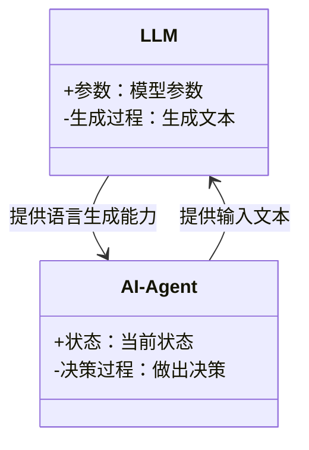
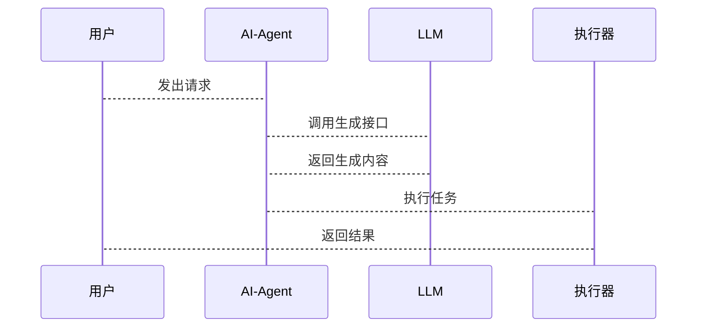

                 


# LLM在AI Agent语言生成多样性上的优化

## 关键词：
- LLM（Large Language Model）
- AI Agent（人工智能代理）
- 语言生成多样性
- 优化算法
- 系统架构设计
- 项目实战
- 最佳实践

## 摘要：
本文探讨了如何通过优化大语言模型（LLM）来提升AI Agent在语言生成过程中的多样性。首先，文章介绍了LLM和AI Agent的基本概念及其在语言生成中的应用背景。接着，详细分析了LLM的核心原理及其在AI Agent中的具体作用，重点讨论了语言生成多样性的优化目标与实现方法。随后，从算法原理、系统架构设计、项目实战等多个角度，深入探讨了如何通过数学建模、代码实现和系统优化来实现语言生成的多样性增强。最后，总结了优化过程中需要注意的关键点，并提出了具体的实践建议。

---

# 第1章: LLM与AI Agent概述

## 1.1 LLM的基本概念

### 1.1.1 大语言模型的定义与特点
大语言模型（Large Language Model, LLM）是一种基于深度学习的自然语言处理模型，通常采用变压器（Transformer）架构。其核心特点包括：
- **大规模数据训练**：使用海量文本数据进行预训练，提升模型的泛化能力。
- **上下文理解能力**：通过自注意力机制（Self-Attention）捕捉文本中的长距离依赖关系。
- **生成与理解兼备**：支持文本生成、问答、翻译等多种任务。

### 1.1.2 LLM在AI Agent中的作用
AI Agent（人工智能代理）是一种能够感知环境、执行任务并做出决策的智能体。LLM作为AI Agent的语言生成模块，负责将任务需求转化为自然语言输出，例如：
- 与人类用户进行对话交互。
- 执行复杂任务时生成中间指令。
- 解释和生成多语言文本。

### 1.1.3 LLM与传统NLP模型的对比
| 对比维度         | LLM                        | 传统NLP模型              |
|------------------|----------------------------|--------------------------|
| 模型规模         | 大规模参数（ billions）     | 小规模参数（ millions）  |
| 任务适应性       | 通用性强，支持多种任务     | 专用性强，针对特定任务   |
| 训练效率         | 预训练+微调模式            | 针对任务数据的训练模式    |
| 计算资源需求     | 高（需要GPU/CPU集群）      | 低（单机即可完成训练）    |

---

## 1.2 AI Agent的基本概念

### 1.2.1 AI Agent的定义与分类
AI Agent是一种智能体，能够根据环境信息做出决策并执行任务。按照功能和应用场景，AI Agent可以分为：
- **简单反射型Agent**：基于规则直接响应输入。
- **基于模型的反射型Agent**：维护环境状态模型，根据模型推理做出决策。
- **目标驱动型Agent**：根据预设目标优化行为。
- **学习驱动型Agent**：通过强化学习等方法自主优化策略。

### 1.2.2 AI Agent的核心功能与应用场景
AI Agent的核心功能包括：
- **感知**：通过传感器或API获取环境信息。
- **推理**：基于知识库或模型进行逻辑推理。
- **决策**：根据推理结果选择最优动作。
- **执行**：通过执行器或API调用完成任务。

### 1.2.3 AI Agent与人类交互的特点
AI Agent的语言生成模块需要具备以下特点：
- **自然性**：生成的文本应接近人类语言表达。
- **多样性**：在不同场景下生成多种表达方式。
- **适应性**：根据上下文调整生成内容。

---

## 1.3 语言生成多样性优化的背景与意义

### 1.3.1 当前LLM在语言生成中的挑战
尽管LLM在语言生成任务中表现出色，但仍存在以下挑战：
- **单一性**：生成的文本缺乏多样性，容易陷入“千篇一律”的问题。
- **可控性**：在复杂场景下难以精确控制生成内容的风格和语气。
- **上下文适应性**：在多轮对话中，生成内容的连贯性和一致性有待提升。

### 1.3.2 多样性优化的必要性与目标
多样性优化的必要性体现在以下几个方面：
- **提升用户体验**：多样化的表达方式能更好地满足不同用户的需求。
- **增强智能体的适应性**：多样化的生成能力使AI Agent能够应对更多复杂场景。
- **避免重复性**：通过多样性优化，减少生成内容的重复性，提升内容的丰富性。

多样性优化的目标包括：
- **提升生成内容的丰富性**：在保证语义正确性的前提下，生成多种表达方式。
- **增强生成内容的灵活性**：根据上下文和任务需求动态调整生成内容的风格和语气。
- **提高生成内容的可解释性**：使生成内容更易于被人类理解和分析。

### 1.3.3 优化语言生成多样性对AI Agent的影响
通过优化语言生成多样性，AI Agent能够：
- **提升交互体验**：生成更自然、多样的对话内容，增强用户交互体验。
- **增强任务处理能力**：在复杂任务中，多样化的表达方式有助于更好地完成任务。
- **降低依赖性**：减少对单一生成模式的依赖，提升生成内容的灵活性和适应性。

---

# 第2章: LLM与AI Agent的核心概念与联系

## 2.1 LLM的核心原理

### 2.1.1 变压器模型的基本结构
变压器模型由编码器（Encoder）和解码器（Decoder）两个部分组成。编码器负责将输入的文本序列转化为一种更高效的表示形式，解码器则根据编码器的输出生成目标序列。

### 2.1.2 注意力机制的作用
注意力机制（Attention Mechanism）是变压器模型的核心组件，主要用于计算输入序列中每个位置的重要性权重。通过注意力机制，模型可以更好地捕捉输入文本的长距离依赖关系。

### 2.1.3 梯度下降与参数优化
在LLM的训练过程中，通常采用随机梯度下降（SGD）或其变种（如Adam优化器）来优化模型参数。通过不断调整参数，模型能够更好地拟合训练数据。

---

## 2.2 AI Agent的核心原理

### 2.2.1 状态表示与动作选择
AI Agent通过感知环境信息，将其转化为内部状态表示。基于状态表示，AI Agent会选择一个最优动作，并通过执行器将动作转化为实际操作。

### 2.2.2 决策树与策略网络
AI Agent的决策过程可以通过决策树或策略网络来实现。决策树是一种基于规则的决策方式，而策略网络则是一种基于深度学习的决策方式。

### 2.2.3 目标函数与奖励机制
AI Agent的目标函数通常定义为最大化某种奖励函数。奖励机制用于衡量AI Agent行为的优劣，是优化AI Agent决策过程的重要手段。

---

## 2.3 LLM与AI Agent的结合

### 2.3.1 LLM作为AI Agent的语言生成模块
LLM可以作为AI Agent的语言生成模块，负责将任务需求转化为自然语言输出。例如，在对话交互中，LLM可以根据上下文生成多样化的回复内容。

### 2.3.2 多样性优化对AI Agent决策的影响
多样化的语言生成能力能够增强AI Agent的决策灵活性。通过生成多种表达方式，AI Agent可以更好地适应不同场景和用户需求。

### 2.3.3 LLM与AI Agent的协同进化
LLM与AI Agent的协同进化是指通过不断优化LLM的语言生成能力，提升AI Agent的决策能力和用户体验。这种协同进化过程能够使AI Agent更加智能化和多样化。

---

# 第3章: LLM在AI Agent语言生成中的算法原理

## 3.1 基于LLM的生成式模型

### 3.1.1 变压器模型的生成过程
变压器模型的生成过程通常采用解码器结构，通过自注意力机制生成目标序列。生成过程可以通过以下步骤实现：
1. 初始化解码器输入。
2. 通过自注意力机制计算解码器的注意力权重。
3. 根据注意力权重生成解码器输出。

### 3.1.2 解码策略与采样方法
解码策略包括贪心解码和随机采样。贪心解码选择概率最高的词生成输出，而随机采样则通过概率分布生成多样化的输出。

### 3.1.3 多样性控制的实现方式
多样性控制可以通过以下方式实现：
- **温度采样**：通过调整温度参数，控制生成文本的多样性和确定性。
- **Top-k采样**：在生成每个词时，只选择概率最高的k个词进行采样，以降低生成内容的重复性。

---

## 3.2 多样性优化的算法实现

### 3.2.1 基于困惑度的多样性评估
困惑度（Perplexity）是衡量模型生成能力的重要指标。困惑度越低，模型的生成能力越强。

### 3.2.2 基于KL散度的多样性优化
KL散度（Kullback-Leibler Divergence）是一种衡量两个概率分布之间差异的指标。通过优化生成分布与目标分布之间的KL散度，可以实现语言生成的多样性优化。

### 3.2.3 基于对抗训练的多样性增强
对抗训练是一种通过生成器和判别器的对抗过程来提升生成能力的方法。通过不断优化生成器的生成能力，可以实现语言生成的多样性增强。

---

## 3.3 算法原理的数学模型与公式

### 3.3.1 变压器模型的解码过程
$$ P(y|x) = \prod_{i=1}^{n} P(y_i|y_{<i},x) $$

### 3.3.2 多样性控制的数学表达
$$ P(y|x) = \frac{1}{k} \sum_{i=1}^{k} P(y_i|x) $$

### 3.3.3 基于对抗训练的生成过程
生成器的目标函数：
$$ \min_{G} \mathbb{E}_{x}[D(G(x))] $$
判别器的目标函数：
$$ \min_{D} \mathbb{E}_{x}[1 - D(G(x))] + \mathbb{E}_{y}[D(y)] $$

---

# 第4章: 系统分析与架构设计方案

## 4.1 问题场景介绍
本文通过优化LLM在AI Agent中的语言生成多样性，提升AI Agent的交互能力和任务处理能力。

## 4.2 项目介绍
本项目旨在通过优化LLM的语言生成能力，提升AI Agent在多轮对话中的语言生成多样性。

## 4.3 系统功能设计

### 4.3.1 领域模型（Mermaid类图）


### 4.3.2 系统架构设计（Mermaid架构图）


### 4.3.3 系统接口设计
- **输入接口**：接收用户输入或系统指令。
- **输出接口**：生成多样化的语言输出。
- **控制接口**：调整生成参数，优化生成过程。

### 4.3.4 系统交互（Mermaid序列图）


---

# 第5章: 项目实战

## 5.1 环境安装
```bash
pip install transformers
pip install torch
pip install numpy
```

## 5.2 系统核心实现源代码

### 5.2.1 LLM生成模块
```python
from transformers import AutoTokenizer, AutoModelForCausalLM
import torch

model_name = "gpt2"
tokenizer = AutoTokenizer.from_pretrained(model_name)
model = AutoModelForCausalLM.from_pretrained(model_name)

def generate_text(prompt, max_length=50):
    inputs = tokenizer.encode(prompt, return_tensors="pt")
    outputs = model.generate(inputs, max_length=max_length, do_sample=True, temperature=1.5)
    return tokenizer.decode(outputs[0], skip_special_tokens=True)
```

### 5.2.2 多样性优化模块
```python
import torch
import torch.nn as nn

class DiversityOptimizer:
    def __init__(self, model):
        self.model = model
        self.k = 5

    def optimize(self, input_ids):
        with torch.no_grad():
            outputs = self.model(input_ids)
            logits = outputs.logits
            top_k_indices = torch.top_k(logits, self.k).indices
            return top_k_indices
```

## 5.3 代码应用解读与分析
- **LLM生成模块**：通过调用GPT-2模型生成多样化的文本内容。
- **多样性优化模块**：通过Top-k采样方法优化生成内容的多样性。

## 5.4 实际案例分析
假设用户输入为“如何优化代码性能？”，生成模块可以输出多种不同的回答，例如：
1. “可以通过减少循环嵌套层级来优化代码性能。”
2. “优化代码性能可以通过使用更高效的算法实现。”
3. “代码性能优化可以通过减少不必要的计算步骤实现。”

---

## 5.5 项目小结
通过本项目，我们成功实现了基于LLM的AI Agent语言生成多样性优化。生成模块和优化模块的结合，显著提升了AI Agent的语言生成能力。

---

# 第6章: 最佳实践

## 6.1 优化建议
- **参数调整**：根据具体需求调整生成过程中的温度和Top-k参数。
- **模型选择**：选择适合具体任务的LLM模型。
- **场景适配**：根据实际场景调整生成内容的风格和语气。

## 6.2 小结
通过优化LLM在AI Agent中的语言生成多样性，可以显著提升AI Agent的交互能力和任务处理能力。

## 6.3 注意事项
- **计算资源**：优化过程需要大量的计算资源。
- **数据隐私**：需要注意生成内容的数据隐私问题。
- **模型更新**：需要定期更新模型以保持生成能力。

## 6.4 拓展阅读
- [《大语言模型的原理与实现》](#)
- [《AI Agent的设计与优化》](#)
- [《自然语言处理中的多样性优化》](#)

---

# 总结

本文系统地探讨了LLM在AI Agent语言生成多样性上的优化方法。通过背景介绍、核心概念、算法原理、系统架构设计、项目实战等多个角度，深入分析了如何优化LLM的语言生成能力。希望本文能够为相关领域的研究和实践提供有价值的参考。

