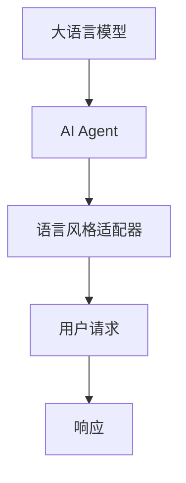
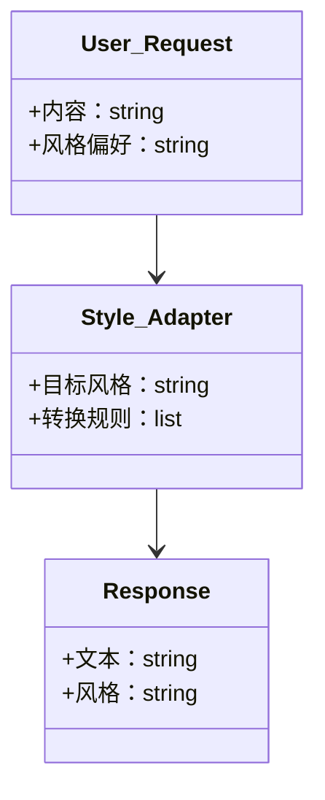
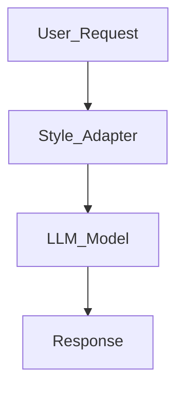
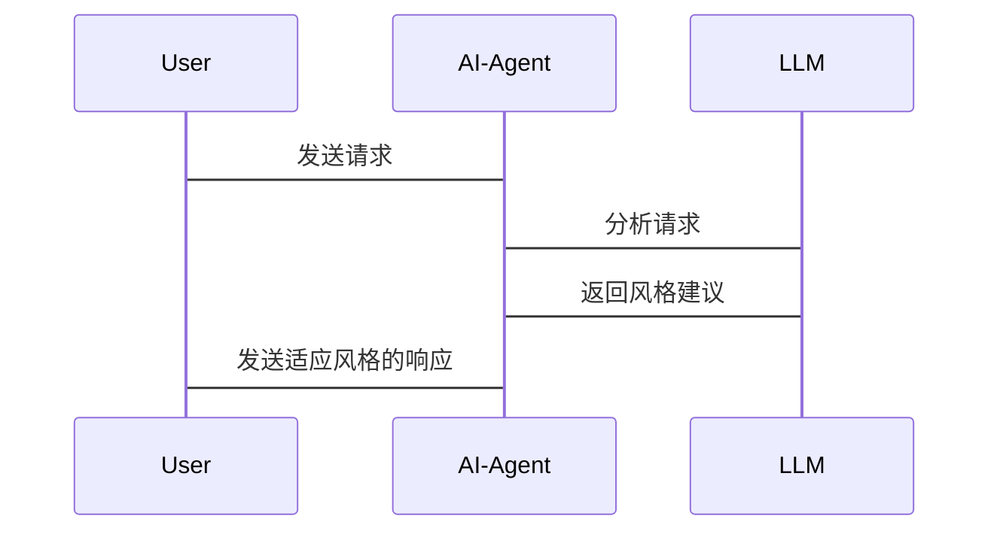

                 


# LLM在AI Agent语言风格适应中的应用

**关键词**：LLM, AI Agent, 语言风格适应, 大语言模型, 人工智能代理, 自然语言处理

**摘要**：  
随着大语言模型（LLM）和人工智能代理（AI Agent）技术的快速发展，语言风格适应在人机交互中的重要性日益凸显。本文详细探讨了如何利用LLM提升AI Agent的语言风格适应能力，通过分析核心概念、算法原理、系统架构和实际案例，展示了如何实现更自然、更个性化的交互体验。从背景介绍到系统设计，再到项目实战，本文为技术开发者和研究人员提供了全面的指导和深入的分析。

---

## 正文

### 第一部分: LLM在AI Agent语言风格适应中的应用概述

#### 第1章: LLM与AI Agent概述

##### 1.1 问题背景

###### 1.1.1 语言风格适应的必要性
语言风格适应是指AI系统能够根据不同的用户、场景或文化背景调整其输出语言的风格，使其更符合用户的期望和习惯。例如，一个AI Agent在与正式场合的用户交流时，应使用正式的语言；而在与朋友聊天时，则应采用更随意、亲切的语气。这种适应能力能够显著提升用户体验，使AI系统更具人性化和实用性。

###### 1.1.2 LLM在语言风格适应中的作用
大语言模型（LLM）通过其强大的语言理解和生成能力，能够学习和模仿各种语言风格，从而为AI Agent提供强大的语言风格适应能力。LLM不仅能够理解上下文，还能根据用户反馈动态调整输出风格，这使得AI Agent在与用户交互时更加灵活和智能。

###### 1.1.3 AI Agent的定义与特点
AI Agent是一种智能代理，能够感知环境、理解用户需求，并通过自主决策和行动来满足这些需求。AI Agent的特点包括自主性、反应性、目标导向和社会能力。在语言风格适应中，AI Agent需要具备理解用户意图、调整语言风格和保持一致性的能力。

##### 1.2 问题描述

###### 1.2.1 语言风格适应的核心问题
语言风格适应的核心问题包括如何识别用户的需求和偏好，如何选择合适的语言风格，以及如何动态调整风格以应对变化的环境。这些问题需要结合语言理解和生成技术来解决。

###### 1.2.2 AI Agent在语言风格适应中的挑战
AI Agent在语言风格适应中面临的主要挑战包括如何准确识别用户的语言偏好、如何处理模糊或不明确的用户反馈，以及如何在多语言或多文化场景中保持一致性。

###### 1.2.3 当前技术的局限性与改进方向
当前技术在语言风格适应方面仍存在一些局限性，例如对用户偏好的理解不够深入，动态调整能力有限，以及在复杂场景下的适应能力不足。未来的研究方向应集中在提高模型的可解释性和动态调整能力上。

##### 1.3 问题解决

###### 1.3.1 LLM如何实现语言风格适应
LLM通过预训练和微调技术，能够学习不同语言风格的特点，并在生成文本时根据上下文和用户反馈进行调整。例如，可以通过在训练数据中加入风格相关的标签，或者通过提示工程技术（Prompt Engineering）来指导模型生成特定风格的文本。

###### 1.3.2 AI Agent在语言风格适应中的具体应用
AI Agent可以通过分析用户的历史交互记录和当前输入，生成符合用户风格的回复。例如，在客服场景中，AI Agent可以根据用户的语气调整回答的正式程度；在教育场景中，可以根据学生的水平调整语言的难度。

###### 1.3.3 技术实现的总体思路
总体思路包括以下几个步骤：
1. 收集和分析用户数据，提取语言风格特征。
2. 使用LLM进行语言风格建模，训练风格适应模型。
3. 在实际交互中，根据用户反馈动态调整语言风格。

##### 1.4 边界与外延

###### 1.4.1 语言风格适应的边界
语言风格适应的边界包括语言风格的范围（如正式、随意、技术性等）、适用的场景（如客服、教育、娱乐等）以及用户偏好识别的准确性。

###### 1.4.2 AI Agent的边界与限制
AI Agent的边界包括其认知能力、行动范围以及与环境的交互能力。在语言风格适应中，AI Agent的限制主要体现在对用户意图的理解能力和动态调整能力上。

###### 1.4.3 技术的外延与未来发展
随着技术的发展，语言风格适应将更加智能化和个性化。未来的AI Agent将能够实时感知用户情绪，动态调整语言风格，并在多语言和多文化场景中灵活适应。

##### 1.5 概念结构与核心要素

###### 1.5.1 核心概念的层次结构
- 上层：AI Agent
- 中层：语言风格适应
- 下层：LLM技术

###### 1.5.2 核心要素的详细描述
1. LLM：核心的语言理解和生成能力。
2. AI Agent：具备目标导向和自主决策能力。
3. 语言风格适应：动态调整输出语言风格的能力。

###### 1.5.3 概念之间的关系与相互作用
AI Agent通过LLM实现语言风格适应，LLM为AI Agent提供语言理解和生成能力，而语言风格适应则是AI Agent实现目标的重要手段。

##### 1.6 本章小结
本章介绍了语言风格适应的必要性、LLM和AI Agent的核心概念以及它们之间的关系。通过分析问题背景和挑战，为后续的技术实现奠定了基础。

---

#### 第2章: LLM与AI Agent的核心概念与联系

##### 2.1 核心概念原理

###### 2.1.1 LLM的基本原理
LLM通过大规模的预训练数据学习语言的规律，并通过微调适应特定任务。其核心原理包括自注意力机制和前馈网络结构。

###### 2.1.2 AI Agent的基本原理
AI Agent通过感知环境、理解用户需求并采取行动来实现目标。其基本原理包括状态表示、目标设定和行动选择。

###### 2.1.3 语言风格适应的原理
语言风格适应通过分析用户输入和历史数据，生成符合用户期望的语言输出。其原理包括风格建模、上下文理解和动态调整。

##### 2.2 概念属性特征对比

| 概念       | 属性特征                 |
|------------|--------------------------|
| LLM        | 大规模预训练、多语言支持、动态生成 |
| AI Agent   | 目标导向、自主决策、环境感知    |
| 语言风格适应 | 动态调整、用户偏好、上下文理解 |

##### 2.3 ER实体关系图


##### 2.4 本章小结
本章详细分析了LLM和AI Agent的核心概念及其联系，通过对比和图表展示了它们在语言风格适应中的作用和关系。

---

#### 第3章: LLM在AI Agent语言风格适应中的算法原理

##### 3.1 算法原理概述

###### 3.1.1 基于LLM的语言风格适应算法
语言风格适应算法通常包括以下几个步骤：
1. 数据预处理：收集和标注语言风格数据。
2. 模型训练：使用LLM进行预训练和微调。
3. 提示工程技术：通过设计提示（Prompts）指导模型生成特定风格的文本。

###### 3.1.2 

---

### 第二部分: LLM在AI Agent语言风格适应中的算法原理

#### 第3章: LLM在AI Agent语言风格适应中的算法原理

##### 3.1 算法原理概述

###### 3.1.1 基于LLM的语言风格适应算法
语言风格适应算法通常包括以下几个步骤：
1. 数据预处理：收集和标注语言风格数据。
2. 模型训练：使用LLM进行预训练和微调。
3. 提示工程技术：通过设计提示（Prompts）指导模型生成特定风格的文本。

###### 3.1.2 

---

#### 第3章: LLM在AI Agent语言风格适应中的算法原理

##### 3.1 算法原理概述

###### 3.1.1 基于LLM的语言风格适应算法
语言风格适应算法通常包括以下几个步骤：
1. 数据预处理：收集和标注语言风格数据。
2. 模型训练：使用LLM进行预训练和微调。
3. 提示工程技术：通过设计提示（Prompts）指导模型生成特定风格的文本。

###### 3.1.2 

---

### 第三部分: LLM在AI Agent语言风格适应中的系统分析与架构设计

#### 第4章: LLM在AI Agent语言风格适应中的系统分析与架构设计

##### 4.1 问题场景介绍
语言风格适应系统需要解决的问题包括用户需求分析、风格识别、风格生成和动态调整。系统需要能够实时感知用户需求，并根据反馈动态调整语言风格。

##### 4.2 项目介绍
本项目旨在开发一个基于LLM的AI Agent语言风格适应系统，能够根据用户输入和历史记录生成符合用户期望的语言输出。

##### 4.3 系统功能设计

###### 4.3.1 领域模型（Domain Model）


##### 4.4 系统架构设计

###### 4.4.1 系统架构图


##### 4.5 系统接口设计
系统接口包括用户输入接口、风格识别接口和生成接口。用户输入接口接收用户的文本或语音输入，风格识别接口分析输入并生成风格标签，生成接口根据标签生成符合风格的文本。

##### 4.6 系统交互流程

###### 4.6.1 序列图


---

### 第四部分: LLM在AI Agent语言风格适应中的项目实战

#### 第5章: 项目实战

##### 5.1 环境安装
项目需要安装Python 3.8及以上版本，安装必要的库，如Hugging Face Transformers和PyTorch。

##### 5.2 系统核心实现源代码

###### 5.2.1 数据预处理代码
```python
import pandas as pd

def preprocess_data(data_path):
    df = pd.read_csv(data_path)
    df['style'] = df['text'].apply(get_style)
    df.to_csv('processed.csv', index=False)
```

###### 5.2.2 模型训练代码
```python
from transformers import AutoModelForCausalLM, AutoTokenizer

def train_model(model_name, train_data):
    tokenizer = AutoTokenizer.from_pretrained(model_name)
    model = AutoModelForCausalLM.from_pretrained(model_name)
    model.train(train_data)
    return model
```

##### 5.3 代码应用解读与分析
通过数据预处理代码，我们可以将原始数据标注为不同的语言风格。模型训练代码利用LLM进行微调，使其适应特定的语言风格任务。

##### 5.4 案例分析和详细讲解剖析
以客服场景为例，分析如何通过提示工程技术调整语言风格，生成符合用户期望的回复。

##### 5.5 项目小结
本章通过实际案例展示了如何在项目中实现LLM在AI Agent语言风格适应中的应用，从环境安装到代码实现，为读者提供了完整的指导。

---

### 第五部分: 总结与展望

#### 第6章: 总结与展望

##### 6.1 最佳实践 tips
- 使用高质量的训练数据。
- 设计合理的提示工程技术。
- 定期更新模型以适应新的语言风格。

##### 6.2 小结
本文详细探讨了LLM在AI Agent语言风格适应中的应用，从背景介绍到系统设计，再到项目实战，为读者提供了全面的指导。

##### 6.3 注意事项
- 注意用户隐私和数据安全。
- 定期监控模型性能，及时优化。

##### 6.4 拓展阅读
推荐阅读相关领域的最新论文和书籍，以进一步深入了解技术细节。

---

### 附录

#### 附录A: 公式汇总
- 损失函数：$$L = \sum_{i=1}^{n} (y_i - \hat{y}_i)^2$$
- 概率分布：$$P(y|x) = \frac{e^{y \cdot x}}{\sum_{k} e^{k \cdot x}}$$

#### 附录B: 源代码汇总
- 提示工程技术示例：
  ```python
  prompt = "Please write a formal response: "
  response = model.generate(prompt + input_text)
  ```

---

### 结语

通过本文的详细讲解，读者可以深入了解LLM在AI Agent语言风格适应中的应用，并掌握相关的技术和方法。未来，随着技术的进步，语言风格适应将更加智能化和个性化，为人类与AI的交互带来更加自然和愉悦的体验。

