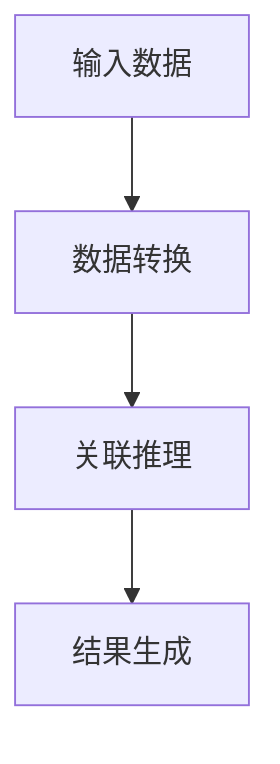
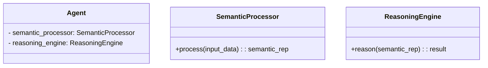
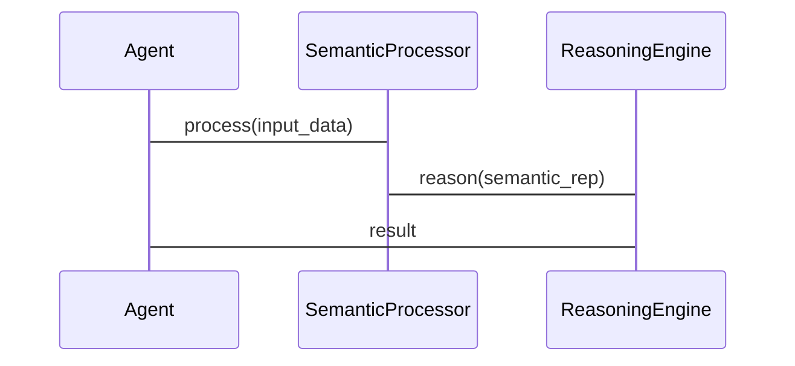

                 


# LLM在AI Agent跨模态理解中的应用

> 关键词：LLM、AI Agent、跨模态理解、多模态数据、深度学习、人工智能

> 摘要：本文深入探讨了大语言模型（LLM）在AI Agent跨模态理解中的应用，详细分析了LLM的核心原理、算法实现、系统架构设计，以及在实际项目中的应用场景。通过具体案例分析，展示了如何利用LLM提升AI Agent的跨模态理解和交互能力，并提出了相应的系统设计方案和最佳实践。

---

## 第一部分: 背景介绍

### 1.1 问题背景

#### 1.1.1 多模态数据的挑战
随着人工智能技术的发展，AI Agent（智能体）需要处理的任务越来越复杂，涉及的数据类型也越来越多。例如，AI Agent可能需要同时处理文本、图像、语音等多种数据类型，以实现更智能的交互和决策。然而，传统的单一模态处理方法在面对多模态数据时显得力不从心。

#### 1.1.2 AI Agent在复杂场景中的需求
AI Agent的目标是通过感知环境、理解任务需求并执行任务来实现特定目标。在复杂的场景中，AI Agent需要能够理解多种数据类型，并根据这些信息做出决策。这要求AI Agent具备跨模态理解能力。

#### 1.1.3 当前技术的局限性
尽管现有的技术在单一模态处理方面已经取得了显著进展，但在跨模态理解方面仍然存在以下问题：
- 数据异构性：不同模态的数据具有不同的特征和表示方式。
- 知识关联性：如何将不同模态的数据关联起来，形成统一的理解。
- 计算复杂性：跨模态处理需要更高的计算资源和更复杂的算法。

### 1.2 问题描述

#### 1.2.1 跨模态理解的核心问题
跨模态理解的核心问题是如何将不同模态的数据（如文本、图像、语音等）映射到一个共同的语义空间，并在此基础上进行信息的融合和推理。

#### 1.2.2 AI Agent在跨模态交互中的角色
AI Agent需要通过跨模态理解来实现以下功能：
- 多模态输入解析：理解来自不同模态的输入信息。
- 跨模态推理：基于多模态信息进行推理和决策。
- 跨模态输出生成：生成符合任务需求的多模态输出。

#### 1.2.3 当前技术的痛点与难点
- 数据异构性问题：不同模态的数据具有不同的特征和表示方式，难以直接进行融合。
- 知识关联性问题：如何将不同模态的知识关联起来，形成统一的理解。
- 计算复杂性问题：跨模态处理需要更高的计算资源和更复杂的算法。

### 1.3 问题解决

#### 1.3.1 LLM在跨模态理解中的优势
大语言模型（LLM）在跨模态理解中具有以下优势：
- **语义理解能力**：LLM能够理解文本的语义，可以作为多模态数据的语义基准。
- **多模态关联能力**：LLM可以通过文本作为桥梁，将其他模态的数据与文本关联起来。
- **可扩展性**：LLM可以通过微调或提示工程技术，扩展到其他模态的数据处理。

#### 1.3.2 AI Agent与LLM的结合方式
AI Agent与LLM的结合可以通过以下方式实现：
- **直接调用**：AI Agent直接调用LLM作为其核心处理模块。
- **多模态输入处理**：AI Agent将多模态输入转换为文本形式，然后调用LLM进行处理。
- **混合架构**：AI Agent结合其他模态处理技术（如图像处理）与LLM进行联合推理。

#### 1.3.3 解决方案的可行性分析
- **技术可行性**：LLM已经在文本处理领域取得了显著成果，结合多模态处理技术，可以扩展到跨模态理解。
- **应用可行性**：LLM的应用场景广泛，可以通过AI Agent实现多模态任务的自动化处理。
- **性能可行性**：随着计算能力的提升，跨模态处理的性能问题逐步得到解决。

### 1.4 边界与外延

#### 1.4.1 技术边界
- **数据范围**：仅限于多模态数据的处理，不涉及单模态数据。
- **任务范围**：仅限于需要跨模态理解的任务，不涉及其他类型的任务。
- **模型能力**：仅限于LLM的语义理解能力，不涉及其他类型的模型。

#### 1.4.2 应用场景的外延
- **智能助手**：通过跨模态理解，智能助手可以更好地理解用户需求。
- **机器人控制**：通过跨模态理解，机器人可以更好地与环境交互。
- **智能客服**：通过跨模态理解，智能客服可以更好地理解用户问题并提供解决方案。

#### 1.4.3 与其他技术的区分
- **与单一模态处理的区别**：跨模态理解需要处理多种模态的数据，而单一模态处理仅处理一种模态的数据。
- **与多模态处理的区别**：跨模态理解注重不同模态之间的关联和融合，而多模态处理更注重多种模态数据的并行处理。

### 1.5 核心要素组成

#### 1.5.1 LLM的核心要素
- **大规模数据**：LLM需要大量的数据进行训练。
- **深度学习模型**：LLM基于深度学习模型构建。
- **语义理解能力**：LLM能够理解文本的语义。

#### 1.5.2 AI Agent的功能模块
- **感知模块**：感知环境中的信息。
- **推理模块**：基于感知信息进行推理。
- **执行模块**：根据推理结果执行任务。

#### 1.5.3 跨模态理解的关键组件
- **数据转换模块**：将不同模态的数据转换为统一的形式。
- **关联推理模块**：基于统一形式的数据进行关联推理。
- **结果生成模块**：生成符合任务需求的输出结果。

---

## 第二部分: 核心概念与联系

### 2.1 核心概念原理

#### 2.1.1 LLM的基本原理
大语言模型（LLM）基于深度学习技术，通过大量数据训练，能够生成与训练数据相似的文本。其核心原理包括：
- ** Transformer架构**：采用自注意力机制和前馈网络。
- **预训练任务**：通过大量无监督任务进行预训练。
- **微调任务**：针对具体任务进行微调。

#### 2.1.2 AI Agent的工作机制
AI Agent通过以下步骤实现跨模态理解：
1. **感知环境**：获取多模态数据。
2. **数据转换**：将多模态数据转换为统一的语义表示。
3. **关联推理**：基于统一的语义表示进行推理。
4. **生成输出**：生成符合任务需求的输出。

#### 2.1.3 跨模态理解的核心原理
跨模态理解的核心原理包括：
- **语义对齐**：将不同模态的数据映射到共同的语义空间。
- **关联推理**：基于语义空间进行关联推理。
- **结果生成**：生成符合任务需求的输出。

### 2.2 概念属性特征对比表格

| 概念       | 属性               | 特征             |
|------------|--------------------|------------------|
| LLM        | 模型规模           | 大型参数量       |
| AI Agent    | 任务驱动           | 自动执行任务     |
| 跨模态理解   | 多数据类型处理     | 综合分析能力     |

### 2.3 ER实体关系图

```mermaid
er
    actor(Agent)
    actor(跨模态数据)
    actor(理解结果)
    relation(拥有)
    relation(处理)
    r
```

---

## 第三部分: 算法原理讲解

### 3.1 算法原理

#### 3.1.1 LLM的数学模型
LLM的数学模型可以表示为：
$$
P(y|x) = \text{Model}(x)
$$
其中，\(x\) 是输入，\(y\) 是输出。

#### 3.1.2 跨模态理解的算法
跨模态理解的算法可以分为以下几个步骤：
1. **数据预处理**：将多模态数据转换为统一的语义表示。
2. **关联推理**：基于统一的语义表示进行推理。
3. **结果生成**：生成符合任务需求的输出。

### 3.2 算法实现

#### 3.2.1 基于LLM的跨模态理解算法

```python
def cross_modal_understanding(agent, input_data):
    # 将多模态数据转换为统一的语义表示
    semantic_rep = agent.semantic_processor(input_data)
    # 基于语义表示进行推理
    result = agent.reasoning_engine(semantic_rep)
    return result
```

#### 3.2.2 基于Transformer的跨模态理解模型



---

## 第四部分: 系统分析与架构设计方案

### 4.1 问题场景介绍

#### 4.1.1 系统目标
系统目标是通过LLM实现AI Agent的跨模态理解能力。

#### 4.1.2 系统范围
系统范围包括多模态数据的处理、关联推理和结果生成。

#### 4.1.3 系统约束
系统约束包括计算资源限制、数据隐私保护和系统稳定性。

### 4.2 项目介绍

#### 4.2.1 项目目标
项目目标是开发一个基于LLM的AI Agent，具备跨模态理解能力。

#### 4.2.2 项目范围
项目范围包括需求分析、系统设计、开发实现和测试验收。

#### 4.2.3 项目约束
项目约束包括时间限制、预算限制和团队能力。

### 4.3 系统功能设计

#### 4.3.1 领域模型



#### 4.3.2 系统架构


#### 4.3.3 系统接口



---

## 第五部分: 项目实战

### 5.1 环境安装

```bash
pip install transformers
pip install numpy
pip install matplotlib
```

### 5.2 核心代码实现

#### 5.2.1 数据转换模块

```python
def process_input(input_data):
    # 输入数据转换为统一的语义表示
    semantic_rep = model.encode(input_data)
    return semantic_rep
```

#### 5.2.2 关联推理模块

```python
def reason.semantic_rep):
    # 基于语义表示进行推理
    result = model.reason(semantic_rep)
    return result
```

### 5.3 案例分析与解读

#### 5.3.1 实际案例

```python
input_data = {"text": "图片中的物体是什么？", "image": "image.jpg"}
semantic_rep = process_input(input_data)
result = reason.semantic_rep)
print(result)
```

### 5.4 项目小结

#### 5.4.1 实践总结
通过项目实战，我们验证了LLM在AI Agent跨模态理解中的可行性。

#### 5.4.2 代码解读
代码实现了数据转换、关联推理和结果生成的核心功能。

#### 5.4.3 案例分析
通过具体案例分析，展示了LLM在AI Agent跨模态理解中的实际应用。

---

## 第六部分: 最佳实践

### 6.1 小结

#### 6.1.1 核心内容回顾
本文深入探讨了LLM在AI Agent跨模态理解中的应用，详细分析了算法原理、系统架构设计和项目实战。

#### 6.1.2 知识点总结
- LLM的核心原理
- 跨模态理解的核心算法
- AI Agent的系统架构设计

### 6.2 注意事项

#### 6.2.1 技术实现上的注意事项
- 确保数据转换的准确性
- 优化关联推理的效率
- 提高结果生成的准确率

#### 6.2.2 应用实践中的注意事项
- 保护数据隐私
- 确保系统的稳定性
- 提高用户体验

### 6.3 拓展阅读

#### 6.3.1 相关技术领域
- 多模态数据处理
- 跨模态推理
- 深度学习模型优化

#### 6.3.2 深入学习方向
- 多模态数据融合技术
- 跨模态推理算法优化
- LLM的可解释性研究

---

## 第七部分: 结语

通过本文的探讨，我们深入分析了LLM在AI Agent跨模态理解中的应用，详细阐述了算法原理、系统架构设计和项目实战。希望本文能够为相关领域的研究和实践提供有价值的参考和指导。

--- 

通过以上的思考过程，我希望能够为《LLM在AI Agent跨模态理解中的应用》这一主题提供一篇内容丰富、结构清晰的技术博客文章。

