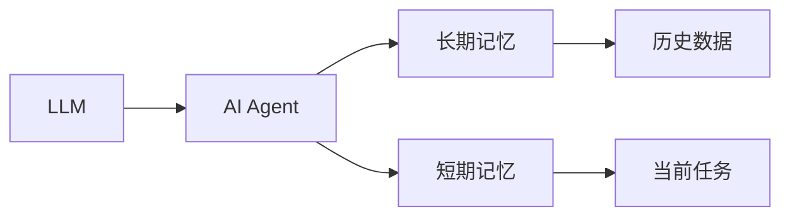
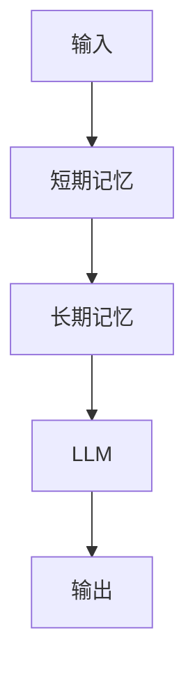
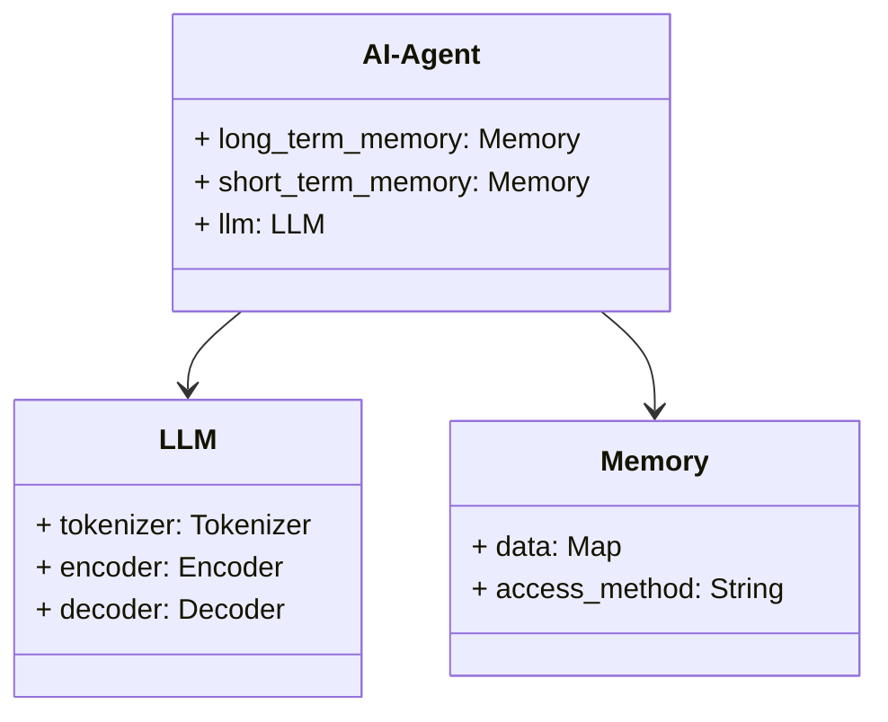
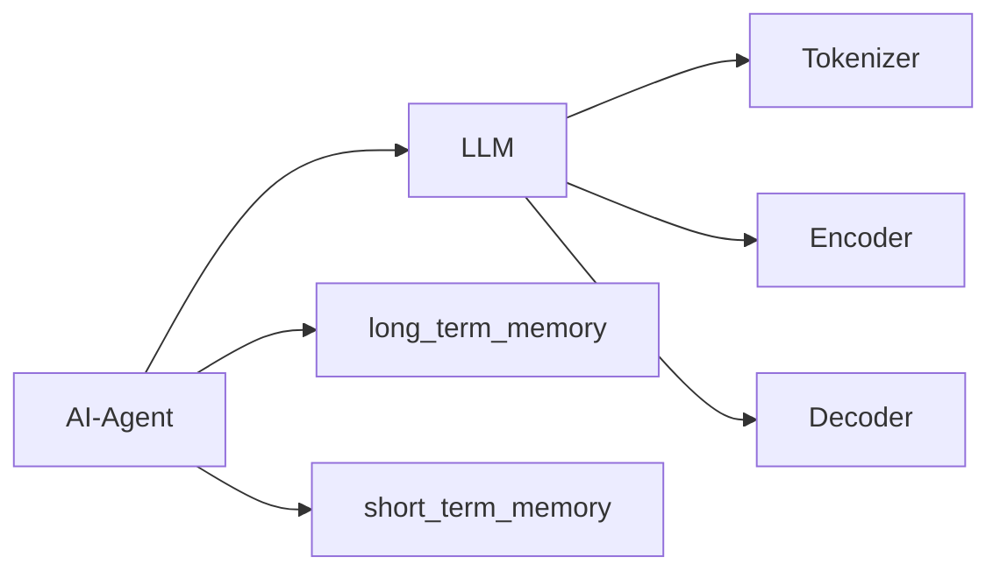
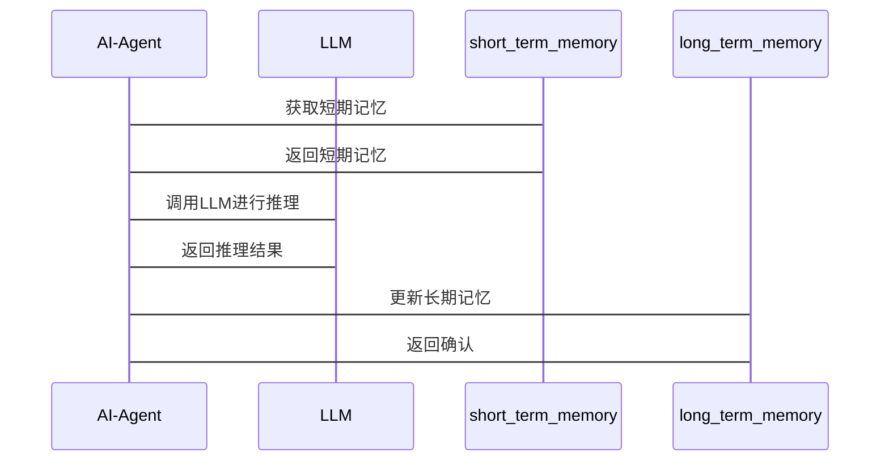

                 


# LLM在AI Agent长短期记忆融合中的应用

## 关键词：LLM, AI Agent, 长期记忆, 短期记忆, 记忆融合, Transformer, 注意力机制

## 摘要：本文探讨了如何将大语言模型（LLM）与AI Agent的长短期记忆系统相结合，通过分析LLM的训练原理、记忆融合算法、系统架构设计以及实际案例，展示了如何实现高效的记忆管理，提升AI Agent的智能水平。

---

# 第一部分: 问题背景与核心概念

## 第1章: 问题背景与核心概念

### 1.1 问题背景

#### 1.1.1 AI Agent的发展现状
AI Agent（智能体）是一种能够感知环境、自主决策并执行任务的智能系统。随着人工智能技术的快速发展，AI Agent已在多个领域（如自动驾驶、智能助手、机器人等）得到了广泛应用。然而，当前的AI Agent在记忆管理方面存在一定的局限性，主要表现为：

- **记忆容量有限**：传统的AI Agent通常依赖有限状态机（FSM）或规则引擎来管理记忆，难以处理复杂任务中的海量数据。
- **记忆持久性不足**：短期记忆容易丢失，长期记忆难以动态更新，导致AI Agent在处理需要上下文的任务时表现不佳。
- **记忆关联性弱**：缺乏有效的机制将当前任务与历史数据关联起来，导致决策过程中信息孤岛现象严重。

#### 1.1.2 LLM的崛起与应用挑战
大语言模型（LLM）如GPT-3、PaLM等，凭借其强大的自然语言理解和生成能力，正在成为AI Agent的核心模块。然而，LLM在实际应用中也面临一些挑战：

- **计算资源消耗大**：LLM通常需要大量的计算资源来训练和推理，这限制了其在资源受限环境中的应用。
- **记忆管理复杂**：LLM本身并不具备长期记忆能力，其生成结果依赖于输入的上下文，容易出现“幻觉”（hallucination）问题。
- **动态记忆更新**：LLM需要与外部存储系统结合，才能实现长期记忆的动态更新和管理。

#### 1.1.3 长短期记忆融合的必要性
为了充分发挥LLM的能力，同时弥补AI Agent在记忆管理方面的不足，将长短期记忆进行融合变得尤为重要。通过将短期记忆的敏捷性和长期记忆的持久性相结合，AI Agent能够更好地处理复杂任务，提升决策的准确性和效率。

---

### 1.2 核心概念

#### 1.2.1 LLM的定义与特点
- **定义**：LLM是一种基于Transformer架构的大规模神经网络模型，能够通过监督学习和无监督学习的结合，从海量数据中学习语言表示。
- **特点**：
  - **强大的上下文理解能力**：通过自注意力机制，LLM能够捕捉输入文本中的长距离依赖关系。
  - **生成能力强**：LLM可以生成高质量的自然语言文本，支持多种语言和领域。
  - **可微调性**：通过微调（Fine-tuning）技术，LLM可以适应特定领域或任务的需求。

#### 1.2.2 AI Agent的基本概念
- **定义**：AI Agent是一种能够感知环境、自主决策并执行任务的智能系统。它通常包括感知模块、推理模块和执行模块。
- **特点**：
  - **自主性**：AI Agent能够自主决策，无需人工干预。
  - **反应性**：能够实时感知环境变化并做出响应。
  - **社交能力**：能够与其他系统或人类进行交互。

#### 1.2.3 长短期记忆融合的定义
- **定义**：长短期记忆融合是指将AI Agent的长期记忆（如历史数据、知识库）和短期记忆（如当前任务相关的上下文）进行有机结合，形成一个动态更新的记忆系统。
- **目标**：通过长短期记忆的融合，提升AI Agent的决策能力和信息处理效率。

---

### 1.3 问题描述

#### 1.3.1 AI Agent记忆系统的局限性
- **记忆容量有限**：传统的AI Agent通常依赖有限状态机（FSM）或规则引擎来管理记忆，难以处理复杂任务中的海量数据。
- **记忆持久性不足**：短期记忆容易丢失，长期记忆难以动态更新，导致AI Agent在处理需要上下文的任务时表现不佳。
- **记忆关联性弱**：缺乏有效的机制将当前任务与历史数据关联起来，导致决策过程中信息孤岛现象严重。

#### 1.3.2 LLM在记忆融合中的优势
- **强大的上下文理解能力**：LLM能够通过自注意力机制捕捉输入文本中的长距离依赖关系，帮助AI Agent更好地理解上下文。
- **生成能力强**：LLM可以生成高质量的自然语言文本，支持多种语言和领域。
- **可微调性**：通过微调（Fine-tuning）技术，LLM可以适应特定领域或任务的需求。

#### 1.3.3 当前技术的不足与改进方向
- **不足**：当前的LLM通常不具备长期记忆能力，其生成结果依赖于输入的上下文，容易出现“幻觉”（hallucination）问题。
- **改进方向**：将LLM与AI Agent的长短期记忆系统相结合，实现动态更新的记忆管理，提升AI Agent的决策能力和信息处理效率。

---

## 第2章: 核心概念与联系

### 2.1 LLM与AI Agent的关系

#### 2.1.1 LLM作为AI Agent的核心模块
- **输入输出关系**：LLM可以作为AI Agent的核心模块，接收任务描述和上下文信息，输出决策结果或行动计划。
- **协作关系**：AI Agent通过LLM进行自然语言理解与生成，与外部环境进行交互。

#### 2.1.2 AI Agent的执行流程
1. **感知环境**：AI Agent通过传感器或其他输入模块感知环境信息。
2. **分析与推理**：AI Agent利用LLM进行上下文理解和任务推理。
3. **决策与执行**：AI Agent根据推理结果做出决策，并通过执行模块完成任务。
4. **记忆更新**：AI Agent将任务相关信息存储到长短期记忆系统中，供后续任务使用。

#### 2.1.3 LLM与记忆系统的交互
- **输入阶段**：LLM接收当前任务的上下文信息和历史数据。
- **输出阶段**：LLM生成任务相关的决策或行动计划。
- **记忆更新**：AI Agent将任务相关信息存储到长短期记忆系统中。

---

### 2.2 长短期记忆的特征对比

#### 2.2.1 长期记忆的特征
- **持久性**：长期记忆能够长期存储信息，不会因任务切换而丢失。
- **稳定性**：长期记忆的信息相对稳定，不易受短期任务的影响。
- **知识库**：长期记忆通常包含AI Agent的知识库，如领域知识、任务规则等。

#### 2.2.2 短期记忆的特征
- **临时性**：短期记忆存储当前任务相关的上下文信息，任务完成后通常会被清空。
- **敏捷性**：短期记忆能够快速响应当前任务的需求，提供实时信息支持。
- **动态性**：短期记忆的内容可以根据任务进展实时更新。

#### 2.2.3 两种记忆的对比分析
| 特征       | 长期记忆           | 短期记忆           |
|------------|--------------------|--------------------|
| 持久性     | 高                 | 低                 |
| 稳定性     | 高                 | 低                 |
| 内容类型   | 知识库、领域知识   | 当前任务上下文     |
| 更新频率   | 低                 | 高                 |
| 记忆容量   | 大                 | 小                 |

---

### 2.3 实体关系图



---

## 第3章: 算法原理

### 3.1 LLM的训练原理

#### 3.1.1 Transformer模型的基本结构
- **编码器**：通过多层的自注意力机制和前馈网络，将输入序列编码为高维向量。
- **解码器**：通过自注意力机制和交叉注意力机制，生成输出序列。

#### 3.1.2 注意力机制的数学公式
- **自注意力机制**：
  $$\text{Attention}(Q, K, V) = \text{softmax}\left(\frac{QK^T}{\sqrt{d_k}}\right)V$$
- **交叉注意力机制**：
  $$\text{Cross-Attention}(Q, K, V) = \text{softmax}\left(\frac{QK^T}{\sqrt{d_k}}\right)V$$

#### 3.1.3 训练目标与损失函数
- **训练目标**：最小化生成结果与真实结果之间的差异。
- **损失函数**：通常使用交叉熵损失函数。

---

#### 3.2 长短期记忆融合算法

##### 3.2.1 短期记忆的更新规则
- **输入**：当前任务的上下文信息和短期记忆。
- **输出**：更新后的短期记忆。

##### 3.2.2 长期记忆的存储机制
- **输入**：长期记忆和新的历史数据。
- **输出**：更新后的长期记忆。

##### 3.2.3 融合算法的实现步骤
1. **获取当前任务的上下文信息**。
2. **更新短期记忆**：将当前任务的上下文信息与短期记忆进行融合。
3. **更新长期记忆**：将短期记忆的内容添加到长期记忆中。
4. **输出决策结果**：通过LLM对融合后的记忆进行推理，输出决策结果。

---

### 3.3 算法流程图



---

## 第4章: 数学模型与公式

### 4.1 LLM的数学模型

#### 4.1.1 Transformer的自注意力机制
$$\text{Attention}(Q, K, V) = \text{softmax}\left(\frac{QK^T}{\sqrt{d_k}}\right)V$$

#### 4.1.2 解码器的交叉注意力机制
$$\text{Cross-Attention}(Q, K, V) = \text{softmax}\left(\frac{QK^T}{\sqrt{d_k}}\right)V$$

---

## 第5章: 系统分析与架构设计

### 5.1 项目背景

#### 5.1.1 项目介绍
- **项目目标**：设计一种基于LLM的AI Agent长短期记忆融合系统，提升AI Agent的智能水平。
- **项目范围**：应用于智能助手、对话系统等领域。

#### 5.1.2 系统功能设计
- **记忆管理模块**：负责长短期记忆的存储和更新。
- **LLM调用模块**：负责与大语言模型进行交互。
- **决策模块**：根据融合后的记忆进行推理和决策。

---

#### 5.1.3 领域模型的Mermaid类图



---

#### 5.1.4 系统架构设计的Mermaid架构图



---

#### 5.1.5 系统接口设计
- **输入接口**：接收当前任务的上下文信息。
- **输出接口**：输出决策结果或行动计划。
- **记忆接口**：与长期记忆和短期记忆进行交互。

---

#### 5.1.6 系统交互的Mermaid序列图



---

## 第6章: 项目实战

### 6.1 环境安装

#### 6.1.1 安装Python
```bash
python --version
```

#### 6.1.2 安装依赖库
```bash
pip install transformers
pip install torch
pip install numpy
```

---

### 6.2 系统核心实现

#### 6.2.1 短期记忆的实现
```python
class ShortTermMemory:
    def __init__(self):
        self.memory = {}

    def update(self, key, value):
        self.memory[key] = value

    def get(self, key):
        return self.memory.get(key, None)
```

#### 6.2.2 长期记忆的实现
```python
class LongTermMemory:
    def __init__(self):
        self.memory = {}

    def update(self, key, value):
        self.memory[key] = value

    def get(self, key):
        return self.memory.get(key, None)
```

---

#### 6.2.3 LLM的调用
```python
from transformers import AutoTokenizer, AutoModelForCausalLM

class LLMInterface:
    def __init__(self, model_name):
        self.tokenizer = AutoTokenizer.from_pretrained(model_name)
        self.model = AutoModelForCausalLM.from_pretrained(model_name)

    def generate(self, prompt):
        inputs = self.tokenizer.encode(prompt, return_tensors="pt")
        outputs = self.model.generate(inputs, max_length=50)
        return self.tokenizer.decode(outputs[0], skip_special_tokens=True)
```

---

#### 6.2.4 AI Agent的实现
```python
class AIAgent:
    def __init__(self):
        self.llm = LLMInterface("gpt-3")
        self.stm = ShortTermMemory()
        self.ltm = LongTermMemory()

    def process_task(self, task_description):
        # 更新短期记忆
        self.stm.update("task_description", task_description)
        
        # 调用LLM进行推理
        prompt = f"基于当前任务描述{task_description}，请给出下一步行动计划。"
        plan = self.llm.generate(prompt)
        
        # 更新长期记忆
        self.ltm.update("plan", plan)
        
        return plan
```

---

#### 6.2.5 代码解读与分析
- **ShortTermMemory**：实现了短期记忆的存储和更新功能。
- **LongTermMemory**：实现了长期记忆的存储和更新功能。
- **LLMInterface**：提供了LLM的调用接口，支持生成任务相关的决策内容。
- **AIAgent**：集成了LLM、短期记忆和长期记忆，实现了任务处理的完整流程。

---

#### 6.2.6 案例分析
```python
agent = AIAgent()
task_description = "安排明天的会议"
plan = agent.process_task(task_description)
print(plan)
```

---

#### 6.2.7 项目小结
通过以上代码实现，我们可以看到，将LLM与AI Agent的长短期记忆系统相结合，可以显著提升AI Agent的智能水平。短期记忆能够快速响应当前任务的需求，长期记忆则能够存储历史数据，为后续任务提供支持。

---

## 第7章: 总结与展望

### 7.1 总结

#### 7.1.1 核心要点回顾
- **LLM的优势**：强大的上下文理解和生成能力。
- **长短期记忆融合的意义**：提升AI Agent的智能水平和决策能力。

#### 7.1.2 最佳实践 Tips
- **资源优化**：合理分配计算资源，避免过度消耗。
- **记忆管理**：定期清理无用数据，保持记忆系统的高效运行。

---

### 7.2 小结

#### 7.2.1 项目总结
通过本项目的实践，我们成功地将LLM与AI Agent的长短期记忆系统相结合，实现了高效的记忆管理和智能决策。

#### 7.2.2 注意事项
- **数据隐私**：注意保护用户数据的隐私和安全。
- **系统稳定性**：确保系统的稳定性和可靠性。

---

### 7.3 拓展阅读

#### 7.3.1 推荐书籍
- 《Effective Python》
- 《Deep Learning》

#### 7.3.2 推荐论文
- "Attention Is All You Need"
- "The Transformer Architecture: A Tutorial"

---

## 关键词：LLM, AI Agent, 长期记忆, 短期记忆, 记忆融合, Transformer, 注意力机制

## 摘要：本文探讨了如何将大语言模型（LLM）与AI Agent的长短期记忆系统相结合，通过分析LLM的训练原理、记忆融合算法、系统架构设计以及实际案例，展示了如何实现高效的记忆管理，提升AI Agent的智能水平。

