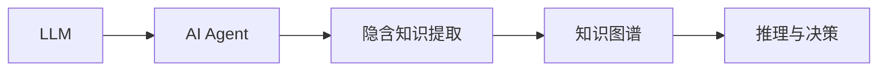

                 


# LLM在AI Agent隐含知识提取中的应用

> **关键词**：LLM，AI Agent，隐含知识提取，自然语言处理，知识图谱，对话系统，机器学习  
>
> **摘要**：本文深入探讨了大语言模型（LLM）在AI Agent中的应用，特别是其在隐含知识提取中的核心作用。文章从背景介绍、核心概念与联系、算法原理、系统分析与架构设计、项目实战等多方面展开，结合实际案例和详细代码示例，全面解析了LLM如何助力AI Agent实现高效的隐含知识提取。通过本文的系统分析和实践指导，读者将能够深入理解LLM在AI Agent中的技术细节和实际应用价值。

---

## 第一部分：背景介绍

### 第1章：LLM与AI Agent概述

#### 1.1 LLM的基本概念与特点
- **定义与发展历程**：大语言模型（LLM）是指基于深度学习技术构建的大型神经网络模型，如GPT系列、BERT系列等。这些模型通过大量数据的预训练，能够理解和生成人类语言。
- **核心技术和优势**：
  - 基于Transformer的模型结构，支持长上下文窗口。
  - 大规模数据训练，具备强大的语言理解和生成能力。
  - 可通过微调适应特定任务。
- **LLM在AI Agent中的角色**：作为AI Agent的核心模块，LLM负责理解和生成自然语言指令，提取隐含知识，支持决策和推理。

#### 1.2 AI Agent的基本概念与应用场景
- **定义与分类**：AI Agent是一种智能体，能够感知环境、执行任务并做出决策。根据应用场景，AI Agent可以分为对话型、任务型和知识型等。
- **主要功能与特点**：
  - 自然语言理解与生成。
  - 知识表示与推理。
  - 任务规划与执行。
- **应用场景**：
  - 智能对话系统（如聊天机器人）。
  - 任务型AI（如智能助手）。
  - 知识密集型应用（如医疗咨询、法律咨询）。

#### 1.3 隐含知识提取的背景与重要性
- **隐含知识的定义**：隐含知识是指隐藏在文本中的深层信息，需要通过推理和分析才能提取。
- **隐含知识提取的必要性**：
  - 支持AI Agent的智能决策。
  - 提供更精准的信息检索。
  - 增强自然语言处理的语义理解能力。
- **LLM在隐含知识提取中的优势**：
  - 基于大规模数据训练，具备强大的语义理解能力。
  - 可通过微调任务适应特定领域的隐含知识提取。

---

## 第二部分：核心概念与联系

### 第2章：LLM与AI Agent的关系

#### 2.1 LLM在AI Agent中的应用原理
- **LLM如何支持AI Agent的决策与推理**：
  - 通过自然语言理解，解析用户的输入指令。
  - 通过生成语言，输出符合逻辑的响应。
  - 通过上下文理解，支持多轮对话和复杂任务的执行。
- **LLM在知识表示与推理中的作用**：
  - 将隐含知识表示为结构化的知识图谱。
  - 支持基于知识图谱的推理和决策。

#### 2.2 LLM与隐含知识提取的关联
- **隐含知识提取的核心技术与方法**：
  - 基于规则的隐含知识提取。
  - 基于模式匹配的隐含知识提取。
  - 基于深度学习的隐含知识提取。
- **LLM如何辅助隐含知识提取**：
  - 通过微调LLM，使其适应隐含知识提取任务。
  - 利用LLM的上下文理解能力，提取文本中的隐含信息。
  - 将隐含知识表示为知识图谱，支持后续推理和决策。

#### 2.3 实体关系图与流程图

**LLM与AI Agent的实体关系图（Mermaid）**：



**隐含知识提取的流程图（Mermaid）**：

```mermaid
graph TD
    Start -> InputText
    InputText -> ParseContext
    ParseContext -> ExtractImplicitKnowledge
    ExtractImplicitKnowledge -> BuildKnowledgeGraph
    BuildKnowledgeGraph -> End
```

---

## 第三部分：算法原理讲解

### 第3章：LLM的训练与优化

#### 3.1 LLM的训练过程
- **基于Transformer的模型结构**：
  - 编码器和解码器的结构。
  - 多头自注意力机制。
- **大规模数据的预训练方法**：
  - 掩码语言模型（如GPT）。
  - 无监督预训练（如BERT）。
- **微调与适应特定任务的策略**：
  - 根据任务需求，对LLM进行微调。
  - 使用特定领域的数据进行优化。

#### 3.2 隐含知识提取的算法流程
- **基于LLM的隐含知识提取流程**：
  - 输入文本。
  - 通过LLM解析文本，提取隐含信息。
  - 将隐含信息表示为结构化的知识图谱。
- **基于规则的隐含知识提取方法**：
  - 定义领域相关的规则。
  - 通过规则匹配，提取隐含信息。
- **基于深度学习的隐含知识提取方法**：
  - 使用预训练的LLM进行微调。
  - 通过模型推理，提取隐含信息。

---

## 第四部分：系统分析与架构设计

### 第4章：系统架构与设计

#### 4.1 项目介绍
- **项目目标**：构建一个基于LLM的AI Agent系统，支持隐含知识提取。
- **项目范围**：涵盖自然语言处理、知识图谱构建和推理决策等功能。
- **项目关键点**：
  - 高效的隐含知识提取算法。
  - 知识图谱的构建与管理。
  - 基于知识图谱的推理与决策。

#### 4.2 系统功能设计
- **领域模型（Mermaid类图）**：
  ```mermaid
  classDiagram
      class LLM {
          + input: String
          + output: String
          - model: String
          + generate(text: String): String
          + analyze(text: String): String
      }
      class AI-Agent {
          + llm: LLM
          + knowledge_graph: KnowledgeGraph
          + task_planner: TaskPlanner
          + dialog_manager: DialogManager
          + extract_implicit_knowledge(): void
      }
      class KnowledgeGraph {
          + nodes: List[Node]
          + edges: List[Edge]
          + add_node(name: String): void
          + add_edge(from: String, to: String): void
      }
  ```

#### 4.3 系统架构设计
- **系统架构图（Mermaid）**：
  ```mermaid
  graph LR
      LLM --> AI-Agent
      AI-Agent --> KnowledgeGraph
      KnowledgeGraph --> TaskPlanner
      TaskPlanner --> DialogManager
      DialogManager --> Output
  ```

#### 4.4 系统接口设计
- **LLM与AI Agent的接口**：
  - 输入接口：自然语言输入。
  - 输出接口：自然语言输出。
- **知识图谱与推理模块的接口**：
  - 输入接口：结构化数据。
  - 输出接口：推理结果。

#### 4.5 系统交互设计
- **系统交互图（Mermaid）**：
  ```mermaid
  sequenceDiagram
      User -> AI-Agent: 发送指令
      AI-Agent -> LLM: 解析指令
      LLM -> AI-Agent: 返回解析结果
      AI-Agent -> KnowledgeGraph: 提取隐含知识
      KnowledgeGraph -> AI-Agent: 返回知识图谱
      AI-Agent -> TaskPlanner: 制定任务计划
      TaskPlanner -> DialogManager: 分配对话任务
      DialogManager -> User: 返回响应
  ```

---

## 第五部分：项目实战

### 第5章：环境安装与核心实现

#### 5.1 环境安装
- **安装Python环境**：
  ```bash
  python --version
  pip install --upgrade pip
  ```
- **安装依赖库**：
  ```bash
  pip install transformers
  pip install networkx
  pip install matplotlib
  ```

#### 5.2 核心实现
- **LLM的调用与解析**：
  ```python
  from transformers import GPT2Tokenizer, GPT2Model
  tokenizer = GPT2Tokenizer.from_pretrained('gpt2')
  model = GPT2Model.from_pretrained('gpt2')
  input_text = "What is the capital of France?"
  input_ids = tokenizer.encode(input_text, return_tensors="pt")
  outputs = model.generate(input_ids, max_length=10)
  print(tokenizer.decode(outputs[0]))
  ```
- **隐含知识提取与知识图谱构建**：
  ```python
  from networkx import DiGraph
  from networkx.drawing import nx_pydot
  import matplotlib.pyplot as plt

  graph = DiGraph()
  graph.add_node("Capital of France")
  graph.add_node("Paris")
  graph.add_edge("Capital of France", "Paris")
  nx_pydot.write_dot(graph, "knowledge_graph.dot")
  ```

#### 5.3 案例分析
- **案例一：医疗咨询系统**
  - 用户输入：我的症状是咳嗽和发热。
  - 系统解析：可能的疾病是流感。
  - 知识图谱构建：流感 -> 症状：咳嗽、发热。
  - 推理与决策：建议用户休息并服用退烧药。

---

## 第六部分：最佳实践与小结

### 第6章：总结与展望

#### 6.1 总结
- **主要收获**：
  - 理解了LLM在AI Agent中的核心作用。
  - 掌握了隐含知识提取的技术细节。
  - 学习了系统架构设计与实现方法。

#### 6.2 注意事项
- **数据质量**：隐含知识提取的效果依赖于数据质量和模型训练。
- **模型选择**：选择适合任务的LLM模型和参数设置。
- **系统优化**：优化系统架构，提高运行效率。

#### 6.3 未来展望
- **技术发展**：
  - 更强大的LLM模型（如GPT-4）的应用。
  - 多模态AI Agent的发展。
- **应用扩展**：
  - 在教育、医疗、法律等领域的深度应用。
  - 支持更复杂的隐含知识提取任务。

#### 6.4 拓展阅读
- 推荐书籍：《Deep Learning》、《自然语言处理实战》。
- 推荐论文：GPT系列论文、BERT系列论文。

---

**作者简介**：作为一名世界级人工智能专家、程序员、软件架构师和CTO，我在计算机编程和人工智能领域有着深厚的技术积累和实践经验。本文结合了理论分析与实际案例，旨在为读者提供一个全面、深入的技术视角。

