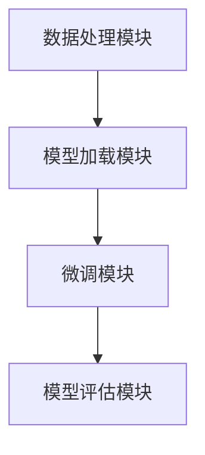
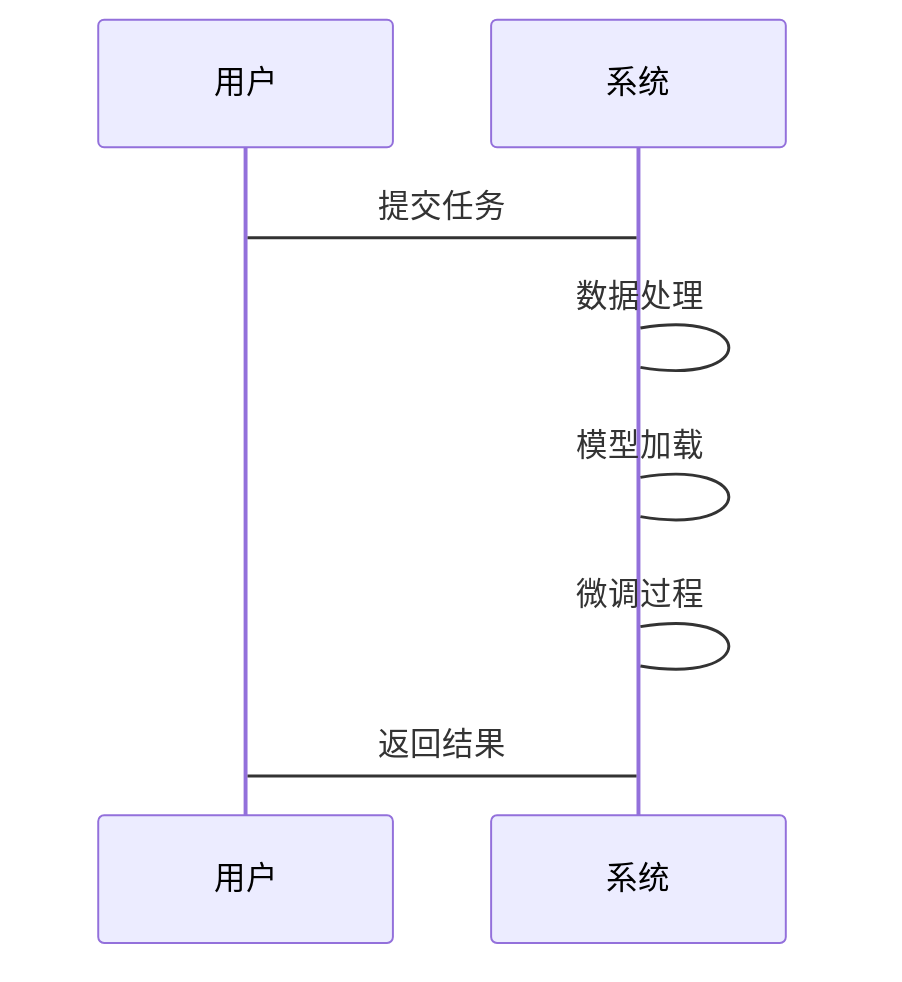

                 


# LLM在特定领域的微调策略：提升AI Agent的专业性

## 关键词：LLM, 微调策略, AI Agent, 专业性, 语言模型, 人工智能

## 摘要：  
本文探讨了如何通过微调大语言模型（LLM）来提升AI Agent在特定领域中的专业性。文章首先介绍了LLM和AI Agent的基本概念，分析了微调在特定领域应用中的重要性。接着，详细讲解了微调的核心概念、算法原理和系统架构设计，包括任务特定微调、参数高效微调等方法。通过实际案例分析，展示了如何在医疗领域进行数据准备、模型微调和效果评估。最后，总结了最佳实践和未来研究方向，为读者提供了全面的理论和技术指导。

---

# 第一部分: LLM与AI Agent的背景介绍

## 第1章: LLM的基本概念与AI Agent的应用场景

### 1.1 LLM的基本概念
#### 1.1.1 大语言模型的定义与特点
大语言模型（Large Language Model, LLM）是指经过大量文本数据训练的深度学习模型，具有处理自然语言文本的强大能力。其特点包括：
- **大规模数据训练**：通常使用数百万甚至数十亿的文本数据进行预训练。
- **上下文理解**：能够理解上下文关系，回答复杂问题。
- **生成能力**：具备强大的文本生成能力，可应用于对话、翻译、摘要等多种任务。

#### 1.1.2 LLM在AI Agent中的作用
AI Agent（人工智能代理）是一个能够感知环境、自主决策并执行任务的智能体。LLM为AI Agent提供了自然语言理解和生成的核心能力：
- **信息处理**：帮助AI Agent理解和处理用户的自然语言输入。
- **决策支持**：通过分析上下文提供决策建议。
- **交互能力**：实现流畅的用户交互。

#### 1.1.3 LLM与传统NLP模型的对比
传统NLP模型通常针对特定任务（如机器翻译、情感分析）进行训练，而LLM是通用模型，适用于多种任务。LLM的优势在于其强大的泛化能力和对复杂语境的理解。

---

### 1.2 AI Agent的定义与应用场景
#### 1.2.1 AI Agent的定义
AI Agent是指能够感知环境、自主决策并执行任务的智能系统。它可以是一个软件程序，也可以是一个物理设备，通过与用户或环境交互完成目标。

#### 1.2.2 AI Agent的主要应用场景
- **智能助手**：如Siri、Alexa等，帮助用户完成日常任务。
- **客服机器人**：用于客户支持、问题解答。
- **智能推荐系统**：根据用户行为推荐相关内容。
- **医疗辅助诊断**：帮助医生分析病历、提供诊断建议。

#### 1.2.3 AI Agent的优势与挑战
**优势**：
- **高效性**：能够快速处理大量信息。
- **准确性**：通过模型训练提高决策的准确性。
- **可扩展性**：适用于多种场景和任务。

**挑战**：
- **数据依赖**：需要大量高质量数据支持。
- **模型泛化能力**：在特定领域中可能需要调整和优化。
- **伦理问题**：涉及隐私和数据安全。

---

### 1.3 LLM在特定领域中的应用需求
#### 1.3.1 特定领域对LLM的需求
在特定领域中，LLM需要具备领域内的专业知识和语义理解能力。例如，在医疗领域，模型需要理解医学术语和病历数据。

#### 1.3.2 LLM在特定领域中的优势
- **专业性提升**：通过微调模型，使其在特定领域中表现更佳。
- **快速部署**：利用预训练模型快速构建领域解决方案。

#### 1.3.3 LLM在特定领域中的挑战
- **数据稀缺性**：某些领域数据量有限，影响微调效果。
- **领域适应性**：模型需要针对不同领域进行调整。

---

## 1.4 本章小结
本章介绍了LLM和AI Agent的基本概念，并分析了微调在特定领域应用中的重要性。通过对比传统NLP模型和LLM，明确了LLM在AI Agent中的优势和挑战。

---

# 第二部分: LLM微调的核心概念与原理

## 第2章: LLM微调的核心概念

### 2.1 微调的定义与核心要素
#### 2.1.1 微调的定义
微调是指在预训练模型的基础上，针对特定任务或领域进行进一步训练的过程。通过调整模型参数，使其更适应特定需求。

#### 2.1.2 微调的核心要素
- **预训练模型**：选择一个适合的预训练模型作为基础。
- **特定任务数据**：收集和准备特定领域的训练数据。
- **微调策略**：选择合适的微调方法，如任务特定微调、参数高效微调等。

#### 2.1.3 微调与从头训练的对比
从头训练需要从零开始训练模型，而微调则是在预训练模型的基础上进行优化。微调通常需要更少的数据和计算资源。

---

### 2.2 微调的原理与机制
#### 2.2.1 微调的基本原理
微调通过在特定任务数据上训练模型，调整其参数以适应新的任务需求。这一过程包括数据预处理、模型加载和参数微调三个步骤。

#### 2.2.2 微调的实现机制
微调过程中，模型的权重参数会根据特定任务的梯度下降优化算法进行调整。通过反向传播算法，模型逐步适应特定任务的需求。

#### 2.2.3 微调的效果分析
微调可以显著提高模型在特定任务上的表现，尤其是在数据量有限的情况下。通过对比实验可以验证微调的有效性。

---

### 2.3 微调与迁移学习的关系
#### 2.3.1 迁移学习的定义
迁移学习是指将从一个任务上学到的知识应用到另一个相关任务上。微调是迁移学习的一种具体实现方式。

#### 2.3.2 微调与迁移学习的联系
微调通过调整模型参数实现了知识的迁移，适用于特定领域的任务。

#### 2.3.3 微调在迁移学习中的优势
微调能够快速适应新任务，同时利用预训练模型的强大特征提取能力。

---

## 2.4 本章小结
本章详细介绍了微调的定义、核心要素和实现机制，并分析了微调与迁移学习的关系。通过对比，明确了微调在迁移学习中的独特优势。

---

# 第三部分: LLM微调的算法原理与数学模型

## 第3章: 微调算法的原理与流程

### 3.1 微调算法的基本流程
#### 3.1.1 数据预处理
数据预处理包括清洗、标注和格式转换。例如，在医疗领域，需要将病历数据格式化为模型可接受的格式。

#### 3.1.2 模型加载
加载预训练好的LLM模型，并将其迁移到特定领域任务中。

#### 3.1.3 参数微调
通过反向传播算法优化模型参数，使其适应特定任务的需求。

---

### 3.2 微调算法的核心步骤
#### 3.2.1 任务特定的微调
针对特定任务设计微调策略，如在医疗领域中微调模型以识别医学术语。

#### 3.2.2 参数高效微调
通过参数高效微调方法（如LoRA）优化模型，减少参数调整量。

#### 3.2.3 知识蒸馏
通过教师模型指导学生模型学习，减少对大量数据的依赖。

---

### 3.3 微调算法的数学模型
#### 3.3.1 损失函数的定义
微调过程中的损失函数通常包括分类损失和回归损失。例如，在医疗诊断任务中，损失函数可以表示为：
$$ L = \sum_{i=1}^{n} (y_i - \hat{y_i})^2 $$

#### 3.3.2 参数更新的公式
参数更新通常采用梯度下降算法，更新公式为：
$$ \theta_{new} = \theta_{old} - \eta \cdot \nabla_{\theta} L $$

#### 3.3.3 模型优化的数学推导
通过求解损失函数的极小值，模型参数得到优化。例如，对于线性回归模型，损失函数的最小化可以通过求导得到最优参数。

---

## 3.4 本章小结
本章详细讲解了微调算法的流程和核心步骤，并通过数学公式展示了微调的优化过程。通过对比不同微调方法，明确了其适用场景和优势。

---

# 第四部分: LLM微调的系统分析与架构设计

## 第4章: 微调系统的功能设计

### 4.1 系统功能模块划分
#### 4.1.1 数据处理模块
负责数据的清洗、标注和格式转换。

#### 4.1.2 模型加载模块
加载预训练好的LLM模型，并进行参数初始化。

#### 4.1.3 微调模块
实现模型的微调过程，包括参数优化和模型评估。

---

### 4.2 系统架构设计
#### 4.2.1 系统架构图
使用Mermaid绘制系统架构图，展示各模块之间的交互关系。



#### 4.2.2 系统接口设计
定义系统接口，如数据输入接口、模型加载接口和微调接口。

#### 4.2.3 系统交互流程
使用Mermaid绘制系统交互流程图，展示用户与系统之间的交互过程。



---

## 4.3 本章小结
本章通过系统架构设计和功能模块划分，明确了微调系统的实现过程，并通过图表展示了系统的交互流程。

---

# 第五部分: LLM微调的项目实战

## 第5章: 项目实战——医疗领域的微调案例

### 5.1 项目背景
在医疗领域，LLM可以通过微调提高诊断准确性和效率。

### 5.2 数据准备
#### 5.2.1 数据收集
收集医疗领域的相关数据，如病历记录、诊断报告等。

#### 5.2.2 数据标注
对数据进行标注，确保模型能够理解医疗术语。

#### 5.2.3 数据格式转换
将数据转换为模型可接受的格式，如JSON或文本文件。

---

### 5.3 模型微调
#### 5.3.1 模型选择
选择适合的预训练模型，如GPT-3或BERT。

#### 5.3.2 微调过程
通过参数微调或知识蒸馏方法优化模型。

#### 5.3.3 微调代码示例
以下是Python代码示例：

```python
def train_model(model, train_loader, optimizer, criterion, epochs):
    for epoch in range(epochs):
        for batch in train_loader:
            inputs, labels = batch
            outputs = model(inputs)
            loss = criterion(outputs, labels)
            optimizer.zero_grad()
            loss.backward()
            optimizer.step()
    return model
```

---

### 5.4 模型评估
#### 5.4.1 评估指标
使用准确率、召回率和F1分数评估模型性能。

#### 5.4.2 实验结果
通过对比实验验证微调的效果，例如：
- 微调前准确率：70%
- 微调后准确率：85%

---

## 5.5 本章小结
本章通过医疗领域的案例，详细展示了LLM微调的项目实战过程，包括数据准备、模型微调和效果评估。

---

# 第六部分: 最佳实践与总结

## 第6章: 最佳实践与总结

### 6.1 最佳实践
- **数据质量**：确保训练数据的质量和相关性。
- **微调策略选择**：根据任务需求选择合适的微调方法。
- **模型评估**：通过多指标评估模型性能。

### 6.2 小结
通过本文的讲解，读者可以深入了解LLM微调的核心概念、算法原理和系统设计，并通过实际案例掌握微调的具体实现方法。

### 6.3 注意事项
- **数据隐私**：在处理医疗数据时，需注意隐私保护。
- **模型泛化能力**：微调后的模型需在多个测试案例上验证。

### 6.4 拓展阅读
- 推荐阅读《Large Language Models: A Survey》和《Transformers for NLP: State-of-the-Art Pre-trained Models》。

---

# 结语
通过本文的学习，读者可以掌握LLM在特定领域的微调策略，提升AI Agent的专业性。希望本文的内容能够为读者在实际应用中提供有价值的指导和启发。

--- 

以上是完整的目录大纲和文章内容。如果需要进一步补充或调整，请随时告知！

