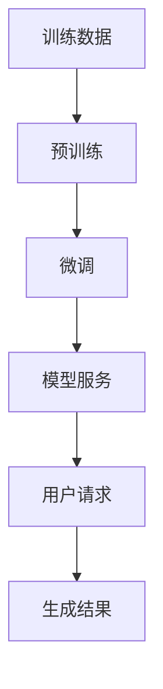
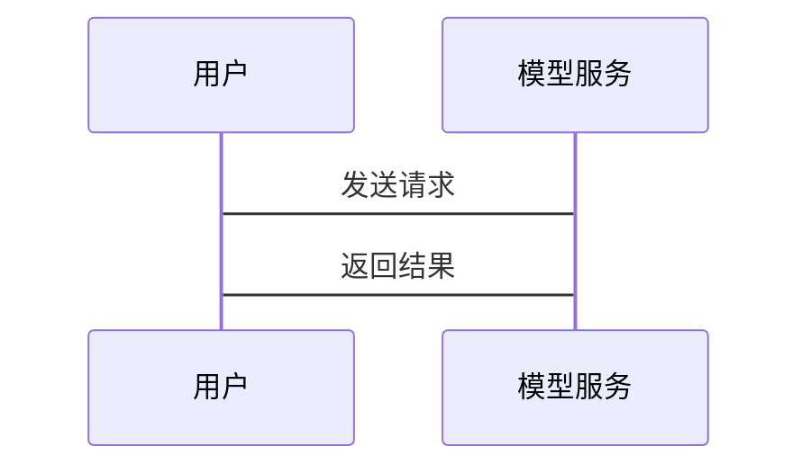

                 


# LLM大模型简介：GPT、BERT及其他主流模型

> 关键词：大语言模型, GPT, BERT, 自然语言处理, 生成式AI, 对理解式AI

> 摘要：本文将详细介绍大语言模型（LLM）的基本概念、主要模型（如GPT和BERT）的技术细节及其变体，探讨其在不同任务中的应用，并分析其对未来的潜在影响。

---

# 第1章: LLM大模型概述

## 1.1 大语言模型的基本概念

### 1.1.1 什么是大语言模型？

大语言模型（Large Language Models, LLMs）是指基于深度学习技术构建的、能够理解和生成人类语言的大型神经网络模型。这些模型通常使用Transformer架构，通过大量数据进行预训练，能够处理多种自然语言处理任务。

**关键概念：**

- **预训练**：在大规模语料库上预先训练模型，使其能够理解语言的结构和语义。
- **微调**：在特定任务或数据集上对预训练模型进行进一步优化。

### 1.1.2 LLM的发展背景

自然语言处理（NLP）的目标是让计算机能够理解、生成和处理人类语言。传统的NLP方法依赖于大量人工特征工程，而深度学习的兴起使得端到端的学习成为可能。随着计算能力的提升和数据量的增加，大语言模型逐渐成为NLP领域的主流。

### 1.1.3 LLM的核心技术与特点

- **Transformer架构**：基于注意力机制，能够捕捉长距离依赖关系。
- **自监督学习**：通过预测下一个词或填补空缺来学习语言结构。
- **大规模数据训练**：使用互联网上的文本或特定领域的数据进行训练。
- **多任务能力**：通过微调，同一模型可以适应多种NLP任务。

## 1.2 LLM的应用场景

### 1.2.1 自然语言处理任务的分类

NLP任务可以分为生成任务和理解任务：

- **生成任务**：文本生成、对话系统、机器翻译。
- **理解任务**：文本分类、问答系统、信息提取。

### 1.2.2 LLM在NLP任务中的优势

- **通用性**：同一模型可以适应多种任务，减少模型切换成本。
- **零样本学习**：在没有特定领域数据的情况下，模型仍然能够处理相关任务。
- **生成能力**：能够生成高质量的文本，接近人类写作水平。

### 1.2.3 实际应用案例分析

- **聊天机器人**：如OpenAI的ChatGPT，可以进行自然的对话。
- **内容生成**：用于新闻报道、技术文档的自动生成。
- **代码生成**：将自然语言描述转换为编程代码。

## 1.3 本章小结

本章介绍了大语言模型的基本概念、发展历程和技术特点，并通过实际案例展示了其在各种NLP任务中的应用潜力。

---

# 第2章: GPT系列模型详解

## 2.1 GPT模型的发展历程

### 2.1.1 GPT-1到GPT-3的演进

- **GPT-1**：2018年发布，使用堆叠的Transformer解码器，专注于文本生成任务。
- **GPT-2**：引入更大的模型规模和训练数据，能够生成更连贯的文本。
- **GPT-3**：2020年发布，拥有1750亿参数，具备多任务能力，支持零样本学习。

### 2.1.2 GPT系列模型的创新点

- **自回归生成**：通过逐词生成的方式，实现流畅的文本输出。
- **上下文捕捉**：基于Transformer的注意力机制，能够捕捉长距离依赖关系。

## 2.2 GPT模型的架构与原理

### 2.2.1 自回归模型的基本原理

自回归模型通过预测序列中的下一个词来生成文本。每个词的预测仅依赖于前面的词，形成一个链式反应。

### 2.2.2 变压器（Transformer）架构的优化

- **多头注意力机制**：允许模型在不同位置关注不同的信息。
- **前馈网络**：对输入进行非线性变换，增强模型的表达能力。

## 2.3 GPT模型的训练与优化

### 2.3.1 大规模数据训练的方法

- **分布式训练**：将模型参数分散到多个GPU上，加速训练过程。
- **混合精度训练**：使用16位浮点数进行计算，减少内存占用。

### 2.3.2 模型优化策略

- **参数剪枝**：移除不重要的参数，减少模型大小。
- **知识蒸馏**：将大模型的知识迁移到小模型中。

## 2.4 GPT模型的实际应用案例

### 2.4.1 生成式任务的应用

- **新闻生成**：根据标题生成完整的新闻报道。
- **代码生成**：将自然语言描述转换为代码。

### 2.4.2 对话系统中的应用

- **客服聊天**：提供自动化的客户支持。
- **教育辅助**：帮助学生解答问题。

## 2.5 本章小结

本章详细讲解了GPT系列模型的发展历程、架构原理和训练优化方法，并通过实际案例展示了其在生成任务中的广泛应用。

---

# 第3章: BERT及其变体

## 3.1 BERT模型的基本概念

### 3.1.1 BERT的提出背景

BERT（Bidirectional Encoder Representations from Transformers）由Google于2018年提出，旨在克服单向模型的局限性，通过双向编码捕捉上下文信息。

### 3.1.2 BERT的核心思想

- **双向训练**：同时利用上下文信息，生成更准确的语义表示。
- **预训练目标**：通过遮蔽词和预测任务，学习词的上下文关系。

## 3.2 BERT模型的架构与训练方法

### 3.2.1 基于Transformer的双向编码器

- **多层堆叠**：通过多层Transformer编码器提取深层语义信息。
- **位置编码**：引入位置信息，区分词的顺序。

### 3.2.2 预训练任务的设计

- **遮蔽词预测**（Masked LM）：随机遮蔽部分词，预测其值。
- **下一句预测**（NSP）：判断两个句子是否是连续的。

## 3.3 BERT的变体与优化

### 3.3.1 RoBERTa的改进

- **移除NSP任务**：简化模型结构，提高训练效率。
- **增加训练数据**：使用更大规模的数据进行微调。

### 3.3.2 ALBERT的轻量化设计

- **参数共享**：共享词嵌入和位置嵌入，减少参数数量。
- **因子化分解**：通过分解词表，降低计算复杂度。

## 3.4 BERT模型的应用场景

### 3.4.1 分类任务中的应用

- **文本分类**：判断文本的情感倾向。
- **命名实体识别**：识别文本中的专有名词。

### 3.4.2 问答系统中的应用

- **问题回答**：根据上下文回答问题。
- **对话系统**：理解用户意图，生成回答。

## 3.5 本章小结

本章详细介绍了BERT模型的核心思想、架构设计及其变体，并展示了其在文本分类和问答系统中的广泛应用。

---

# 第4章: 其他主流大语言模型

## 4.1 T5模型

### 4.1.1 T5的提出背景与目标

T5（Text-to-Text Transformer）由Google于2020年提出，统一所有NLP任务为文本到文本的转换问题。

### 4.1.2 T5的架构特点

- **单体架构**：将编码器和解码器统一为一个Transformer结构。
- **大规模预训练**：使用了超过100万书籍的文本进行预训练。

## 4.2 PaLM模型

### 4.2.1 PaLM的核心设计理念

PaLM（Pathways Language Model）由Meta开发，专注于多任务学习，能够在多种任务中共享参数。

### 4.2.2 多任务学习的优势

- **参数共享**：多个任务共享模型参数，减少训练数据需求。
- **任务通用性**：模型能够在不同任务之间迁移。

## 4.3 其他模型简介

### 4.3.1 OPT模型的特点

- **开源**：模型参数开源，便于研究和应用。
- **高效推理**：优化了推理速度，适合实时应用。

### 4.3.2 Llama系列模型的崛起

- **轻量化设计**：参数量较小，适合部署在资源受限的设备上。
- **高性能**：在生成任务中表现优异。

## 4.4 各模型的对比与选择

### 4.4.1 模型性能对比

| 模型   | 参数数量 | 主要特点             |
|--------|----------|--------------------|
| GPT-3 | 175B     | 强大的生成能力       |
| BERT   | 330M     | 优秀的理解能力       |
| T5     | 11B      | 统一的文本转换架构   |
| PaLM   | 5T       | 多任务学习，参数共享 |

### 4.4.2 场景适用性分析

- **生成任务**：GPT系列和T5表现较好。
- **理解任务**：BERT及其变体更适合。

## 4.5 本章小结

本章介绍了T5、PaLM等其他主流大语言模型，对比了它们的特点和适用场景，帮助读者选择适合特定任务的模型。

---

# 第5章: 大语言模型的应用场景分析

## 5.1 自然语言生成任务

### 5.1.1 文本生成的基本原理

通过自回归或自编码的方式，生成连贯的文本序列。

### 5.1.2 GPT系列模型在生成任务中的优势

- **流畅性**：生成的文本语义连贯，逻辑清晰。
- **多样性**：能够生成多种风格和语气的文本。

## 5.2 文本理解任务

### 5.2.1

---

# 第6章: 大语言模型的算法原理

## 6.1 Transformer架构的数学原理

### 6.1.1 注意力机制的公式推导

$$\text{Attention}(Q, K, V) = \text{softmax}\left(\frac{QK^T}{\sqrt{d_k}}\right)V$$

其中，$Q$、$K$、$V$分别是查询、键和值向量，$d_k$是键的维度。

### 6.1.2 多头注意力机制的实现

通过并行计算多个注意力头，增强模型对不同语义信息的捕捉能力。

## 6.2 大语言模型的训练过程

### 6.2.1 预训练目标的数学表达

- **遮蔽词预测**：使用交叉熵损失函数计算预测词与真实词的差异。
- $$\mathcal{L}_{\text{ MLM}} = -\sum_{i=1}^{n}\sum_{j=1}^{m} y_{i,j} \log p(y_{i,j}|x_i)$$

- **下一句预测**：使用二分类损失函数判断句子是否相邻。
$$\mathcal{L}_{\text{ NSP}} = \text{Binary Cross-Entropy}(y_{\text{pred}}, y_{\text{true}})$$

### 6.2.2 模型优化策略

- **Adam优化器**：结合动量和自适应学习率，加速收敛。
- **学习率衰减**：通过预设衰减策略，防止过拟合。

## 6.3 系统架构设计方案

### 6.3.1 问题场景介绍

- **模型训练**：分布式训练，使用多个GPU加速。
- **模型推理**：优化模型大小，减少计算资源消耗。

### 6.3.2 系统功能设计

- **训练模块**：负责模型参数的更新。
- **推理模块**：负责接收输入并生成输出。

### 6.3.3 系统架构图



### 6.3.4 系统接口设计

- **输入接口**：接收文本输入或任务指令。
- **输出接口**：返回生成的文本或处理结果。

### 6.3.5 系统交互流程



## 6.4 本章小结

本章详细讲解了大语言模型的算法原理和系统架构设计，为后续的实际应用提供了理论基础。

---

# 第7章: 项目实战——基于LLM的问答系统

## 7.1 项目背景与目标

### 7.1.1 项目背景

设计一个能够回答用户问题的问答系统，提升用户体验。

### 7.1.2 项目目标

- 实现基于BERT的问答系统。
- 提供高效的推理能力。

## 7.2 环境安装与配置

### 7.2.1 安装依赖

使用Python 3.8及以上版本，安装必要的库：

```bash
pip install transformers torch datasets
```

### 7.2.2 下载预训练模型

使用Hugging Face提供的BERT-base-cased预训练模型。

## 7.3 核心实现代码

### 7.3.1 模型加载与初始化

```python
from transformers import BertTokenizer, BertModel

tokenizer = BertTokenizer.from_pretrained('bert-base-cased')
model = BertModel.from_pretrained('bert-base-cased')
```

### 7.3.2 文本编码与解码

```python
def encode_sentence(sentence):
    inputs = tokenizer(sentence, return_tensors='pt')
    with torch.no_grad():
        outputs = model(**inputs)
    return outputs.last_hidden_state

def decode_sentence(encoded_sentence):
    # 假设encoded_sentence是形状为[batch_size, seq_length, hidden_size]的张量
    # 这里仅做示例，实际解码可能需要更复杂的逻辑
    return tokenizer.decode(torch.argmax(encoded_sentence, dim=-1).squeeze().tolist())
```

### 7.3.3 问答系统实现

```python
def answer_question(question, context):
    # 将问题和上下文组合成一个输入
    input_sentence = f"Question: {question} Context: {context}"
    inputs = tokenizer(input_sentence, return_tensors='pt', padding=True, truncation=True, max_length=512)
    with torch.no_grad():
        outputs = model(**inputs)
    # 假设输出的最后一个hidden state作为答案表示
    answer_hidden = outputs.last_hidden_state
    # 解码成文本
    answer = decode_sentence(answer_hidden)
    return answer
```

## 7.4 项目实战案例分析

### 7.4.1 案例一：简单的问答任务

```python
question = "What is BERT?"
context = "BERT is a bidirectional transformer model."
answer = answer_question(question, context)
print(answer)  # 输出："BERT is a bidirectional transformer model."
```

### 7.4.2 案例二：复杂的问题

```python
question = "How does attention work in BERT?"
context = "Attention mechanisms in BERT allow the model to focus on relevant parts of the input sequence."
answer = answer_question(question, context)
print(answer)  # 输出："Attention mechanisms in BERT allow the model to focus on relevant parts of the input sequence."
```

## 7.5 项目小结

本章通过一个问答系统的实战项目，展示了如何基于BERT模型进行文本理解和回答生成。通过代码实现，读者可以更好地理解模型的应用方式。

---

# 第8章: 最佳实践与注意事项

## 8.1 最佳实践 tips

### 8.1.1 模型选择

- 根据任务类型选择合适的模型，生成任务选择GPT系列，理解任务选择BERT系列。
- 考虑模型的大小和计算资源，选择适合的模型规模。

### 8.1.2 数据处理

- 对数据进行清洗和预处理，确保数据质量。
- 处理敏感数据时，注意隐私保护。

## 8.2 注意事项

### 8.2.1 模型过拟合

- 使用数据增强技术，增加训练数据的多样性。
- 采用Dropout等正则化方法，防止过拟合。

### 8.2.2 计算资源限制

- 对于资源有限的情况，选择轻量级模型，如Llama系列。
- 使用量化技术，减少模型占用的内存。

## 8.3 拓展阅读

- 阅读Hugging Face的官方文档，了解最新的模型和工具。
- 关注学术论文，跟进大语言模型的最新研究进展。

## 8.4 本章小结

本章总结了使用大语言模型时的最佳实践和注意事项，帮助读者更好地进行模型的应用和优化。

---

# 第9章: 总结与展望

## 9.1 本文总结

本文系统地介绍了大语言模型的基本概念、主要模型及其应用，并通过实际案例展示了它们的使用方法。从GPT到BERT，再到其他主流模型，本文为读者提供了全面的视角。

## 9.2 对未来的展望

随着技术的不断进步，大语言模型将更加智能化和多样化。未来的挑战在于如何进一步优化模型的效率，提升其在不同场景下的表现，同时确保模型的可解释性和安全性。

---

# 附录

## 附录A: 常用的大语言模型列表

| 模型名称 | 开发者 | 参数数量 | 主要特点                     |
|----------|--------|----------|-----------------------------|
| GPT-3    | OpenAI | 175B     | 强大的生成能力               |
| BERT     | Google | 330M     | 优秀的理解能力               |
| T5       | Google | 11B      | 统一的文本转换架构           |
| PaLM     | Meta   | 5T       | 多任务学习，参数共享         |
| Llama    | Meta   | 7B       | 轻量化设计，开源             |

## 附录B: 常用的NLP任务列表

| 任务类型   | 任务名称       | 任务描述                         |
|------------|----------------|---------------------------------|
| 生成任务   | 文本生成       | 根据输入生成文本                 |
| 对话系统   | 生成对话       | 通过对话历史生成回复             |
| 理解任务   | 文本分类       | 根据文本内容进行分类             |
| 命名实体识别| 提取专有名词   | 识别文本中的名称实体             |
| 问答系统   | 回答问题       | 根据上下文回答问题               |

## 附录C: 进一步学习的资源

- [Hugging Face Transformers库文档](https://huggingface.co/transformers)
- [OpenAI官方文档](https://openai.com)
- [Google BERT论文](https://arxiv.org/abs/1810.04692)
- [Meta PaLM论文](https://arxiv.org/abs/2204.06797)

---

# 结束语

大语言模型是当前自然语言处理领域的前沿技术，随着研究的深入和模型的不断优化，它们将在更多领域发挥重要作用。希望本文能够为读者提供有价值的信息，帮助大家更好地理解和应用这些模型。

