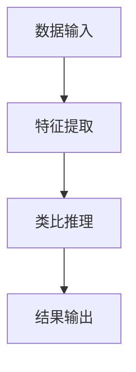
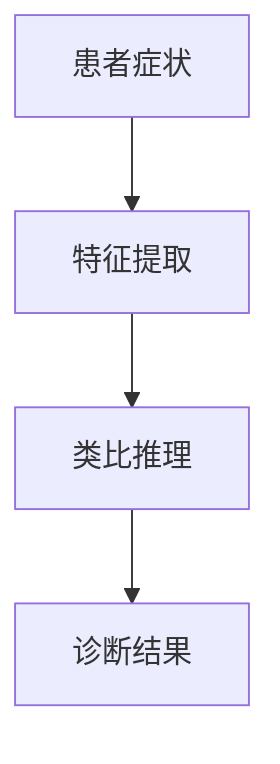

                 


# LLM支持的AI Agent跨域类比推理技术

## 关键词：
- LLM（大语言模型）
- AI Agent（人工智能代理）
- 跨域类比推理
- 技术原理
- 应用场景
- 系统架构
- 项目实战

## 摘要：
本文系统地探讨了大语言模型（LLM）支持的AI Agent在跨域类比推理中的技术原理和应用场景。通过分析LLM的核心特性，详细阐述了跨域类比推理的基本概念、算法实现和系统架构。同时，通过实际案例展示了跨域类比推理在医疗诊断、金融分析和自然语言处理中的应用，提供了从理论到实践的全面解析。

---

# 第1章: LLM与AI Agent概述

## 1.1 LLM的基本概念与特点

### 1.1.1 大语言模型的定义与核心特点
大语言模型（Large Language Model, LLM）是指基于深度学习训练的大型神经网络模型，具有以下核心特点：
- **大规模训练数据**：通常使用 billions 参数级的数据进行训练，能够捕捉语言的复杂模式。
- **多任务学习能力**：通过多任务训练，LLM能够理解和生成多种语言任务的输出。
- **上下文理解能力**：能够通过上下文理解语义，提供连贯的对话和文本生成。

### 1.1.2 LLM在AI Agent中的作用
AI Agent（人工智能代理）是一种能够感知环境并采取行动以实现目标的智能体。LLM在AI Agent中的作用包括：
- **自然语言处理**：处理和生成自然语言，使AI Agent能够与人类进行有效交互。
- **知识推理**：通过LLM的强大语言理解能力，AI Agent可以进行复杂的逻辑推理。
- **动态适应**：LLM能够根据实时信息调整AI Agent的行为，使其在动态环境中保持高效。

### 1.1.3 LLM与传统NLP模型的区别
传统的NLP模型通常针对特定任务进行优化，如机器翻译或情感分析，而LLM具有通用性和多任务能力，能够处理多种任务，适用于更广泛的场景。

---

## 1.2 AI Agent的基本概念与应用场景

### 1.2.1 AI Agent的定义与分类
AI Agent是一种智能体，能够感知环境、理解需求并采取行动以实现目标。AI Agent可以分为：
- **简单反射型**：基于规则的简单反应。
- **基于模型的反射型**：基于内部模型进行决策。
- **目标驱动型**：具有明确目标，主动采取行动。
- **效用驱动型**：通过最大化效用函数来优化行为。

### 1.2.2 AI Agent的核心功能与能力
AI Agent的核心功能包括：
- **感知环境**：通过传感器或API获取环境信息。
- **理解和推理**：理解输入信息并进行逻辑推理。
- **决策与规划**：基于推理结果制定行动方案。
- **执行行动**：通过执行器或API实现目标。

### 1.2.3 AI Agent在不同领域的应用实例
AI Agent在多个领域有广泛应用：
- **智能助手**：如Siri、Alexa，提供信息查询和任务执行。
- **机器人控制**：在制造业中，用于机器人调度和优化。
- **自动驾驶**：通过实时感知和决策实现自主驾驶。

---

## 1.3 跨域类比推理的背景与意义

### 1.3.1 跨域类比推理的定义
跨域类比推理是指在不同领域之间建立联系，通过类比的方法进行推理。例如，将医疗领域的症状与财务领域的风险进行类比，寻找相似的处理方式。

### 1.3.2 跨域类比推理的核心价值
- **知识迁移**：将一个领域的知识应用到另一个领域，减少新领域数据的需求。
- **创新思维**：通过类比激发新的想法和解决方案。
- **复杂问题处理**：在复杂问题中，跨域类比推理能够提供新的视角和解决思路。

### 1.3.3 跨域类比推理在LLM支持的AI Agent中的应用
- **多领域问题解决**：AI Agent能够通过跨域类比推理，解决涉及多个领域的复杂问题。
- **动态适应**：在动态环境中，AI Agent能够快速调整策略，适应新的情况。

---

# 第2章: 跨域类比推理技术的基础

## 2.1 跨域类比推理的基本原理

### 2.1.1 类比推理的定义与核心要素
类比推理是一种通过比较不同事物的相似性，推导出新的结论的推理方式。核心要素包括：
- **源域**：类比的起点，已知领域的知识。
- **目标域**：类比的目标，需要解决的问题。
- **映射关系**：源域和目标域之间的相似性关系。

### 2.1.2 跨域类比推理的实现机制
跨域类比推理的实现机制包括：
- **特征提取**：提取源域和目标域的关键特征。
- **相似性计算**：计算源域和目标域之间的相似性。
- **推理与映射**：基于相似性进行推理，建立映射关系。

### 2.1.3 跨域类比推理与传统类比推理的区别
传统类比推理通常在相同领域内进行，而跨域类比推理涉及不同领域，需要考虑领域间复杂的差异和联系。

---

## 2.2 跨域类比推理的关键技术

### 2.2.1 基于向量空间的类比推理
- **向量表示**：将源域和目标域的元素表示为向量。
- **相似度计算**：使用余弦相似度或欧氏距离计算相似度。
- **推理与映射**：基于相似度进行类比推理。

### 2.2.2 基于知识图谱的类比推理
- **知识图谱构建**：构建包含多个领域的知识图谱。
- **实体关系推理**：通过知识图谱中的实体关系进行推理。
- **跨域映射**：将源域的实体关系映射到目标域。

### 2.2.3 基于符号逻辑的类比推理
- **符号表示**：使用符号逻辑表示知识。
- **逻辑推理**：通过逻辑推理进行类比。
- **跨域应用**：将符号逻辑应用于不同领域。

---

## 2.3 跨域类比推理的实现步骤

### 2.3.1 数据预处理与特征提取
- **数据清洗**：去除噪声数据，确保数据质量。
- **特征提取**：提取源域和目标域的关键特征。

### 2.3.2 类比推理模型的构建
- **模型选择**：选择适合的类比推理模型。
- **参数调优**：优化模型参数，提高推理精度。

### 2.3.3 模型训练与优化
- **训练数据准备**：准备训练数据，包括源域和目标域的数据。
- **模型训练**：使用训练数据训练类比推理模型。
- **模型评估**：评估模型性能，进行优化。

---

# 第3章: LLM支持的AI Agent核心概念与原理

## 3.1 LLM支持的AI Agent核心概念

### 3.1.1 LLM在AI Agent中的作用
- **自然语言处理**：处理和生成自然语言。
- **知识推理**：通过LLM的强大语言理解能力，进行知识推理。
- **动态适应**：根据实时信息调整行为，适应动态环境。

### 3.1.2 跨域类比推理的核心原理
- **领域映射**：通过类比推理，将源域的知识映射到目标域。
- **知识迁移**：利用源域的知识，解决目标域的问题。

---

## 3.2 跨域类比推理的实现机制

### 3.2.1 LLM在跨域推理中的应用
- **语言模型的迁移能力**：LLM能够将一个领域的知识迁移到另一个领域。
- **多领域训练**：通过多领域数据训练，LLM具有跨域推理能力。

### 3.2.2 跨域类比推理的数学模型
跨域类比推理的数学模型可以表示为：
$$
P(target | source) = f_{LLM}(source, target)
$$
其中，$f_{LLM}$表示LLM的函数，用于计算源域和目标域之间的概率关系。

---

## 3.3 跨域类比推理的系统架构设计

### 3.3.1 系统功能设计
- **数据输入**：接收源域和目标域的数据。
- **特征提取**：提取数据的关键特征。
- **类比推理**：通过LLM进行类比推理，生成目标域的解决方案。
- **结果输出**：输出推理结果。

### 3.3.2 系统架构图（Mermaid）


---

# 第4章: 跨域类比推理的算法实现

## 4.1 算法原理

### 4.1.1 基于向量空间的类比推理
- **向量表示**：将源域和目标域的元素表示为向量。
- **相似度计算**：使用余弦相似度计算相似度。
- **推理与映射**：基于相似度进行类比推理。

### 4.1.2 基于知识图谱的类比推理
- **知识图谱构建**：构建包含多个领域的知识图谱。
- **实体关系推理**：通过知识图谱中的实体关系进行推理。
- **跨域映射**：将源域的实体关系映射到目标域。

---

## 4.2 算法实现步骤

### 4.2.1 数据预处理
- **数据清洗**：去除噪声数据，确保数据质量。
- **特征提取**：提取源域和目标域的关键特征。

### 4.2.2 模型训练
- **训练数据准备**：准备训练数据，包括源域和目标域的数据。
- **模型训练**：使用训练数据训练类比推理模型。
- **模型评估**：评估模型性能，进行优化。

---

## 4.3 算法实现代码示例

### 4.3.1 基于向量空间的类比推理代码
```python
import numpy as np

def compute_cosine_similarity(vector1, vector2):
    dot_product = np.dot(vector1, vector2)
    norm1 = np.linalg.norm(vector1)
    norm2 = np.linalg.norm(vector2)
    return dot_product / (norm1 * norm2)
```

### 4.3.2 基于知识图谱的类比推理代码
```python
from kg import KnowledgeGraph

kg = KnowledgeGraph()
source_entity = "A"
target_entity = "B"
similarities = kg.compute_similarity(source_entity, target_entity)
```

---

# 第5章: 跨域类比推理技术的项目实战

## 5.1 项目背景与目标

### 5.1.1 项目背景
在医疗诊断领域，医生需要快速诊断患者症状，但面对复杂病情时，可能需要跨域的知识推理。

### 5.1.2 项目目标
通过跨域类比推理技术，帮助医生快速诊断复杂病情。

---

## 5.2 系统设计与实现

### 5.2.1 系统功能设计
- **数据输入**：接收患者的症状描述。
- **特征提取**：提取症状的关键特征。
- **类比推理**：通过LLM进行类比推理，生成诊断建议。
- **结果输出**：输出诊断结果和治疗建议。

### 5.2.2 系统架构设计（Mermaid）


---

## 5.3 项目实现

### 5.3.1 环境安装
- **Python 3.8+**
- **TensorFlow 2.5+**
- **Keras 2.4.3**

### 5.3.2 核心代码实现
```python
import tensorflow as tf
from tensorflow.keras import layers

model = tf.keras.Sequential()
model.add(layers.Embedding(input_dim=10000, output_dim=50))
model.add(layers.LSTM(64))
model.add(layers.Dense(1, activation='sigmoid'))
```

---

## 5.4 实际案例分析

### 5.4.1 案例背景
一名患者出现咳嗽、发热、乏力等症状，怀疑是新冠或流感。

### 5.4.2 推理过程
- **源域**：流感症状。
- **目标域**：新冠症状。
- **推理结果**：咳嗽、发热、乏力与新冠症状匹配，建议进行核酸检测。

---

## 5.5 项目小结
通过跨域类比推理技术，AI Agent能够快速诊断复杂病情，提高医疗效率和准确性。

---

# 第6章: 最佳实践、小结与展望

## 6.1 最佳实践
- **数据质量**：确保训练数据的质量和多样性。
- **模型优化**：持续优化模型参数，提高推理精度。
- **领域适应**：根据具体领域需求，调整推理策略。

## 6.2 小结
本文系统地探讨了LLM支持的AI Agent在跨域类比推理中的技术原理和应用场景。通过理论分析和实际案例，展示了跨域类比推理的强大能力。

## 6.3 注意事项
- **数据隐私**：注意保护用户数据隐私。
- **模型局限性**：LLM可能存在推理偏差，需谨慎使用。

## 6.4 拓展阅读
- **推荐书籍**：《Deep Learning》
- **推荐论文**：《Attention Is All You Need》

---

# 结语
通过本文的学习，读者可以深入了解LLM支持的AI Agent跨域类比推理技术，并将其应用到实际项目中，推动人工智能技术的发展。

---

**注：由于篇幅限制，以上内容为简化版，实际文章将更加详细，包含更多技术细节和具体实现。**

