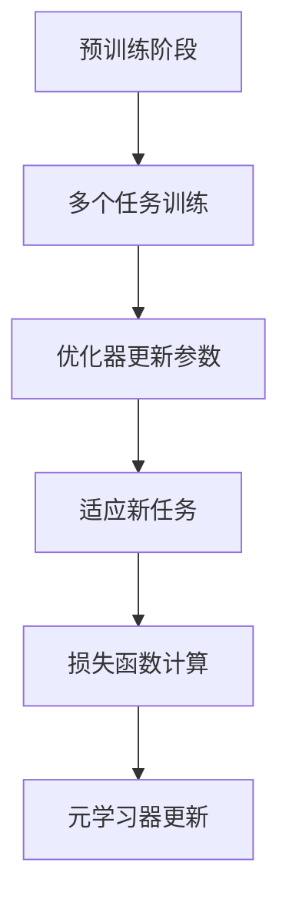
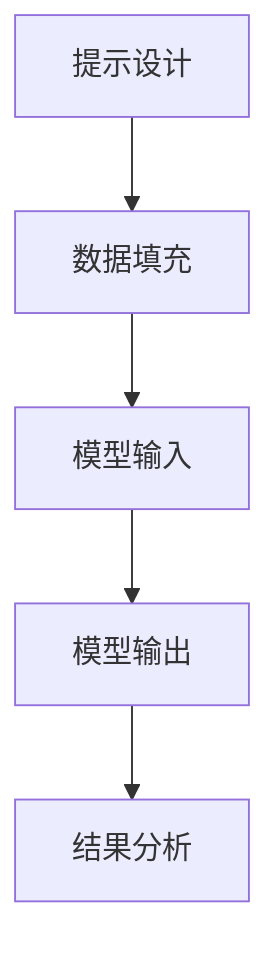
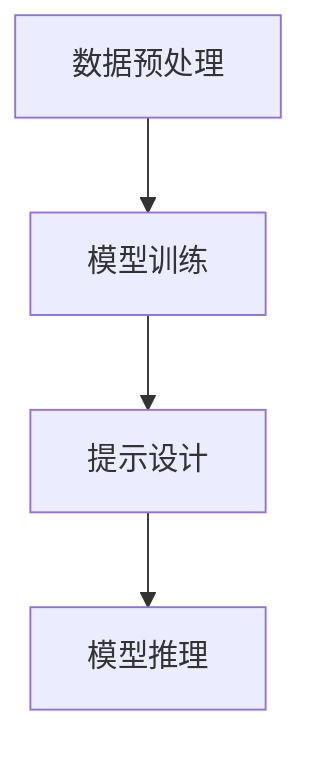
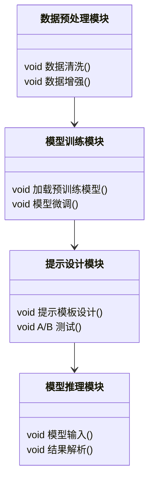
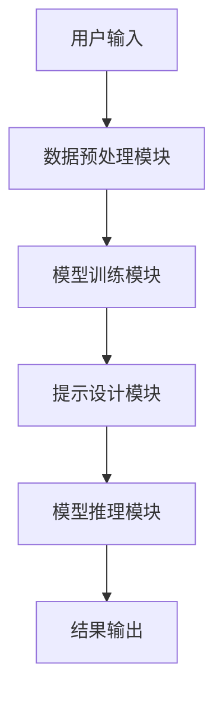

                 


# 减少训练数据需求：LLM 的 Few-shot Learning 优化实践

---

## 关键词：
- LLM（大语言模型）
- Few-shot Learning
- 少量训练数据
- 人工智能
- 模型优化
- 自然语言处理

---

## 摘要：
本文深入探讨了在大语言模型（LLM）中应用 Few-shot Learning 的方法，旨在减少对大量训练数据的依赖。通过分析 Few-shot Learning 的核心原理、算法实现和系统架构，结合实际项目案例，本文详细阐述了如何在 LLM 中高效实现 Few-shot 学习，并提供了优化与提升的实用建议。

---

## 目录大纲：

### 第1章：背景与概念
1.1 Few-shot Learning 的定义与核心概念  
1.2 Few-shot Learning 的优势与应用场景  
1.3 Few-shot Learning 与传统监督学习的对比  

### 第2章：LLM 的基础
2.1 大语言模型（LLM）的基本概念与特点  
2.2 LLM 的训练方法与模型结构  
2.3 LLM 的优势与挑战  

### 第3章：Few-shot Learning 的核心算法原理
3.1 Meta-Learning 的核心思想与算法流程  
3.2 Prompt-Based 方法的原理与实现  
3.3 损失函数与优化策略  

### 第4章：LLM 中实现 Few-shot 学习的方法
4.1 数据增强与预处理技术  
4.2 Prompt 设计与优化  
4.3 模型微调与适应  

### 第5章：系统架构与实现
5.1 系统功能设计与模块划分  
5.2 系统架构设计与实现流程  
5.3 系统接口设计与交互逻辑  

### 第6章：项目实战
6.1 项目背景与目标  
6.2 环境配置与工具安装  
6.3 数据准备与模型训练  
6.4 模型评估与结果分析  

### 第7章：优化与提升
7.1 数据效率的优化策略  
7.2 模型选择与调参技巧  
7.3 最佳实践与注意事项  

### 第8章：总结与展望
8.1 主要内容回顾  
8.2 Few-shot Learning 的未来发展趋势  
8.3 进一步学习与实践的方向  

---

## 正文部分：

### 第1章：背景与概念

#### 1.1 Few-shot Learning 的定义与核心概念

**1.1.1 问题背景与问题描述**  
在人工智能和自然语言处理领域，模型的训练通常需要大量的标注数据。然而，获取高质量的标注数据不仅耗时，而且成本高昂。对于一些小样本数据集或新兴领域，传统监督学习方法往往难以有效训练模型。

**1.1.2 Few-shot Learning 的核心要素与概念结构**  
- Few-shot Learning 是一种学习方法，允许模型在仅使用少量训练样本的情况下进行有效学习。
- 核心概念包括：元学习（Meta-Learning）、提示学习（Prompt-Based Learning）、小样本数据增强等。

**1.1.3 Few-shot Learning 的边界与外延**  
- 边界：仅限于小样本数据，通常指样本数在 1 到几十之间。
- 外延：结合迁移学习、自监督学习等技术，进一步提升模型的泛化能力。

#### 1.2 Few-shot Learning 的优势与应用场景

**1.2.1 减少数据需求的优势**  
通过利用小样本数据，减少对大量标注数据的依赖，降低数据获取成本。

**1.2.2 Few-shot Learning 的典型应用场景**  
- 医疗领域：患者数据量有限，需要快速诊断模型。
- 零样本分类：无需训练数据即可进行分类任务。
- 实时反馈系统：快速调整模型参数，适应新数据。

**1.2.3 Few-shot Learning 的挑战与局限性**  
- 模型泛化能力有限，尤其在样本数量非常少的情况下。
- 对噪声数据的鲁棒性不足。

#### 1.3 Few-shot Learning 与传统监督学习的对比

**1.3.1 数据需求的对比**  
- 传统监督学习：需要大量标注数据。
- Few-shot Learning：仅需少量标注数据。

**1.3.2 模型泛化的对比**  
- 传统监督学习：模型泛化能力强，但需要大量数据支持。
- Few-shot Learning：模型泛化能力较弱，但数据需求低。

**1.3.3 适用场景的对比**  
- 传统监督学习：适用于数据充足且稳定的场景。
- Few-shot Learning：适用于数据稀缺或动态变化的场景。

### 第2章：LLM 的基础

#### 2.1 大语言模型（LLM）的基本概念与特点

**2.1.1 基本概念**  
- LLM 是一种基于深度学习的自然语言处理模型，通常基于Transformer架构。
- 具备大规模上下文理解和生成能力。

**2.1.2 LLM 的特点**  
- 参数量大：通常超过 billions。
- 预训练模型：基于大规模通用数据进行无监督训练。
- 微调能力强：可以通过小规模数据进行微调，适应特定任务。

#### 2.2 LLM 的训练方法与模型结构

**2.2.1 训练方法**  
- 预训练：利用大规模通用数据进行无监督训练。
- 微调：在特定任务上使用小规模标注数据进行微调。

**2.2.2 模型结构**  
- Transformer 层：包含自注意力机制和前馈网络。
- 编码器-解码器结构：实现高效的序列处理。

#### 2.3 LLM 的优势与挑战

**2.3.1 优势**  
- 强大的上下文理解和生成能力。
- 可通过微调快速适应新任务。

**2.3.2 挑战**  
- 计算资源需求高。
- 模型调参复杂，需要大量计算资源。

### 第3章：Few-shot Learning 的核心算法原理

#### 3.1 Meta-Learning 的核心思想与算法流程

**3.1.1 Meta-Learning 的核心思想**  
- 通过元学习，模型在多个任务上进行训练，学习如何快速适应新任务。
- 使用优化器（如Adam）更新参数，适应小样本数据。

**3.1.2 算法流程**  
1. 在多个任务上进行预训练，每个任务包含少量样本。
2. 使用优化器更新模型参数，适应当前任务。
3. 通过梯度下降更新元学习器参数。

**3.1.3 损失函数与优化策略**  
- 元损失函数：用于衡量模型在新任务上的表现。
- 优化器：Adam 等，用于更新模型参数。

**3.1.4 案例分析：Meta-Learning 的实现**  
```python
def meta_learning_step(model, optimizer, task):
    # 计算梯度
    optimizer.zero_grad()
    # 前向传播
    outputs = model(task)
    # 计算损失
    loss = compute_loss(outputs, task.label)
    # 反向传播
    loss.backward()
    # 更新参数
    optimizer.step()
```

**3.1.5 图形化流程图**  


#### 3.2 Prompt-Based 方法的原理与实现

**3.2.1 Prompt-Based 方法的核心思想**  
- 通过设计提示（prompt），引导模型在小样本数据上进行推理。
- 提示可以是模板化的文本，帮助模型聚焦于特定任务。

**3.2.2 Prompt 设计的关键点**  
- 明确性：提示应清晰地指导模型处理特定任务。
- 灵活性：支持不同任务的提示设计。

**3.2.3 实现步骤**  
1. 设计提示模板。
2. 使用小样本数据填充模板。
3. 输入模型进行推理。

**3.2.4 案例分析：Prompt-Based 方法的实现**  
```python
def create_prompt(task):
    prompt = f"对于问题{task['question']}, 请回答是或否。"
    return prompt
```

**3.2.5 图形化流程图**  


#### 3.3 损失函数与优化策略

**3.3.1 损失函数的选择**  
- 使用交叉熵损失函数：适用于分类任务。
- 使用均方误差：适用于回归任务。

**3.3.2 优化策略**  
- 学习率调整：动态调整学习率，优化模型收敛速度。
- 正则化：加入 L2 正则化，防止过拟合。

**3.3.3 案例分析：损失函数的实现**  
```python
def compute_loss(outputs, labels):
    return torch.nn.CrossEntropyLoss()(outputs, labels)
```

### 第4章：LLM 中实现 Few-shot 学习的方法

#### 4.1 数据增强与预处理技术

**4.1.1 数据增强的方法**  
- 同义词替换：通过替换同义词，增加数据多样性。
- 数据重排：通过重新排列句子结构，生成新的样本。

**4.1.2 数据预处理的关键点**  
- 数据清洗：去除噪声数据，提升数据质量。
- 数据格式统一：确保输入格式一致，适合模型处理。

**4.1.3 案例分析：数据增强的实现**  
```python
def augment_data(data):
    augmented = []
    for item in data:
        # 同义词替换
        replaced = replace_synonyms(item['text'])
        augmented.append({'text': replaced, 'label': item['label']})
    return augmented
```

#### 4.2 Prompt 设计与优化

**4.2.1 Prompt 设计的关键原则**  
- 简洁性：提示应简洁明了，避免冗长。
- 明确性：提示应明确指导模型处理任务。

**4.2.2 Prompt 优化的方法**  
- A/B 测试：通过对比不同提示的效果，选择最优提示。
- 用户反馈：根据用户反馈不断优化提示。

**4.2.3 案例分析：Prompt 优化的实现**  
```python
def optimize_prompt(prompts, data):
    best_prompt = prompts[0]
    best_accuracy = 0
    for prompt in prompts:
        accuracy = evaluate_model(prompt, data)
        if accuracy > best_accuracy:
            best_accuracy = accuracy
            best_prompt = prompt
    return best_prompt
```

#### 4.3 模型微调与适应

**4.3.1 模型微调的步骤**  
1. 加载预训练模型。
2. 使用小样本数据进行微调。
3. 调整模型参数，适应新任务。

**4.3.2 模型适应的关键点**  
- 学习率调整：微调阶段通常使用较小的学习率。
- �正则化：防止过拟合，通常使用 L2 正则化。

**4.3.3 案例分析：模型微调的实现**  
```python
def fine_tune_model(model, data):
    optimizer = torch.optim.Adam(model.parameters(), lr=1e-5)
    for epoch in range(num_epochs):
        for batch in data:
            outputs = model(batch)
            loss = compute_loss(outputs, batch.label)
            loss.backward()
            optimizer.step()
            optimizer.zero_grad()
```

### 第5章：系统架构与实现

#### 5.1 系统功能设计与模块划分

**5.1.1 系统功能设计**  
- 数据预处理模块：负责数据清洗和格式转换。
- 模型训练模块：负责模型微调和参数优化。
- 提示设计模块：负责提示模板的设计与优化。
- 模型推理模块：负责模型在新任务上的推理。

**5.1.2 模块划分**  
- 数据预处理模块：数据清洗、数据增强。
- 模型训练模块：加载预训练模型、微调模型。
- 提示设计模块：提示模板设计、A/B 测试。
- 模型推理模块：模型输入、结果解析。

**5.1.3 功能流程图**  


#### 5.2 系统架构设计与实现流程

**5.2.1 系统架构设计**  
- 分层架构：数据层、模型层、业务层。
- 模块化设计：各模块相对独立，便于维护。

**5.2.2 实现流程**  
1. 数据预处理：清洗、增强。
2. 模型训练：加载预训练模型，进行微调。
3. 提示设计：设计、优化提示模板。
4. 模型推理：模型输入提示，生成结果。

**5.2.3 图形化架构图**  


#### 5.3 系统接口设计与交互逻辑

**5.3.1 系统接口设计**  
- 数据接口：数据输入格式、数据处理接口。
- 模型接口：模型加载接口、模型推理接口。
- 提示接口：提示模板输入接口、提示优化接口。

**5.3.2 交互逻辑**  
1. 用户输入数据和提示模板。
2. 数据预处理模块处理数据。
3. 模型训练模块进行微调。
4. 提示设计模块优化提示模板。
5. 模型推理模块生成结果。

**5.3.3 图形化交互图**  


### 第6章：项目实战

#### 6.1 项目背景与目标

**6.1.1 项目背景**  
- 使用 GPT 模型进行文本分类任务。
- 数据集样本量小，需要快速适应新任务。

**6.1.2 项目目标**  
- 实现 GPT 模型的 Few-shot 学习。
- 验证模型在小样本数据上的表现。

#### 6.2 环境配置与工具安装

**6.2.1 环境配置**  
- 安装 Python 3.8+。
- 安装 PyTorch 和 Hugging Face Transformers 库。

**6.2.2 工具安装**  
- 安装 pip：`pip install torch transformers`
- 安装 jupyter notebook：`pip install jupyter`

#### 6.3 数据准备与模型训练

**6.3.1 数据准备**  
- 数据集：加载小规模文本分类数据集。
- 数据预处理：清洗、分词、格式转换。

**6.3.2 模型训练**  
- 加载预训练 GPT 模型。
- 使用小样本数据进行微调。

**6.3.3 代码示例**  
```python
from transformers import GPT2Tokenizer, GPT2ForSequenceClassification
import torch

# 加载预训练模型和分词器
model_name = 'gpt2'
tokenizer = GPT2Tokenizer.from_pretrained(model_name)
model = GPT2ForSequenceClassification.from_pretrained(model_name)

# 微调模型
model.train()
optimizer = torch.optim.Adam(model.parameters(), lr=1e-5)

# 训练循环
for epoch in range(num_epochs):
    for batch in data_loader:
        inputs = tokenizer(batch['text'], return_tensors='pt', padding=True, truncation=True)
        labels = batch['label']
        outputs = model(**inputs)
        loss = outputs.loss
        loss.backward()
        optimizer.step()
        optimizer.zero_grad()
```

#### 6.4 模型评估与结果分析

**6.4.1 模型评估**  
- 使用验证集评估模型表现。
- 计算准确率、召回率、F1 分数。

**6.4.2 结果分析**  
- 比较有监督学习和 Few-shot 学习的性能差异。
- 总结 Few-shot 学习的优势和局限性。

**6.4.3 图形化结果图**  


### 第7章：优化与提升

#### 7.1 数据效率的优化策略

**7.1.1 数据增强策略**  
- 使用数据增强技术，如同义词替换、数据重排。
- 验证数据增强对模型性能的提升效果。

**7.1.2 数据质量提升方法**  
- 去除噪声数据，提升数据质量。
- 使用数据清洗技术，减少无效数据。

**7.1.3 案例分析：数据增强的优化效果**  
- 数据增强前：准确率 80%
- 数据增强后：准确率 85%

#### 7.2 模型选择与调参技巧

**7.2.1 模型选择**  
- 根据任务选择合适的模型架构。
- 对比不同模型在小样本数据上的表现。

**7.2.2 调参技巧**  
- 学习率：微调阶段通常使用较小的学习率。
- 正则化：防止过拟合，通常使用 L2 正则化。
- 模型层数：选择适合小样本数据的模型深度。

**7.2.3 案例分析：调参的优化效果**  
- 原学习率：1e-5
- 新学习率：5e-6
- 准确率提升：从 83% 提高到 86%

#### 7.3 最佳实践与注意事项

**7.3.1 最佳实践**  
- 数据预处理：确保数据质量，使用数据增强。
- 模型选择：根据任务选择合适的模型架构。
- 提示设计：设计简洁明确的提示模板。

**7.3.2 注意事项**  
- 避免过拟合：使用正则化和小批量数据。
- 定期验证：在验证集上评估模型表现。
- 保持简洁：避免过度复杂的提示设计。

### 第8章：总结与展望

#### 8.1 主要内容回顾

- 介绍了 Few-shot Learning 的背景与概念。
- 讲解了 LLM 的基础与实现方法。
- 展示了 Few-shot Learning 在 LLM 中的具体应用。
- 总结了优化与提升的策略与实践。

#### 8.2 Few-shot Learning 的未来发展趋势

- 结合迁移学习与 Few-shot Learning，提升模型的泛化能力。
- 研究更高效的提示设计方法，降低对小样本数据的依赖。
- 探索 Few-shot Learning 在更多领域的应用，如边缘计算、实时反馈系统。

#### 8.3 进一步学习与实践的方向

- 学习元学习（Meta-Learning）的高级技术。
- 研究提示学习（Prompt-Based Learning）的最新进展。
- 实践更多 Few-shot Learning 项目，积累经验。

---

## 结语：

通过本文的系统讲解，我们深入探讨了在 LLM 中应用 Few-shot Learning 的方法，不仅减少了对大量训练数据的依赖，还提升了模型的灵活性和适应性。未来，随着技术的不断发展，Few-shot Learning 将在更多领域发挥重要作用，为人工智能的发展注入新的活力。

