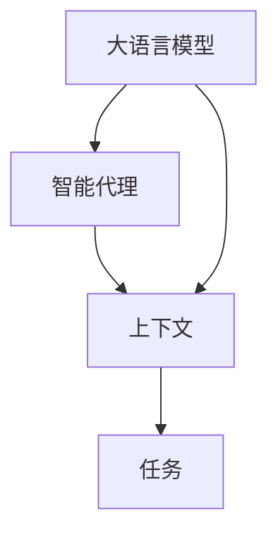

                 

# LLM驱动的AI Agent上下文管理技术

## 关键词：LLM，AI Agent，上下文管理，大语言模型，智能代理，知识库

## 摘要：LLM驱动的AI Agent上下文管理技术探讨了如何利用大语言模型（LLM）驱动的智能代理进行高效的上下文管理。本文从背景、核心概念、算法原理、系统架构、项目实战到总结，全面分析了LLM在AI Agent上下文管理中的应用，提出了具体的实现方案和最佳实践。

---

# 第1章: LLM驱动的AI Agent上下文管理技术背景

## 1.1 LLM与AI Agent的基本概念

### 1.1.1 大语言模型（LLM）的定义与特点
- **定义**：大语言模型是指经过大量文本数据训练的深度学习模型，能够理解和生成人类语言。
- **特点**：
  - 巨量参数：通常拥有 billions 甚至 trillions 的参数。
  - 微调能力：可以通过少量数据进行微调以适应特定任务。
  - 多任务能力：能够处理多种语言理解和生成任务。

### 1.1.2 AI Agent的定义与特点
- **定义**：AI Agent是具有自主决策能力的智能体，能够感知环境并执行任务。
- **特点**：
  - 自主性：能够自主决策。
  - 反应性：能够实时响应环境变化。
  - 学习能力：能够通过经验改进性能。

### 1.1.3 LLM与AI Agent的结合
- LLM作为AI Agent的核心驱动，提供自然语言处理能力，使AI Agent能够理解和生成人类语言。
- AI Agent作为LLM的应用载体，赋予LLM执行复杂任务的能力。

## 1.2 技术背景与应用现状

### 1.2.1 当前LLM技术的发展趋势
- 大模型竞赛：模型参数不断增加，从GPT-3（175B）到GPT-4（超过100,000B）。
- 行业应用广泛：从客服、教育到医疗，覆盖多个领域。

### 1.2.2 AI Agent在各领域的应用现状
- **客服系统**：自动处理客户咨询。
- **智能家居**：控制家庭设备。
- **企业自动化**：处理日常办公任务。

### 1.2.3 LLM驱动的AI Agent的创新点
- 结合LLM强大的语言能力与AI Agent的自主执行能力。
- 实现更智能化和个性化的服务。

## 1.3 问题背景与目标

### 1.3.1 上下文管理的核心问题
- 上下文的有效存储和管理。
- 上下文与任务的关联。

### 1.3.2 LLM驱动的AI Agent上下文管理的目标
- 提供高效、准确的上下文管理，支持智能代理的任务执行。

## 1.4 核心概念与联系

### 1.4.1 LLM与AI Agent的关系
- LLM作为知识库，AI Agent作为执行者。
- LLM提供语言理解能力，AI Agent提供任务执行能力。

### 1.4.2 实体关系图

## 1.5 本章小结
本章介绍了LLM和AI Agent的基本概念，分析了当前技术背景与应用现状，并提出了LLM驱动的AI Agent上下文管理的目标与核心概念。

---

# 第2章: LLM驱动的AI Agent上下文管理核心概念

## 2.1 上下文管理的基本原理

### 2.1.1 上下文的定义与特征
- **定义**：上下文是任务执行过程中所需的相关信息。
- **特征**：
  - 关联性：与任务相关。
  - 动态性：随着任务进展而变化。

### 2.1.2 上下文管理的流程
1. **获取上下文**：通过LLM理解和提取。
2. **存储上下文**：存储相关信息。
3. **更新上下文**：根据任务进展更新。

## 2.2 LLM在上下文管理中的作用

### 2.2.1 LLM作为知识库的作用
- 提供语义理解能力，帮助AI Agent理解上下文。

### 2.2.2 LLM作为决策支持的作用
- 通过生成文本提供决策建议。

## 2.3 上下文与任务的关系

### 2.3.1 上下文对任务的影响
- 上下文提供任务所需的信息，影响任务的执行策略。

### 2.3.2 任务对上下文的影响
- 任务执行结果更新上下文。

## 2.4 核心概念属性对比表

| 概念 | 属性 | 描述 |
|------|------|------|
| LLM  | 输入  | 文本数据 |
| LLM  | 输出  | 文本生成 |
| Agent| 目标  | 用户指定任务 |
| Agent| 行为  | 自动执行任务 |

## 2.5 本章小结
本章详细阐述了上下文管理的基本原理和LLM在其中的作用，通过对比分析明确了核心概念之间的关系。

---

接下来，按照这个大纲，每章内容都会逐步展开，确保逻辑清晰，内容详实。希望这个大纲能为读者提供一个全面了解LLM驱动的AI Agent上下文管理技术的框架。

