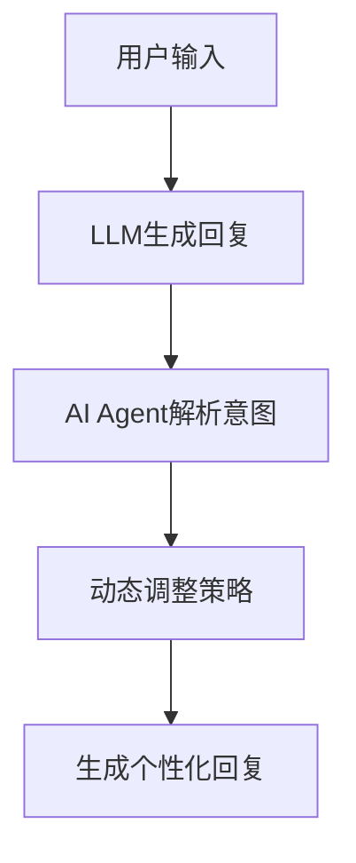
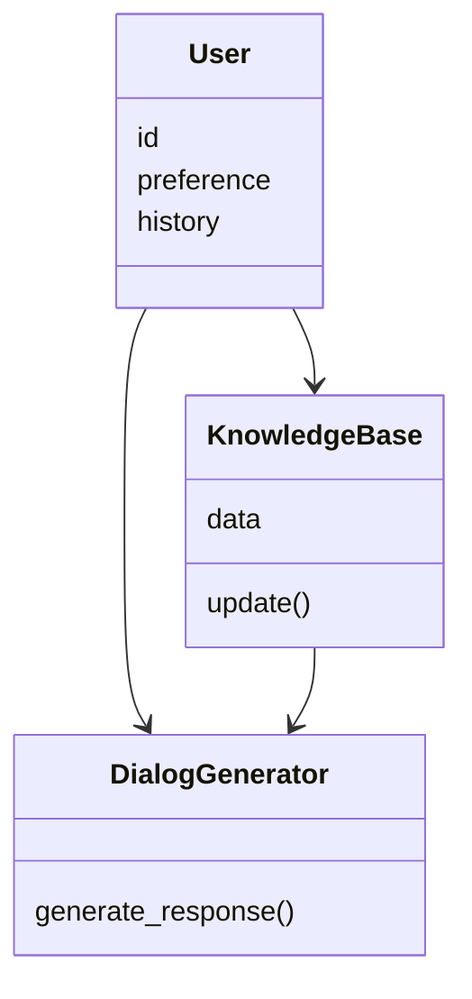
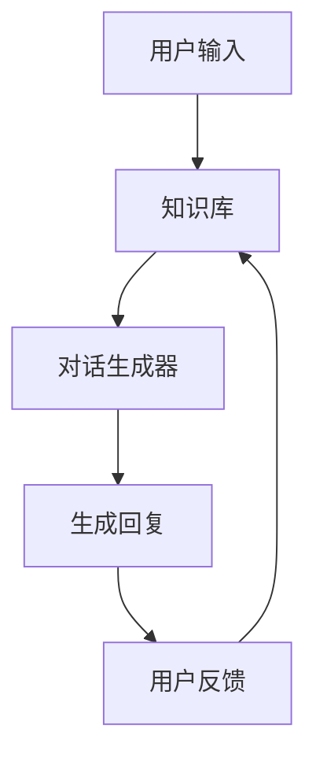
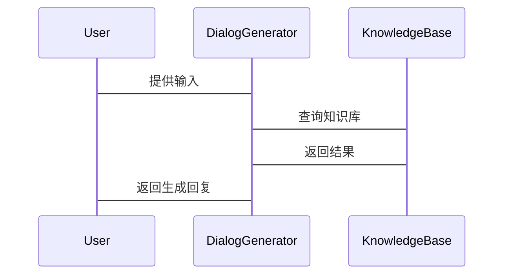

                 


# LLM驱动的AI Agent个性化对话生成

---

## 关键词：
LLM（Large Language Model）、AI Agent、个性化对话生成、自然语言处理、人机交互、对话系统

---

## 摘要：
随着大语言模型（LLM）的快速发展，AI Agent在个性化对话生成中的应用变得越来越重要。本文深入探讨了LLM驱动的AI Agent在个性化对话生成中的核心原理、算法实现、系统架构以及实际应用。通过详细分析LLM与AI Agent的协同工作方式，结合数学模型、mermaid图表和Python代码示例，本文为读者提供了从理论到实践的全面指导。

---

# 第1章: LLM驱动的AI Agent个性化对话生成背景介绍

## 1.1 问题背景与描述
### 1.1.1 当前人机交互的挑战
- 传统的对话系统难以应对复杂多变的用户需求。
- 对话生成的实时性和动态性要求越来越高。
- 用户对个性化交互体验的期望不断提升。

### 1.1.2 LLM在对话生成中的作用
- LLM通过大规模数据训练，能够生成自然流畅的对话内容。
- LLM具备强大的上下文理解和生成能力。
- LLM可以实时调整对话策略，以满足个性化需求。

### 1.1.3 AI Agent的核心目标与边界
- 核心目标：通过LLM实现智能化、个性化的对话生成。
- 边界：仅限于文本对话生成，不涉及非文本交互。

## 1.2 个性化对话生成的必要性
### 1.2.1 用户需求的多样性
- 不同用户有不同的表达习惯和偏好。
- 用户需求可能涉及多个领域，需要灵活应对。

### 1.2.2 对话生成的动态性与实时性
- 对话过程中用户需求可能随时变化。
- 系统需要实时调整生成策略以保持对话流畅性。

### 1.2.3 个性化对话的实现路径
- 基于用户画像的个性化生成。
- 动态调整对话策略以适应用户需求。

## 1.3 LLM驱动的AI Agent解决方案
### 1.3.1 LLM在对话生成中的优势
- 大规模数据训练使得LLM具备强大的语言理解能力。
- 可以通过微调（fine-tuning）适应特定领域的需求。

### 1.3.2 AI Agent的架构与功能
- 知识库管理模块：存储和管理对话相关知识。
- 对话生成模块：基于LLM生成个性化回复。
- 用户意图理解模块：通过NLP技术理解用户需求。

### 1.3.3 解决方案的可行性与局限性
- 可行性：LLM的强大能力使得个性化对话生成成为可能。
- 局限性：需要大量计算资源，且对话生成的实时性可能受限。

## 1.4 核心概念与外延
### 1.4.1 LLM与AI Agent的关系
- LLM作为对话生成器，AI Agent作为决策者，两者协同工作。

### 1.4.2 对话生成的边界与外延
- 边界：仅限于文本对话生成。
- 外延：可以扩展到其他形式的交互，如语音或视觉交互。

### 1.4.3 核心要素与组成结构
- 核心要素：LLM、AI Agent、对话生成模块、用户意图理解模块。
- 组成结构：知识库、对话生成模块、用户意图理解模块。

## 1.5 本章小结
本章从背景出发，详细介绍了LLM驱动的AI Agent在个性化对话生成中的核心概念、优势与局限性，为后续章节的深入分析奠定了基础。

---

# 第2章: LLM与AI Agent的核心原理

## 2.1 LLM的基本原理
### 2.1.1 大语言模型的训练机制
- 基于Transformer架构的模型结构。
- 使用大规模数据进行无监督预训练。

### 2.1.2 概率生成模型的核心原理
- 基于最大似然估计的生成目标。
- 通过解码器生成连续的文本序列。

### 2.1.3 注意力机制的作用
- 注意力机制通过权重分配实现语义理解。
- 解码器端注意力机制用于生成上下文相关的文本。

## 2.2 AI Agent的构成与功能
### 2.2.1 知识库的构建与管理
- 知识库的存储结构。
- 知识库的动态更新机制。

### 2.2.2 对话策略的制定与执行
- 基于用户意图的对话策略制定。
- 动态调整对话策略以适应用户需求。

### 2.2.3 用户意图的理解与反馈
- 通过NLP技术理解用户意图。
- 基于反馈调整对话生成策略。

## 2.3 LLM与AI Agent的协同工作
### 2.3.1 LLM作为对话生成器的角色
- 基于LLM生成个性化回复。
- 通过微调适应特定领域需求。

### 2.3.2 AI Agent作为决策者的角色
- 基于知识库和用户意图制定对话策略。
- 动态调整对话生成模块的参数。

### 2.3.3 两者协同的工作流程
- 用户输入 -> AI Agent解析意图 -> LLM生成回复 -> 用户反馈 -> 动态调整策略。

## 2.4 核心概念对比与联系
### 2.4.1 LLM与传统NLP模型的对比
- LLM的优势：强大的语义理解和生成能力。
- 传统NLP模型的局限性：依赖特定规则和数据。

### 2.4.2 AI Agent与传统对话系统的对比
- AI Agent的优势：具备自主决策能力，能够动态调整对话策略。
- 传统对话系统的局限性：基于固定规则，缺乏灵活性。

### 2.4.3 两者协同的优缺点分析
- 优点：结合了LLM的强大生成能力和AI Agent的自主决策能力。
- 缺点：需要大量计算资源，且对话生成的实时性可能受限。

## 2.5 本章小结
本章详细分析了LLM与AI Agent的核心原理及其协同工作方式，为后续章节的算法实现奠定了理论基础。

---

# 第3章: LLM驱动的对话生成算法

## 3.1 对话生成的算法框架
### 3.1.1 基于LLM的生成式对话模型
- Transformer解码器的结构。
- 基于LLM的生成式对话模型的实现。

### 3.1.2 基于规则的对话生成模型
- 基于预定义规则的生成策略。
- 优缺点分析。

### 3.1.3 混合式对话生成模型
- 结合LLM和规则的生成策略。
- 动态调整生成方式以适应用户需求。

## 3.2 LLM的数学模型与公式
### 3.2.1 变压器模型的结构
- 编码器和解码器的结构。
- 自注意力机制的公式表示：
  $$ \text{Attention}(Q, K, V) = \text{softmax}\left(\frac{QK^T}{\sqrt{d_k}}\right)V $$

### 3.2.2 注意力机制的数学表达
- 查询（Q）、键（K）、值（V）的计算公式：
  $$ Q = W_q x, \quad K = W_k x, \quad V = W_v x $$

### 3.2.3 概率生成模型的
- 生成式模型的损失函数：
  $$ \mathcal{L} = -\sum_{i=1}^n \log p(y_i|x_{<i}) $$

## 3.3 算法实现与代码示例
### 3.3.1 基于LLM的对话生成代码
```python
def generate_response(prompt, model):
    inputs = tokenizer(prompt, return_tensors="pt").to(device)
    with torch.no_grad():
        outputs = model.generate(inputs.input_ids, max_length=100, do_sample=True)
    response = tokenizer.decode(outputs[0], skip_special_tokens=True)
    return response
```

### 3.3.2 对话生成流程图


## 3.4 本章小结
本章详细讲解了基于LLM的对话生成算法及其数学模型，通过代码示例和流程图进一步阐述了算法的实现细节。

---

# 第4章: 系统分析与架构设计

## 4.1 问题场景介绍
- 个性化对话生成的场景分析。
- 系统需要支持的用户需求。

## 4.2 系统功能设计
### 4.2.1 领域模型设计


### 4.2.2 系统架构设计


### 4.2.3 接口设计
- 用户输入接口：`/api/v1/dialog/input`
- 对话生成接口：`/api/v1/dialog/generate`

### 4.2.4 交互序列图


## 4.3 系统实现与优化
### 4.3.1 系统实现
- 知识库的构建与管理。
- 对话生成模块的实现。

### 4.3.2 系统优化
- 基于缓存技术优化对话生成性能。
- 基于分布式架构提升系统扩展性。

## 4.4 本章小结
本章详细分析了系统架构设计，通过领域模型设计和交互序列图进一步阐述了系统的实现细节。

---

# 第5章: 项目实战

## 5.1 环境安装
- 安装Python和相关库：
  ```
  pip install torch transformers
  ```

## 5.2 核心代码实现
### 5.2.1 对话生成模块
```python
import torch
from transformers import AutoTokenizer, AutoModelForCausalLM

tokenizer = AutoTokenizer.from_pretrained("gpt2")
model = AutoModelForCausalLM.from_pretrained("gpt2")

def generate_response(prompt):
    inputs = tokenizer(prompt, return_tensors="pt").to(device)
    with torch.no_grad():
        outputs = model.generate(inputs.input_ids, max_length=100, do_sample=True)
    return tokenizer.decode(outputs[0], skip_special_tokens=True)
```

### 5.2.2 知识库管理模块
```python
class KnowledgeBase:
    def __init__(self, data):
        self.data = data
```

## 5.3 代码解读与分析
- 对话生成模块的代码解读。
- 知识库管理模块的功能分析。

## 5.4 案例分析与实际应用
- 实际案例分析。
- 对话生成的实际应用示例。

## 5.5 项目小结
本章通过实际案例分析和代码实现，详细讲解了LLM驱动的AI Agent个性化对话生成的实现过程。

---

# 第6章: 最佳实践与总结

## 6.1 最佳实践
### 6.1.1 系统优化建议
- 基于缓存技术优化对话生成性能。
- 基于分布式架构提升系统扩展性。

### 6.1.2 开发注意事项
- 注意数据安全和隐私保护。
- 定期更新知识库以保持系统的准确性。

## 6.2 本章小结
本章总结了LLM驱动的AI Agent个性化对话生成的核心内容，并提出了系统的优化建议和开发注意事项。

---

# 附录

## 附录A: 全部代码示例
### 附录A.1 对话生成模块代码
```python
import torch
from transformers import AutoTokenizer, AutoModelForCausalLM

tokenizer = AutoTokenizer.from_pretrained("gpt2")
model = AutoModelForCausalLM.from_pretrained("gpt2")

def generate_response(prompt):
    inputs = tokenizer(prompt, return_tensors="pt").to(device)
    with torch.no_grad():
        outputs = model.generate(inputs.input_ids, max_length=100, do_sample=True)
    return tokenizer.decode(outputs[0], skip_special_tokens=True)
```

### 附录A.2 知识库管理模块代码
```python
class KnowledgeBase:
    def __init__(self, data):
        self.data = data

    def update(self, new_data):
        self.data.update(new_data)
```

---

## 参考文献
1. Transformer论文：《Attention Is All You Need》
2. GPT系列论文
3. 相关NLP领域的经典论文

---

**全文完。**

