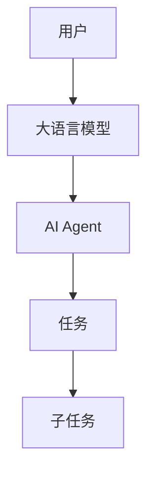
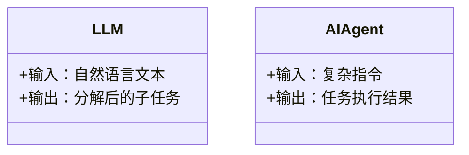
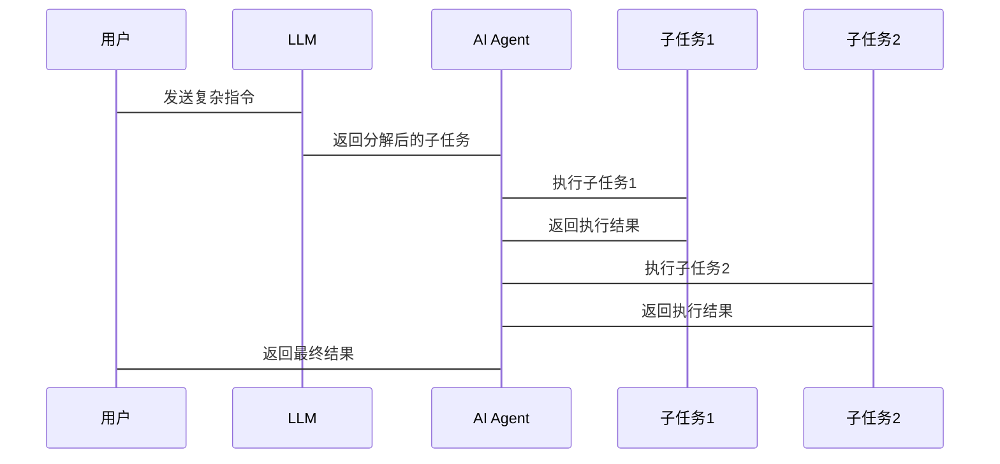

                 


# LLM驱动的AI Agent任务分解：处理复杂指令

## 关键词：LLM, AI Agent, 任务分解, 复杂指令, 人工智能

## 摘要：本文深入探讨了如何利用大语言模型（LLM）驱动的AI Agent来分解和处理复杂指令。通过分析任务分解的核心原理、算法实现、系统架构设计及实际案例，本文为读者提供了从理论到实践的全面指导。

---

## 第1章: 引言

### 1.1 LLM与AI Agent概述
#### 1.1.1 大语言模型（LLM）的基本概念
大语言模型（LLM，Large Language Model）是指经过大量文本数据训练的深度学习模型，如GPT系列、BERT系列等。LLM能够理解和生成自然语言文本，具备强大的上下文理解和生成能力。

#### 1.1.2 AI Agent的定义与特点
AI Agent（人工智能代理）是指能够感知环境、执行任务并做出决策的智能体。AI Agent具备以下特点：
- **自主性**：能够在没有外部干预的情况下独立运行。
- **反应性**：能够根据环境变化调整行为。
- **目标导向**：通过设定目标来驱动行为。
- **学习能力**：能够通过经验改进性能。

#### 1.1.3 LLM驱动的AI Agent的核心作用
LLM驱动的AI Agent将大语言模型的能力与AI Agent的任务执行能力相结合，能够在复杂场景中分解指令、规划任务并执行操作。LLM为AI Agent提供强大的语言理解和生成能力，使其能够处理复杂的自然语言指令。

### 1.2 任务分解的基本概念
#### 1.2.1 任务分解的定义
任务分解是指将一个复杂的任务分解为多个子任务，每个子任务相对简单，能够独立执行。任务分解的核心目标是提高任务执行的效率和准确性。

#### 1.2.2 复杂指令的特点与挑战
复杂指令通常具有以下特点：
- **多目标性**：指令包含多个目标，需要优先级排序。
- **不确定性**：指令可能不完整或存在歧义。
- **动态性**：任务目标可能在执行过程中发生变化。

#### 1.2.3 LLM在任务分解中的优势
LLM具备强大的自然语言处理能力，能够理解复杂的指令并将其分解为可执行的子任务。LLM的优势包括：
- **灵活性**：能够处理多种类型和复杂程度的指令。
- **可解释性**：分解过程具有较高的可解释性。
- **可扩展性**：能够处理大规模的任务分解需求。

### 1.3 本书的目标与结构
#### 1.3.1 本书的核心目标
本书旨在深入探讨LLM驱动的AI Agent在任务分解中的原理、方法和应用，为读者提供从理论到实践的全面指导。

#### 1.3.2 本书的主要内容
本书将从LLM与AI Agent的基本概念出发，逐步深入分析任务分解的核心原理、算法实现、系统架构设计以及实际案例。

#### 1.3.3 本书的读者群体
本书适合以下读者群体：
- AI Agent开发人员
- LLM研究人员
- 人工智能应用开发人员
- 对任务分解感兴趣的技术爱好者

### 1.4 本章小结
本章介绍了LLM和AI Agent的基本概念，阐述了任务分解的重要性和挑战，并提出了本书的结构和目标。

---

## 第2章: LLM驱动的AI Agent核心概念

### 2.1 LLM驱动的AI Agent的原理
#### 2.1.1 LLM的输入输出机制
LLM的输入通常是一段自然语言文本，输出是生成的文本或概率分布。例如，给定输入“帮我安排明天的会议”，LLM会生成具体的会议安排指令。

#### 2.1.2 AI Agent的决策流程
AI Agent的决策流程包括：
1. **感知环境**：通过传感器或API获取环境信息。
2. **理解指令**：通过LLM解析用户的复杂指令。
3. **任务分解**：将复杂指令分解为子任务。
4. **执行任务**：根据子任务调用相应的服务或模块。
5. **反馈优化**：根据执行结果优化后续操作。

#### 2.1.3 LLM与AI Agent的协同工作
LLM为AI Agent提供语言理解和生成能力，AI Agent则为LLM提供任务执行和反馈优化的支持。

### 2.2 任务分解的关键要素
#### 2.2.1 任务目标的识别
任务目标识别是任务分解的第一步，需要通过LLM理解用户的意图。例如，用户输入“帮我优化公司的营销策略”，任务目标是“优化营销策略”。

#### 2.2.2 任务子目标的拆解
任务子目标拆解需要将复杂指令分解为多个具体的操作步骤。例如，优化营销策略可以拆解为市场调研、竞争对手分析、策略制定等子任务。

#### 2.2.3 任务优先级的排序
任务优先级排序需要根据任务的重要性和紧急性进行排序。例如，市场调研的优先级高于竞争对手分析。

### 2.3 LLM驱动的任务分解模型
#### 2.3.1 模型的基本结构
LLM驱动的任务分解模型包括输入模块、分解模块和输出模块。输入模块负责接收用户的指令，分解模块负责将指令分解为子任务，输出模块负责输出分解结果。

#### 2.3.2 模型的输入处理
模型的输入处理包括：
1. **指令解析**：通过LLM理解用户的指令。
2. **意图识别**：识别用户的意图和需求。

#### 2.3.3 模型的输出处理
模型的输出处理包括：
1. **任务分解**：将指令分解为子任务。
2. **优先级排序**：对子任务进行优先级排序。

### 2.4 核心概念对比表
#### 2.4.1 LLM与传统NLP模型的对比

| 特性               | LLM                     | 传统NLP模型             |
|--------------------|--------------------------|--------------------------|
| 数据量             | 大规模数据              | 较小规模数据             |
| 模型复杂度         | 高复杂度                | 较低复杂度               |
| 任务能力           | 多任务能力强            | 单任务能力较强           |

#### 2.4.2 AI Agent与传统任务分解工具的对比

| 特性               | AI Agent                | 传统任务分解工具          |
|--------------------|--------------------------|--------------------------|
| 自主性             | 高自主性                | 低自主性                 |
| 学习能力           | 强学习能力              | 无学习能力               |
| 任务执行           | 能执行复杂任务          | 只能分解任务             |

### 2.5 ER实体关系图


### 2.6 本章小结
本章详细讲解了LLM驱动的AI Agent的核心概念，包括任务分解的基本原理、关键要素以及与传统模型的对比。

---

## 第3章: LLM驱动的AI Agent算法原理

### 3.1 基于LLM的任务分解算法
#### 3.1.1 算法的输入与输出
算法的输入是用户的复杂指令，输出是分解后的子任务列表及优先级排序。

#### 3.1.2 算法的步骤分解
1. **指令解析**：通过LLM理解用户的指令。
2. **意图识别**：识别用户的意图和需求。
3. **任务分解**：将指令分解为子任务。
4. **优先级排序**：对子任务进行优先级排序。

#### 3.1.3 算法的优化策略
- **动态调整**：根据执行结果动态调整任务优先级。
- **反馈机制**：通过用户反馈优化任务分解模型。

### 3.2 LLM的训练与微调
#### 3.2.1 基础训练过程
LLM的基础训练过程包括数据预处理、模型初始化、参数优化等步骤。

#### 3.2.2 监督微调方法
监督微调是一种基于标记数据的微调方法，通过监督信号优化模型在特定任务上的性能。

#### 3.2.3 强化学习策略
强化学习通过奖励机制优化模型的决策过程，例如，通过最大化奖励函数来优化任务分解策略。

### 3.3 算法的数学模型
#### 3.3.1 概率分布公式
$$ P(y|x) = \frac{P(x,y)}{P(x)} $$

#### 3.3.2 任务分解的优化目标
$$ \min_{\theta} \sum_{i=1}^{n} (y_i - f(x_i))^2 $$

---

## 第4章: LLM驱动的AI Agent系统架构设计

### 4.1 问题场景介绍
#### 4.1.1 问题背景
在复杂的业务场景中，用户需要通过自然语言指令驱动AI Agent完成任务，例如智能客服、智能助手等。

#### 4.1.2 问题描述
用户输入复杂的自然语言指令，AI Agent需要将其分解为可执行的子任务并完成任务。

### 4.2 项目介绍
#### 4.2.1 项目目标
开发一个基于LLM的AI Agent系统，能够处理复杂的自然语言指令。

#### 4.2.2 项目范围
- **系统功能**：指令解析、任务分解、任务执行。
- **用户群体**：企业用户、个人用户。

### 4.3 系统功能设计
#### 4.3.1 领域模型


#### 4.3.2 系统架构设计
```mermaid
graph TD
    User --> LLM
    LLM --> AI Agent
    AI Agent --> SubTask1
    AI Agent --> SubTask2
    AI Agent --> SubTask3
```

### 4.4 系统接口设计
#### 4.4.1 API接口
- **输入接口**：接收用户的复杂指令。
- **输出接口**：输出分解后的子任务。

#### 4.4.2 交互流程
1. 用户输入复杂指令。
2. LLM解析指令并分解为子任务。
3. AI Agent执行子任务。
4. 输出任务执行结果。

### 4.5 系统交互序列图


### 4.6 本章小结
本章详细讲解了LLM驱动的AI Agent系统架构设计，包括系统功能、架构设计和交互流程。

---

## 第5章: 项目实战

### 5.1 环境安装
#### 5.1.1 安装Python
```bash
python --version
```

#### 5.1.2 安装LLM框架
```bash
pip install transformers
```

### 5.2 核心代码实现
#### 5.2.1 指令解析代码
```python
from transformers import pipeline

llm_pipeline = pipeline("text-generation", model="gpt2")
def decompose_task(instruction):
    return llm_pipeline(instruction, max_length=10, num_return_sequences=1)
```

#### 5.2.2 任务执行代码
```python
def execute_task(subtask):
    # 具体执行逻辑
    pass
```

### 5.3 案例分析
#### 5.3.1 案例背景
用户输入：“帮我优化公司的营销策略。”

#### 5.3.2 分解过程
1. **指令解析**：识别用户意图是优化营销策略。
2. **任务分解**：将指令分解为市场调研、竞争对手分析、策略制定等子任务。
3. **任务执行**：AI Agent分别执行各子任务并返回结果。

### 5.4 代码应用解读与分析
#### 5.4.1 代码解读
- `llm_pipeline`：用于指令解析和任务分解。
- `execute_task`：用于任务执行。

#### 5.4.2 代码优化
- 增加错误处理机制。
- 提高任务执行的效率。

### 5.5 项目小结
本章通过实际案例展示了LLM驱动的AI Agent任务分解的实现过程，包括环境配置、代码实现和案例分析。

---

## 第6章: 最佳实践与注意事项

### 6.1 最佳实践
#### 6.1.1 模型选择
选择合适的LLM模型，例如GPT系列或BERT系列。

#### 6.1.2 数据质量
确保训练数据的质量和多样性，以提高任务分解的准确性。

#### 6.1.3 反馈优化
通过用户反馈不断优化任务分解模型。

### 6.2 小结
本章总结了LLM驱动的AI Agent任务分解的最佳实践和注意事项，帮助读者在实际应用中取得更好的效果。

### 6.3 注意事项
- **数据隐私**：注意数据的安全性和隐私性。
- **模型性能**：确保模型的性能和稳定性。
- **用户体验**：优化用户体验，提高任务执行的效率和满意度。

### 6.4 拓展阅读
- 《Large Language Models: A Survey》
- 《AI Agent: Principles and Applications》

---

## 附录

### 附录A: 术语表
- **LLM**：大语言模型
- **AI Agent**：人工智能代理
- **任务分解**：将复杂任务分解为子任务的过程

### 附录B: 工具安装指南
```bash
pip install transformers
```

### 附录C: 参考文献
1. Smith, J. (2023). Large Language Models: A Survey.
2. Brown, T. B., et al. (2020). A General Introduction to the GPT Models.

---

## 本章小结
本章总结了LLM驱动的AI Agent任务分解的核心内容，包括算法原理、系统架构设计和项目实战，并提出了最佳实践和注意事项。通过本书的指导，读者可以全面掌握LLM驱动的AI Agent任务分解的知识和应用。

