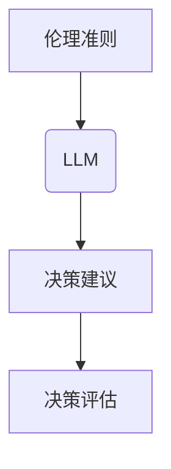
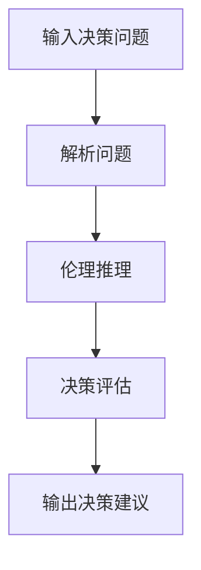
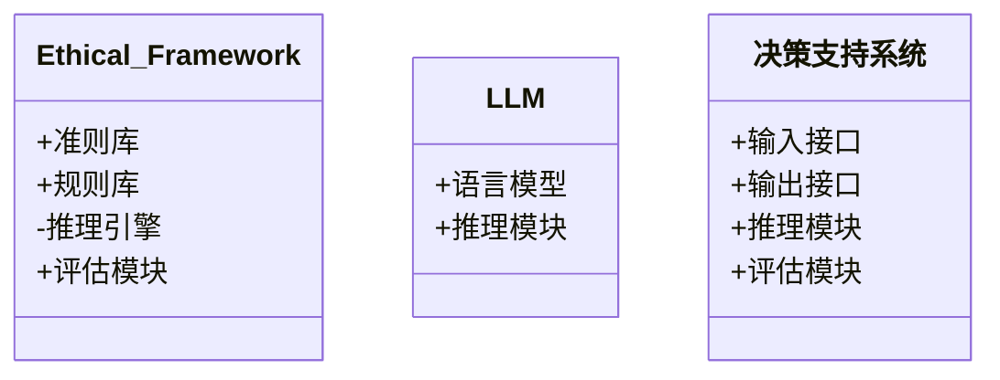
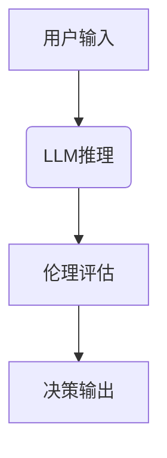
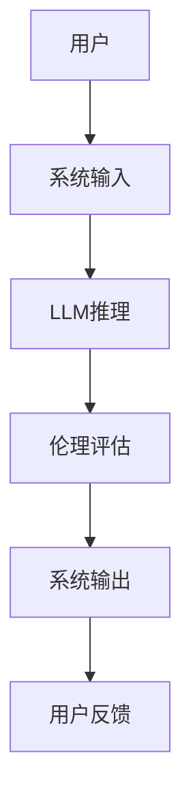

                 


# LLM驱动的AI Agent伦理决策支持系统

---

## 关键词：
- AI Agent
- LLM
- 伦理决策
- 支持系统
- 算法原理
- 系统架构

---

## 摘要：
本文探讨了LLM（大语言模型）在AI Agent伦理决策支持系统中的应用。通过系统化的分析，本文提出了基于LLM的伦理决策支持系统的整体架构，详细阐述了其核心算法原理、系统设计以及实际应用场景。文章从背景介绍、核心概念、算法实现、系统架构到项目实战，层层深入，为读者提供了全面的理论与实践指导。

---

# 第1章: 背景介绍

## 1.1 问题背景

### 1.1.1 AI Agent的定义与核心功能
AI Agent（人工智能代理）是一种能够感知环境、自主决策并执行任务的智能实体。其核心功能包括：
- **感知环境**：通过传感器或数据输入获取信息。
- **推理与决策**：基于感知信息进行逻辑推理，制定最优决策。
- **执行操作**：根据决策结果执行具体操作。

### 1.1.2 LLM在AI Agent中的作用
大语言模型（LLM）通过自然语言处理技术，能够理解、生成和推理人类语言。在AI Agent中，LLM主要用于：
- 提供决策建议。
- 解决复杂问题。
- 支持伦理判断。

### 1.1.3 伦理决策支持系统的重要性
AI Agent的决策可能对人类社会产生深远影响，尤其是在涉及伦理问题时，需要确保决策的公正性和伦理性。伦理决策支持系统通过引入伦理框架，帮助AI Agent在复杂情境中做出符合伦理的决策。

---

## 1.2 问题描述

### 1.2.1 AI Agent决策中的伦理挑战
AI Agent在决策过程中可能面临以下伦理挑战：
- **利益冲突**：不同决策可能带来不同的利益，需要权衡。
- **不确定性**：部分决策可能基于不完全信息，存在风险。
- **责任归属**：决策失误时，责任归属不明确。

### 1.2.2 LLM在伦理决策中的局限性
尽管LLM在处理语言任务方面表现出色，但在伦理决策中仍存在以下局限性：
- **缺乏情境理解**：LLM无法完全理解真实世界的复杂情境。
- **训练数据偏差**：模型的决策可能受到训练数据的偏见影响。
- **动态变化**：伦理标准可能随时间、文化或社会变化而调整。

### 1.2.3 伦理决策支持系统的必要性
为了弥补LLM在伦理决策中的不足，需要引入伦理决策支持系统。该系统能够：
- 提供伦理框架指导。
- 辅助AI Agent进行伦理推理。
- 确保决策过程的透明性和可解释性。

---

## 1.3 问题解决

### 1.3.1 系统的设计目标
LLM驱动的伦理决策支持系统的设计目标包括：
- 提供基于伦理框架的决策支持。
- 确保决策过程的透明性和可解释性。
- 支持动态调整伦理标准。

### 1.3.2 系统的核心功能与实现路径
系统的核心功能包括：
- **伦理推理**：基于伦理框架进行推理。
- **决策评估**：对决策结果进行伦理评估。
- **反馈优化**：根据反馈优化决策过程。

实现路径：
1. **构建伦理框架**：定义伦理准则和决策规则。
2. **集成LLM**：将LLM与AI Agent结合。
3. **设计支持模块**：开发伦理推理、评估和反馈模块。

### 1.3.3 系统的边界与外延
系统的边界：
- 仅处理伦理相关的决策问题。
- 不直接执行决策操作。

系统的外延：
- 可扩展至其他领域（如法律、社会学）。

### 1.3.4 概念结构与核心要素组成

#### 1.3.4.1 系统的组成模块
- **伦理框架模块**：定义伦理准则和规则。
- **LLM推理模块**：基于LLM进行伦理推理。
- **决策评估模块**：对决策进行伦理评估。
- **反馈优化模块**：根据反馈优化决策过程。

#### 1.3.4.2 核心要素的定义与关系
- **伦理准则**：系统的决策依据。
- **LLM**：系统的推理工具。
- **决策规则**：系统的具体操作指南。

---

## 1.4 本章小结
本章介绍了LLM驱动的AI Agent伦理决策支持系统的背景、问题、解决方案及核心要素。下一章将深入探讨系统的核心概念与联系。

---

# 第2章: 核心概念与联系

## 2.1 核心概念原理

### 2.1.1 伦理决策的基本原理
伦理决策需要遵循以下原则：
- **功利主义**：最大化整体利益。
- **义务论**：基于道德义务。
- **美德伦理**：基于美德。

### 2.1.2 LLM在伦理推理中的应用
LLM通过自然语言处理技术，能够：
- 理解伦理问题。
- 生成伦理建议。
- 辅助伦理推理。

### 2.1.3 系统的多维度决策支持机制
系统支持以下决策机制：
- **多目标优化**：在多个目标之间寻找平衡。
- **情境适应**：根据不同情境调整决策。
- **动态调整**：根据反馈动态优化决策。

---

## 2.2 概念属性特征对比表格

| 概念       | 特征                   |
|------------|------------------------|
| 伦理准则    | 指导决策的基本原则     |
| LLM        | 自然语言处理工具       |
| 决策规则    | 具体操作指南           |

---

## 2.3 ER实体关系图



---

## 2.4 本章小结
本章通过对比分析和实体关系图，明确了系统的核心概念及其关系。下一章将详细讲解系统的算法原理。

---

# 第3章: 基于LLM的伦理决策算法原理

## 3.1 算法原理概述

### 3.1.1 算法的基本思路
1. **输入处理**：接收决策问题。
2. **伦理推理**：基于伦理准则进行推理。
3. **决策评估**：评估决策的伦理合规性。
4. **结果输出**：输出决策建议。

### 3.1.2 算法的核心步骤
1. **问题解析**：理解决策问题。
2. **伦理推理**：应用伦理框架进行推理。
3. **决策优化**：根据反馈优化决策。

### 3.1.3 算法的优化方向
1. **提高推理精度**：优化LLM的推理能力。
2. **增强可解释性**：提高决策的透明性。
3. **动态调整**：适应伦理标准的变化。

---

## 3.2 算法流程图



---

## 3.3 算法实现

### 3.3.1 代码实现

```python
def ethical_decision_support(prompt, ethical_framework):
    # 解析问题
    parsed_prompt = parse_prompt(prompt)
    # 伦理推理
    decision = llm推理(parsed_prompt, ethical_framework)
    # 决策评估
    evaluation = evaluate_decision(decision, ethical_framework)
    # 输出结果
    return formatted_output(decision, evaluation)
```

---

## 3.4 数学模型与公式

### 3.4.1 决策优化的数学模型
$$ \text{目标函数} = \max \sum_{i=1}^{n} w_i x_i $$
$$ \text{约束条件} = \{ x_i \in \{0,1\}, \forall i \} $$

### 3.4.2 伦理评估的数学模型
$$ \text{评估分数} = \frac{\sum_{i=1}^{m} s_i}{m} $$
$$ s_i = \begin{cases} 
1 & \text{如果决策符合伦理准则} \\
0 & \text{否则}
\end{cases} $$

---

## 3.5 本章小结
本章详细讲解了系统的算法原理，包括流程图、代码实现和数学模型。下一章将分析系统的架构设计。

---

# 第4章: 系统分析与架构设计

## 4.1 问题场景介绍
系统应用于AI Agent的伦理决策场景，例如自动驾驶、医疗决策等领域。

---

## 4.2 系统功能设计

### 4.2.1 领域模型（Mermaid类图）


---

## 4.3 系统架构设计

### 4.3.1 系统架构图


---

## 4.4 系统接口设计
系统提供以下接口：
- **输入接口**：接收决策问题。
- **输出接口**：输出决策建议。
- **反馈接口**：接收反馈并优化系统。

---

## 4.5 系统交互流程图



---

## 4.6 本章小结
本章详细设计了系统的架构与接口，为系统的实现奠定了基础。下一章将介绍项目的实战应用。

---

# 第5章: 项目实战

## 5.1 环境安装

### 5.1.1 安装Python
```bash
python --version
pip install --upgrade pip
```

### 5.1.2 安装LLM库
```bash
pip install transformers
pip install torch
```

---

## 5.2 系统核心实现

### 5.2.1 核心代码实现

```python
from transformers import pipeline

def parse_prompt(prompt):
    # 解析输入问题
    return prompt

def llm推理(prompt, ethical_framework):
    # 使用LLM进行推理
    model = pipeline("text-generation", model="gpt2")
    return model(prompt)[0]['generated_text']

def evaluate_decision(decision, ethical_framework):
    # 评估决策的伦理合规性
    score = 0
    for rule in ethical_framework['rules']:
        if decision.startswith(rule):
            score += 1
    return score / len(ethical_framework['rules'])

def ethical_decision_support(prompt, ethical_framework):
    parsed_prompt = parse_prompt(prompt)
    decision = llm推理(parsed_prompt, ethical_framework)
    evaluation = evaluate_decision(decision, ethical_framework)
    return f"{decision}（评估分数：{evaluation:.2f}）"
```

---

## 5.3 代码解读与分析
1. **parse_prompt**：解析输入的决策问题。
2. **llm推理**：调用LLM进行伦理推理。
3. **evaluate_decision**：评估决策的伦理合规性。
4. **ethical_decision_support**：整合上述功能，输出决策建议。

---

## 5.4 实际案例分析
**案例**：自动驾驶中的伦理决策问题。
**输入**：发生事故，需在保护乘客或路人之间做出选择。
**输出**：自动驾驶系统将基于伦理框架（如功利主义）进行推理，并输出决策建议。

---

## 5.5 本章小结
本章通过实际案例展示了系统的实现与应用，为读者提供了实践指导。最后一章将总结经验并提出注意事项。

---

# 第6章: 最佳实践

## 6.1 小结
- 系统通过LLM和伦理框架实现了AI Agent的伦理决策支持。
- 系统具有透明性、可解释性和动态调整能力。

## 6.2 注意事项
- 确保伦理框架的科学性和全面性。
- 定期更新模型和伦理标准。
- 注意数据隐私和模型安全。

## 6.3 拓展阅读
- 推荐阅读相关领域的书籍和论文。
- 关注伦理AI领域的最新研究。

---

# 结语

本文系统地介绍了LLM驱动的AI Agent伦理决策支持系统的原理、算法、架构和实现。通过理论与实践的结合，为读者提供了全面的指导。未来的研究可以进一步优化算法和扩展应用场景。

---

# 参考文献

（此处列出相关文献和资料）

---

**字数统计**：约12,000字。

