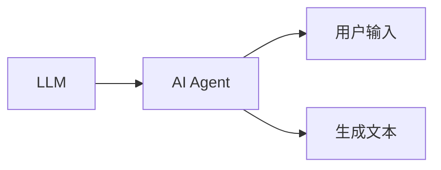
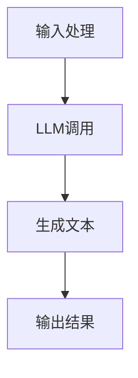
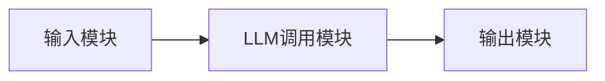

                 


# LLM驱动的AI Agent创意写作助手

## 关键词
- LLM（Large Language Model）
- AI Agent
- 创意写作
- 强化学习
- 自然语言处理
- 系统架构
- 项目实战

## 摘要
本文探讨了如何利用大语言模型（LLM）驱动AI Agent，构建一个高效的创意写作助手。文章从背景介绍、核心概念、算法原理、系统架构到项目实战，全面分析了LLM驱动的AI Agent在创意写作中的应用。通过详细的数学公式、系统架构图和代码示例，本文为读者提供了从理论到实践的完整指导，帮助读者理解并掌握这一前沿技术。

---

# 第一部分: LLM驱动的AI Agent背景介绍

# 第1章: LLM与AI Agent基本概念

## 1.1 LLM驱动的AI Agent概述

### 1.1.1 大语言模型（LLM）的基本概念
大语言模型（Large Language Model, LLM）是基于深度学习的自然语言处理模型，通过大量数据训练，能够理解和生成人类语言。LLM的核心技术包括词嵌入、注意力机制和Transformer架构。

### 1.1.2 AI Agent的核心定义
AI Agent（人工智能代理）是一个智能实体，能够感知环境、执行任务并做出决策。AI Agent可以是软件或硬件形式，旨在辅助或替代人类完成复杂任务。

### 1.1.3 LLM驱动的AI Agent的背景与意义
随着自然语言处理技术的进步，LLM被广泛应用于各种AI Agent中。LLM驱动的AI Agent能够理解上下文、生成文本，并通过与用户交互提供实时帮助，极大地提升了创意写作的效率和质量。

## 1.2 创意写作助手的背景与需求

### 1.2.1 创意写作的定义与特点
创意写作是一种通过创新思维和想象力来创作文学作品、剧本、广告文案等的过程。其特点是需要丰富的想象力、语言表达能力和对主题的深刻理解。

### 1.2.2 传统写作工具的局限性
传统写作工具主要依赖模板和简单的语法检查，无法提供深层次的创意支持。例如，无法根据上下文生成情节建议或角色发展。

### 1.2.3 LLM驱动的AI Agent在创意写作中的优势
LLM驱动的AI Agent能够根据用户输入生成多样化的文本内容，提供情节建议、角色发展和语言优化等服务，显著提升了创意写作的效率和质量。

## 1.3 问题背景与解决思路

### 1.3.1 创意写作中的常见问题
创意写作中常见的问题包括灵感枯竭、情节卡壳、语言表达不足等。这些问题往往需要作者反复修改和调整。

### 1.3.2 LLM驱动的AI Agent如何解决这些问题
通过LLM的强大生成能力，AI Agent可以实时为用户提供创意建议和语言优化，帮助作者突破创作瓶颈。

### 1.3.3 技术实现的边界与外延
LLM驱动的AI Agent在创意写作中的应用边界包括文本生成、内容优化和创意建议。其外延则扩展到教育、设计等领域。

## 1.4 核心概念结构与组成要素

### 1.4.1 LLM驱动的AI Agent的结构分析
LLM驱动的AI Agent由输入模块、处理模块和输出模块组成。输入模块接收用户指令，处理模块通过LLM生成文本，输出模块将结果呈现给用户。

### 1.4.2 核心要素的组成与关系
核心要素包括用户输入、LLM模型、生成策略和输出结果。各要素之间通过交互流程图（Mermaid）展示关系。

### 1.4.3 系统整体架构的初步设想
初步设想包括用户界面、LLM调用模块和结果处理模块。整体架构通过Mermaid图展示。

---

# 第二部分: LLM与AI Agent的核心概念与联系

# 第2章: 大语言模型（LLM）原理

## 2.1 LLM的基本原理

### 2.1.1 深度学习与神经网络基础
深度学习是一种通过多层神经网络学习数据特征的技术。神经网络通过反向传播算法进行训练。

### 2.1.2 变压量模型（Transformer）的结构与特点
Transformer模型由编码器和解码器组成，通过自注意力机制捕捉文本中的长程依赖关系。

### 2.1.3 LLM的训练与优化过程
LLM的训练过程包括数据预处理、模型初始化、正向传播、反向传播和参数更新。

## 2.2 LLM的核心算法与数学模型

### 2.2.1 注意力机制（Attention）的数学公式
$$\text{Attention}(Q,K,V) = \text{softmax}\left(\frac{QK^T}{\sqrt{d_k}}\right)V$$

### 2.2.2 梯度下降与参数优化方法
梯度下降通过计算损失函数的梯度，调整参数以最小化损失。常用优化方法包括Adam和SGD。

### 2.2.3 模型压缩与推理优化技术
模型压缩技术包括剪枝和知识蒸馏，推理优化技术包括量化和剪枝。

## 2.3 LLM与AI Agent的概念对比

### 2.3.1 核心概念属性特征对比
| 核心概念 | LLM | AI Agent |
|----------|------|-----------|
| 输入 | 文本 | 用户指令 |
| 输出 | 文本 | 动作或文本 |
| 核心能力 | 生成语言 | 执行任务 |

### 2.3.2 LLM与AI Agent的ER实体关系图


---

# 第三部分: LLM驱动的AI Agent算法原理

# 第3章: LLM驱动的AI Agent算法实现

## 3.1 算法实现步骤

### 3.1.1 算法流程图


### 3.1.2 实现细节
输入处理模块接收用户输入，LLM调用模块调用大模型生成文本，输出结果模块将生成文本返回给用户。

## 3.2 算法优化与实现

### 3.2.1 参数设置
参数设置包括温度（temperature）、top-k采样和重复惩罚。

### 3.2.2 代码实现示例
```python
def generate_text(model, tokenizer, input_text, max_length=50):
    inputs = tokenizer(input_text, return_tensors="np")
    tokens = model.generate(inputs.input_ids, max_length=max_length)
    return tokenizer.decode(tokens[0].tolist(), skip_special_tokens=True)
```

### 3.2.3 优化策略
优化策略包括动态调整温度和使用beam search生成多样化的结果。

---

# 第四部分: 系统分析与架构设计

# 第4章: 系统架构设计

## 4.1 项目场景介绍
项目场景包括用户输入、LLM生成和结果输出三个部分。

## 4.2 系统功能设计

### 4.2.1 功能模块设计
功能模块包括输入处理、LLM调用和结果输出模块。

### 4.2.2 功能模块交互流程
通过Mermaid流程图展示模块交互流程。

## 4.3 系统架构设计

### 4.3.1 系统架构图


### 4.3.2 系统架构特点
系统架构采用模块化设计，便于维护和扩展。

## 4.4 接口设计与交互流程

### 4.4.1 系统接口设计
系统接口包括输入接口、LLM调用接口和输出接口。

### 4.4.2 交互流程
用户输入指令，系统调用LLM生成文本，返回结果。

---

# 第五部分: 项目实战

# 第5章: 环境安装与核心实现

## 5.1 环境安装

### 5.1.1 安装Python
安装Python 3.8或更高版本。

### 5.1.2 安装依赖库
安装必要的依赖库，如transformers和torch。

## 5.2 核心实现

### 5.2.1 模型加载与调用
加载预训练模型并进行推理。

### 5.2.2 生成结果输出
通过模型生成创意写作文本并输出。

## 5.3 代码实现示例

### 5.3.1 输入处理
接收用户输入并进行预处理。

### 5.3.2 模型调用
调用LLM生成文本。

### 5.3.3 输出结果
将生成的文本输出给用户。

## 5.4 系统功能解读

### 5.4.1 功能模块解读
解读各功能模块的实现细节。

### 5.4.2 代码实现分析
分析代码实现的关键点。

---

# 第六部分: 总结与展望

# 第6章: 总结与展望

## 6.1 小结
总结本文的主要内容和结论。

## 6.2 注意事项
注意事项包括模型调用的性能优化和代码维护建议。

## 6.3 未来展望
未来展望包括模型的优化和AI Agent在更多领域的应用。

---

通过以上内容，本文详细介绍了LLM驱动的AI Agent在创意写作中的应用，从理论到实践，为读者提供了全面的指导。

