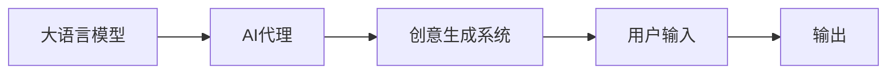
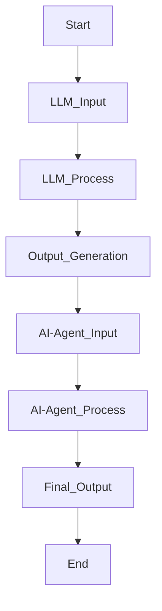
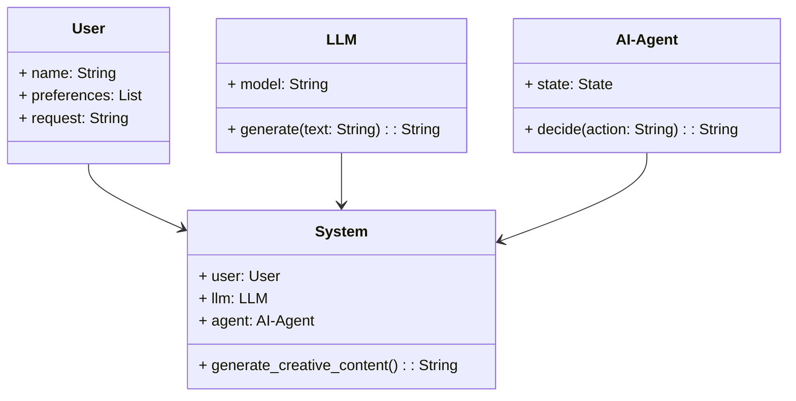
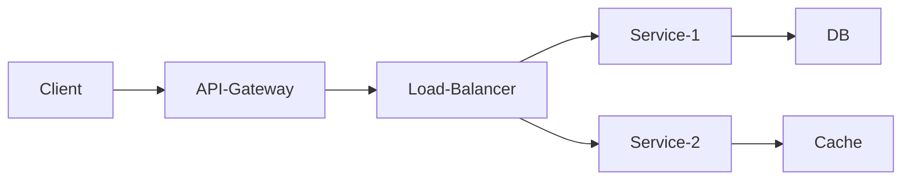
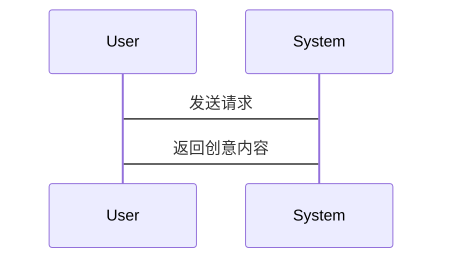

                 


# LLM驱动的AI Agent创意生成系统

> 关键词：LLM, AI Agent, 创意生成系统, 大语言模型, 人工智能, 创意设计, 系统架构

> 摘要：本文详细探讨了LLM驱动的AI Agent创意生成系统，从背景介绍、核心概念到算法原理、系统架构，再到项目实战和最佳实践，系统性地分析了该系统的构建与应用。通过理论与实践结合，展示了如何利用大语言模型与AI代理技术实现智能化创意生成。

---

## 第1章: LLM驱动的AI Agent创意生成系统背景介绍

### 1.1 问题背景

随着人工智能技术的飞速发展，大语言模型（LLM）和AI代理（AI Agent）逐渐成为技术领域的焦点。LLM以其强大的自然语言处理能力，能够理解并生成人类语言，而AI Agent则能够自主决策并执行任务。将两者结合，可以构建一个智能化的创意生成系统，为用户提供高效、个性化的创意解决方案。

#### 1.1.1 当前AI技术的发展现状
- AI技术在各领域的广泛应用，尤其是自然语言处理和自主决策系统。
- 大语言模型如GPT-3、GPT-4的崛起，推动了生成式AI的发展。
- AI代理技术的进步，使其能够执行复杂任务并适应动态环境。

#### 1.1.2 LLM与AI Agent的结合趋势
- LLM为AI Agent提供了强大的语言理解和生成能力。
- AI Agent为LLM提供了应用场景和决策能力，使其能够更好地服务用户。
- 两者的结合催生了智能化、个性化的创意生成系统。

#### 1.1.3 创意生成系统的市场需求
- 用户对个性化、高效创意解决方案的需求日益增长。
- 企业希望通过智能化工具提高效率，降低人工成本。
- 创意生成系统在教育、设计、娱乐等领域的广泛应用前景。

### 1.2 问题描述

创意生成系统的核心目标是利用LLM和AI Agent的技术优势，为用户提供高质量的创意内容。系统需要具备以下功能：
- 理解用户需求，解析创意方向。
- 利用LLM生成多样化的创意方案。
- 通过AI Agent优化创意内容，满足用户特定要求。

#### 1.2.1 创意生成系统的定义
创意生成系统是一种结合大语言模型和AI代理技术的智能系统，能够根据用户需求生成创意内容，并通过自主决策优化结果。

#### 1.2.2 系统的目标与功能
- 目标：提供高效、个性化的创意生成服务。
- 功能：
  - 用户需求解析。
  - 创意内容生成。
  - 内容优化与推荐。

#### 1.2.3 系统的边界与外延
- 边界：仅限于创意内容的生成与优化，不涉及内容的实际实施。
- 外延：可扩展至其他领域，如市场分析、策略制定等。

### 1.3 核心概念与联系

系统的核心概念包括大语言模型和AI代理，两者共同驱动创意生成过程。

#### 1.3.1 LLM与AI Agent的关系
- LLM为AI Agent提供语言理解和生成能力。
- AI Agent为LLM提供决策支持和应用场景。

#### 1.3.2 创意生成系统的概念结构
- 用户输入需求。
- 系统解析需求，生成创意内容。
- AI Agent优化内容，输出结果。

#### 1.3.3 核心要素组成
- LLM模型：负责内容生成。
- AI Agent：负责内容优化与决策。
- 用户接口：实现用户与系统的交互。

### 1.4 本章小结

本章介绍了LLM驱动的AI Agent创意生成系统的背景、问题描述及核心概念。通过分析当前AI技术的发展趋势，明确了系统的目标与功能，为后续章节的深入探讨奠定了基础。

---

## 第2章: 核心概念与联系

### 2.1 LLM与AI Agent的核心原理

#### 2.1.1 LLM的原理概述
- 基于变压器架构，通过自注意力机制实现长文本的理解与生成。
- 利用概率分布生成多样化的语言内容。

#### 2.1.2 AI Agent的工作机制
- 通过感知环境信息，自主决策并执行任务。
- 结合LLM的生成能力，优化决策结果。

#### 2.1.3 两者结合的创新点
- LLM增强了AI Agent的语言生成能力。
- AI Agent提升了LLM的决策能力，使其能够根据上下文优化生成内容。

### 2.2 核心概念对比分析

#### 2.2.1 LLM与传统NLP模型的对比
| 特性                | LLM                  | 传统NLP模型           |
|---------------------|----------------------|-----------------------|
| 模型结构            | 基于Transformer       | 基于RNN/LSTM          |
| 上下文理解能力      | 强大                 | 较弱                  |
| 多任务处理能力      | 良好                 | 较差                  |
| 训练数据量          | 极大                 | 较小                  |

#### 2.2.2 AI Agent与传统任务型AI的区别
| 特性                | AI Agent             | 传统任务型AI          |
|---------------------|----------------------|-----------------------|
| 自主决策能力        | 强                   | 弱或无                |
| 适应环境变化能力    | 强                   | 较弱                  |
| 与人类交互方式      | 多样化               | 单一化                |

#### 2.2.3 创意生成系统的独特性
- 集成了LLM的生成能力和AI Agent的决策能力。
- 能够根据用户需求动态生成创意内容，并进行优化。

### 2.3 实体关系图



### 2.4 本章小结

本章详细分析了LLM和AI Agent的核心原理，并通过对比分析明确了两者结合的优势。实体关系图展示了系统中各组件的关系，为后续章节的系统设计提供了参考。

---

## 第3章: 算法原理讲解

### 3.1 LLM的核心算法

#### 3.1.1 变压器模型的结构
- 编码器-解码器架构。
- 自注意力机制：计算每个词与其他词的相关性，生成位置相关的表示。

#### 3.1.2 注意力机制的实现
- 查询（Q）、键（K）、值（V）的计算。
- 注意力权重的计算公式：
  $$\text{Attention}(Q, K, V) = \text{softmax}\left(\frac{QK^T}{\sqrt{d_k}}\right)V$$

#### 3.1.3 梯度下降优化方法
- 使用交叉熵损失函数：
  $$\mathcal{L} = -\sum_{i=1}^{n} y_i \log p(y_i)$$
- 采用Adam优化器进行参数更新。

#### 3.1.4 生成算法
- 采样生成：基于概率分布生成词序列。
-_beam search：选择最可能的词序列，生成高质量文本。

#### 3.1.5 多模态扩展
- 结合图像、视频等多模态数据，丰富生成内容。

### 3.2 AI Agent的算法实现

#### 3.2.1 状态表示
- 使用向量表示当前状态，包含环境信息和用户需求。

#### 3.2.2 动作选择
- 基于状态信息，选择最优动作，采用Q-learning算法：
  $$Q(s, a) = r + \gamma \max_{a'} Q(s', a')$$

#### 3.2.3 与LLM的交互
- 向LLM输入上下文，生成多样化的创意内容。
- 根据反馈调整生成策略。

#### 3.2.4 自然语言理解
- 使用LLM解析用户输入，提取关键信息。

### 3.3 算法流程图



### 3.4 本章小结

本章详细讲解了LLM和AI Agent的核心算法，包括模型结构、注意力机制、优化方法以及生成策略。算法流程图展示了系统的整体流程，帮助读者理解各部分的协作关系。

---

## 第4章: 数学模型和公式

### 4.1 大语言模型的数学基础

#### 4.1.1 概率分布
- 生成模型基于概率分布，计算每个词的条件概率：
  $$P(w_i | w_{i-1}, ..., w_1)$$

#### 4.1.2 损失函数
- 交叉熵损失用于模型训练：
  $$\mathcal{L} = -\sum_{i=1}^{n} y_i \log p(y_i)$$

#### 4.1.3 生成模型
- 基于Transformer的生成模型：
  $$p_{\theta}(y|x) = \prod_{i=1}^{n} p_{\theta}(y_i|y_{<i},x)$$

### 4.2 AI Agent的数学模型

#### 4.2.1 状态-动作空间
- 状态空间：$S$，动作空间：$A$。
- 状态转移：$P(s' | s, a)$，动作价值：$Q(s, a)$。

#### 4.2.2 Q-learning算法
- 更新规则：
  $$Q(s, a) = r + \gamma \max_{a'} Q(s', a')$$

#### 4.2.3 模型选择
- 使用最大熵方法优化动作选择：
  $$\arg\max_{\theta} \mathbb{E}_{s,a}[Q(s,a)] - \beta \text{KL}(P(a|s), P(a))]$$

### 4.3 本章小结

本章通过数学公式详细分析了LLM和AI Agent的数学模型，为系统的实现提供了理论基础。

---

## 第5章: 系统分析与架构设计方案

### 5.1 问题场景介绍

创意生成系统的应用场景包括：
- 为设计师提供灵感。
- 帮助写作者生成内容。
- 为企业提供市场分析报告。

### 5.2 系统功能设计

#### 5.2.1 领域模型


#### 5.2.2 系统架构设计


#### 5.2.3 接口设计
- 用户接口：HTTP API。
- 系统内部接口：模块间通信接口。

#### 5.2.4 交互设计


### 5.3 本章小结

本章通过系统分析与架构设计，明确了创意生成系统的实现方案，为后续章节的项目实战奠定了基础。

---

## 第6章: 项目实战

### 6.1 环境安装

#### 6.1.1 安装Python
- 使用Anaconda或虚拟环境。

#### 6.1.2 安装依赖
- `pip install transformers`
- `pip install mermaid`

### 6.2 核心代码实现

#### 6.2.1 LLM接口实现
```python
from transformers import AutoModelForCausalLM, AutoTokenizer

model_name = "gpt2"
tokenizer = AutoTokenizer.from_pretrained(model_name)
model = AutoModelForCausalLM.from_pretrained(model_name)
```

#### 6.2.2 AI Agent实现
```python
class AI-Agent:
    def __init__(self):
        self.model = ...  # 初始化模型

    def generate(self, input_text):
        # 调用LLM生成内容
        return self.model.generate(input_text)
```

#### 6.2.3 系统集成
```python
def main():
    user_input = input("请输入需求：")
    llm = LLM()
    agent = AI-Agent()
    creative_content = agent.generate(user_input)
    print(creative_content)

if __name__ == "__main__":
    main()
```

### 6.3 代码解读与分析

#### 6.3.1 LLM接口实现
- 使用Hugging Face的Transformers库，加载预训练模型。
- 通过tokenizer和model实现生成式对话。

#### 6.3.2 AI Agent实现
- 定义AI Agent类，集成LLM接口。
- 实现生成方法，根据输入生成创意内容。

### 6.4 实际案例分析

#### 6.4.1 案例背景
- 用户需求：生成一篇科技类文章的引言。

#### 6.4.2 系统输出
```plaintext
"随着人工智能技术的飞速发展，大语言模型在各个领域的应用日益广泛。本文将探讨LLM在创意生成系统中的应用，分析其优势与挑战。"
```

### 6.5 本章小结

本章通过项目实战，详细讲解了创意生成系统的实现过程，从环境搭建到代码实现，再到案例分析，帮助读者掌握系统的实际应用。

---

## 第7章: 最佳实践、小结、注意事项与拓展阅读

### 7.1 最佳实践

#### 7.1.1 系统优化建议
- 使用分布式训练提升模型性能。
- 优化缓存机制，提高系统响应速度。

#### 7.1.2 代码优化技巧
- 使用并行计算加速模型推理。
- 优化内存管理，降低资源消耗。

### 7.2 小结

本文系统性地探讨了LLM驱动的AI Agent创意生成系统的构建与应用，从理论到实践，全面分析了系统的各个组成部分，为读者提供了详实的技术指导。

### 7.3 注意事项

- 确保数据安全，保护用户隐私。
- 定期更新模型，保持生成内容的时效性。
- 在实际应用中，注意系统的可扩展性和可维护性。

### 7.4 拓展阅读

- 《大语言模型的原理与实践》
- 《AI代理技术的应用与开发》
- 《创意生成系统的前沿研究》

### 7.5 本章小结

本章总结了全文内容，提出了系统的优化建议，并为读者提供了进一步阅读的方向。

---

## 附录

### 附录A: 术语表

- 大语言模型（LLM）：指基于大量数据训练的大型语言模型。
- AI代理（AI Agent）：能够感知环境并自主决策的智能体。
- 创意生成系统：利用LLM和AI Agent生成创意内容的系统。

### 附录B: 参考文献

1. Vaswani, A., et al. "Attention Is All You Need." arXiv, 2017.
2. Brown, T., et al. "Language Models Are Few-Shot Learners." arXiv, 2020.
3. LeCun, Y., Bengio, Y., & Hinton, G. "Deep Learning." Nature, 2015.

---

**完**

