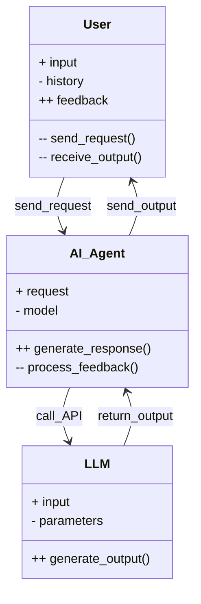
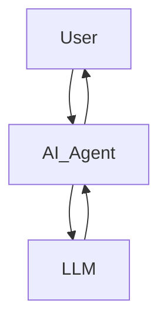

                 


# LLM驱动的AI Agent创意生成：突破思维局限

## 关键词：LLM, AI Agent, 创意生成, 思维突破, 人工智能, 大语言模型

## 摘要：本文探讨如何利用大语言模型（LLM）驱动AI代理，实现创意生成的新突破。通过分析LLM的核心原理、AI Agent的运作机制，以及系统的架构设计，结合实际项目案例，全面解析如何通过技术手段突破传统思维局限，提升创意生成效率和多样性。

---

# 目录

1. [背景介绍](#背景介绍)
2. [核心概念与原理](#核心概念与原理)
3. [算法原理与数学模型](#算法原理与数学模型)
4. [系统分析与架构设计](#系统分析与架构设计)
5. [项目实战](#项目实战)
6. [最佳实践与小结](#最佳实践与小结)

---

## 1. 背景介绍

### 1.1 问题背景与描述

#### 1.1.1 创意生成的挑战与局限性
创意生成是许多领域的重要任务，如写作、设计、编程等。然而，传统方法依赖人工经验，效率低下且难以突破思维定式。此外，创意生成需要多样性和创新性，但传统方法往往难以满足这些要求。

#### 1.1.2 LLM在创意生成中的作用
大语言模型（LLM）具有强大的文本生成能力，能够快速生成多样化的创意内容。通过LLM，AI代理可以辅助人类完成创意生成任务，提升效率和创新性。

#### 1.1.3 AI Agent在创意生成中的角色
AI Agent作为LLM的接口，能够理解用户需求，并通过LLM生成创意内容。它充当用户与模型之间的桥梁，简化交互过程。

### 1.2 问题解决与边界

#### 1.2.1 利用LLM提升创意生成的效率
通过LLM，AI Agent可以在短时间内生成大量创意内容，显著提升效率。同时，模型可以根据用户反馈不断优化输出，增强用户体验。

#### 1.2.2 AI Agent在创意生成中的边界与限制
尽管LLM能够生成多样化的内容，但其结果可能缺乏深度和逻辑性。此外，模型的训练数据可能包含偏见，影响生成内容的质量。

### 1.3 核心概念与结构

#### 1.3.1 LLM驱动的AI Agent核心要素
- **LLM模型**：负责生成创意内容。
- **AI Agent**：负责理解和处理用户需求。
- **用户输入**：驱动整个生成过程。

#### 1.3.2 创意生成的流程与机制
用户输入需求，AI Agent调用LLM生成创意内容，用户反馈优化结果。

---

## 2. 核心概念与原理

### 2.1 LLM与AI Agent的核心原理

#### 2.1.1 LLM的工作原理
大语言模型通过Transformer架构处理输入，生成概率分布，选择最可能的词生成输出。其核心在于自注意力机制，捕捉输入中的长距离依赖关系。

#### 2.1.2 AI Agent的运作机制
AI Agent接收用户输入，解析需求，调用LLM生成内容，并将结果反馈给用户。

#### 2.1.3 LLM与AI Agent的结合
通过API调用，AI Agent将用户需求转化为LLM可处理的输入，接收生成内容并返回给用户。

---

## 3. 算法原理与数学模型

### 3.1 概率分布与损失函数

#### 3.1.1 概率分布的数学表达
LLM生成每个词的概率基于前缀的条件概率分布。

$$ P(y_i|y_{<i}) = \text{softmax}(W_{y_i}^T h_i) $$

其中，$h_i$ 是第i层的隐藏状态。

#### 3.1.2 损失函数的作用与计算
交叉熵损失函数衡量生成分布与真实分布的差距，公式为：

$$ \text{loss} = -\sum_{i=1}^n \sum_{j=1}^m P(y_j|x_i) \log P(y_j|x_i) $$

### 3.2 模型训练流程

#### 3.2.1 数据预处理与特征提取
输入数据经过分词、编码等预处理，提取特征用于模型训练。

#### 3.2.2 模型训练的数学模型
训练目标是最小化损失函数，优化参数：

$$ \text{min}_{\theta} \mathbb{E}_{x,y}[ -\log P_\theta(y|x) ] $$

---

## 4. 系统分析与架构设计

### 4.1 系统架构设计

#### 4.1.1 领域模型设计
领域模型定义系统的功能模块及其交互关系。



#### 4.1.2 系统架构图
系统架构图展示各模块之间的关系。



---

## 5. 项目实战

### 5.1 环境安装

安装必要的库，如Python 3.8及以上，TensorFlow 2.0及以上，和Hugging Face的库。

```bash
pip install numpy tensorflow transformers
```

### 5.2 核心实现代码

编写AI Agent调用LLM生成创意内容的代码。

```python
from transformers import pipeline

# 初始化AI Agent
class AI_Agent:
    def __init__(self):
        self.llm = pipeline('text-generation', model='gpt2')

    def generate_creative_content(self, prompt):
        response = self.llm(prompt, max_length=50, num_return_sequences=3)
        return [resp['generated_text'] for resp in response]

# 使用示例
agent = AI_Agent()
prompt = "Write a creative story about a robot."
results = agent.generate_creative_content(prompt)
print(results)
```

### 5.3 案例分析与实现

分析用户输入，生成多个创意故事，展示生成结果。

### 5.4 项目小结

总结项目的实现过程，强调LLM与AI Agent结合的优势，讨论潜在的改进空间。

---

## 6. 最佳实践与小结

### 6.1 总结

LLM驱动的AI Agent在创意生成中展现出巨大潜力，能够显著提升效率和创新性。

### 6.2 注意事项

- 确保数据安全和隐私保护。
- 定期优化模型参数，提升生成质量。

### 6.3 拓展阅读

建议读者深入研究Transformer架构和大语言模型的优化方法。

---

通过以上步骤，我们详细探讨了LLM驱动的AI Agent在创意生成中的应用，从理论到实践，全面解析其优势与挑战。希望本文能为相关领域的研究者和开发者提供有价值的参考。

