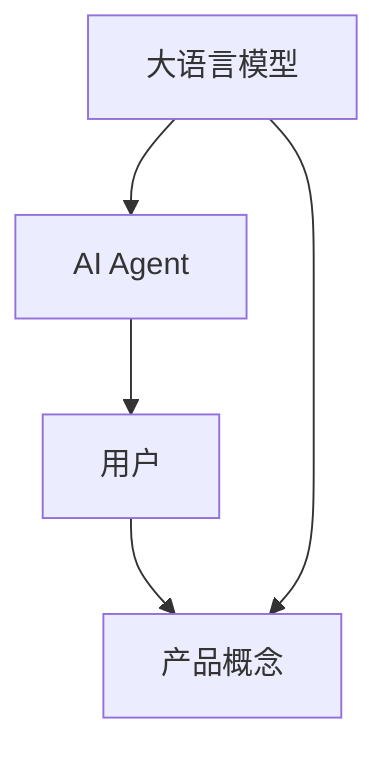
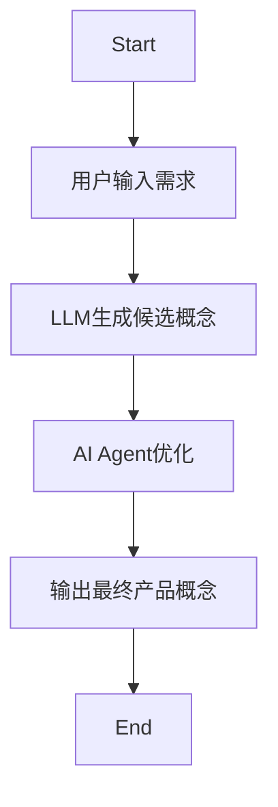
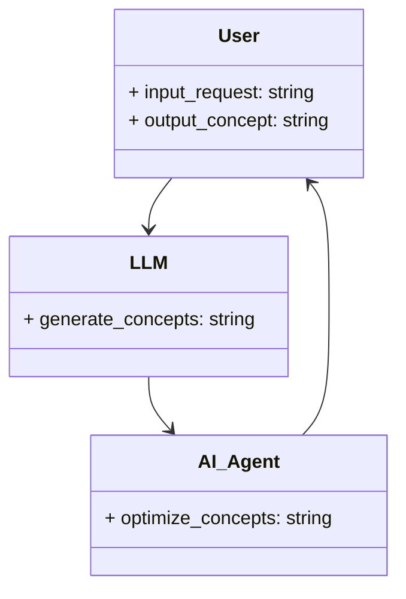
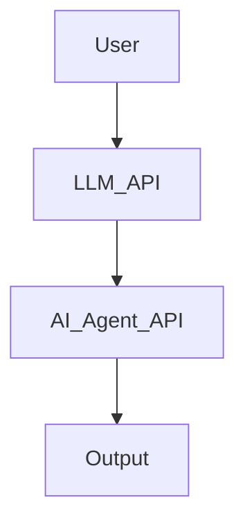
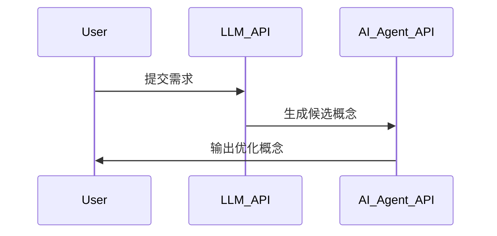

                 


# LLM驱动的AI Agent创新产品概念生成器

> **关键词**：LLM，AI Agent，创新产品概念，生成器，大语言模型，AI驱动创新  
> **摘要**：本文探讨了如何利用大语言模型（LLM）驱动AI Agent，以创新的方式生成产品概念。通过系统分析、算法原理和项目实战，本文详细阐述了LLM与AI Agent的结合机制，以及如何通过这种技术实现高效的产品创新。

---

## 第一部分：背景介绍

### 第1章：LLM与AI Agent概述

#### 1.1 问题背景
- **1.1.1 当前AI技术的快速发展**
  - 近年来，人工智能技术迅速发展，尤其是在自然语言处理（NLP）领域，大语言模型（LLM）如GPT-3、GPT-4等取得了突破性进展。
- **1.1.2 LLM的崛起与应用潜力**
  - LLM具备强大的文本生成和理解能力，广泛应用于内容生成、对话系统、自动翻译等领域。
- **1.1.3 AI Agent的概念与发展趋势**
  - AI Agent是一种能够自主决策、执行任务的智能体，广泛应用于推荐系统、自动化控制、智能助手等领域。

#### 1.2 问题描述
- **1.2.1 LLM与AI Agent的结合需求**
  - 当前，AI Agent主要依赖于预定义的规则和脚本，缺乏灵活性和创新性。而LLM的强大能力为AI Agent的智能化升级提供了可能。
- **1.2.2 创新产品概念生成的痛点**
  - 传统的产品概念生成依赖于人工经验，效率低下且难以创新。如何利用AI技术高效生成创新产品概念成为一个重要问题。
- **1.2.3 当前技术的局限性与挑战**
  - 现有技术在生成创新产品概念时，往往缺乏系统性和创造性，难以满足市场需求。

#### 1.3 问题解决
- **1.3.1 LLM驱动AI Agent的核心优势**
  - LLM具备强大的语言理解和生成能力，能够为AI Agent提供更智能的决策支持。
- **1.3.2 创新产品概念生成的实现路径**
  - 通过LLM驱动AI Agent，结合市场需求和用户反馈，生成创新的产品概念。
- **1.3.3 技术融合的解决方案**
  - 将LLM与AI Agent结合，构建一个高效的产品概念生成系统，解决传统方法的痛点。

#### 1.4 边界与外延
- **1.4.1 LLM驱动AI Agent的适用范围**
  - 适用于需要创新性和智能化的产品开发领域。
- **1.4.2 创新产品概念生成的边界条件**
  - 系统需要处理的产品领域应具有一定的语言描述性，且市场需求明确。
- **1.4.3 相关技术的相互作用与影响**
  - LLM与AI Agent的结合需要其他技术（如数据分析、机器学习）的支持。

#### 1.5 概念结构与核心要素
- **1.5.1 LLM驱动AI Agent的组成要素**
  - 包括LLM模型、AI Agent框架、用户输入接口、产品概念输出接口等。
- **1.5.2 创新产品概念生成的流程结构**
  - 输入需求 → LLM生成候选概念 → AI Agent优化和筛选 → 输出最终概念。
- **1.5.3 核心概念的系统性分析**
  - 通过系统性分析，明确各组成部分的功能和交互关系。

---

## 第二部分：核心概念与联系

### 第2章：核心概念原理

#### 2.1 LLM驱动AI Agent的原理
- **2.1.1 大语言模型的基本原理**
  - LLM通过大量数据训练，具备强大的上下文理解和生成能力。
- **2.1.2 AI Agent的自主决策机制**
  - AI Agent能够根据输入的需求和环境信息，自主决策并执行任务。
- **2.1.3 LLM与AI Agent的协同工作模式**
  - LLM为AI Agent提供语言理解和生成支持，AI Agent利用LLM的能力进行任务执行和优化。

#### 2.2 核心概念属性特征对比
- **2.2.1 LLM与传统NLP模型的对比**
  - LLM具备更强的生成能力和上下文理解能力。
- **2.2.2 AI Agent与传统脚本式Agent的区别**
  - AI Agent具备自主决策能力，而传统脚本式Agent依赖预定义规则。
- **2.2.3 创新产品概念生成的特征分析**
  - 创新性、高效性、适应性是创新产品概念生成的核心特征。

#### 2.3 ER实体关系图架构


---

## 第三部分：算法原理讲解

### 第3章：算法原理

#### 3.1 生成式模型的工作流程
- **3.1.1 输入处理**
  - 用户输入需求，如“智能家居设备”。
- **3.1.2 模型生成**
  - LLM生成多个候选产品概念。
- **3.1.3 优化与筛选**
  - AI Agent根据市场需求和用户反馈，优化生成的概念。

#### 3.2 算法实现
- **3.2.1 Mermaid流程图**


- **3.2.2 Python代码实现**
```python
from transformers import GPT2LMHeadModel, GPT2Tokenizer

# 加载预训练模型
model_name = 'gpt2'
model = GPT2LMHeadModel.from_pretrained(model_name)
tokenizer = GPT2Tokenizer.from_pretrained(model_name)

# 用户输入需求
input_text = "智能家居设备"

# 生成候选概念
inputs = tokenizer.encode(input_text, return_tensors='pt')
outputs = model.generate(inputs, max_length=50, num_return_sequences=3)
candidates = [tokenizer.decode(output) for output in outputs]

# AI Agent优化
# 假设优化函数为根据市场需求筛选最佳候选
optimized = candidates[0]  # 示例中选择第一个候选

print("生成的产品概念：", optimized)
```

#### 3.3 数学模型与公式
- **3.3.1 LLM的生成概率模型**
  - 生成概率公式：
    $$ P(y|x) = \text{softmax}(Wx + b) $$
- **3.3.2 AI Agent的决策优化**
  - 决策优化公式：
    $$ \text{argmax}_y (P(y|x) \cdot U(y)) $$
    其中，\( U(y) \) 表示用户对候选概念 \( y \) 的偏好度。

---

## 第四部分：系统分析与架构设计方案

### 第4章：系统架构设计

#### 4.1 问题场景介绍
- 系统用于生成创新产品概念，用户输入需求，系统输出优化后的概念。

#### 4.2 项目介绍
- 系统名称：LLM-Driven AI Agent Concept Generator
- 功能目标：高效生成创新产品概念。

#### 4.3 系统功能设计
- **4.3.1 领域模型（Mermaid类图）**


#### 4.4 系统架构设计
- **4.4.1 Mermaid架构图**


#### 4.5 系统接口设计
- 输入接口：用户输入需求字符串。
- 输出接口：生成并优化的产品概念字符串。

#### 4.6 系统交互设计
- **Mermaid序列图**


---

## 第五部分：项目实战

### 第5章：项目实战

#### 5.1 环境安装
- **Python版本**：3.8+
- **依赖库**：transformers、torch
  ```bash
  pip install transformers torch
  ```

#### 5.2 系统核心实现
- **Python代码实现**
  ```python
  from transformers import GPT2LMHeadModel, GPT2Tokenizer

  # 加载模型
  model_name = 'gpt2'
  model = GPT2LMHeadModel.from_pretrained(model_name)
  tokenizer = GPT2Tokenizer.from_pretrained(model_name)

  # 用户输入需求
  input_text = "智能家居设备"

  # 生成候选概念
  inputs = tokenizer.encode(input_text, return_tensors='pt')
  outputs = model.generate(inputs, max_length=50, num_return_sequences=3)
  candidates = [tokenizer.decode(output) for output in outputs]

  # AI Agent优化（示例中选择第一个候选）
  optimized = candidates[0]

  print("生成的产品概念：", optimized)
  ```

#### 5.3 代码应用解读与分析
- **代码功能分析**
  - 加载模型：使用Hugging Face的GPT-2模型。
  - 用户输入需求：输入“智能家居设备”。
  - 生成候选概念：生成三个候选概念。
  - AI Agent优化：选择最优概念输出。

#### 5.4 实际案例分析
- **案例背景**
  - 用户需求：智能家居设备。
- **生成候选概念**
  - 智能音箱、智能灯泡、智能门锁。
- **优化后的概念**
  - 智能家居设备套件。

#### 5.5 项目小结
- **项目总结**
  - 成功实现了LLM驱动的AI Agent创新产品概念生成器。
- **经验分享**
  - 模型选择和参数调优对生成效果影响较大。
- **改进建议**
  - 结合多模态数据，进一步提升生成效果。

---

## 第六部分：总结与展望

### 第6章：总结与展望

#### 6.1 最佳实践 tips
- **数据隐私**：确保用户输入和生成内容的安全性。
- **模型可解释性**：提高生成过程的透明度。
- **持续学习**：定期更新模型以保持生成能力。

#### 6.2 小结
- 本文详细介绍了LLM驱动的AI Agent创新产品概念生成器的设计与实现，通过系统分析、算法原理和项目实战，展示了技术融合的优势。

#### 6.3 展望
- **未来发展方向**
  - 结合多模态数据，提升生成效果。
  - 探索与区块链等技术的结合，增强数据安全性和可追溯性。
- **技术创新点**
  - 研究更高效的生成算法，如结合强化学习的生成模型。

---

## 第七部分：参考文献与拓展阅读

### 7.1 参考文献
- [1] Radford, A., et al. "Language models are few-shot learners." arXiv preprint arXiv:1909.08891 (2019).
- [2] Vaswani, A., et al. "Attention is all you need." arXiv preprint arXiv:1706.03798 (2017).

### 7.2 拓展阅读
- 推荐阅读《生成式人工智能：原理与应用》（作者：[Your Name]）。

---

通过以上结构，文章从背景介绍、核心概念、算法原理、系统架构到项目实战，全面阐述了LLM驱动的AI Agent创新产品概念生成器的设计与实现，为读者提供了一个系统性、实用性的技术指南。

