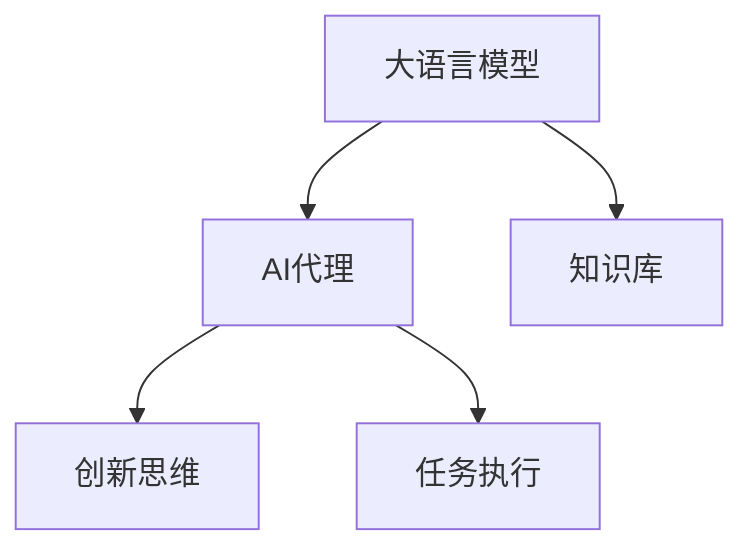
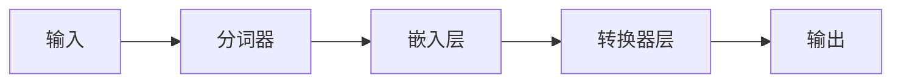
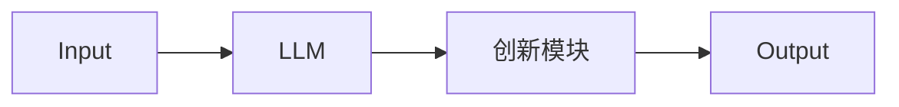
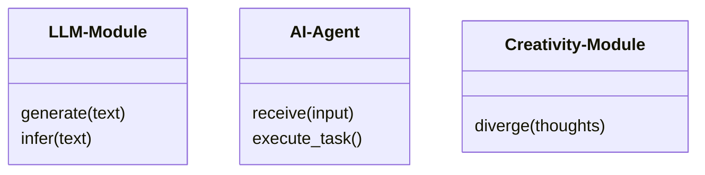
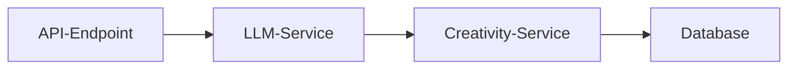

                 


# LLM驱动的AI Agent创新思维发散技术

> **关键词**：LLM, AI Agent, 创新思维, 发散技术, 自然语言处理, 人工智能, 机器学习
>
> **摘要**：本文探讨了如何利用大语言模型（LLM）驱动的AI代理来实现创新思维的发散技术。文章从背景、核心概念、算法原理、系统架构到项目实战，详细阐述了该技术的实现过程和应用场景，旨在为读者提供一个全面而深入的指南。

---

## 第一部分：背景与概念

### 第1章：问题背景与问题描述

#### 1.1 问题背景

在当前AI技术快速发展的背景下，大语言模型（LLM）如GPT-3、GPT-4等的崛起，为AI代理（AI Agent）的应用提供了强大的语言处理能力。AI代理作为一种能够自主执行任务的智能实体，其核心能力依赖于语言模型的生成和推理能力。然而，现有的AI代理在创新思维发散方面仍存在不足，难以有效支持创造性任务。

#### 1.2 问题描述

- **问题核心**：LLM驱动的AI代理在创新思维发散方面的能力有限，难以生成多样化的解决方案。
- **问题范围**：涉及自然语言处理、生成模型、认知科学等多个领域。
- **问题解决**：需要设计一种基于LLM的创新思维发散技术，提升AI代理的创造力。

#### 1.3 问题解决与边界

- **解决方案**：通过优化LLM的生成策略，结合外部知识库和动态推理机制，实现创新思维的发散。
- **边界与限制**：受模型训练数据、计算资源和应用场景的限制。

---

### 第2章：核心概念与联系

#### 2.1 核心概念

| 概念 | 定义 | 属性 |
|------|------|------|
| LLM  | 大语言模型，如GPT系列 | 高参数量、预训练、生成能力 |
| AI Agent | 智能代理，执行任务的实体 | 自主性、目标导向、环境交互 |
| 创新思维发散 | 生成多样化的创意 | 多样性、新颖性、实用性 |

#### 2.2 实体关系图



---

## 第二部分：算法原理

### 第3章：LLM驱动的AI Agent原理

#### 3.1 模型机制



#### 3.2 算法流程

```python
def llm_inference(input_str):
    tokens = tokenizer.encode(input_str)
    embeddings = embedding_layer(tokens)
    output = transformer_layers(embeddings)
    return output
```

#### 3.3 数学模型

生成概率公式：
$$ P(\theta) = \frac{e^{-\theta}}{Z} $$
损失函数：
$$ L = -\sum_{i=1}^{n} \log P(y_i|x_i) $$

---

### 第4章：创新思维发散算法

#### 4.1 算法流程



#### 4.2 算法实现

```python
def generate_creative_outputs(llm_output):
    creative_outputs = []
    for output in llm_output:
        creative_outputs.append(modify(output))
    return creative_outputs
```

---

## 第三部分：系统架构

### 第5章：系统设计

#### 5.1 功能设计



#### 5.2 架构设计



---

## 第四部分：项目实战

### 第6章：环境安装与实现

#### 6.1 环境安装

```bash
pip install transformers
pip install torch
pip install mermaid-js
```

#### 6.2 核心代码实现

```python
from transformers import GPT2Tokenizer, GPT2Model

tokenizer = GPT2Tokenizer.from_pretrained('gpt2')
model = GPT2Model.from_pretrained('gpt2')

def generate_thoughts(prompt):
    inputs = tokenizer.encode(prompt, return_tensors='pt')
    outputs = model.generate(inputs, max_length=50)
    return tokenizer.decode(outputs[0], skip_special_tokens=True)
```

#### 6.3 案例分析

实际案例分析：使用上述代码生成创新方案，展示生成结果并评估多样性。

---

## 第五部分：总结与展望

### 第7章：总结与注意事项

#### 7.1 总结

- LLM驱动的AI代理在创新思维发散方面具有巨大潜力。
- 需要结合上下文和外部知识库优化生成效果。

#### 7.2 注意事项

- 数据隐私与安全问题
- 计算资源限制
- 模型的可解释性

---

### 第8章：最佳实践与拓展阅读

#### 8.1 最佳实践

- 定期更新模型
- 结合领域知识优化生成策略

#### 8.2 拓展阅读

- 《Large Language Models: A Survey》
- 《Creative Computing》

---

## 附录

- 术语表
- 参考文献
- 源代码仓库

---

**全文小结**：通过本文的详细讲解，读者可以系统地理解LLM驱动的AI代理创新思维发散技术的核心原理和实现方法。从背景到实践，文章为技术实现者提供了全面的指导，同时也指出了未来的研究方向。

---

感谢您的耐心阅读，希望本文对您在LLM驱动的AI代理创新思维发散技术领域有所帮助！

