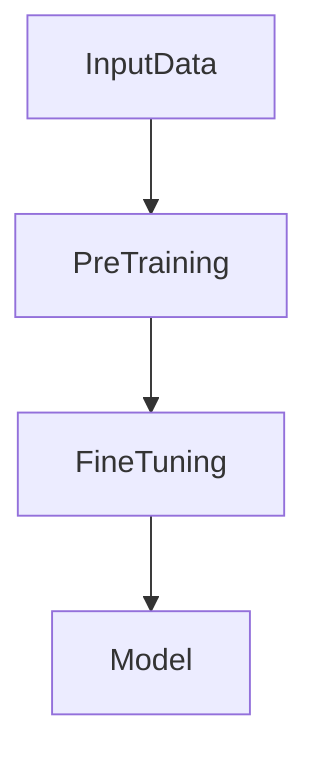
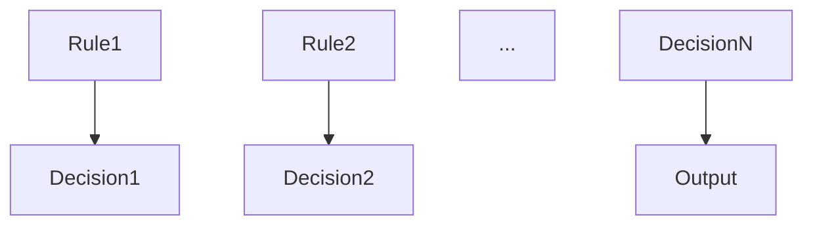
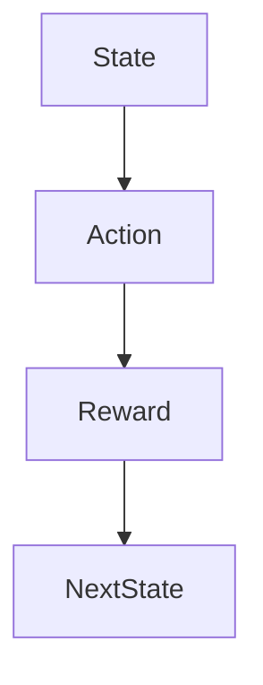
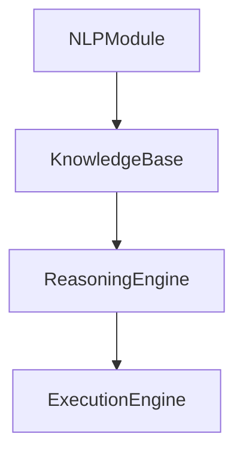
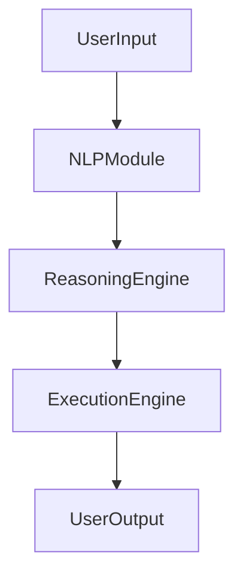

                 


# LLM驱动的AI Agent创新思维激发器

> 关键词：大语言模型（LLM）、AI Agent、创新思维、自然语言处理、人机交互、系统架构

> 摘要：本文探讨了如何利用大语言模型（LLM）驱动AI Agent，通过创新思维激发器的设计与实现，提升AI Agent的智能决策能力和创造力。文章从背景、原理、算法、系统架构到项目实战，全面解析了LLM与AI Agent结合的应用，旨在为读者提供一个系统的解决方案。

---

## 第1章: LLM与AI Agent基础概述

### 1.1 LLM与AI Agent的核心概念

#### 1.1.1 大语言模型（LLM）的定义与特点
- **定义**：大语言模型（LLM）是基于Transformer架构的自然语言处理模型，通过大量数据训练，能够理解并生成人类语言。
- **特点**：
  - **大规模训练数据**：通常使用万亿参数，能够捕捉语言的复杂性。
  - **多任务能力**：支持问答、翻译、文本生成等多种任务。
  - **上下文理解**：通过注意力机制，能够理解上下文关系。

#### 1.1.2 AI Agent的基本概念与功能
- **定义**：AI Agent是一种智能实体，能够感知环境、自主决策并执行任务。
- **功能**：
  - **感知**：通过传感器或数据接口获取信息。
  - **推理**：基于知识库和推理引擎进行逻辑推理。
  - **决策**：根据推理结果制定行动方案。
  - **执行**：通过执行引擎完成任务。

#### 1.1.3 LLM与AI Agent的结合方式
- **结合方式**：
  - **直接集成**：将LLM作为AI Agent的自然语言处理模块。
  - **间接交互**：AI Agent通过LLM获取外部知识或语言生成能力。

### 1.2 创新思维激发器的背景与意义

#### 1.2.1 当前AI技术的发展趋势
- **趋势**：AI从单一任务处理向通用化、智能化方向发展，需要更强的创新能力和适应性。

#### 1.2.2 创新思维在AI Agent中的作用
- **作用**：
  - **提升决策多样性**：通过创新思维，生成更多元的解决方案。
  - **增强适应性**：在复杂环境中灵活应对，提出创新性策略。

#### 1.2.3 本书的目标与价值
- **目标**：通过LLM驱动的AI Agent，探索创新思维的激发方法。
- **价值**：为AI Agent的设计与实现提供理论支持和实践指导。

---

## 第2章: LLM与AI Agent的核心原理

### 2.1 大语言模型的内部机制

#### 2.1.1 变压器模型的基本结构
- **结构**：编码器-解码器架构，包含自注意力机制和前馈网络。
- **图示**：使用Mermaid绘制Transformer模型结构图。

```mermaid
graph TD
    Encoder -> SubLayer1 -> SubLayer2 -> Output
    Decoder -> SubLayer1 -> SubLayer2 -> Output
    SubLayer1 --> "自注意力机制"
    SubLayer2 --> "前馈网络"
```

#### 2.1.2 注意力机制的原理
- **原理**：通过计算词与词之间的相关性，确定每个词的重要性。
- **公式**：
  $$ \text{Attention}(Q, K, V) = \text{softmax}\left(\frac{QK^T}{\sqrt{d_k}}\right)V $$

#### 2.1.3 激活函数与损失函数的作用
- **激活函数**：ReLU、Sigmoid等，用于引入非线性。
- **损失函数**：交叉熵损失，用于模型优化。

### 2.2 AI Agent的决策与执行流程

#### 2.2.1 意图识别与自然语言处理
- **流程**：通过LLM理解用户的意图，生成相应的响应。

#### 2.2.2 知识表示与推理逻辑
- **知识图谱**：构建领域知识图谱，用于推理和决策。
- **推理逻辑**：基于逻辑推理生成解决方案。

#### 2.2.3 行为规划与执行策略
- **行为规划**：基于决策结果制定执行计划。
- **执行策略**：通过执行引擎完成任务。

---

## 第3章: LLM驱动AI Agent的创新思维模型

### 3.1 创新思维的核心要素

#### 3.1.1 创新思维的定义与特征
- **定义**：创新思维是突破常规，提出新颖解决方案的能力。
- **特征**：
  - **多样性**：解决方案多样化。
  - **创造性**：提出新想法。
  - **适应性**：灵活应对变化。

#### 3.1.2 创新思维的分类与层次
- **分类**：
  - **发散思维**：从不同角度思考问题。
  - **收敛思维**：集中资源解决问题。
- **层次**：
  - **初级**：简单改进。
  - **高级**：创新性突破。

#### 3.1.3 创新思维在AI Agent中的作用
- **作用**：
  - **提升决策质量**：生成更多可能性。
  - **增强适应性**：灵活应对复杂环境。

### 3.2 LLM如何激发创新思维

#### 3.2.1 通过知识关联激发创意
- **知识图谱**：利用知识关联生成新想法。
- **案例分析**：通过跨领域的知识结合，提出创新方案。

#### 3.2.2 利用上下文推理生成新想法
- **上下文分析**：基于上下文生成相关联的想法。
- **动态调整**：根据反馈不断优化。

#### 3.2.3 基于反馈优化创新路径
- **反馈机制**：通过用户反馈调整生成策略。
- **优化路径**：基于反馈优化创新路径。

---

## 第4章: LLM驱动AI Agent的算法实现

### 4.1 大语言模型的训练与优化

#### 4.1.1 基于Transformer的模型训练流程
- **预训练**：在大规模数据上进行无监督学习。
- **微调**：在特定任务上进行有监督微调。
- **流程图**：使用Mermaid绘制训练流程图。



#### 4.1.2 模型调优与参数优化方法
- **调优方法**：
  - **学习率调整**：使用学习率衰减。
  - **参数调节**：通过超参数优化。
- **公式**：交叉熵损失函数。

$$ L = -\frac{1}{N} \sum_{i=1}^{N} \sum_{j=1}^{C} y_{ij} \log p(y_{ij}) $$

#### 4.1.3 预训练与微调的对比分析
- **预训练**：通用性强，但需要大量计算资源。
- **微调**：针对性强，但需要特定数据。

### 4.2 AI Agent的决策算法

#### 4.2.1 基于规则的决策算法
- **规则定义**：通过预定义规则进行决策。
- **流程图**：使用Mermaid绘制规则决策流程图。



#### 4.2.2 基于强化学习的决策算法
- **强化学习**：通过奖励机制优化决策。
- **流程图**：使用Mermaid绘制强化学习流程图。



#### 4.2.3 基于概率论的决策算法
- **概率计算**：通过概率计算选择最优决策。
- **公式**：贝叶斯定理。

$$ P(A|B) = \frac{P(B|A)P(A)}{P(B)} $$

---

## 第5章: 系统架构与交互设计

### 5.1 系统整体架构设计

#### 5.1.1 系统功能模块划分
- **功能模块**：
  - **自然语言处理模块**：负责语言理解和生成。
  - **知识库模块**：存储和管理知识。
  - **推理引擎**：进行逻辑推理。
  - **执行引擎**：完成任务执行。

#### 5.1.2 系统组件之间的关系
- **关系图**：使用Mermaid绘制系统架构图。



#### 5.1.3 系统架构的可扩展性设计
- **模块化设计**：各模块独立，便于扩展。
- **接口设计**：通过标准接口进行交互。

### 5.2 人机交互界面设计

#### 5.2.1 用户界面设计
- **UI设计**：简洁直观，便于用户操作。
- **交互流程**：从输入到输出的交互流程。
- **流程图**：使用Mermaid绘制交互流程图。



#### 5.2.2 交互逻辑实现
- **逻辑流程**：用户输入 -> NLP处理 -> 推理 -> 执行 -> 输出。
- **代码示例**：前端与后端交互的接口设计。

---

## 第6章: 项目实战

### 6.1 环境安装

#### 6.1.1 安装Python与相关库
- **安装命令**：
  ```bash
  pip install transformers torch
  ```

#### 6.1.2 安装LLM框架
- **框架选择**：使用Hugging Face的Transformers库。
- **安装命令**：
  ```bash
  pip install transformers
  ```

### 6.2 系统核心实现

#### 6.2.1 LLM集成代码
- **代码示例**：
  ```python
  from transformers import AutoTokenizer, AutoModelForCausalLM
  model = AutoModelForCausalLM.from_pretrained('gpt2')
  tokenizer = AutoTokenizer.from_pretrained('gpt2')
  ```

#### 6.2.2 AI Agent核心代码
- **代码示例**：
  ```python
  class Agent:
      def __init__(self, model):
          self.model = model
      def process_input(self, input_str):
          # 处理输入
          pass
      def generate_output(self, input_str):
          # 生成输出
          pass
  ```

#### 6.2.3 创新思维激发器代码实现
- **代码示例**：
  ```python
  def generate_creative_ideas(topic):
      # 生成创意
      pass
  ```

### 6.3 实际案例分析

#### 6.3.1 案例介绍
- **案例**：设计一个智能助手，帮助用户制定旅行计划。

#### 6.3.2 代码应用解读
- **代码解读**：如何通过LLM生成旅行计划。
- **流程分析**：从需求理解到计划生成的全过程。

#### 6.3.3 案例分析与总结
- **总结**：LLM驱动的AI Agent在实际应用中的优势。

---

## 第7章: 最佳实践与总结

### 7.1 最佳实践

#### 7.1.1 小结
- **小结**：通过LLM驱动的AI Agent，可以有效激发创新思维。

#### 7.1.2 注意事项
- **注意事项**：
  - 数据隐私保护。
  - 系统稳定性保障。

#### 7.1.3 拓展阅读
- **推荐书籍**：
  - 《深度学习》。
  - 《自然语言处理实战》。

---

## 参考文献

（此处列出相关的书籍、论文和技术文档）

---

通过以上目录和内容，您可以逐步展开撰写每一篇章的具体内容，确保逻辑清晰、结构紧凑、简单易懂。每一部分都需要详细展开，确保涵盖所有要求的要点。

