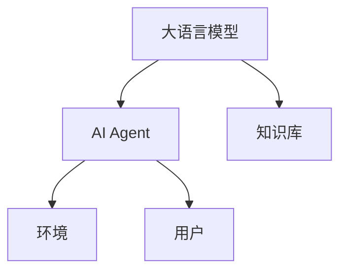

                 

# 目录大纲：《LLM驱动的AI Agent创新思维训练方法》

## 第一部分：背景介绍

### 第1章：LLM驱动的AI Agent概述

#### 1.1 问题背景
- **1.1.1 人工智能与大语言模型的崛起**：介绍AI和大语言模型的发展背景，及其在各领域的应用。
- **1.1.2 AI Agent在智能系统中的作用**：说明AI Agent在自动化决策、个性化推荐等场景中的重要性。
- **1.1.3 创新思维在AI Agent中的重要性**：探讨AI Agent如何通过创新思维提升问题解决能力。

#### 1.2 问题描述
- **1.2.1 LLM与AI Agent结合的挑战**：分析当前技术在结合中存在的问题，如模型调优、实时响应等。
- **1.2.2 创新思维训练的必要性**：说明为何创新思维是提升AI Agent性能的关键。
- **1.2.3 当前技术的局限性**：列举现有方法在创新性上的不足，如过于依赖训练数据，缺乏灵活性。

#### 1.3 问题解决
- **1.3.1 LLM驱动AI Agent的核心思路**：介绍如何利用LLM的能力来增强AI Agent的智能性。
- **1.3.2 创新思维训练的方法**：提出具体的训练策略，如动态调整模型参数、结合外部知识库等。
- **1.3.3 技术实现的路径**：概述从数据准备到模型训练再到系统集成的实现步骤。

#### 1.4 边界与外延
- **1.4.1 LLM驱动AI Agent的边界**：明确适用场景和限制，如处理复杂任务时的性能瓶颈。
- **1.4.2 创新思维训练的适用范围**：确定哪些类型的问题适合创新思维训练。
- **1.4.3 相关领域的联系**：探讨与机器学习、自然语言处理等领域的关联。

#### 1.5 概念结构与核心要素
- **1.5.1 LLM驱动AI Agent的核心要素**：包括模型架构、训练数据、推理机制等。
- **1.5.2 创新思维训练的关键因素**：如多样性数据输入、动态调整模型参数等。
- **1.5.3 两者结合的逻辑框架**：展示LLM、AI Agent和创新思维之间的交互关系。

## 第二部分：核心概念与联系

### 第2章：LLM与AI Agent的核心原理

#### 2.1 LLM的核心原理
- **2.1.1 大语言模型的基本原理**：介绍LLM的训练目标、损失函数等。
- **2.1.2 模型的训练过程**：详细说明预训练和微调的过程。
- **2.1.3 模型的应用机制**：解释LLM如何生成文本、进行推理等。

#### 2.2 AI Agent的核心原理
- **2.2.1 AI Agent的定义与分类**：介绍AI Agent的类型，如基于规则的和基于模型的。
- **2.2.2 Agent的行为决策机制**：说明基于状态、动作和奖励的决策过程。
- **2.2.3 Agent与环境的交互方式**：探讨实时交互和离线分析的区别。

#### 2.3 LLM与AI Agent的关系
- **2.3.1 LLM作为AI Agent的核心模块**：说明LLM在AI Agent中的角色，如作为大脑提供决策支持。
- **2.3.2 LLM驱动AI Agent的优势**：比较传统方法，突出LLM带来的自然语言处理能力提升。
- **2.3.3 两者的协同工作模式**：展示LLM如何赋能AI Agent，使其具备更强的创新能力。

### 2.4 核心概念对比表
| 概念       | 属性               | 描述                                                                 |
|------------|--------------------|----------------------------------------------------------------------|
| LLM        | 模型类型           | 大语言模型，如GPT系列                                           |
|            | 数据需求           | 需要大量高质量的文本数据                                           |
|            | 应用场景           | 自然语言处理、文本生成、问答系统                                   |
| AI Agent   | 行为决策机制       | 基于感知和状态进行决策                                             |
|            | 交互方式           | 可以实时与用户交互，执行任务                                       |
|            | 知识库             | 可能需要外部知识库辅助决策                                         |

### 2.5 实体关系图

通过以上目录结构，读者可以系统地理解LLM驱动AI Agent的背景、核心概念、算法原理、系统架构和实际应用，从而掌握创新思维训练的方法。

