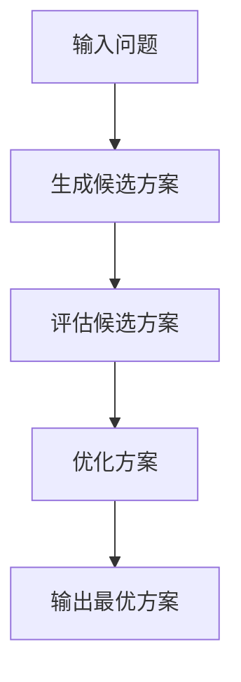
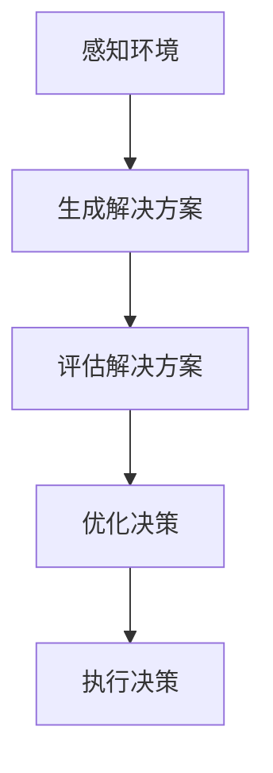
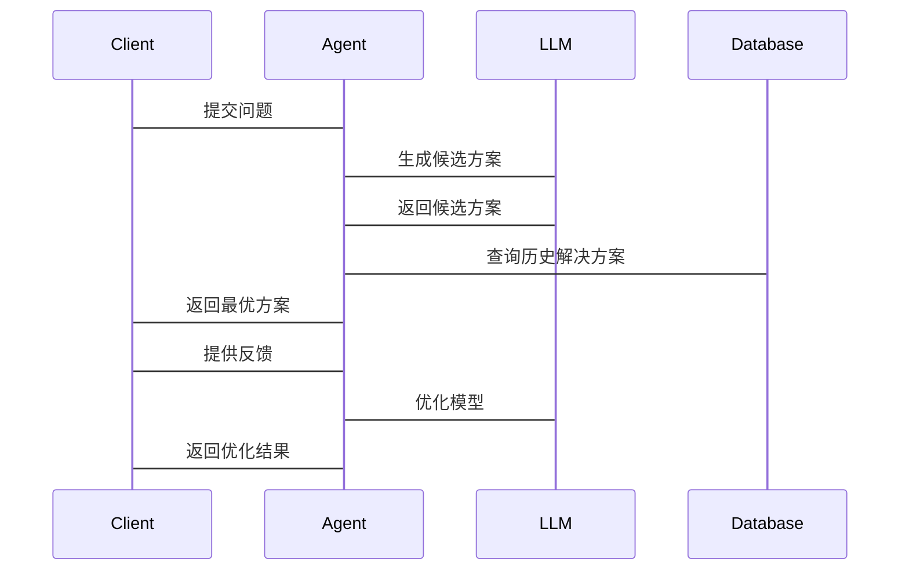

                 


# LLM驱动的AI Agent创新问题解决技术

## 关键词：
LLM, AI Agent, 创新问题解决, 大语言模型, 人工智能, 技术博客

## 摘要：
本文深入探讨了LLM（大语言模型）驱动的AI Agent在创新问题解决技术中的应用。通过分析LLM和AI Agent的核心原理、算法实现、系统架构设计，以及实际项目中的应用案例，本文为读者提供了全面的技术解析和实践指导。从问题背景到系统实现，从算法原理到项目实战，本文旨在帮助读者理解并掌握如何利用LLM驱动的AI Agent来解决复杂问题。

---

## 第一部分: LLM驱动的AI Agent创新问题解决技术背景介绍

### 第1章: 问题背景与描述

#### 1.1 问题背景
人工智能技术的快速发展为问题解决技术带来了前所未有的变革。传统的基于规则的AI系统在处理复杂问题时存在局限性，而大语言模型（LLM）的出现为AI Agent的创新问题解决提供了新的可能性。

- **1.1.1 LLM驱动的AI Agent的兴起**
  - 大语言模型（如GPT系列）的自然语言处理能力使得AI Agent能够更自然地理解和生成人类语言。
  - AI Agent通过LLM的强大能力，可以更好地理解用户需求，并提供更智能化的解决方案。

- **1.1.2 当前问题解决技术的局限性**
  - 传统基于规则的AI系统在处理复杂、动态变化的问题时显得力不从心。
  - 创新问题解决技术需要具备更强的适应性和创造性，而传统的算法难以满足这一需求。

- **1.1.3 创新问题解决技术的需求**
  - 在复杂的现实场景中，问题往往具有多样性和不确定性，需要AI系统具备更强的学习和适应能力。
  - LLM驱动的AI Agent能够通过不断学习和优化，提供更高效的解决方案。

#### 1.2 问题描述
- **1.2.1 LLM驱动的AI Agent的核心问题**
  - 如何将LLM与AI Agent相结合，使其能够高效地解决问题。
  - 如何设计AI Agent的架构，使其能够充分发挥LLM的能力。

- **1.2.2 创新问题解决技术的关键挑战**
  - 如何确保LLM生成的解决方案具有创新性和实用性。
  - 如何处理复杂的现实场景中的不确定性。

- **1.2.3 技术边界与外延**
  - LLM驱动的AI Agent的核心技术边界包括模型训练、推理优化和系统集成。
  - 技术外延包括与外部知识库的集成、多模态数据处理能力以及与其他AI技术的结合。

#### 1.3 问题解决方法
- **1.3.1 LLM驱动的AI Agent的基本原理**
  - 通过LLM生成候选解决方案，再通过AI Agent进行优化和决策。
  - 利用强化学习等技术对AI Agent进行训练，使其能够在复杂场景中做出最优决策。

- **1.3.2 创新问题解决技术的实现路径**
  - 通过LLM生成多样化的解决方案，再通过AI Agent进行筛选和优化。
  - 利用反馈机制不断改进AI Agent的决策能力。

- **1.3.3 技术实现的可行性分析**
  - 技术可行性：基于现有的LLM技术和AI Agent架构，创新问题解决技术是可行的。
  - 实用性分析：通过实际案例验证技术的有效性。

### 第2章: 核心概念与联系

#### 2.1 核心概念原理
- **2.1.1 LLM的基本原理**
  - 基于Transformer架构的模型，通过自注意力机制捕捉上下文信息。
  - 通过大量的训练数据，模型能够生成与上下文相关的文本。

- **2.1.2 AI Agent的核心机制**
  - AI Agent通过感知环境、理解需求、生成解决方案来完成任务。
  - 利用强化学习等技术，AI Agent能够在复杂环境中做出决策。

- **2.1.3 创新问题解决技术的数学模型**
  - 利用概率论和优化理论，构建创新问题解决的数学模型。
  - 通过模型训练和优化，提高AI Agent的决策能力。

#### 2.2 核心概念属性特征对比
- **2.2.1 LLM与传统NLP模型的对比**
  - LLM具有更强的泛化能力和生成能力。
  - 传统NLP模型通常针对特定任务进行优化。

- **2.2.2 AI Agent与传统AI算法的对比**
  - AI Agent具有更强的自主决策能力。
  - 传统AI算法通常依赖于明确的规则和输入。

- **2.2.3 创新问题解决技术的特征分析**
  - 创新性：能够生成多样化的解决方案。
  - 实用性：解决方案具有实际应用价值。
  - 可扩展性：能够适应不同规模和复杂度的问题。

#### 2.3 ER实体关系图
```mermaid
er
  actor(Agent, id, name)
  actor(Task, id, description)
  actor(Solution, id, solution)
  relation(Agent, has, Task)
  relation(Task, has, Solution)
```

---

## 第二部分: LLM驱动的AI Agent算法原理

### 第3章: 算法原理与实现

#### 3.1 算法原理
- **3.1.1 LLM的训练过程**
  - 基于Transformer模型，通过自注意力机制捕捉上下文信息。
  - 使用大规模数据进行预训练，通过微调任务特定数据进行优化。

- **3.1.2 AI Agent的决策机制**
  - 通过LLM生成候选解决方案，再通过强化学习优化决策。
  - 利用动态规划等算法，提高决策的效率和准确性。

- **3.1.3 创新问题解决技术的算法流程**
  - 输入问题描述。
  - LLM生成多种解决方案。
  - AI Agent对方案进行评估和优化。
  - 输出最优解决方案。

#### 3.2 算法实现
- **3.2.1 基于LLM的文本生成算法**


- **3.2.2 AI Agent的决策算法**


- **3.2.3 创新问题解决算法的数学模型**
  - 概率模型：$$ P(\text{选择最优解}) = \frac{\exp(\theta \cdot x)}{\sum_{i} \exp(\theta \cdot x_i)} $$
  - 强化学习模型：$$ Q(s, a) = r + \gamma \max_{a'} Q(s', a') $$

---

## 第三部分: 系统分析与架构设计

### 第4章: 系统分析与架构设计方案

#### 4.1 问题场景介绍
- 系统需要解决一个复杂的问题，例如优化企业的资源分配。
- 系统需要具备多用户支持、实时反馈和动态优化的能力。

#### 4.2 系统功能设计
- **领域模型类图**
```mermaid
classDiagram
    class Agent {
        +id: int
        +name: string
        +problem: string
        +solution: string
        -score: float
        }
    class Task {
        +id: int
        +description: string
        }
    class Solution {
        +id: int
        +solution: string
        }
    Agent o- Task
    Task o- Solution
```

- **系统架构图**


- **系统接口设计**
  - 输入接口：接收问题描述和用户反馈。
  - 输出接口：输出解决方案和优化结果。

- **系统交互序列图**


---

## 第四部分: 项目实战

### 第5章: 项目实战

#### 5.1 环境安装
- 安装Python 3.8及以上版本。
- 安装必要的库：`transformers`, `torch`, `numpy`。

#### 5.2 核心代码实现
- **模型加载**
```python
from transformers import AutoTokenizer, AutoModelForCausalLM
model_name = "gpt2"
tokenizer = AutoTokenizer.from_pretrained(model_name)
model = AutoModelForCausalLM.from_pretrained(model_name)
```

- **生成候选方案**
```python
def generate_solutions(problem, model, tokenizer):
    inputs = tokenizer(problem, return_tensors="pt")
    outputs = model.generate(**inputs, max_length=100, num_return_sequences=5)
    solutions = [tokenizer.decode(output, skip_special_tokens=True) for output in outputs]
    return solutions
```

- **评估与优化**
```python
def evaluate_solution(solution, problem):
    score = 0.0
    # 具体评估逻辑
    return score
```

#### 5.3 案例分析
- 问题：如何优化企业的资源分配？
- 实施步骤：
  1. 收集企业资源分配的历史数据。
  2. 使用LLM生成多种资源分配方案。
  3. 使用AI Agent对方案进行评估和优化。
  4. 输出最优解决方案并实施。

#### 5.4 项目总结
- 项目实现的关键点：
  - LLM生成多样化的解决方案。
  - AI Agent对方案进行有效评估和优化。
  - 系统具备良好的扩展性和可维护性。

---

## 第五部分: 最佳实践与总结

### 第6章: 最佳实践与总结

#### 6.1 最佳实践
- 定期更新模型以保持其性能。
- 确保系统的安全性和隐私保护。
- 与领域专家合作，优化解决方案的质量。

#### 6.2 小结
- LLM驱动的AI Agent创新问题解决技术具有广阔的应用前景。
- 通过不断优化算法和系统架构，可以进一步提高问题解决的效率和质量。

#### 6.3 注意事项
- 在实际应用中，需要考虑模型的训练成本和计算资源。
- 确保系统的可解释性和透明性。

#### 6.4 拓展阅读
- 推荐阅读《Large Language Models: A Survey》。
- 参考GitHub上的相关开源项目。

---

# 结语
通过本文的详细讲解，读者可以全面了解LLM驱动的AI Agent创新问题解决技术的核心原理、算法实现和系统架构设计。希望本文能够为读者提供有价值的参考，帮助他们在实际项目中更好地应用这些技术。

