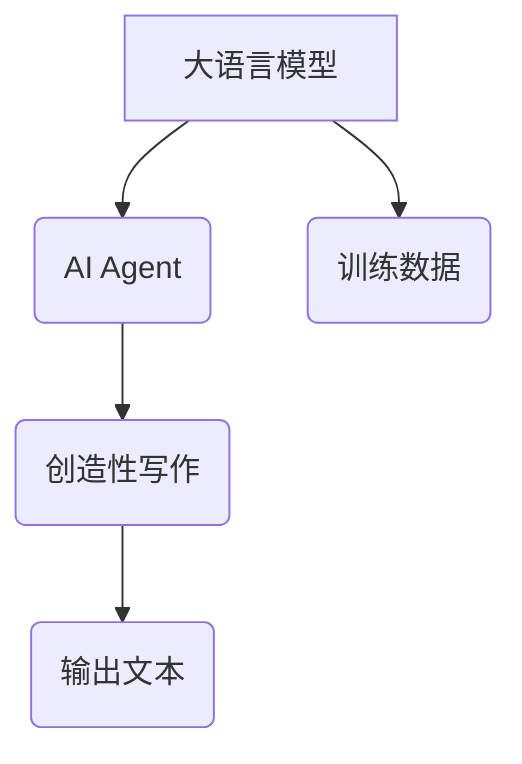
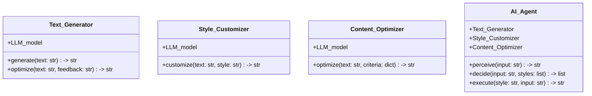
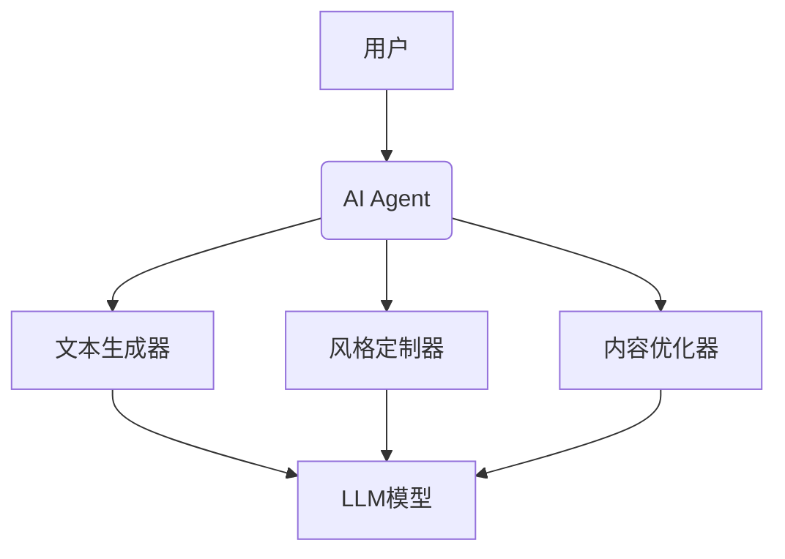
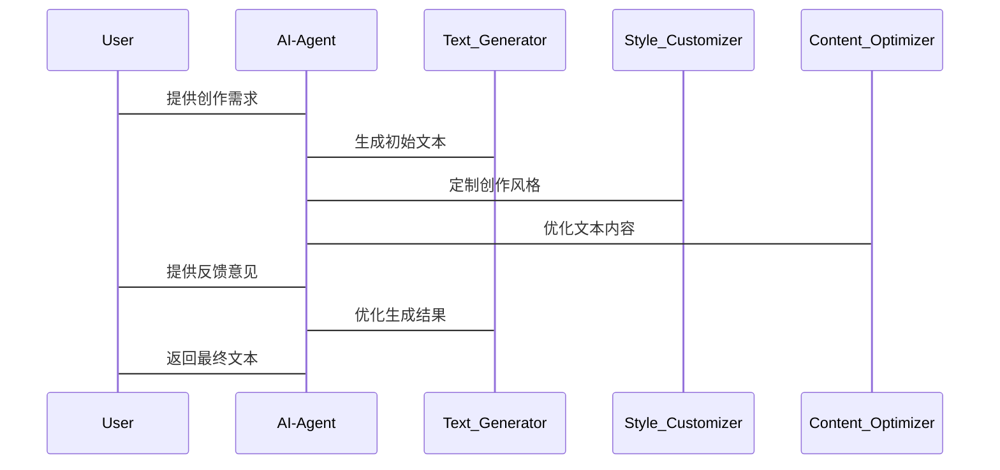

                 


# LLM驱动的AI Agent创造性写作能力

## 关键词：
LLM, AI Agent, 创造性写作, 自然语言处理, 人工智能

## 摘要：
本文深入探讨了大语言模型（LLM）驱动的AI Agent在创造性写作中的潜力与实现路径。通过分析LLM与AI Agent的结合，阐述了其在文本生成、情感表达、创意构思等领域的优势，并结合实际案例展示了如何构建一个基于LLM的AI写作辅助系统。文章内容涵盖理论基础、技术实现、系统架构设计和项目实战，为技术开发者和研究者提供了系统的指导与参考。

---

# 第一部分：引言

## 第1章：AI Agent与LLM的背景介绍

### 1.1 问题背景与描述

#### 1.1.1 创造性写作的定义与重要性
创造性写作是指通过创新性的思维和表达方式，创作出具有独特性、想象力和情感深度的文本内容。它广泛应用于文学创作、广告文案、市场报告等领域。随着AI技术的发展，创造性写作的实现方式也在不断演变，从传统的手工创作逐步向智能化、自动化方向迈进。

#### 1.1.2 AI Agent在创造性写作中的角色
AI Agent（智能代理）是一种能够感知环境、自主决策并执行任务的智能系统。在创造性写作中，AI Agent可以作为辅助工具，帮助用户生成创意文本、优化写作结构、提供情感反馈等。通过结合大语言模型（LLM），AI Agent能够理解上下文、分析用户需求，并生成符合要求的高质量文本内容。

#### 1.1.3 LLM驱动的AI Agent的独特优势
LLM（大语言模型）具有强大的文本理解和生成能力，能够处理复杂语义、捕捉上下文信息，并生成自然流畅的语言。结合AI Agent的自主决策能力，LLM驱动的AI Agent在创造性写作中展现出以下独特优势：
1. **智能化**：能够根据用户需求和上下文，生成个性化、多样化的文本内容。
2. **高效性**：通过自动化处理，显著提高创作效率，减少人工干预。
3. **创造性**：通过算法优化和模型训练，能够在一定程度上模拟人类的创造性思维。

### 1.2 问题解决与边界

#### 1.2.1 创造性写作中的常见问题
1. **创意枯竭**：创作者在创作过程中可能会遇到灵感不足的问题，导致内容缺乏新意。
2. **效率低下**：传统创作方式需要大量时间和精力，尤其是在修改和优化阶段。
3. **个性化需求**：不同用户对文本风格、语气、主题的需求存在差异，如何满足个性化需求是一个挑战。

#### 1.2.2 AI Agent如何解决这些问题
AI Agent通过结合LLM的文本生成能力和自身的智能决策能力，能够为创作者提供以下帮助：
1. **激发创意**：通过生成多种风格的文本片段，为创作者提供灵感。
2. **自动化优化**：根据用户反馈，自动调整文本结构、语言风格，提高创作效率。
3. **个性化定制**：根据用户偏好，生成符合其风格和需求的文本内容。

#### 1.2.3 LLM驱动的边界与局限性
尽管LLM驱动的AI Agent在创造性写作中具有诸多优势，但其能力也存在一定的边界和局限性：
1. **创意的原创性**：AI生成的内容可能缺乏真正的原创性，容易出现重复或雷同的情况。
2. **情感理解的深度**：虽然LLM能够模拟情感表达，但其对情感的深度理解和人类的共情能力仍有差距。
3. **复杂场景的处理**：在处理复杂、多维度的创作任务时，AI Agent的能力可能受到限制，需要结合人类专家的干预。

### 1.3 核心概念与结构

#### 1.3.1 LLM与AI Agent的结合模型
LLM与AI Agent的结合模型可以分为以下几个层次：
1. **感知层**：AI Agent通过LLM理解用户的输入需求和创作意图。
2. **决策层**：基于理解的结果，AI Agent制定生成文本的策略和计划。
3. **执行层**：通过LLM生成具体的文本内容，并通过反馈机制不断优化生成结果。

#### 1.3.2 创造性写作能力的评估标准
创造性写作能力的评估可以从以下几个维度进行：
1. **创新性**：生成内容的独特性和新颖性。
2. **连贯性**：文本的逻辑结构和语言流畅性。
3. **情感表达**：文本所传达的情感深度和感染力。

#### 1.3.3 核心要素与组成分析
LLM驱动的AI Agent创造性写作能力的核心要素包括：
1. **LLM模型**：提供文本生成和理解能力。
2. **AI Agent**：实现任务感知和智能决策。
3. **用户反馈机制**：用于优化生成结果和调整创作方向。
4. **创作场景**：定义具体的创作任务和目标。

---

## 第2章：核心概念与联系

### 2.1 核心概念原理

#### 2.1.1 LLM的工作原理
大语言模型（LLM）通常基于Transformer架构，通过自注意力机制和前馈网络，对输入文本进行编码和解码。其生成过程如下：
1. **输入编码**：将输入文本转换为向量表示。
2. **自注意力机制**：分析文本的上下文关系。
3. **生成解码**：逐步生成输出文本。

#### 2.1.2 AI Agent的决策机制
AI Agent的决策机制通常包括以下几个步骤：
1. **感知环境**：通过LLM理解和分析用户需求。
2. **制定策略**：根据需求生成多种可能的创作方案。
3. **执行任务**：选择最优方案并生成文本内容。
4. **反馈优化**：根据用户反馈不断优化生成结果。

#### 2.1.3 创造性写作的生成模型
创造性写作的生成模型可以采用基于LLM的生成式模型，例如GPT系列模型。生成过程可以通过以下步骤实现：
1. **输入处理**：将用户输入的创作需求或初始文本进行处理。
2. **模型生成**：通过LLM生成符合要求的文本内容。
3. **结果优化**：根据用户反馈或预设规则，对生成内容进行优化调整。

### 2.2 概念属性特征对比表格
以下是核心概念的属性特征对比：

| 概念 | 属性 | 特征 |
|------|------|------|
| LLM  | 模型结构 | 基于Transformer的自注意力机制 |
| AI Agent | 交互能力 | 能够感知环境并自主决策 |
| 创造性写作 | 创新性 | 生成具有独特性和多样性的文本内容 |

### 2.3 ER实体关系图
以下是核心概念的实体关系图：



---

## 第3章：算法原理讲解

### 3.1 算法原理

#### 3.1.1 LLM的生成过程
大语言模型的生成过程可以通过以下步骤实现：

1. **输入处理**：将用户的创作需求或初始文本输入模型。
2. **文本编码**：将输入文本转换为模型可处理的向量表示。
3. **自注意力机制**：模型通过自注意力机制分析文本的上下文关系。
4. **生成解码**：模型逐步生成输出文本，每一步生成一个词或短语。
5. **结果优化**：根据用户反馈或预设规则，对生成内容进行优化调整。

#### 3.1.2 AI Agent的决策机制
AI Agent的决策机制可以通过以下步骤实现：

1. **感知环境**：AI Agent通过LLM理解用户的创作需求。
2. **制定策略**：根据需求生成多种可能的创作方案。
3. **执行任务**：选择最优方案并生成文本内容。
4. **反馈优化**：根据用户反馈调整生成策略。

### 3.2 Python源代码实现

#### 3.2.1 基于GPT-2的文本生成代码
以下是一个基于GPT-2的文本生成代码示例：

```python
import torch
import torch.nn as nn
import torch.optim as optim

class GPT2(nn.Module):
    def __init__(self, vocab_size, embed_dim, num_heads, num_layers):
        super(GPT2, self).__init__()
        self.embedding = nn.Embedding(vocab_size, embed_dim)
        self.transformer = nn.Transformer(embed_dim, embed_dim, num_layers, num_heads)
        self.linear = nn.Linear(embed_dim, vocab_size)

    def forward(self, input_ids):
        embed = self.embedding(input_ids)
        output = self.transformer(embed, embed)
        output = self.linear(output)
        return output

# 初始化模型
vocab_size = 10000
embed_dim = 512
num_heads = 8
num_layers = 6
model = GPT2(vocab_size, embed_dim, num_heads, num_layers)

# 定义损失函数和优化器
criterion = nn.CrossEntropyLoss()
optimizer = optim.Adam(model.parameters(), lr=0.001)

# 训练过程
def train(model, criterion, optimizer, input_ids, labels):
    outputs = model(input_ids)
    loss = criterion(outputs, labels)
    optimizer.zero_grad()
    loss.backward()
    optimizer.step()
    return loss.item()

# 示例训练
input_ids = torch.randint(0, vocab_size, (32, 128))
labels = torch.randint(0, vocab_size, (32, 128))
loss = train(model, criterion, optimizer, input_ids, labels)
print(f"训练损失: {loss}")
```

#### 3.2.2 AI Agent的决策逻辑代码
以下是一个AI Agent的决策逻辑代码示例：

```python
class AI_Agent:
    def __init__(self, llm_model):
        self.llm = llm_model

    def perceive(self, input_text):
        # 通过LLM理解输入文本
        response = self.llm.generate(input_text)
        return response

    def decide(self, input_text, target_style):
        # 根据需求生成创作方案
        response_style1 = self.llm.generate(input_text + "，请以幽默风格写一篇短文。")
        response_style2 = self.llm.generate(input_text + "，请以正式风格写一篇短文。")
        return response_style1, response_style2

    def execute(self, chosen_style, input_text):
        # 执行生成任务
        if chosen_style == "humor":
            output = self.llm.generate(input_text + "，请以幽默风格写一篇短文。")
        else:
            output = self.llm.generate(input_text + "，请以正式风格写一篇短文。")
        return output

# 示例使用
llm_model = LLM_Model()  # 假设已经定义好的LLM模型
agent = AI_Agent(llm_model)
input_text = "如何写一篇关于人工智能的介绍？"
style_choices = ["humor", "formal"]
response_style1, response_style2 = agent.decide(input_text, style_choices)
output = agent.execute(style_choices[0], input_text)
print(output)
```

### 3.3 数学公式

#### 3.3.1 LLM的自注意力机制公式
自注意力机制的计算公式如下：

$$
\text{Attention}(Q, K, V) = \text{softmax}\left(\frac{QK^T}{\sqrt{d_k}}\right)V
$$

其中：
- $Q$ 是查询向量
- $K$ 是键向量
- $V$ 是值向量
- $d_k$ 是向量的维度

#### 3.3.2 AI Agent的决策优化公式
AI Agent的决策优化可以通过以下公式实现：

$$
\text{argmax}_{a \in A} \sum_{i=1}^{n} P(a|s_i)
$$

其中：
- $A$ 是所有可能的动作集合
- $s_i$ 是状态序列
- $P(a|s_i)$ 是在状态$s_i$下选择动作$a$的概率

---

## 第4章：系统分析与架构设计

### 4.1 项目介绍与系统功能设计

#### 4.1.1 项目介绍
本项目旨在构建一个基于LLM的AI Agent写作辅助系统，帮助用户高效地进行创造性写作。系统主要包括文本生成、风格定制、内容优化等功能模块。

#### 4.1.2 系统功能设计
以下是系统功能模块的类图：



### 4.2 系统架构设计

#### 4.2.1 系统架构图
以下是系统架构图：



#### 4.2.2 系统接口设计
以下是系统的主要接口：

1. **用户输入接口**：
   - 输入文本内容
   - 选择创作风格
   - 提供反馈意见

2. **AI Agent接口**：
   - `perceive(input: str) -> str`
   - `decide(input: str, styles: list) -> list`
   - `execute(style: str, input: str) -> str`

3. **LLM模型接口**：
   - `generate(input: str) -> str`
   - `optimize(input: str, feedback: str) -> str`

### 4.3 系统交互流程

#### 4.3.1 交互流程图
以下是系统交互流程图：



---

## 第5章：项目实战

### 5.1 环境安装与配置

#### 5.1.1 环境搭建
1. 安装Python 3.8及以上版本。
2. 安装PyTorch和Hugging Face Transformers库：
   ```bash
   pip install torch transformers
   ```

#### 5.1.2 LLM模型加载
使用Hugging Face的GPT-2模型：

```python
from transformers import AutoTokenizer, AutoModelForCausalLM

tokenizer = AutoTokenizer.from_pretrained('gpt2')
model = AutoModelForCausalLM.from_pretrained('gpt2')
```

### 5.2 系统核心实现

#### 5.2.1 文本生成器实现
文本生成器的实现代码如下：

```python
class Text_Generator:
    def __init__(self, tokenizer, model):
        self.tokenizer = tokenizer
        self.model = model

    def generate(self, input_text, max_length=50):
        inputs = self.tokenizer.encode(input_text, return_tensors='pt')
        outputs = self.model.generate(inputs, max_length=max_length, do_sample=True)
        return self.tokenizer.decode(outputs[0], skip_special_tokens=True)
```

#### 5.2.2 风格定制器实现
风格定制器的实现代码如下：

```python
class Style_Customizer:
    def __init__(self, tokenizer, model):
        self.tokenizer = tokenizer
        self.model = model

    def customize(self, input_text, style, max_length=50):
        prompt = f"请以{style}风格写一篇关于{input_text}的文章。"
        inputs = self.tokenizer.encode(prompt, return_tensors='pt')
        outputs = self.model.generate(inputs, max_length=max_length, do_sample=True)
        return self.tokenizer.decode(outputs[0], skip_special_tokens=True)
```

#### 5.2.3 内容优化器实现
内容优化器的实现代码如下：

```python
class Content_Optimizer:
    def __init__(self, tokenizer, model):
        self.tokenizer = tokenizer
        self.model = model

    def optimize(self, input_text, feedback, max_length=50):
        prompt = f"根据以下反馈优化文本：{feedback}\n原文：{input_text}"
        inputs = self.tokenizer.encode(prompt, return_tensors='pt')
        outputs = self.model.generate(inputs, max_length=max_length, do_sample=True)
        return self.tokenizer.decode(outputs[0], skip_special_tokens=True)
```

### 5.3 项目实战案例分析

#### 5.3.1 案例分析
假设用户希望生成一篇关于“人工智能在教育中的应用”的文章，以下是具体步骤：

1. **用户输入**：用户提供输入文本“人工智能在教育中的应用”。
2. **AI Agent感知**：AI Agent通过LLM生成多篇关于人工智能在教育中的应用的初稿。
3. **风格定制**：用户选择“正式”风格，AI Agent通过风格定制器生成正式风格的文章。
4. **内容优化**：用户提供反馈“文章开头可以更吸引人”，AI Agent通过内容优化器优化生成结果。
5. **最终输出**：生成符合用户需求的正式风格文章。

#### 5.3.2 代码实现与解读
以下是完整的代码实现：

```python
from transformers import AutoTokenizer, AutoModelForCausalLM
import torch

class Text_Generator:
    def __init__(self, tokenizer, model):
        self.tokenizer = tokenizer
        self.model = model

    def generate(self, input_text, max_length=50):
        inputs = self.tokenizer.encode(input_text, return_tensors='pt')
        outputs = self.model.generate(inputs, max_length=max_length, do_sample=True)
        return self.tokenizer.decode(outputs[0], skip_special_tokens=True)

class Style_Customizer:
    def __init__(self, tokenizer, model):
        self.tokenizer = tokenizer
        self.model = model

    def customize(self, input_text, style, max_length=50):
        prompt = f"请以{style}风格写一篇关于{input_text}的文章。"
        inputs = self.tokenizer.encode(prompt, return_tensors='pt')
        outputs = self.model.generate(inputs, max_length=max_length, do_sample=True)
        return self.tokenizer.decode(outputs[0], skip_special_tokens=True)

class Content_Optimizer:
    def __init__(self, tokenizer, model):
        self.tokenizer = tokenizer
        self.model = model

    def optimize(self, input_text, feedback, max_length=50):
        prompt = f"根据以下反馈优化文本：{feedback}\n原文：{input_text}"
        inputs = self.tokenizer.encode(prompt, return_tensors='pt')
        outputs = self.model.generate(inputs, max_length=max_length, do_sample=True)
        return self.tokenizer.decode(outputs[0], skip_special_tokens=True)

class AI_Agent:
    def __init__(self, tokenizer, model):
        self.text_generator = Text_Generator(tokenizer, model)
        self.style_customizer = Style_Customizer(tokenizer, model)
        self.content_optimizer = Content_Optimizer(tokenizer, model)

    def perceive(self, input_text):
        return self.text_generator.generate(input_text)

    def decide(self, input_text, styles):
        results = []
        for style in styles:
            result = self.style_customizer.customize(input_text, style)
            results.append(result)
        return results

    def execute(self, input_text, chosen_style, feedback=None):
        if feedback is not None:
            return self.content_optimizer.optimize(input_text, feedback)
        else:
            return self.style_customizer.customize(input_text, chosen_style)

# 示例使用
tokenizer = AutoTokenizer.from_pretrained('gpt2')
model = AutoModelForCausalLM.from_pretrained('gpt2')
agent = AI_Agent(tokenizer, model)

input_text = "人工智能在教育中的应用"
styles = ["正式", "幽默"]
results = agent.decide(input_text, styles)
for i, result in enumerate(results):
    print(f"风格{i+1}生成结果：{result}")

feedback = "文章开头可以更吸引人"
optimized_text = agent.execute(input_text, styles[0], feedback=feedback)
print("优化后文本：", optimized_text)
```

#### 5.3.3 案例分析与总结
通过上述案例分析，我们可以看到，基于LLM的AI Agent在创造性写作中表现出以下优势：
1. **高效性**：能够快速生成多种风格的文本内容。
2. **灵活性**：可以根据用户反馈不断优化生成结果。
3. **创造性**：生成的文本内容具有一定的创新性和独特性。

---

## 第6章：总结与展望

### 6.1 总结
本文深入探讨了大语言模型（LLM）驱动的AI Agent在创造性写作中的潜力与实现路径。通过结合LLM的文本生成能力和AI Agent的智能决策能力，能够显著提升创作效率和文本质量。本文详细分析了LLM与AI Agent的核心概念、算法原理、系统架构设计，并通过实际案例展示了如何构建一个基于LLM的AI写作辅助系统。

### 6.2 展望
随着AI技术的不断进步，LLM驱动的AI Agent在创造性写作中的应用前景广阔。未来的研究方向可以包括：
1. **提升创意的原创性**：通过优化模型结构和训练方法，进一步提升生成内容的创新性。
2. **增强情感理解能力**：结合情感计算技术，提升文本的情感深度和感染力。
3. **拓展应用场景**：将AI Agent应用于更多领域，如文学创作、广告文案、市场报告等。

### 6.3 最佳实践 Tips
1. 在实际应用中，建议结合人类专家的反馈，进一步优化生成结果。
2. 定期更新模型参数，确保生成内容的质量和时效性。
3. 注意保护用户隐私，确保生成内容的安全性。

---

# 结语

通过本文的系统阐述，读者可以全面了解LLM驱动的AI Agent在创造性写作中的应用潜力和实现方法。希望本文能够为技术开发者和研究者提供有价值的参考，推动创造性写作领域的智能化发展。

