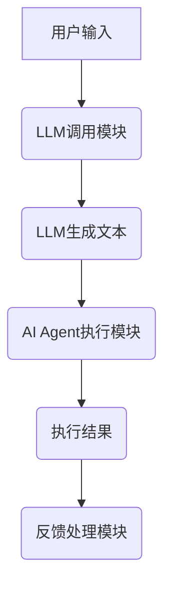
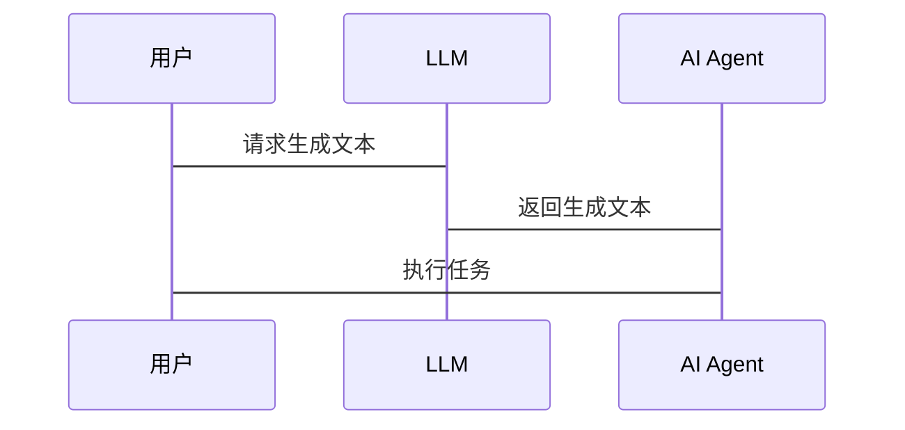

                 


# LLM驱动的AI Agent创造性问题解决框架

> 关键词：LLM、AI Agent、创造性问题解决、人工智能、机器学习

> 摘要：本文将探讨如何利用大语言模型（LLM）驱动的AI Agent来解决创造性问题。通过分析LLM与AI Agent的核心概念、算法原理、系统架构及实际应用，本文将提供一个全面的框架，帮助读者理解如何将LLM与AI Agent结合，实现创新性的问题解决。

---

# 第一部分: LLM驱动的AI Agent背景与概述

## 第1章: LLM驱动的AI Agent概述

### 1.1 LLM驱动的AI Agent的基本概念

#### 1.1.1 大语言模型（LLM）的定义与特点
- 大语言模型（LLM）是基于深度学习的自然语言处理模型，具有以下特点：
  - **大规模**：通常使用海量数据进行训练，参数量巨大。
  - **通用性**：能够处理多种自然语言任务，如文本生成、问答、翻译等。
  - **生成能力**：通过解码器结构生成连贯且有意义的文本。
  - **可微调性**：可以通过微调适应特定领域的需求。

#### 1.1.2 AI Agent的基本概念与功能
- AI Agent（智能代理）是一种能够感知环境、执行任务并做出决策的智能系统，具有以下功能：
  - **感知**：通过传感器或接口获取环境信息。
  - **决策**：基于感知信息做出决策。
  - **执行**：通过执行器或工具完成任务。
  - **学习**：通过经验或数据优化自身行为。

#### 1.1.3 LLM驱动AI Agent的必要性与优势
- LLM驱动AI Agent的核心优势在于：
  - **强大的生成能力**：LLM能够生成高质量、多样化的文本，为AI Agent提供丰富的表达和创意。
  - **快速适应性**：通过LLM的微调，AI Agent可以快速适应不同的任务和领域。
  - **创新性**：LLM的生成能力使得AI Agent能够在问题解决中提供创新性的思路。

### 1.2 创造性问题解决的背景与意义

#### 1.2.1 传统问题解决方法的局限性
- 传统问题解决方法通常依赖固定的规则和逻辑推理，难以应对复杂、不确定的环境。
- 在面对创造性问题时，传统方法往往缺乏灵活性和多样性。

#### 1.2.2 创造性思维在现代问题解决中的重要性
- 在现代复杂环境中，创造性思维是解决复杂问题的关键能力。
- 创造性思维能够帮助AI Agent突破常规，提出新颖的解决方案。

#### 1.2.3 LLM驱动AI Agent在创造性问题解决中的应用潜力
- LLM的生成能力和创造性思维使其成为驱动AI Agent解决复杂问题的理想工具。
- 通过结合LLM的生成能力和AI Agent的执行能力，可以实现创新性问题解决。

### 1.3 本章小结
- 本章介绍了LLM和AI Agent的基本概念及其在创造性问题解决中的重要性，为后续章节奠定了基础。

---

# 第二部分: LLM与AI Agent的核心概念与联系

## 第2章: LLM与AI Agent的核心概念

### 2.1 大语言模型（LLM）的原理与实现

#### 2.1.1 LLM的训练目标与损失函数
- LLM的训练目标是通过最大化条件概率$P(w_{i}|w_{<i})$来生成连贯的文本。
- 损失函数通常采用交叉熵损失，表示为：
  $$ \mathcal{L} = -\sum_{i=1}^{n} \log P(w_i|w_{<i}) $$

#### 2.1.2 LLM的注意力机制与解码器结构
- 注意力机制通过计算输入序列中每个词的重要性，生成注意力权重矩阵。
- 解码器通过自注意力机制生成输出序列，通常采用贪心搜索或采样方法。

#### 2.1.3 LLM的生成过程与概率分布模型
- LLM的生成过程遵循概率分布模型，通过采样方法生成多样化的输出。
- 生成过程可以表示为：
  $$ P(w_1, w_2, \ldots, w_n) = \prod_{i=1}^{n} P(w_i|w_{<i}) $$

### 2.2 AI Agent的系统架构与功能模块

#### 2.2.1 AI Agent的感知层与决策层
- 感知层负责接收输入信息并进行初步处理。
- 决策层基于感知信息做出决策，并生成行动计划。

#### 2.2.2 AI Agent的执行层与反馈机制
- 执行层负责根据决策层的指令执行具体任务。
- 反馈机制通过接收执行结果优化决策层的行为。

#### 2.2.3 多模态AI Agent的扩展功能
- 多模态AI Agent能够处理多种类型的数据，如图像、音频、视频等。
- 多模态处理能力通过引入多模态编码器或解码器实现。

### 2.3 LLM与AI Agent的结合方式

#### 2.3.1 LLM作为AI Agent的核心驱动
- LLM作为AI Agent的“大脑”，负责生成文本、提供创意和优化决策。
- LLM通过接口与AI Agent的感知层、决策层和执行层交互。

#### 2.3.2 LLM与AI Agent的交互模式
- **实时交互模式**：AI Agent实时调用LLM生成文本。
- **离线交互模式**：AI Agent预先生成文本并存储，需要时调用。

#### 2.3.3 LLM驱动AI Agent的创新应用场景
- **创意写作**：AI Agent帮助用户生成小说、文章等。
- **问题解决**：AI Agent通过LLM生成创新的解决方案。
- **多模态交互**：AI Agent结合LLM处理多种数据类型。

## 第3章: LLM与AI Agent的关系分析

### 3.1 LLM与AI Agent的对比分析

#### 3.1.1 LLM与AI Agent的核心区别
| 特性         | LLM                     | AI Agent               |
|--------------|-------------------------|-------------------------|
| 核心功能     | 生成文本                 | 执行任务               |
| 依赖性       | 依赖大规模训练数据       | 依赖任务目标           |
| 输出形式     | 文本、图像等             | 动作、决策等           |

#### 3.1.2 LLM与AI Agent的协同工作方式
- LLM作为AI Agent的核心模块，负责生成创意和优化决策。
- AI Agent通过LLM生成的文本进行任务执行和环境交互。

#### 3.1.3 LLM与AI Agent的协同优势
- **创造力提升**：LLM的生成能力增强了AI Agent的创新性。
- **效率提升**：LLM能够快速生成多样化的解决方案，提高AI Agent的执行效率。
- **灵活性增强**：通过结合不同LLM模型，AI Agent可以适应多种任务需求。

---

# 第三部分: LLM驱动的AI Agent算法原理

## 第4章: LLM驱动AI Agent的算法实现

### 4.1 LLM的训练算法与优化策略

#### 4.1.1 LLM的训练流程
- 数据预处理：清洗、分词、标注等。
- 模型训练：使用大规模数据训练LLM，优化损失函数。
- 调优策略：通过学习率调整、Dropout等技术优化模型性能。

#### 4.1.2 LLM的解码算法
- 贪心解码：逐词生成最可能的下一个词。
- 采样解码：通过随机采样生成多样化的文本。
- 常见的解码策略包括温度采样、Top-k采样等。

### 4.2 AI Agent的决策算法

#### 4.2.1 AI Agent的决策模型
- 基于规则的决策模型：通过预设规则进行决策。
- 基于强化学习的决策模型：通过奖励机制优化决策策略。
- 基于概率的决策模型：根据概率分布进行决策。

#### 4.2.2 AI Agent的行动规划
- 状态空间：表示AI Agent的当前状态。
- 行动空间：表示AI Agent可以执行的动作。
- 策略函数：从状态到动作的映射函数。

### 4.3 LLM与AI Agent的联合优化

#### 4.3.1 联合优化的目标
- 提高AI Agent的决策准确性和执行效率。
- 增强LLM的生成能力和创造性。

#### 4.3.2 联合优化的策略
- 微调LLM模型以适应AI Agent的任务需求。
- 通过强化学习优化AI Agent的决策策略。

---

# 第四部分: LLM驱动的AI Agent系统架构设计

## 第5章: 系统架构与设计

### 5.1 系统功能设计

#### 5.1.1 系统功能模块
- 输入处理模块：接收用户的输入并进行预处理。
- LLM调用模块：调用LLM生成文本。
- AI Agent执行模块：根据生成的文本执行任务。
- 反馈处理模块：接收执行结果并优化系统。

#### 5.1.2 系统流程图


### 5.2 系统架构设计

#### 5.2.1 系统架构图


#### 5.2.2 系统接口设计
- 输入接口：接收用户的输入指令。
- 输出接口：输出AI Agent生成的文本或执行结果。
- LLM接口：与LLM进行交互，获取生成文本。

### 5.3 系统交互设计

#### 5.3.1 系统交互流程


---

# 第五部分: LLM驱动的AI Agent项目实战

## 第6章: 项目实战

### 6.1 环境安装与配置

#### 6.1.1 安装依赖
```bash
pip install transformers torch
```

#### 6.1.2 配置LLM模型
```python
from transformers import AutoTokenizer, AutoModelForCausalLM
tokenizer = AutoTokenizer.from_pretrained('gpt2')
model = AutoModelForCausalLM.from_pretrained('gpt2')
```

### 6.2 核心代码实现

#### 6.2.1 LLM生成文本
```python
def generate_text(prompt, max_length=50):
    inputs = tokenizer.encode(prompt, return_tensors='pt')
    outputs = model.generate(inputs, max_length=max_length, do_sample=True)
    return tokenizer.decode(outputs[0], skip_special_tokens=True)
```

#### 6.2.2 AI Agent决策模块
```python
def decide_action(state):
    # 假设状态为当前环境状态
    # 根据状态生成可能的行动
    actions = ['行动1', '行动2', '行动3']
    return random.choice(actions)
```

### 6.3 项目运行与测试

#### 6.3.1 运行环境
- Python 3.8+
- Transformers库版本1.5+

#### 6.3.2 测试案例
```python
# 生成文本测试
print(generate_text('写一篇关于人工智能的文章'))

# AI Agent决策测试
print(decide_action('初始状态'))
```

### 6.4 项目分析与优化

#### 6.4.1 项目分析
- 通过测试案例验证系统的功能实现。
- 分析生成文本的质量和AI Agent的决策准确率。

#### 6.4.2 优化建议
- 优化LLM的生成参数，提高文本质量。
- 优化AI Agent的决策算法，提高决策准确率。

---

# 第六部分: LLM驱动的AI Agent最佳实践

## 第7章: 最佳实践与经验分享

### 7.1 项目开发经验总结

#### 7.1.1 系统设计的关键点
- 确保系统的模块化设计，便于维护和扩展。
- 确保系统的可扩展性，支持多种任务需求。

#### 7.1.2 开发中的注意事项
- 注意模型的训练效率和计算资源消耗。
- 注意生成文本的质量和相关性。

### 7.2 优化建议与技巧

#### 7.2.1 LLM模型的优化
- 使用更高效的模型架构，如GPT-3、GPT-4等。
- 通过微调优化模型在特定任务上的表现。

#### 7.2.2 AI Agent的优化
- 优化AI Agent的决策算法，提高决策效率。
- 优化AI Agent的执行效率，减少计算时间。

### 7.3 未来发展方向

#### 7.3.1 多模态AI Agent的发展
- 结合图像、音频等多种模态数据，提升AI Agent的感知能力。

#### 7.3.2 更加智能化的AI Agent
- 引入强化学习和自适应算法，使AI Agent更加智能。

---

# 第七部分: 总结与展望

## 第8章: 总结与展望

### 8.1 本章总结
- 本文详细探讨了LLM驱动的AI Agent创造性问题解决框架。
- 从理论基础到实际应用，全面分析了LLM与AI Agent的结合方式。

### 8.2 未来展望
- 随着大语言模型的不断发展，LLM驱动的AI Agent将具有更广泛的应用前景。
- 未来的研发方向可能包括多模态AI Agent、更加智能化的决策算法等。

---

# 参考文献

（此处列出相关文献和参考资料）

---

# 致谢

（感谢参与本书创作和提供帮助的人员）

---

通过以上目录结构，我们可以系统地探讨LLM驱动的AI Agent创造性问题解决框架，从理论到实践，全面分析其核心概念、算法原理、系统架构及实际应用。

